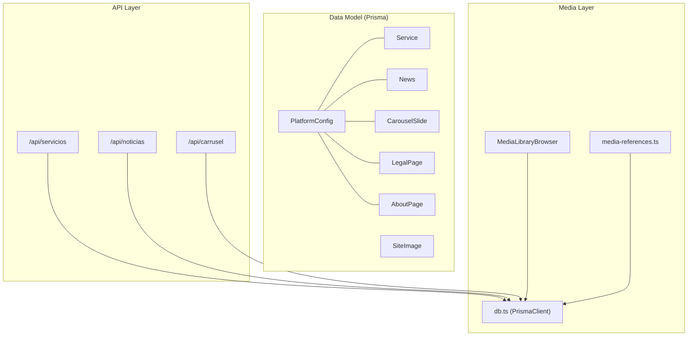
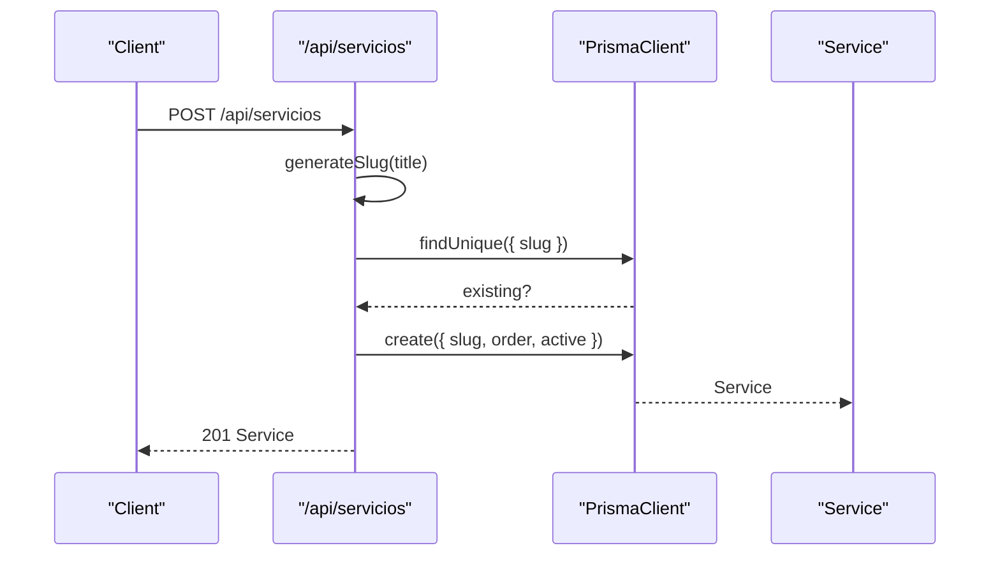
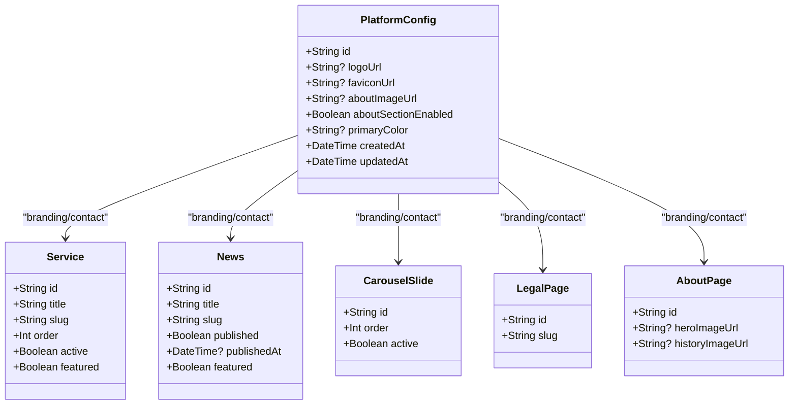
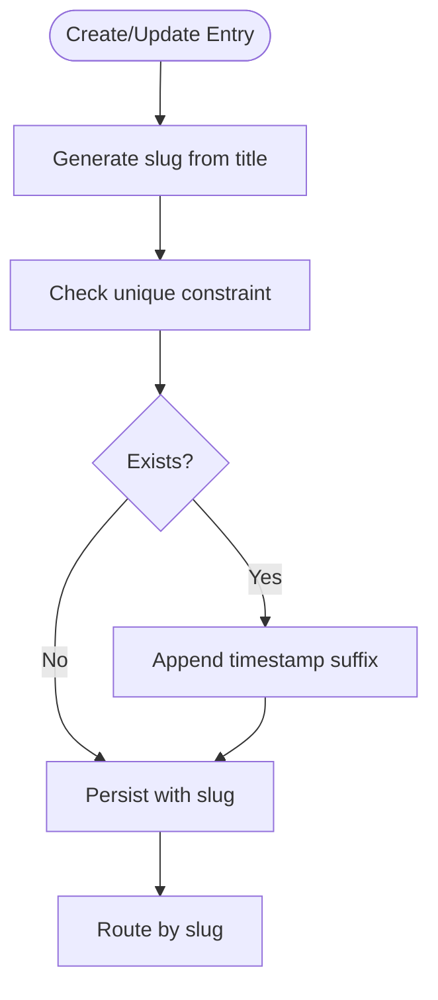
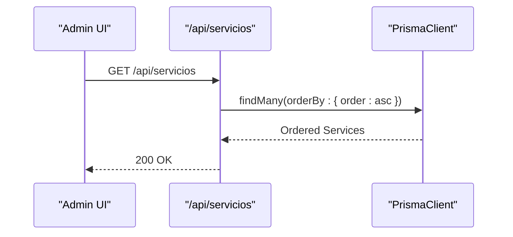
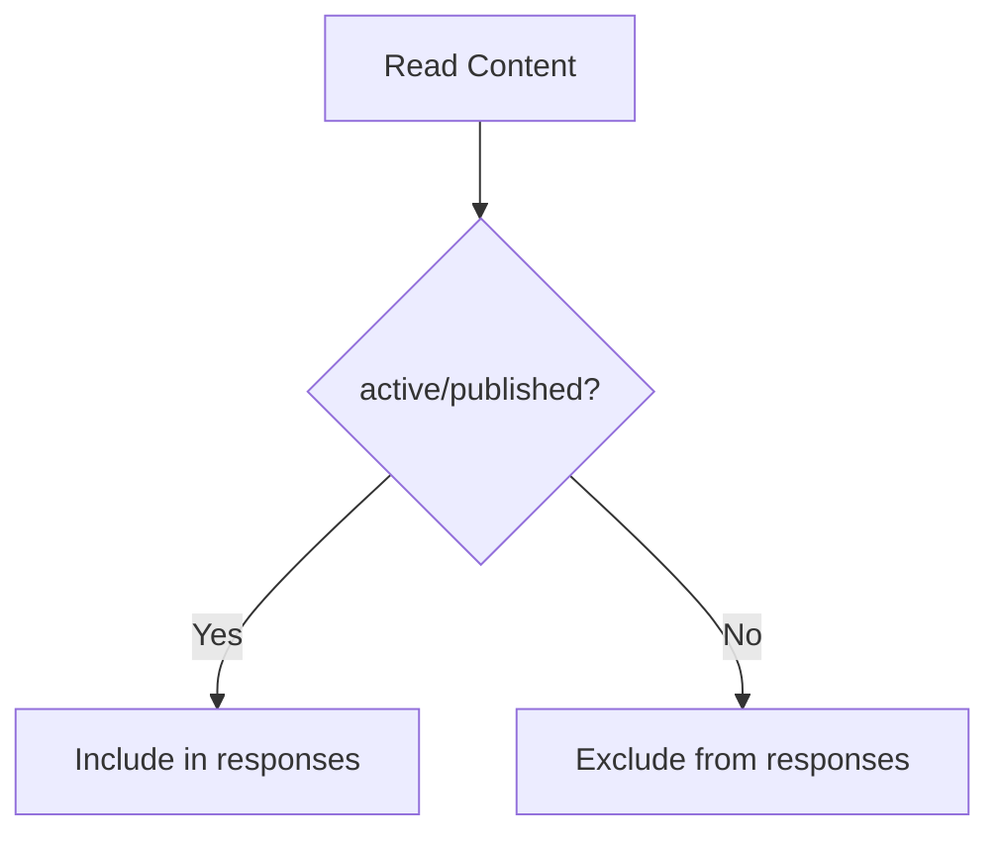
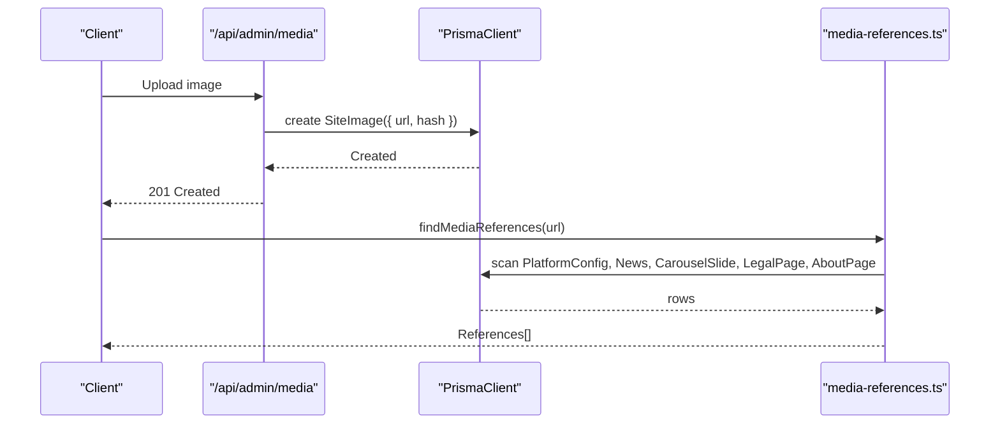
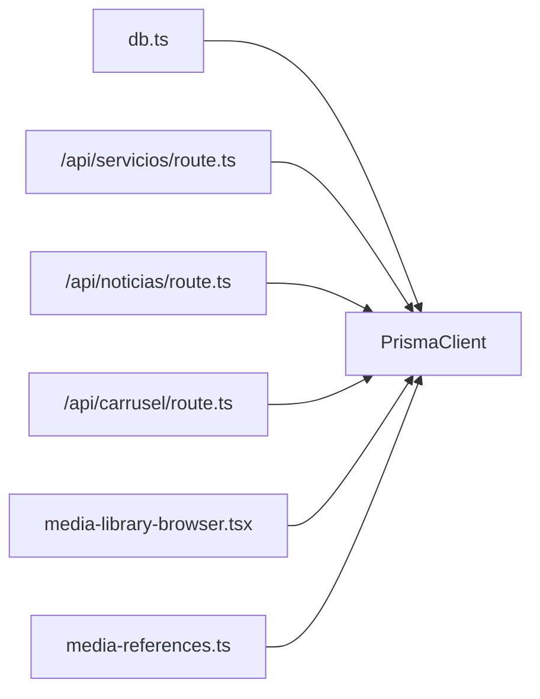

# Entity Relationships & Constraints

<cite>
**Referenced Files in This Document**
- [schema.prisma](file://prisma/schema.prisma)
- [db.ts](file://src/lib/db.ts)
- [route.ts](file://src/app/api/servicios/route.ts)
- [route.ts](file://src/app/api/noticias/route.ts)
- [route.ts](file://src/app/api/carrusel/route.ts)
- [media-library-browser.tsx](file://src/components/media-library-browser.tsx)
- [media-references.ts](file://src/lib/media-references.ts)
</cite>

## Table of Contents
1. [Introduction](#introduction)
2. [Project Structure](#project-structure)
3. [Core Components](#core-components)
4. [Architecture Overview](#architecture-overview)
5. [Detailed Component Analysis](#detailed-component-analysis)
6. [Dependency Analysis](#dependency-analysis)
7. [Performance Considerations](#performance-considerations)
8. [Troubleshooting Guide](#troubleshooting-guide)
9. [Conclusion](#conclusion)

## Introduction
This document explains the database entity relationships and referential constraints in GreenAxis, focusing on:
- One-to-many relationships between PlatformConfig and content entities
- Unique constraints for slugs across Service and News models for URL-friendly routing
- Ordering mechanisms via integer order fields for carousel slides and content management
- Active/published status flags and their impact on content visibility
- Hash-based duplicate detection in SiteImage and its integration with media workflows
- Prisma query patterns, relationship loading strategies, and performance considerations

## Project Structure
The data model is defined in the Prisma schema. Application-level APIs use Prisma to enforce constraints and maintain ordering and visibility flags. Media management integrates with SiteImage and cross-table reference resolution.

**Diagram sources**
- [schema.prisma](file://prisma/schema.prisma)
- [db.ts](file://src/lib/db.ts)
- [route.ts](file://src/app/api/servicios/route.ts)
- [route.ts](file://src/app/api/noticias/route.ts)
- [route.ts](file://src/app/api/carrusel/route.ts)
- [media-library-browser.tsx](file://src/components/media-library-browser.tsx)
- [media-references.ts](file://src/lib/media-references.ts)

**Section sources**
- [schema.prisma](file://prisma/schema.prisma)
- [db.ts](file://src/lib/db.ts)

## Core Components
- PlatformConfig: Central configuration hub for branding, contact, SEO, and theme. It is conceptually a singleton-like entity referenced by other content entities.
- Service: Editable service catalog with URL-friendly slug, ordering, and active flag.
- News: Blog/news entries with URL-friendly slug, publishing workflow, and optional Editor.js content.
- SiteImage: Media registry with optional key, label, category, and SHA-256 hash for duplicate detection.
- CarouselSlide: Hero carousel entries with ordering and active flag.
- LegalPage and AboutPage: Static content pages with optional Editor.js content.

Key constraints and flags:
- Unique slugs for Service and News enable deterministic routing.
- Integer order fields control presentation order for Services and CarouselSlides.
- Active flags govern visibility; published flags control content availability.

**Section sources**
- [schema.prisma](file://prisma/schema.prisma)

## Architecture Overview
The system uses Prisma as the ORM over SQLite/Turso. APIs perform CRUD operations while enforcing:
- Slug uniqueness and generation helpers
- Ordering via integer fields
- Visibility via active/published flags
- Media lifecycle via SiteImage and cross-reference utilities

**Diagram sources**
- [route.ts](file://src/app/api/servicios/route.ts)
- [schema.prisma](file://prisma/schema.prisma)

## Detailed Component Analysis

### PlatformConfig and Content Entities
- Relationship pattern: PlatformConfig acts as a shared configuration anchor for branding and contact details. While there is no explicit foreign key in the schema, content entities reference PlatformConfig indirectly through configuration fields (e.g., logoUrl, faviconUrl, aboutImageUrl).
- Impact: Changes to PlatformConfig propagate visually across content that references these fields.

**Diagram sources**
- [schema.prisma](file://prisma/schema.prisma)

**Section sources**
- [schema.prisma](file://prisma/schema.prisma)

### Slug Uniqueness and Routing
- Service and News enforce unique slugs to support URL-friendly routing.
- APIs generate slugs from titles and append timestamps to ensure uniqueness during creation and updates.

**Diagram sources**
- [route.ts](file://src/app/api/servicios/route.ts)
- [route.ts](file://src/app/api/noticias/route.ts)
- [schema.prisma](file://prisma/schema.prisma)

**Section sources**
- [route.ts](file://src/app/api/servicios/route.ts)
- [route.ts](file://src/app/api/noticias/route.ts)
- [schema.prisma](file://prisma/schema.prisma)

### Ordering Mechanisms
- Services and CarouselSlides use integer order fields to define presentation order.
- APIs sort by ascending order for consistent rendering.

**Diagram sources**
- [route.ts](file://src/app/api/servicios/route.ts)
- [route.ts](file://src/app/api/carrusel/route.ts)

**Section sources**
- [route.ts](file://src/app/api/servicios/route.ts)
- [route.ts](file://src/app/api/carrusel/route.ts)

### Active/Published Flags and Visibility
- Service.active controls whether a service appears in listings.
- News.published toggles visibility; publishedAt tracks publication timestamp.
- These flags are respected by API queries and UI rendering.

**Diagram sources**
- [schema.prisma](file://prisma/schema.prisma)
- [route.ts](file://src/app/api/noticias/route.ts)

**Section sources**
- [schema.prisma](file://prisma/schema.prisma)
- [route.ts](file://src/app/api/noticias/route.ts)

### Hash-Based Duplicate Detection in SiteImage
- SiteImage.hash stores a SHA-256 digest to detect duplicates during uploads.
- The media library browser supports infinite scroll and filtering by category; media references are tracked across content tables.

**Diagram sources**
- [schema.prisma](file://prisma/schema.prisma)
- [media-library-browser.tsx](file://src/components/media-library-browser.tsx)
- [media-references.ts](file://src/lib/media-references.ts)

**Section sources**
- [schema.prisma](file://prisma/schema.prisma)
- [media-library-browser.tsx](file://src/components/media-library-browser.tsx)
- [media-references.ts](file://src/lib/media-references.ts)

## Dependency Analysis
- PrismaClient is initialized with a LibSQL adapter and Turso credentials, enabling SQLite-compatible operations.
- APIs depend on Prisma for data access and enforce business rules (ordering, visibility, slug uniqueness).
- Media utilities traverse multiple tables to locate and update references when media is changed or removed.

**Diagram sources**
- [db.ts](file://src/lib/db.ts)
- [route.ts](file://src/app/api/servicios/route.ts)
- [route.ts](file://src/app/api/noticias/route.ts)
- [route.ts](file://src/app/api/carrusel/route.ts)
- [media-library-browser.tsx](file://src/components/media-library-browser.tsx)
- [media-references.ts](file://src/lib/media-references.ts)

**Section sources**
- [db.ts](file://src/lib/db.ts)
- [route.ts](file://src/app/api/servicios/route.ts)
- [route.ts](file://src/app/api/noticias/route.ts)
- [route.ts](file://src/app/api/carrusel/route.ts)
- [media-library-browser.tsx](file://src/components/media-library-browser.tsx)
- [media-references.ts](file://src/lib/media-references.ts)

## Performance Considerations
- Indexing and ordering: Use integer order fields to avoid expensive sorting at query time. Keep order values dense and update in batches when reordering.
- Slug checks: Perform unique checks before inserts/updates to prevent constraint violations.
- Pagination: Use skip/take or cursor-based pagination for large lists (as seen in News API).
- Media scanning: Limit scans to necessary tables when updating references; cache results when appropriate.
- ORM logging: Enable Prisma query logs in development to identify slow queries.

[No sources needed since this section provides general guidance]

## Troubleshooting Guide
- Slug conflicts: When creating or updating Service/News, ensure slug uniqueness. The APIs append a timestamp suffix if a conflict is detected.
- Published vs active: Verify published flags for News and active flags for Services when content does not appear.
- Media deletion: Before removing images, resolve references across PlatformConfig, News, CarouselSlide, LegalPage, and AboutPage using the media reference utilities.
- Database connectivity: Confirm Turso connection settings in the Prisma adapter initialization.

**Section sources**
- [route.ts](file://src/app/api/servicios/route.ts)
- [route.ts](file://src/app/api/noticias/route.ts)
- [media-references.ts](file://src/lib/media-references.ts)
- [db.ts](file://src/lib/db.ts)

## Conclusion
GreenAxis employs a straightforward relational model centered on Prisma. Unique slugs, integer order fields, and visibility flags provide predictable content behavior. Media workflows leverage SiteImage hashing and cross-table reference utilities to maintain consistency. APIs encapsulate business rules, ensuring robust data integrity and efficient rendering.

[No sources needed since this section summarizes without analyzing specific files]