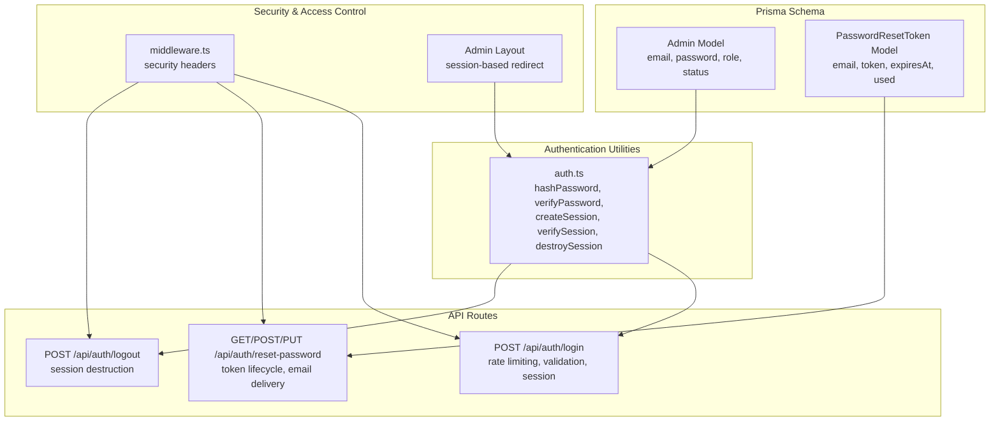
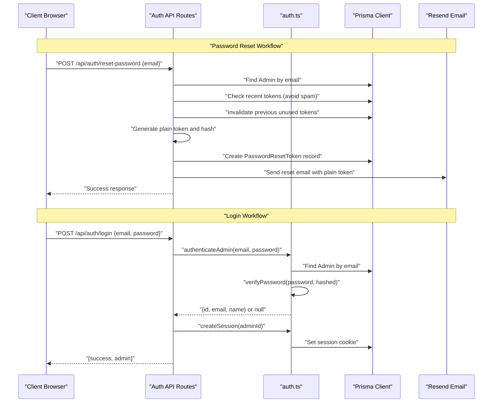
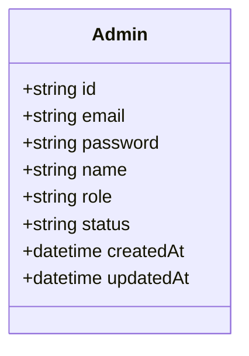
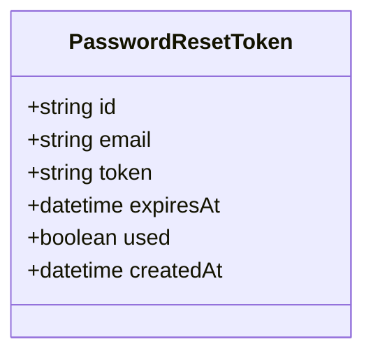
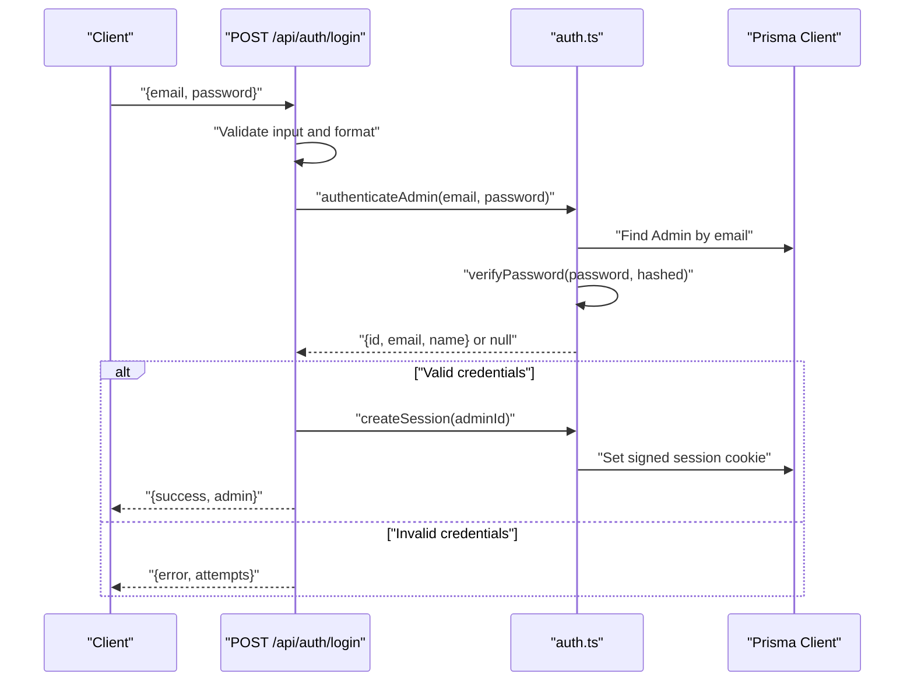
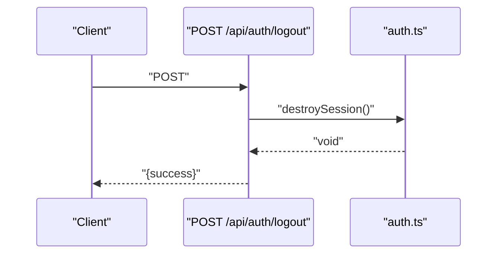
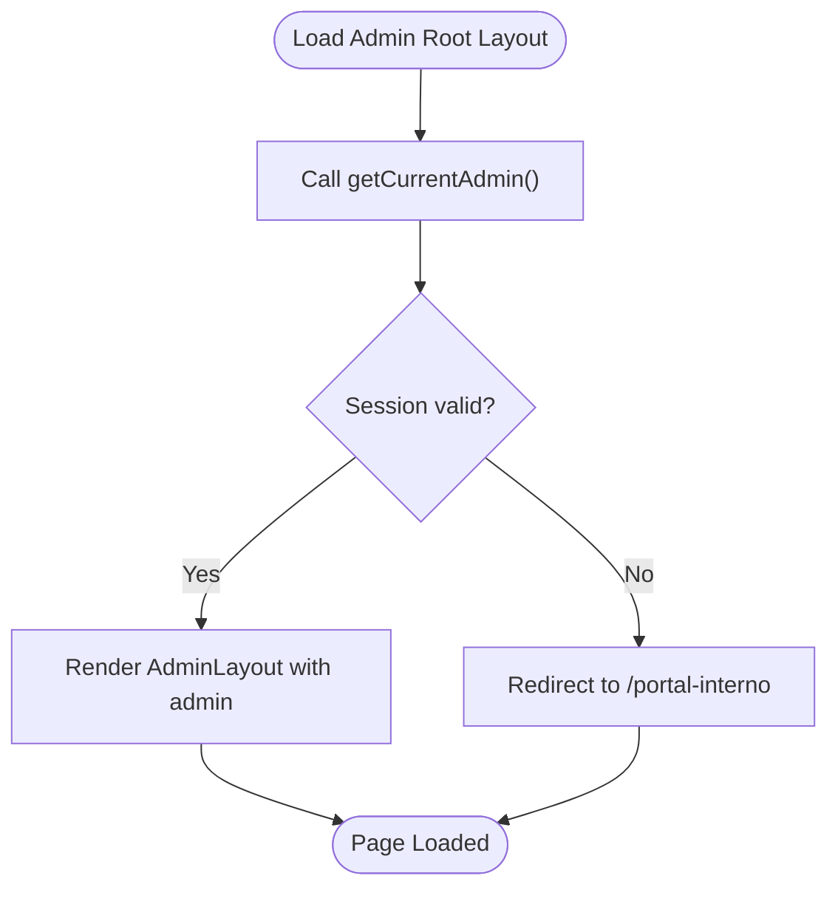
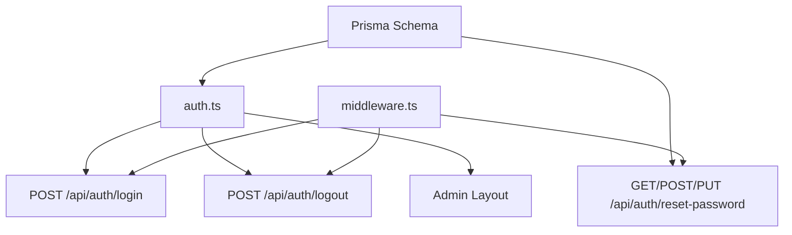

# User Administration Entities

<cite>
**Referenced Files in This Document**
- [schema.prisma](file://prisma/schema.prisma)
- [auth.ts](file://src/lib/auth.ts)
- [login.route.ts](file://src/app/api/auth/login/route.ts)
- [logout.route.ts](file://src/app/api/auth/logout/route.ts)
- [reset-password.route.ts](file://src/app/api/auth/reset-password/route.ts)
- [layout.tsx](file://src/app/admin/layout.tsx)
- [middleware.ts](file://src/middleware.ts)
</cite>

## Table of Contents
1. [Introduction](#introduction)
2. [Project Structure](#project-structure)
3. [Core Components](#core-components)
4. [Architecture Overview](#architecture-overview)
5. [Detailed Component Analysis](#detailed-component-analysis)
6. [Dependency Analysis](#dependency-analysis)
7. [Performance Considerations](#performance-considerations)
8. [Troubleshooting Guide](#troubleshooting-guide)
9. [Conclusion](#conclusion)

## Introduction
This document provides comprehensive documentation for user administration and security-related database entities in the project. It focuses on:
- The Admin model for user account management, including email authentication, role-based permissions (developer, superadmin, admin), status tracking (pending, approved, inactive), and password hashing requirements.
- The PasswordResetToken model for secure password recovery, including token generation, uniqueness constraints, expiration handling (1 hour), and usage tracking.
- Authentication workflow integration with session management and security middleware.
- User role hierarchies, access control patterns, and embedded security best practices in the database design.

## Project Structure
The user administration and security features are implemented across the Prisma schema, authentication utilities, API routes, middleware, and admin layout:
- Prisma schema defines the Admin and PasswordResetToken models and their constraints.
- Authentication utilities handle password hashing, session creation, verification, and destruction.
- API routes implement login, logout, and password reset flows with security measures.
- Middleware applies security headers to all requests.
- Admin layout enforces session-based access control for protected routes.

**Diagram sources**
- [schema.prisma:200-222](file://prisma/schema.prisma#L200-L222)
- [auth.ts:1-170](file://src/lib/auth.ts#L1-L170)
- [login.route.ts:1-91](file://src/app/api/auth/login/route.ts#L1-L91)
- [reset-password.route.ts:1-262](file://src/app/api/auth/reset-password/route.ts#L1-L262)
- [logout.route.ts:1-13](file://src/app/api/auth/logout/route.ts#L1-L13)
- [middleware.ts:1-58](file://src/middleware.ts#L1-L58)
- [layout.tsx:1-18](file://src/app/admin/layout.tsx#L1-L18)

**Section sources**
- [schema.prisma:200-222](file://prisma/schema.prisma#L200-L222)
- [auth.ts:1-170](file://src/lib/auth.ts#L1-L170)
- [login.route.ts:1-91](file://src/app/api/auth/login/route.ts#L1-L91)
- [reset-password.route.ts:1-262](file://src/app/api/auth/reset-password/route.ts#L1-L262)
- [logout.route.ts:1-13](file://src/app/api/auth/logout/route.ts#L1-L13)
- [middleware.ts:1-58](file://src/middleware.ts#L1-L58)
- [layout.tsx:1-18](file://src/app/admin/layout.tsx#L1-L18)

## Core Components
This section documents the two core database entities and their roles in user administration and security.

- Admin model
  - Purpose: Stores administrator accounts with credentials, roles, and status.
  - Key attributes:
    - email: Unique identifier for authentication.
    - password: Hashed password value.
    - role: Enumerated role with defaults and supported values.
    - status: Account lifecycle status.
  - Constraints:
    - email uniqueness.
    - default role and status values.
    - timestamps for creation and updates.

- PasswordResetToken model
  - Purpose: Manages secure password reset tokens with safety controls.
  - Key attributes:
    - email: Target user’s email.
    - token: Unique token value (stored as a hash).
    - expiresAt: Expiration timestamp (1 hour).
    - used: Flag to prevent reuse.
  - Constraints:
    - token uniqueness.
    - expiration enforcement.
    - usage tracking.

**Section sources**
- [schema.prisma:200-222](file://prisma/schema.prisma#L200-L222)

## Architecture Overview
The authentication and administration architecture integrates database models, utilities, API routes, and middleware to enforce secure access and lifecycle management.

**Diagram sources**
- [reset-password.route.ts:104-185](file://src/app/api/auth/reset-password/route.ts#L104-L185)
- [login.route.ts:9-91](file://src/app/api/auth/login/route.ts#L9-L91)
- [auth.ts:136-170](file://src/lib/auth.ts#L136-L170)

**Section sources**
- [reset-password.route.ts:104-185](file://src/app/api/auth/reset-password/route.ts#L104-L185)
- [login.route.ts:9-91](file://src/app/api/auth/login/route.ts#L9-L91)
- [auth.ts:136-170](file://src/lib/auth.ts#L136-L170)

## Detailed Component Analysis

### Admin Model
The Admin model encapsulates user account management with built-in constraints and defaults.

- Role hierarchy and permissions
  - Roles: developer, superadmin, admin.
  - Access control pattern: role-based checks should be enforced at the application level (e.g., route guards or action wrappers) to restrict administrative operations.
- Status tracking
  - Values: pending, approved, inactive.
  - Lifecycle: pending indicates initial state; approved enables full access; inactive disables access.
- Password hashing requirements
  - Passwords are stored as hashes; hashing occurs in the authentication utilities.

Security best practices embedded in the schema:
- email uniqueness prevents duplicate accounts.
- default role and status reduce ambiguity and ensure consistent initialization.

**Diagram sources**
- [schema.prisma:200-211](file://prisma/schema.prisma#L200-L211)

**Section sources**
- [schema.prisma:200-211](file://prisma/schema.prisma#L200-L211)
- [auth.ts:11-18](file://src/lib/auth.ts#L11-L18)

### PasswordResetToken Model
The PasswordResetToken model manages secure password recovery with robust safeguards.

- Token generation and storage
  - Plain token generated for email delivery.
  - Hashed token stored in the database for secure lookup.
- Uniqueness constraints
  - token is unique; previous unused tokens are invalidated before creating new ones.
- Expiration handling
  - expiresAt set to 1 hour from creation; expired tokens are rejected.
- Usage tracking
  - used flag prevents token reuse after successful password reset.

Security best practices embedded in the schema and API:
- Token stored as a hash to mitigate exposure risks.
- Immediate invalidation of prior unused tokens reduces attack surface.
- Expiration enforced on both retrieval and reset endpoints.

**Diagram sources**
- [schema.prisma:213-222](file://prisma/schema.prisma#L213-L222)
- [reset-password.route.ts:133-167](file://src/app/api/auth/reset-password/route.ts#L133-L167)

**Section sources**
- [schema.prisma:213-222](file://prisma/schema.prisma#L213-L222)
- [reset-password.route.ts:133-167](file://src/app/api/auth/reset-password/route.ts#L133-L167)

### Authentication Workflow and Session Management
The authentication workflow integrates validation, rate limiting, password verification, and session management.

- Rate limiting
  - Tracks failed attempts per IP; locks out after threshold until cooldown.
- Timing attack mitigation
  - Delays response for invalid credentials to reduce timing-based inference.
- Session management
  - Secure, HTTP-only, same-site cookie with expiration.
  - Session verification and destruction handled centrally.

**Diagram sources**
- [login.route.ts:9-91](file://src/app/api/auth/login/route.ts#L9-L91)
- [auth.ts:25-77](file://src/lib/auth.ts#L25-L77)

**Section sources**
- [login.route.ts:9-91](file://src/app/api/auth/login/route.ts#L9-L91)
- [auth.ts:25-77](file://src/lib/auth.ts#L25-L77)

### Logout and Session Destruction
Logout clears the session cookie, terminating the authenticated state.

**Diagram sources**
- [logout.route.ts:1-13](file://src/app/api/auth/logout/route.ts#L1-L13)
- [auth.ts:73-77](file://src/lib/auth.ts#L73-L77)

**Section sources**
- [logout.route.ts:1-13](file://src/app/api/auth/logout/route.ts#L1-L13)
- [auth.ts:73-77](file://src/lib/auth.ts#L73-L77)

### Admin Access Control via Layout
The admin layout enforces session-based access control for protected routes.

- Behavior: If no valid session exists, the user is redirected to the internal portal.
- Integration: Uses the authentication utility to verify session and fetch current admin.

**Diagram sources**
- [layout.tsx:5-17](file://src/app/admin/layout.tsx#L5-L17)
- [auth.ts:155-169](file://src/lib/auth.ts#L155-L169)

**Section sources**
- [layout.tsx:5-17](file://src/app/admin/layout.tsx#L5-L17)
- [auth.ts:155-169](file://src/lib/auth.ts#L155-L169)

### Security Middleware
Security headers are applied globally to enhance transport and content protection.

Key headers:
- X-Frame-Options: DENY
- X-Content-Type-Options: nosniff
- X-XSS-Protection: 1; mode=block
- Referrer-Policy: strict-origin-when-cross-origin
- Permissions-Policy: camera=(), microphone=(), geolocation=()
- Strict-Transport-Security: max-age=31536000; includeSubDomains; preload
- Content-Security-Policy: Permissive policy for corporate sites

**Section sources**
- [middleware.ts:8-43](file://src/middleware.ts#L8-L43)

## Dependency Analysis
The following diagram shows dependencies among the core components involved in user administration and security.

**Diagram sources**
- [schema.prisma:200-222](file://prisma/schema.prisma#L200-L222)
- [auth.ts:1-170](file://src/lib/auth.ts#L1-L170)
- [login.route.ts:1-91](file://src/app/api/auth/login/route.ts#L1-L91)
- [logout.route.ts:1-13](file://src/app/api/auth/logout/route.ts#L1-L13)
- [reset-password.route.ts:1-262](file://src/app/api/auth/reset-password/route.ts#L1-L262)
- [layout.tsx:1-18](file://src/app/admin/layout.tsx#L1-L18)
- [middleware.ts:1-58](file://src/middleware.ts#L1-L58)

**Section sources**
- [schema.prisma:200-222](file://prisma/schema.prisma#L200-L222)
- [auth.ts:1-170](file://src/lib/auth.ts#L1-L170)
- [login.route.ts:1-91](file://src/app/api/auth/login/route.ts#L1-L91)
- [logout.route.ts:1-13](file://src/app/api/auth/logout/route.ts#L1-L13)
- [reset-password.route.ts:1-262](file://src/app/api/auth/reset-password/route.ts#L1-L262)
- [layout.tsx:1-18](file://src/app/admin/layout.tsx#L1-L18)
- [middleware.ts:1-58](file://src/middleware.ts#L1-L58)

## Performance Considerations
- Password hashing cost: bcrypt salt rounds are configured in the authentication utilities; adjust based on hardware capabilities while balancing security and latency.
- Session duration: Cookie expiration is set to a week; consider shorter durations for highly sensitive environments.
- Rate limiting: Memory-based tracking is simple but not persistent across instances; consider a shared store for multi-instance deployments.
- Token cleanup: Periodic cleanup of expired or used tokens can reduce index bloat and improve lookup performance.

## Troubleshooting Guide
Common issues and resolutions:
- Login failures
  - Verify email format and credentials; ensure account status allows access.
  - Check rate limiting lockout; wait for cooldown period.
- Session not persisting
  - Confirm cookie settings (HTTP-only, secure, same-site) match deployment environment.
  - Validate expiration and server time synchronization.
- Password reset not received
  - Confirm email provider configuration and token recentness checks.
  - Ensure token is not expired or marked as used.
- Access denied to admin routes
  - Verify active session and that the admin account is not inactive.

**Section sources**
- [login.route.ts:16-33](file://src/app/api/auth/login/route.ts#L16-L33)
- [auth.ts:34-46](file://src/lib/auth.ts#L34-L46)
- [reset-password.route.ts:133-146](file://src/app/api/auth/reset-password/route.ts#L133-L146)
- [layout.tsx:10-14](file://src/app/admin/layout.tsx#L10-L14)

## Conclusion
The user administration and security subsystem combines database-first modeling with robust application-layer controls:
- Admin and PasswordResetToken models define strong constraints for identity, roles, status, and secure token handling.
- Authentication utilities and API routes implement validated workflows with rate limiting, timing attack mitigations, and secure sessions.
- Middleware and admin layout enforce global security headers and session-based access control.
These practices collectively establish a secure foundation for managing administrators and protecting user credentials.