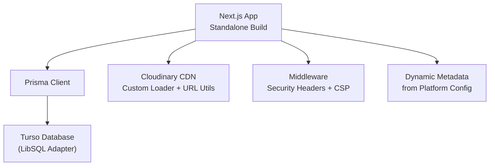
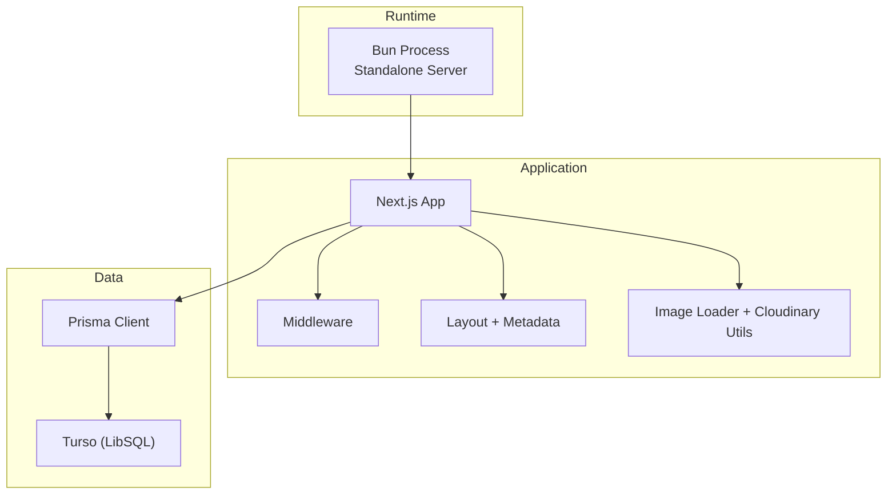
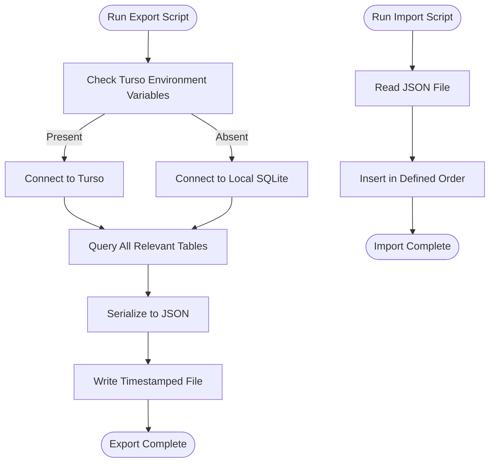
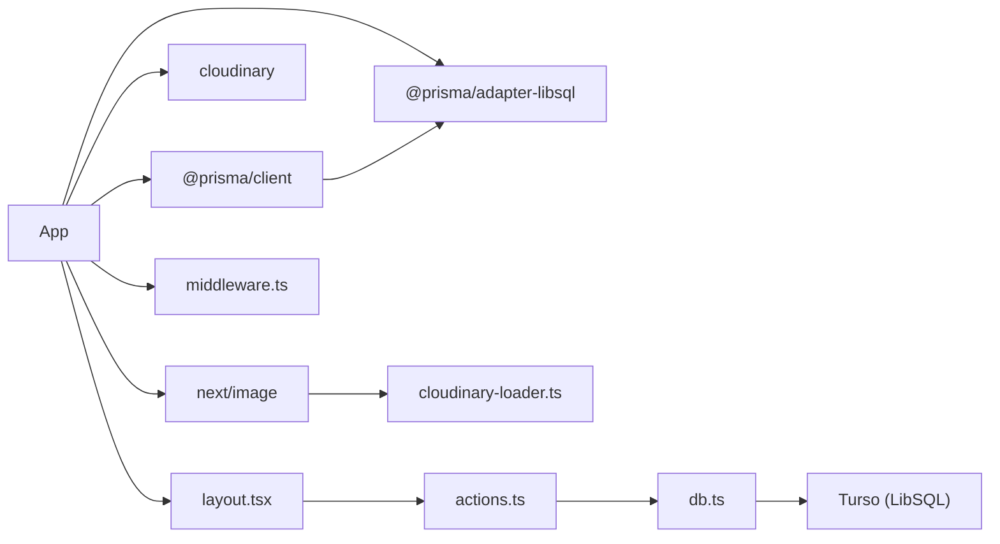

# Deployment & Operations

<cite>
**Referenced Files in This Document**
- [package.json](file://package.json)
- [next.config.ts](file://next.config.ts)
- [prisma/schema.prisma](file://prisma/schema.prisma)
- [src/lib/db.ts](file://src/lib/db.ts)
- [src/lib/cloudinary.ts](file://src/lib/cloudinary.ts)
- [src/lib/cloudinary-loader.ts](file://src/lib/cloudinary-loader.ts)
- [src/middleware.ts](file://src/middleware.ts)
- [src/app/layout.tsx](file://src/app/layout.tsx)
- [scripts/export-data.ts](file://scripts/export-data.ts)
- [scripts/import-data.ts](file://scripts/import-data.ts)
</cite>

## Table of Contents
1. [Introduction](#introduction)
2. [Project Structure](#project-structure)
3. [Core Components](#core-components)
4. [Architecture Overview](#architecture-overview)
5. [Detailed Component Analysis](#detailed-component-analysis)
6. [Dependency Analysis](#dependency-analysis)
7. [Performance Considerations](#performance-considerations)
8. [Troubleshooting Guide](#troubleshooting-guide)
9. [Conclusion](#conclusion)
10. [Appendices](#appendices)

## Introduction
This document provides comprehensive deployment and operations guidance for GreenAxis. It covers production deployment strategies for Next.js standalone builds, Turso database configuration, Cloudinary CDN setup, environment configuration across development, staging, and production, monitoring and maintenance procedures, backup and recovery via data export/import scripts, CI/CD pipeline configuration, performance monitoring, error tracking integration, operational troubleshooting, scaling and load balancing, disaster recovery planning, maintenance schedules, update procedures, and production best practices.

## Project Structure
GreenAxis is a Next.js 16 application using Prisma with a LibSQL adapter for connectivity to Turso. Media assets leverage Cloudinary via a custom loader and URL transformation utilities. The build output is configured as a standalone server for simplified containerized deployments.

Key deployment-related areas:
- Build and runtime: Next.js standalone output and Bun-based startup
- Database: Prisma with LibSQL adapter connecting to Turso
- Images: Next.js Image loader and Cloudinary URL transformation utilities
- Security: Middleware enforcing strict security headers and CSP
- Metadata: Dynamic metadata generation from the database

**Diagram sources**
- [next.config.ts:1-46](file://next.config.ts#L1-L46)
- [src/lib/db.ts:1-21](file://src/lib/db.ts#L1-L21)
- [src/lib/cloudinary-loader.ts:1-59](file://src/lib/cloudinary-loader.ts#L1-L59)
- [src/lib/cloudinary.ts:1-119](file://src/lib/cloudinary.ts#L1-L119)
- [src/middleware.ts:1-58](file://src/middleware.ts#L1-L58)
- [src/app/layout.tsx:1-80](file://src/app/layout.tsx#L1-L80)

**Section sources**
- [next.config.ts:1-46](file://next.config.ts#L1-L46)
- [package.json:1-116](file://package.json#L1-L116)

## Core Components
- Next.js Standalone Build
  - Output mode set to standalone for minimal runtime footprint.
  - Custom loader configured to use a custom loader file for image optimization.
  - Remote patterns include Cloudinary and Unsplash domains.
  - Static asset caching headers for uploads.
- Turso Database
  - Prisma configured with LibSQL adapter using TURSO_DATABASE_URL and TURSO_AUTH_TOKEN.
  - Development fallback to local SQLite file when environment variables are absent.
- Cloudinary CDN
  - Custom loader for Next.js Image component.
  - Utility functions to inject transformations into Cloudinary URLs.
  - Responsive and preset helpers for hero, thumbnails, and admin previews.
- Security Middleware
  - Enforces XFO, XCTO, XXS, Referrer-Policy, Permissions-Policy, HSTS, and CSP.
- Dynamic Metadata
  - Generates Open Graph and Twitter metadata from PlatformConfig.

**Section sources**
- [next.config.ts:1-46](file://next.config.ts#L1-L46)
- [src/lib/db.ts:1-21](file://src/lib/db.ts#L1-L21)
- [src/lib/cloudinary-loader.ts:1-59](file://src/lib/cloudinary-loader.ts#L1-L59)
- [src/lib/cloudinary.ts:1-119](file://src/lib/cloudinary.ts#L1-L119)
- [src/middleware.ts:1-58](file://src/middleware.ts#L1-L58)
- [src/app/layout.tsx:1-80](file://src/app/layout.tsx#L1-L80)

## Architecture Overview
The production runtime consists of:
- A single-process standalone server started by Bun.
- A database connection to Turso using LibSQL.
- Cloudinary for image delivery with Next.js Image optimization.
- Security headers and CSP enforced at the edge via middleware.
- Dynamic metadata served from the database.

**Diagram sources**
- [package.json:8-8](file://package.json#L8-L8)
- [next.config.ts:11-28](file://next.config.ts#L11-L28)
- [src/lib/db.ts:1-21](file://src/lib/db.ts#L1-L21)
- [src/middleware.ts:1-58](file://src/middleware.ts#L1-L58)
- [src/app/layout.tsx:19-54](file://src/app/layout.tsx#L19-L54)

## Detailed Component Analysis

### Next.js Standalone Build Configuration
- Output mode: standalone for self-contained deployments.
- TypeScript build errors ignored during build to accommodate schema changes.
- React strict mode disabled.
- Custom loader enabled with a custom loader file.
- Remote patterns include Cloudinary and Unsplash.
- Upload cache headers set to immutable for long-term caching.

Operational implications:
- Simplifies containerization and reduces runtime dependencies.
- Ensure environment variables are present for production Turso connectivity.
- Verify CDN remote patterns match actual Cloudinary domains.

**Section sources**
- [next.config.ts:3-43](file://next.config.ts#L3-L43)
- [package.json:5-16](file://package.json#L5-L16)

### Turso Database Deployment
- Prisma adapter configured with LibSQL using TURSO_DATABASE_URL and TURSO_AUTH_TOKEN.
- Development fallback to local SQLite file when environment variables are missing.
- Prisma client instantiated with logging enabled for queries.

Operational implications:
- Always set TURSO_DATABASE_URL and TURSO_AUTH_TOKEN in production.
- Use migrations for schema changes; development uses local SQLite.
- Monitor query logs during initial rollout.

**Section sources**
- [src/lib/db.ts:1-21](file://src/lib/db.ts#L1-L21)
- [prisma/schema.prisma:4-13](file://prisma/schema.prisma#L4-L13)

### Cloudinary CDN Setup
- Custom loader for Next.js Image component injects automatic format, quality, and width transformations.
- Utility functions to inject transformations into Cloudinary URLs and presets for common image sizes.
- Next.js remote patterns include Cloudinary domain.

Operational implications:
- Ensure Cloudinary credentials and transformations are configured upstream.
- Use responsive variants for Next.js Image to leverage automatic srcset generation.
- Validate that uploaded images are served from Cloudinary domains.

**Section sources**
- [src/lib/cloudinary-loader.ts:1-59](file://src/lib/cloudinary-loader.ts#L1-L59)
- [src/lib/cloudinary.ts:1-119](file://src/lib/cloudinary.ts#L1-L119)
- [next.config.ts:11-28](file://next.config.ts#L11-L28)

### Security Middleware
- Sets X-Frame-Options, X-Content-Type-Options, X-XSS-Protection, Referrer-Policy, Permissions-Policy, and Strict-Transport-Security.
- Defines a permissive Content-Security-Policy suitable for corporate sites with analytics and embedded maps.
- Applied to non-static routes.

Operational implications:
- Review and tighten CSP for stricter environments.
- Ensure HTTPS termination occurs before requests reach the server.
- Validate that analytics and embedded resources are whitelisted.

**Section sources**
- [src/middleware.ts:1-58](file://src/middleware.ts#L1-L58)

### Dynamic Metadata Generation
- Metadata (title, description, icons, Open Graph, Twitter) generated from PlatformConfig.
- Provides fallback values when no configuration exists.

Operational implications:
- Ensure PlatformConfig exists or the seeding action creates defaults.
- Keep metadata fields aligned with marketing requirements.

**Section sources**
- [src/app/layout.tsx:19-54](file://src/app/layout.tsx#L19-L54)
- [src/lib/actions.ts:6-22](file://src/lib/actions.ts#L6-L22)

### Data Export/Import Scripts
- Export script connects to Turso when environment variables are present; otherwise falls back to local SQLite.
- Imports data into Turso using createMany with skipDuplicates.
- Exports a snapshot of platform configuration, services, news, site images, carousel slides, legal pages, contact messages, admins, and about page content.

Operational implications:
- Use export to create backups prior to migrations.
- Use import to restore data to a new Turso instance.
- Ensure consistent ordering to avoid foreign key issues.

**Diagram sources**
- [scripts/export-data.ts:1-62](file://scripts/export-data.ts#L1-L62)
- [scripts/import-data.ts:1-82](file://scripts/import-data.ts#L1-L82)

**Section sources**
- [scripts/export-data.ts:1-62](file://scripts/export-data.ts#L1-L62)
- [scripts/import-data.ts:1-82](file://scripts/import-data.ts#L1-L82)

## Dependency Analysis
- Application depends on Prisma client and LibSQL adapter for Turso connectivity.
- Uses Next.js Image with a custom loader and Cloudinary utilities.
- Middleware applies security headers globally.
- Dynamic metadata depends on PlatformConfig model.

**Diagram sources**
- [package.json:17-101](file://package.json#L17-L101)
- [src/lib/db.ts:1-21](file://src/lib/db.ts#L1-L21)
- [src/lib/cloudinary-loader.ts:1-59](file://src/lib/cloudinary-loader.ts#L1-L59)
- [src/middleware.ts:1-58](file://src/middleware.ts#L1-L58)
- [src/app/layout.tsx:1-80](file://src/app/layout.tsx#L1-L80)
- [src/lib/actions.ts:1-136](file://src/lib/actions.ts#L1-L136)

**Section sources**
- [package.json:17-101](file://package.json#L17-L101)
- [prisma/schema.prisma:16-78](file://prisma/schema.prisma#L16-L78)

## Performance Considerations
- Image optimization
  - Use Cloudinary transformations for automatic format and quality selection.
  - Prefer responsive variants for Next.js Image to reduce bandwidth and improve Core Web Vitals.
- Caching
  - Leverage long-lived immutable cache headers for uploads.
  - Consider CDN caching policies for frequently accessed static assets.
- Database
  - Monitor query logs during initial rollout; optimize queries and indexes as needed.
  - Use Turso’s distributed architecture for low-latency reads/writes.
- Build and runtime
  - Standalone output reduces cold starts and simplifies deployment.
  - Use Bun for faster startup compared to Node.js.

[No sources needed since this section provides general guidance]

## Troubleshooting Guide
Common operational issues and resolutions:
- Turso connectivity failures
  - Verify TURSO_DATABASE_URL and TURSO_AUTH_TOKEN are set in production.
  - Confirm network access to Turso endpoints.
- Image loading problems
  - Ensure images are served from Cloudinary domains.
  - Validate Next.js remote patterns include Cloudinary hostnames.
- Security headers blocking resources
  - Adjust CSP to whitelist required domains for analytics and embedded content.
  - Confirm HTTPS termination and HSTS configuration.
- Metadata not updating
  - Ensure PlatformConfig exists; the seeding action creates defaults if missing.
- Export/Import issues
  - Confirm Turso environment variables are present for export/import.
  - Validate JSON file integrity and insertion order.

**Section sources**
- [src/lib/db.ts:5-8](file://src/lib/db.ts#L5-L8)
- [next.config.ts:14-27](file://next.config.ts#L14-L27)
- [src/middleware.ts:29-41](file://src/middleware.ts#L29-L41)
- [src/lib/actions.ts:6-22](file://src/lib/actions.ts#L6-L22)
- [scripts/export-data.ts:9-22](file://scripts/export-data.ts#L9-L22)
- [scripts/import-data.ts:5-10](file://scripts/import-data.ts#L5-L10)

## Conclusion
GreenAxis is designed for straightforward production deployment using Next.js standalone builds, Turso for scalable database operations, and Cloudinary for optimized media delivery. The included export/import scripts facilitate backup and migration. Security is enforced via middleware, while dynamic metadata ensures branding consistency. Follow the operational procedures outlined here to maintain reliability, performance, and security in production.

[No sources needed since this section summarizes without analyzing specific files]

## Appendices

### Environment Configuration Matrix
- Development
  - DATABASE_URL: Local SQLite file path
  - TURSO_DATABASE_URL: Not required
  - TURSO_AUTH_TOKEN: Not required
- Staging
  - DATABASE_URL: Local SQLite file path
  - TURSO_DATABASE_URL: Turso staging URL
  - TURSO_AUTH_TOKEN: Turso staging token
- Production
  - DATABASE_URL: Local SQLite file path (fallback)
  - TURSO_DATABASE_URL: Turso production URL
  - TURSO_AUTH_TOKEN: Turso production token

[No sources needed since this section provides general guidance]

### Monitoring and Maintenance Procedures
- Health checks
  - Implement a lightweight health endpoint returning application and database connectivity status.
- Logs
  - Stream Bun server logs to centralized logging (e.g., syslog, cloud logging).
  - Enable Prisma query logging in non-production environments.
- Backups
  - Use the export script to create periodic snapshots.
  - Store backups securely and test restoration regularly.
- Updates
  - Perform updates during maintenance windows; validate with staging first.
  - Rollback plan: revert to previous build and restore from last known-good backup.

[No sources needed since this section provides general guidance]

### CI/CD Pipeline Configuration
- Build
  - Run Prisma generate and Next.js build.
  - Produce standalone output for deployment.
- Test
  - Execute linting and unit tests.
- Deploy
  - Push artifacts to container registry or deployment target.
  - Set environment variables per stage.
- Rollback
  - Maintain artifact versions for quick rollback.

[No sources needed since this section provides general guidance]

### Scaling and Load Balancing
- Horizontal scaling
  - Stateless application; scale multiple instances behind a load balancer.
- Database
  - Use Turso’s managed clusters for high availability and read replicas.
- CDN
  - Offload media delivery to Cloudinary; configure caching and compression.
- Autoscaling
  - Configure autoscaling based on CPU/memory or request rate metrics.

[No sources needed since this section provides general guidance]

### Disaster Recovery Planning
- Backup strategy
  - Automated daily exports to secure storage.
- Recovery testing
  - Periodically restore to a staging environment.
- RTO/RPO targets
  - Define acceptable recovery time and point in time for critical systems.

[No sources needed since this section provides general guidance]

### Operational Best Practices
- Secrets management
  - Store Turso credentials in a secrets manager; avoid committing to repositories.
- Network security
  - Restrict inbound traffic to necessary ports; enforce TLS.
- Observability
  - Add application metrics and tracing; integrate with monitoring platforms.
- Change management
  - Use feature flags and blue-green deployments where applicable.

[No sources needed since this section provides general guidance]