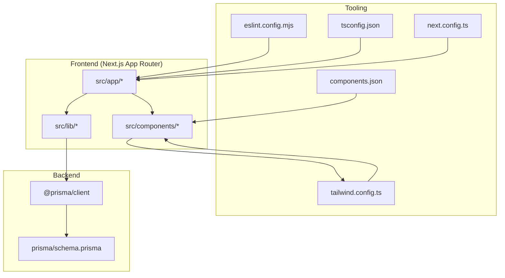
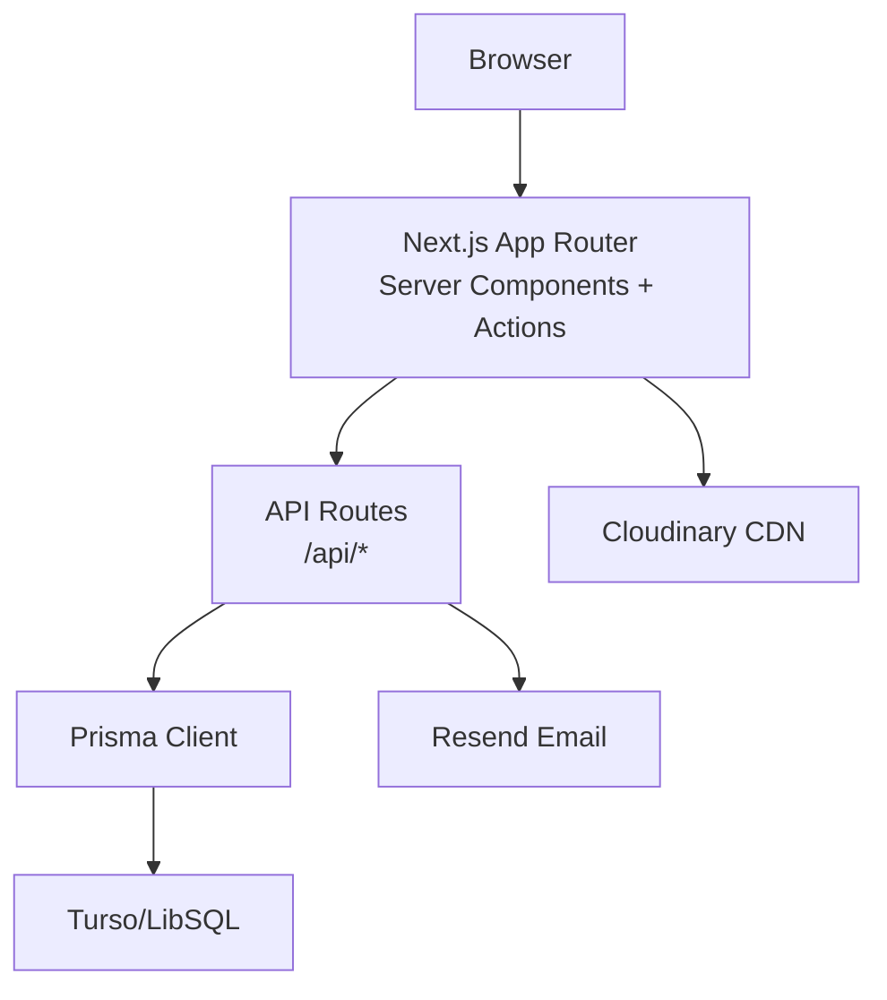
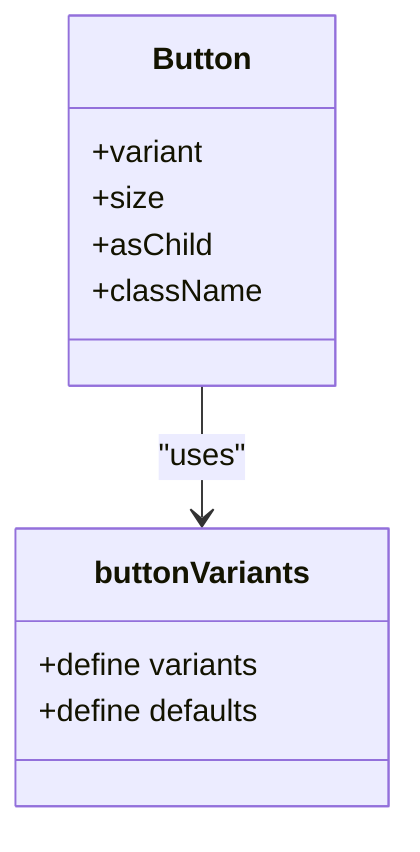
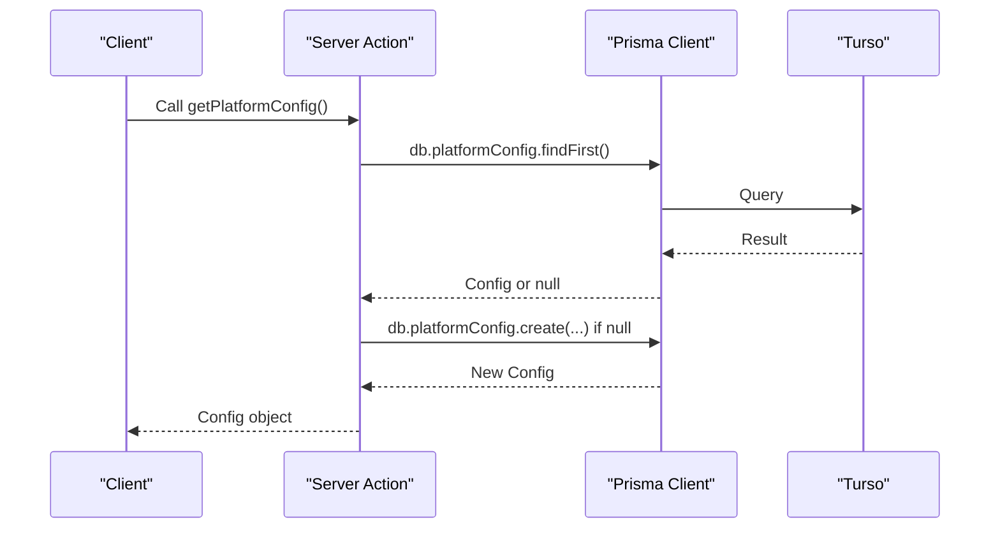
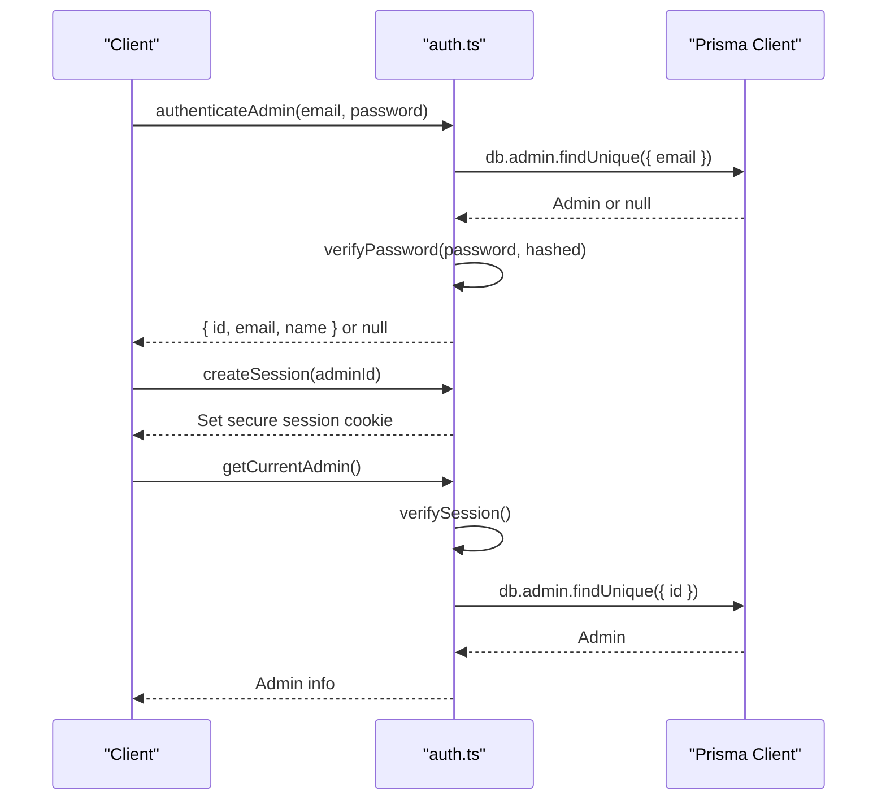
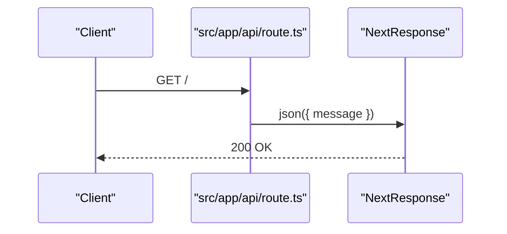
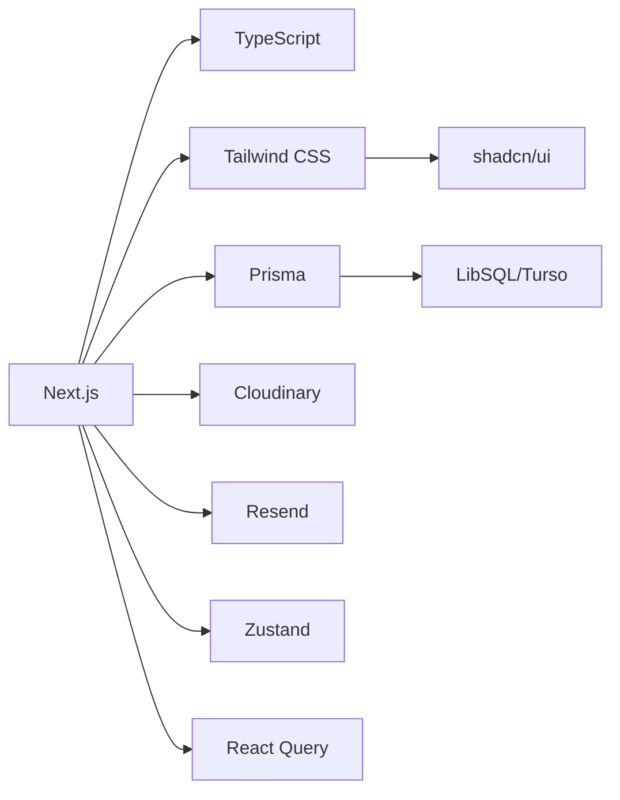

# Development Guidelines

<cite>
**Referenced Files in This Document**
- [README.md](file://README.md)
- [package.json](file://package.json)
- [eslint.config.mjs](file://eslint.config.mjs)
- [tsconfig.json](file://tsconfig.json)
- [next.config.ts](file://next.config.ts)
- [tailwind.config.ts](file://tailwind.config.ts)
- [components.json](file://components.json)
- [src/app/layout.tsx](file://src/app/layout.tsx)
- [src/components/ui/button.tsx](file://src/components/ui/button.tsx)
- [src/lib/actions.ts](file://src/lib/actions.ts)
- [src/lib/db.ts](file://src/lib/db.ts)
- [src/lib/auth.ts](file://src/lib/auth.ts)
- [src/middleware.ts](file://src/middleware.ts)
- [src/app/api/route.ts](file://src/app/api/route.ts)
- [scripts/export-data.ts](file://scripts/export-data.ts)
- [scripts/import-data.ts](file://scripts/import-data.ts)
- [test-media-endpoint.js](file://test-media-endpoint.js)
</cite>

## Table of Contents
1. [Introduction](#introduction)
2. [Project Structure](#project-structure)
3. [Core Components](#core-components)
4. [Architecture Overview](#architecture-overview)
5. [Detailed Component Analysis](#detailed-component-analysis)
6. [Dependency Analysis](#dependency-analysis)
7. [Performance Considerations](#performance-considerations)
8. [Troubleshooting Guide](#troubleshooting-guide)
9. [Conclusion](#conclusion)
10. [Appendices](#appendices)

## Introduction
This document provides comprehensive development guidelines for contributors working on GreenAxis. It covers code organization standards, component development patterns, file structure conventions, naming conventions, lifecycle from design to testing, contributing workflows, code quality standards, environment setup, debugging, performance optimization, documentation standards, commit conventions, and release management. The goal is to ensure consistent, maintainable, and scalable development across the Next.js + TypeScript + Prisma stack.

## Project Structure
GreenAxis follows a modern Next.js App Router project layout with clear separation of concerns:
- src/app: App Router pages, layouts, and API routes
- src/components: Reusable UI components (shadcn/ui variants)
- src/lib: Shared utilities, database client, server actions, auth helpers
- prisma: Database schema and migrations
- scripts: Data export/import utilities
- public: Static assets and robots.txt
- Tooling configs: ESLint, TypeScript, Tailwind, Next.js

**Diagram sources**
- [src/app/layout.tsx:1-80](file://src/app/layout.tsx#L1-L80)
- [src/lib/db.ts:1-21](file://src/lib/db.ts#L1-L21)
- [eslint.config.mjs:1-51](file://eslint.config.mjs#L1-L51)
- [tsconfig.json:1-43](file://tsconfig.json#L1-L43)
- [next.config.ts:1-46](file://next.config.ts#L1-L46)
- [tailwind.config.ts:1-65](file://tailwind.config.ts#L1-L65)
- [components.json:1-21](file://components.json#L1-L21)

**Section sources**
- [README.md:152-186](file://README.md#L152-L186)

## Core Components
This section documents the foundational building blocks and patterns used throughout the codebase.

- Component Variants Pattern (shadcn/ui)
  - Components define variants and sizes via a variants factory and className merging utility.
  - Example: Button component exposes variant and size props with consistent styling and accessibility attributes.
  - Reference: [src/components/ui/button.tsx:1-60](file://src/components/ui/button.tsx#L1-L60)

- Server Actions Layer
  - Centralized data access functions encapsulate Prisma queries and provide typed results.
  - Examples include retrieving platform config, services, news, carousel slides, legal pages, contact messages, and social feed configurations.
  - Reference: [src/lib/actions.ts:1-136](file://src/lib/actions.ts#L1-L136)

- Database Client and Prisma Adapter
  - Uses LibSQL adapter for Turso with production-safe connection handling and logging.
  - Reference: [src/lib/db.ts:1-21](file://src/lib/db.ts#L1-L21)

- Authentication Utilities
  - Password hashing, session creation/verification/expiration, admin account limits, and current admin retrieval.
  - Reference: [src/lib/auth.ts:1-170](file://src/lib/auth.ts#L1-L170)

- Application Layout and Metadata
  - Dynamic metadata generation from database, theme provider, analytics loader, and global fonts.
  - Reference: [src/app/layout.tsx:1-80](file://src/app/layout.tsx#L1-L80)

- Middleware Security Headers and Rate Limiting
  - Security headers, CSP, and rate limiting for contact and auth endpoints.
  - Reference: [src/middleware.ts:1-58](file://src/middleware.ts#L1-L58)

**Section sources**
- [src/components/ui/button.tsx:1-60](file://src/components/ui/button.tsx#L1-L60)
- [src/lib/actions.ts:1-136](file://src/lib/actions.ts#L1-L136)
- [src/lib/db.ts:1-21](file://src/lib/db.ts#L1-L21)
- [src/lib/auth.ts:1-170](file://src/lib/auth.ts#L1-L170)
- [src/app/layout.tsx:1-80](file://src/app/layout.tsx#L1-L80)
- [src/middleware.ts:1-58](file://src/middleware.ts#L1-L58)

## Architecture Overview
The system is built on Next.js 16 with App Router, TypeScript, shadcn/ui components, Prisma ORM with Turso/LibSQL, and external services for media and email.

**Diagram sources**
- [README.md:67-108](file://README.md#L67-L108)
- [src/lib/db.ts:1-21](file://src/lib/db.ts#L1-L21)
- [src/middleware.ts:1-58](file://src/middleware.ts#L1-L58)

**Section sources**
- [README.md:67-108](file://README.md#L67-L108)

## Detailed Component Analysis

### Component Development Patterns
- Use shadcn/ui primitives with consistent variants and sizes.
- Prefer composition via asChild prop and className merging utilities.
- Keep components pure and declarative; delegate data fetching to server actions.

**Diagram sources**
- [src/components/ui/button.tsx:1-60](file://src/components/ui/button.tsx#L1-L60)

**Section sources**
- [src/components/ui/button.tsx:1-60](file://src/components/ui/button.tsx#L1-L60)

### Server Actions and Data Access
- Encapsulate Prisma queries in server action functions for predictable data access.
- Use async/await and handle missing records gracefully (e.g., create default platform config if none exists).

**Diagram sources**
- [src/lib/actions.ts:6-22](file://src/lib/actions.ts#L6-L22)
- [src/lib/db.ts:1-21](file://src/lib/db.ts#L1-L21)

**Section sources**
- [src/lib/actions.ts:1-136](file://src/lib/actions.ts#L1-L136)
- [src/lib/db.ts:1-21](file://src/lib/db.ts#L1-L21)

### Authentication Flow
- Password hashing with bcrypt, session cookie management, and admin account limits.
- Current admin retrieval via verified session.

**Diagram sources**
- [src/lib/auth.ts:136-170](file://src/lib/auth.ts#L136-L170)
- [src/lib/db.ts:1-21](file://src/lib/db.ts#L1-L21)

**Section sources**
- [src/lib/auth.ts:1-170](file://src/lib/auth.ts#L1-L170)

### API Route Example
- Minimal API route returning JSON response.
- Intended to be extended with server actions and middleware protection.

**Diagram sources**
- [src/app/api/route.ts:1-5](file://src/app/api/route.ts#L1-L5)

**Section sources**
- [src/app/api/route.ts:1-5](file://src/app/api/route.ts#L1-L5)

### Media Library Browser Component
- Typical pattern: component imports server actions, renders cards, and handles selection.
- Reference: [Media library browser component:338-341](file://README.md#L338-L341)

**Section sources**
- [README.md:338-341](file://README.md#L338-L341)

## Dependency Analysis
Key dependencies and their roles:
- Next.js 16 App Router for routing and rendering
- TypeScript 5 for type safety
- Tailwind CSS 4 + shadcn/ui for styling and UI primitives
- Prisma 6.19.2 + @prisma/adapter-libsql for database ORM
- Turso/LibSQL for distributed database
- Cloudinary for media optimization and CDN
- Resend for transactional emails
- Zustand and TanStack React Query for state and data fetching
- ESLint 9 for linting

**Diagram sources**
- [package.json:17-101](file://package.json#L17-L101)
- [README.md:69-107](file://README.md#L69-L107)

**Section sources**
- [package.json:17-101](file://package.json#L17-L101)
- [README.md:69-107](file://README.md#L69-L107)

## Performance Considerations
- Build output: standalone bundle for optimized deployments
- Image optimization: Next.js Image with Sharp, lazy loading, and Cloudinary transformations
- Data fetching: React Query caching and optimistic updates
- Bundle size: tree shaking, dynamic imports, and minimal third-party footprint
- Database: Turso edge replicas reduce latency; Prisma client-side caching and batching
- Recommendations:
  - Prefer WebP/AVIF formats and appropriate dimensions
  - Limit active carousel slides and featured services to improve LCP
  - Defer heavy Editor.js usage in admin
  - Monitor Core Web Vitals targets (TTFB < 200ms, LCP < 2.5s, FID < 100ms, CLS < 0.1)

**Section sources**
- [README.md:733-800](file://README.md#L733-L800)
- [next.config.ts:5-43](file://next.config.ts#L5-L43)

## Troubleshooting Guide
Common areas to inspect during development and debugging:

- Environment and Tooling
  - Verify ESLint configuration and TypeScript strictness
  - Confirm Tailwind content paths and shadcn aliases
  - Validate Next.js standalone output and image loader settings

- Database Connectivity
  - Ensure Turso credentials are set for production
  - Use Prisma CLI commands for migrations and schema generation

- Authentication and Sessions
  - Check session cookie flags and expiration
  - Verify bcrypt rounds and admin account limits

- API and Middleware
  - Confirm security headers and CSP policies
  - Review rate limiting behavior for contact and auth endpoints

- Testing Utilities
  - Use manual test scripts for API endpoints
  - Export/import data for environment synchronization

**Section sources**
- [eslint.config.mjs:1-51](file://eslint.config.mjs#L1-L51)
- [tsconfig.json:1-43](file://tsconfig.json#L1-L43)
- [tailwind.config.ts:1-65](file://tailwind.config.ts#L1-L65)
- [components.json:1-21](file://components.json#L1-L21)
- [next.config.ts:1-46](file://next.config.ts#L1-L46)
- [src/lib/db.ts:1-21](file://src/lib/db.ts#L1-L21)
- [src/lib/auth.ts:1-170](file://src/lib/auth.ts#L1-L170)
- [src/middleware.ts:1-58](file://src/middleware.ts#L1-L58)
- [test-media-endpoint.js:1-121](file://test-media-endpoint.js#L1-L121)
- [scripts/export-data.ts:1-62](file://scripts/export-data.ts#L1-L62)
- [scripts/import-data.ts:1-82](file://scripts/import-data.ts#L1-L82)

## Conclusion
These guidelines establish a consistent development workflow for GreenAxis contributors. By adhering to the documented patterns—component variants, server actions, Prisma usage, middleware security, and tooling—you ensure code quality, maintainability, and scalability. Follow the contributing and testing practices outlined here to keep the codebase healthy and aligned with the project’s architecture.

## Appendices

### Code Organization Standards
- File Naming Conventions
  - Use kebab-case for page routes and directories (e.g., /servicios, /quienes-somos)
  - Use PascalCase for component files (e.g., HeroCarousel.tsx)
  - Use kebab-case for utility and helper files (e.g., media-references.ts)

- Directory Structure Conventions
  - src/app: App Router pages and API routes
  - src/components: UI primitives and page components
  - src/lib: Shared utilities, database client, server actions, auth helpers
  - prisma: Database schema and migrations
  - scripts: Data export/import utilities
  - public: Static assets

- Component Development Patterns
  - Prefer shadcn/ui primitives with consistent variants and sizes
  - Use className merging utilities and asChild composition
  - Keep components pure; delegate data fetching to server actions

**Section sources**
- [README.md:152-186](file://README.md#L152-L186)
- [src/components/ui/button.tsx:1-60](file://src/components/ui/button.tsx#L1-L60)

### Contributing Guidelines
- Branching and Pull Requests
  - Create feature branches from develop/main
  - Open pull requests with clear descriptions and acceptance criteria
  - Include screenshots or recordings for UI changes

- Code Review Process
  - Request reviews from maintainers
  - Address feedback promptly and update tests as needed

- Collaboration Workflows
  - Use GitHub Issues to track tasks
  - Keep commit messages descriptive and scoped

**Section sources**
- [README.md:1-20](file://README.md#L1-L20)

### Code Quality Standards
- ESLint Configuration
  - Extends Next.js core-web-vitals and TypeScript rules
  - Some rules are intentionally relaxed for developer productivity; maintain consistency within teams

- TypeScript Best Practices
  - Enable strict mode and incremental builds
  - Use path aliases (@/*) consistently
  - Prefer explicit types for props and return values

- Architectural Consistency
  - Use server actions for data mutations
  - Apply middleware for security headers and rate limiting
  - Centralize database access via lib/db.ts

**Section sources**
- [eslint.config.mjs:1-51](file://eslint.config.mjs#L1-L51)
- [tsconfig.json:1-43](file://tsconfig.json#L1-L43)
- [components.json:1-21](file://components.json#L1-L21)
- [src/lib/db.ts:1-21](file://src/lib/db.ts#L1-L21)
- [src/middleware.ts:1-58](file://src/middleware.ts#L1-L58)

### Development Environment Setup
- Install dependencies
  - Use Bun-compatible package manager
- Start development server
  - Run the dev script to launch Next.js
- Database
  - Use Prisma CLI for migrations and schema generation
  - Configure Turso credentials for production-like environments
- Scripts
  - Use export-data.ts and import-data.ts for data synchronization

**Section sources**
- [package.json:5-16](file://package.json#L5-L16)
- [README.md:103-108](file://README.md#L103-L108)
- [scripts/export-data.ts:1-62](file://scripts/export-data.ts#L1-L62)
- [scripts/import-data.ts:1-82](file://scripts/import-data.ts#L1-L82)

### Debugging Techniques
- Use manual test scripts for API endpoints
- Inspect server actions and Prisma logs
- Validate middleware headers and rate limiting behavior
- Export/import data to synchronize environments

**Section sources**
- [test-media-endpoint.js:1-121](file://test-media-endpoint.js#L1-L121)
- [src/lib/actions.ts:1-136](file://src/lib/actions.ts#L1-L136)
- [src/middleware.ts:1-58](file://src/middleware.ts#L1-L58)

### Performance Optimization Guidelines
- Optimize images: use WebP/AVIF, appropriate dimensions, and lazy loading
- Reduce payload: minimize third-party scripts and defer heavy components
- Improve LCP: limit active carousels and featured items
- Monitor metrics: track TTFB, LCP, FID, CLS targets

**Section sources**
- [README.md:733-800](file://README.md#L733-L800)
- [next.config.ts:11-42](file://next.config.ts#L11-L42)

### Code Documentation Standards
- Document public APIs with JSDoc-style comments
- Keep component documentation concise and focused on usage
- Update README sections when introducing new features

**Section sources**
- [README.md:1-20](file://README.md#L1-L20)

### Commit Message Conventions
- Use imperative mood and concise descriptions
- Reference related issues or tasks
- Group related changes and avoid overly large commits

**Section sources**
- [README.md:1-20](file://README.md#L1-L20)

### Release Management Procedures
- Prepare release notes summarizing changes
- Validate environment variables and database connectivity
- Run data export/import scripts to synchronize environments
- Deploy using production-ready Next.js standalone output

**Section sources**
- [README.md:1-20](file://README.md#L1-L20)
- [scripts/export-data.ts:1-62](file://scripts/export-data.ts#L1-L62)
- [scripts/import-data.ts:1-82](file://scripts/import-data.ts#L1-L82)
- [next.config.ts:5-5](file://next.config.ts#L5-L5)