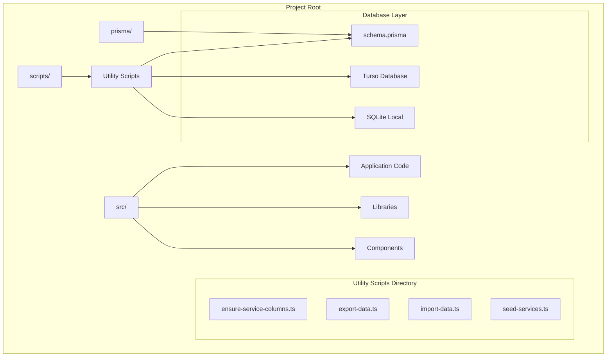
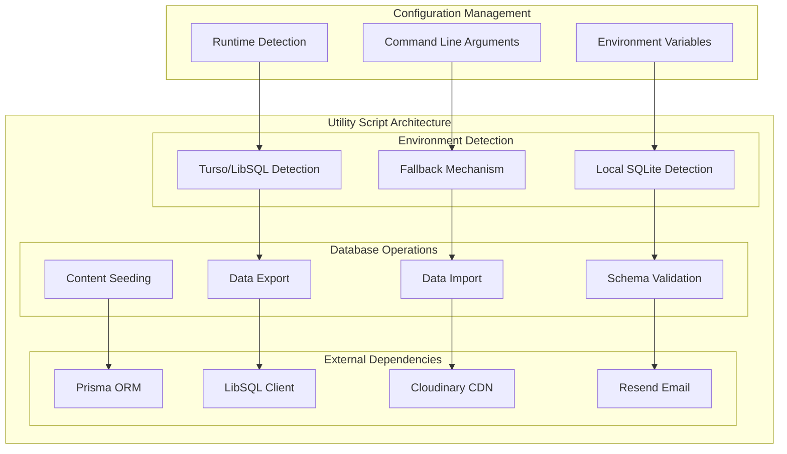
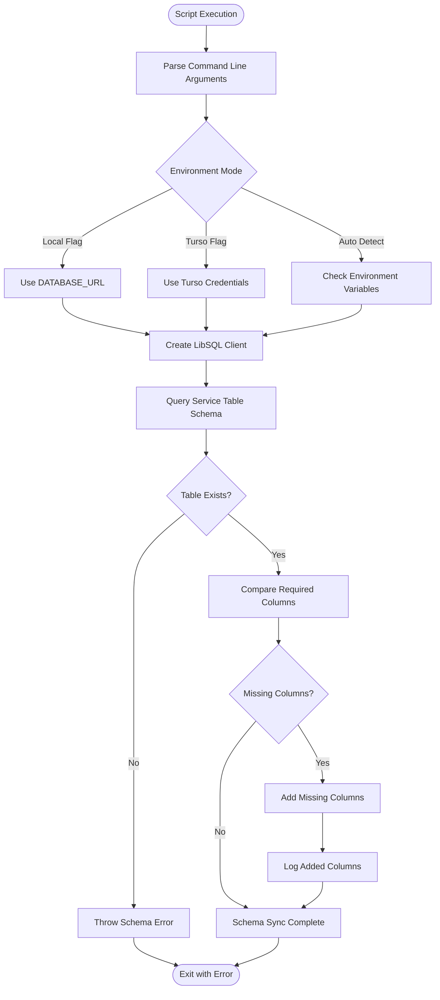
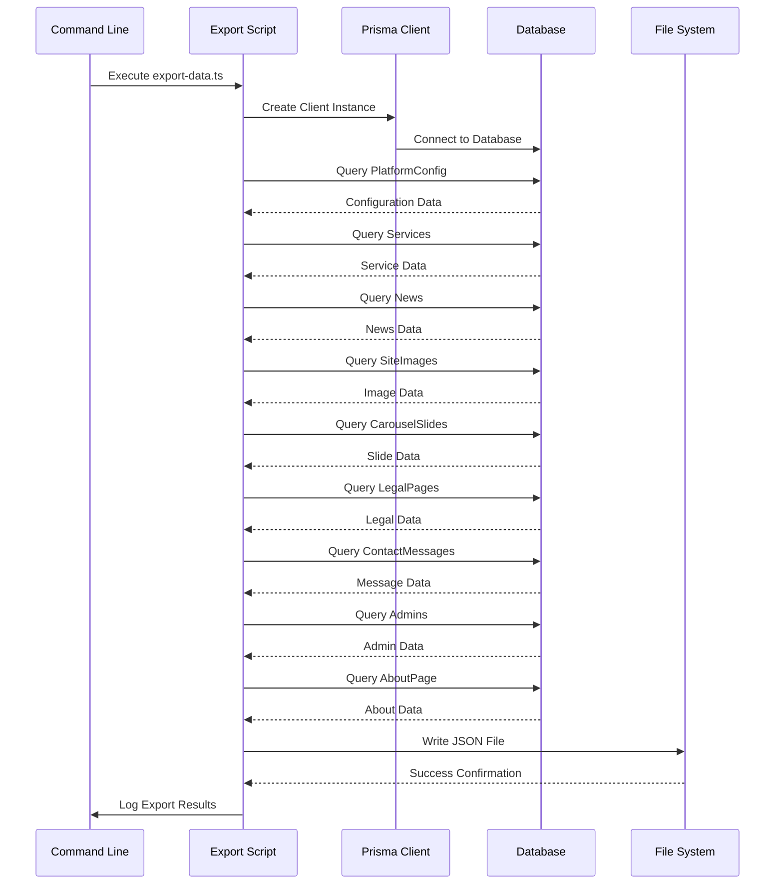
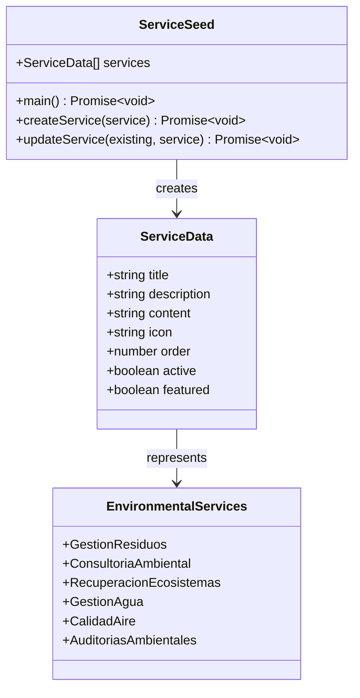
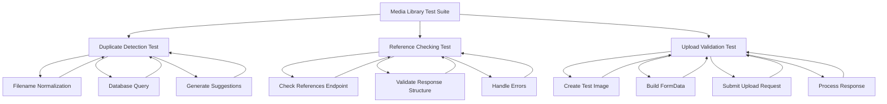
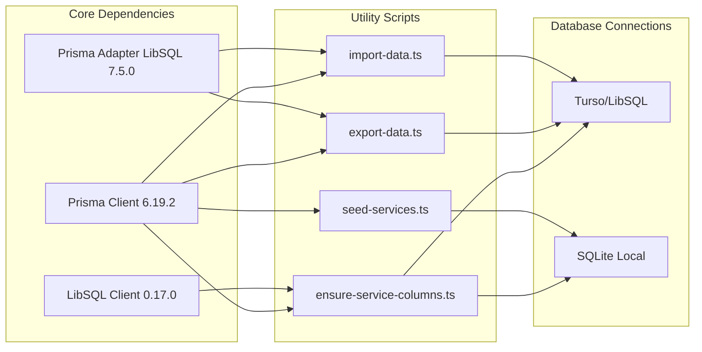
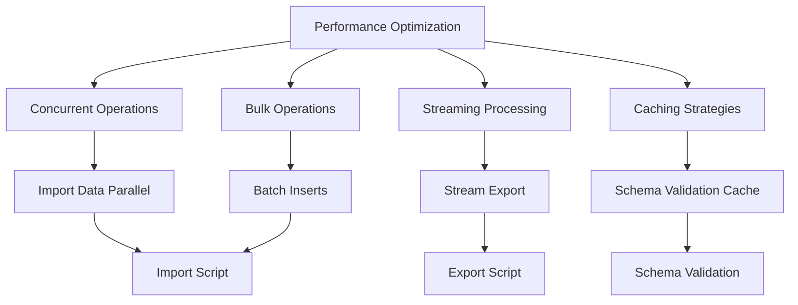
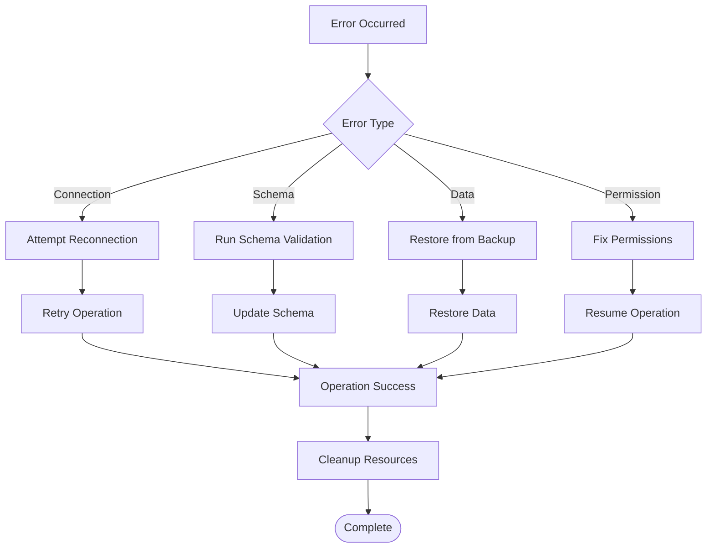

# Utility Scripts

<cite>
**Referenced Files in This Document**
- [ensure-service-columns.ts](file://scripts/ensure-service-columns.ts)
- [export-data.ts](file://scripts/export-data.ts)
- [import-data.ts](file://scripts/import-data.ts)
- [seed-services.ts](file://scripts/seed-services.ts)
- [package.json](file://package.json)
- [schema.prisma](file://prisma/schema.prisma)
- [README.md](file://README.md)
- [test-check-references.js](file://test-check-references.js)
- [test-duplicate-detection.js](file://test-duplicate-detection.js)
- [test-upload-duplicate-detection.js](file://test-upload-duplicate-detection.js)
</cite>

## Table of Contents
1. [Introduction](#introduction)
2. [Project Structure](#project-structure)
3. [Core Components](#core-components)
4. [Architecture Overview](#architecture-overview)
5. [Detailed Component Analysis](#detailed-component-analysis)
6. [Dependency Analysis](#dependency-analysis)
7. [Performance Considerations](#performance-considerations)
8. [Troubleshooting Guide](#troubleshooting-guide)
9. [Conclusion](#conclusion)

## Introduction

The GreenAxis utility scripts provide essential database management and data migration capabilities for the environmental services company website. These scripts handle critical operations including database schema validation, data backup and restoration, initial content seeding, and media library testing.

The utility scripts are designed to work with the project's dual database architecture supporting both local SQLite and remote Turso/LibSQL databases, ensuring flexibility for different deployment environments while maintaining data consistency across platforms.

## Project Structure

The utility scripts are organized in the `scripts/` directory alongside the main application code, following a clean separation of concerns between application logic and administrative utilities.

**Diagram sources**
- [package.json:15-20](file://package.json#L15-L20)
- [schema.prisma:1-20](file://prisma/schema.prisma#L1-L20)

**Section sources**
- [package.json:15-20](file://package.json#L15-L20)
- [README.md:152-186](file://README.md#L152-L186)

## Core Components

The utility script suite consists of four primary components, each serving distinct database management functions:

### Database Schema Management
The `ensure-service-columns.ts` script provides automated schema validation and column synchronization for the Service model, ensuring database consistency across different environments.

### Data Migration Tools
The `export-data.ts` and `import-data.ts` scripts enable complete data backup and restoration, supporting both JSON export/import operations and Turso database connectivity.

### Content Initialization
The `seed-services.ts` script provides comprehensive service content population with predefined environmental services data, including certification information and service descriptions.

### Testing Infrastructure
Multiple test scripts validate media library functionality, duplicate detection, and reference checking capabilities.

**Section sources**
- [ensure-service-columns.ts:1-88](file://scripts/ensure-service-columns.ts#L1-L88)
- [export-data.ts:1-62](file://scripts/export-data.ts#L1-L62)
- [import-data.ts:1-82](file://scripts/import-data.ts#L1-L82)
- [seed-services.ts:1-148](file://scripts/seed-services.ts#L1-L148)

## Architecture Overview

The utility scripts operate within a sophisticated dual-database architecture supporting both local development and cloud deployment scenarios.

**Diagram sources**
- [ensure-service-columns.ts:7-43](file://scripts/ensure-service-columns.ts#L7-L43)
- [export-data.ts:9-22](file://scripts/export-data.ts#L9-L22)
- [import-data.ts:5-10](file://scripts/import-data.ts#L5-L10)

The architecture supports three operational modes:
- **Local Development Mode**: Uses DATABASE_URL environment variable for SQLite connections
- **Cloud Production Mode**: Connects to Turso/LibSQL using TURSO_DATABASE_URL and TURSO_AUTH_TOKEN
- **Hybrid Detection Mode**: Automatically selects appropriate connection based on available environment variables

**Section sources**
- [ensure-service-columns.ts:7-43](file://scripts/ensure-service-columns.ts#L7-L43)
- [export-data.ts:9-22](file://scripts/export-data.ts#L9-L22)
- [import-data.ts:5-10](file://scripts/import-data.ts#L5-L10)

## Detailed Component Analysis

### Service Column Validation Script

The `ensure-service-columns.ts` script provides comprehensive database schema validation and automatic column addition for the Service model.

**Diagram sources**
- [ensure-service-columns.ts:45-82](file://scripts/ensure-service-columns.ts#L45-L82)

The script validates the presence of three critical columns in the Service table:
- `slug`: URL-friendly service identifier
- `blocks`: Editor.js formatted content blocks
- `shortBlocks`: Short content blocks for public display

**Section sources**
- [ensure-service-columns.ts:45-82](file://scripts/ensure-service-columns.ts#L45-L82)

### Data Export and Import System

The data migration system provides comprehensive backup and restoration capabilities with support for both local and cloud database environments.

**Diagram sources**
- [export-data.ts:24-59](file://scripts/export-data.ts#L24-L59)

The export process captures data from ten distinct database tables, creating a comprehensive backup that preserves all platform content and configuration.

**Section sources**
- [export-data.ts:24-59](file://scripts/export-data.ts#L24-L59)

### Service Content Seeding

The `seed-services.ts` script provides comprehensive initial content population for environmental services, featuring six specialized service categories with detailed descriptions and certifications.

**Diagram sources**
- [seed-services.ts:5-113](file://scripts/seed-services.ts#L5-L113)

Each service includes:
- Comprehensive service descriptions with environmental certifications
- Icon references for visual representation
- Ordering system for display priority
- Featured status for homepage highlighting
- Active status for content management

**Section sources**
- [seed-services.ts:5-113](file://scripts/seed-services.ts#L5-L113)

### Media Library Testing Infrastructure

The testing scripts validate media library functionality including duplicate detection, reference checking, and upload validation processes.

**Diagram sources**
- [test-duplicate-detection.js:8-26](file://test-duplicate-detection.js#L8-L26)
- [test-check-references.js:14-158](file://test-check-references.js#L14-L158)
- [test-upload-duplicate-detection.js:9-146](file://test-upload-duplicate-detection.js#L9-L146)

**Section sources**
- [test-duplicate-detection.js:8-26](file://test-duplicate-detection.js#L8-L26)
- [test-check-references.js:14-158](file://test-check-references.js#L14-L158)
- [test-upload-duplicate-detection.js:9-146](file://test-upload-duplicate-detection.js#L9-L146)

## Dependency Analysis

The utility scripts leverage several key dependencies that enable cross-platform database connectivity and data management operations.

**Diagram sources**
- [package.json:33-36](file://package.json#L33-L36)
- [ensure-service-columns.ts:1](file://scripts/ensure-service-columns.ts#L1)
- [export-data.ts:1](file://scripts/export-data.ts#L1)
- [import-data.ts:1](file://scripts/import-data.ts#L1)

The dependency architecture supports:
- **Dual Database Connectivity**: Single codebase supporting both SQLite and Turso/LibSQL
- **Type Safety**: Full TypeScript integration with Prisma client generation
- **Cross-Platform Compatibility**: LibSQL client enables edge-native database operations
- **Development Flexibility**: Automatic environment detection reduces configuration overhead

**Section sources**
- [package.json:33-36](file://package.json#L33-L36)
- [ensure-service-columns.ts:1](file://scripts/ensure-service-columns.ts#L1)
- [export-data.ts:1](file://scripts/export-data.ts#L1)
- [import-data.ts:1](file://scripts/import-data.ts#L1)

## Performance Considerations

The utility scripts are designed with performance optimization in mind, particularly for large-scale data operations and database migrations.

### Connection Pooling and Resource Management

The scripts implement efficient resource management through:
- **Connection Reuse**: Single client instances for multiple operations
- **Automatic Cleanup**: Proper disconnection handling in finally blocks
- **Memory Efficiency**: Streaming JSON serialization for large datasets
- **Batch Operations**: Bulk insert operations for improved performance

### Database Optimization Strategies

**Diagram sources**
- [export-data.ts:24-59](file://scripts/export-data.ts#L24-L59)
- [import-data.ts:12-79](file://scripts/import-data.ts#L12-L79)

### Memory Management

The scripts implement careful memory management:
- **Large Dataset Handling**: Streaming JSON processing prevents memory overflow
- **Resource Cleanup**: Proper client disposal in finally blocks
- **Error Recovery**: Graceful degradation during operation failures
- **Progress Tracking**: Real-time feedback for long-running operations

## Troubleshooting Guide

### Common Environment Configuration Issues

**Database Connection Problems**
- Verify environment variables are properly set
- Check Turso credentials for production deployments
- Ensure SQLite file permissions for local development
- Confirm network connectivity for remote database access

**Schema Validation Failures**
- Review Service table structure in database
- Check for existing column conflicts
- Verify database user permissions
- Validate Prisma client generation

**Data Migration Issues**
- Ensure sufficient disk space for export operations
- Check database connectivity timeouts
- Verify JSON file permissions for import operations
- Monitor database transaction limits

### Error Handling and Recovery

**Diagram sources**
- [ensure-service-columns.ts:84-87](file://scripts/ensure-service-columns.ts#L84-L87)
- [export-data.ts:54-58](file://scripts/export-data.ts#L54-L58)
- [import-data.ts:74-79](file://scripts/import-data.ts#L74-L79)

### Debugging and Logging

The scripts provide comprehensive logging for troubleshooting:
- **Operation Progress**: Real-time status updates for long-running operations
- **Error Details**: Specific error messages with stack traces
- **Environment Information**: Database connection details and configuration
- **Performance Metrics**: Timing information for optimization

**Section sources**
- [ensure-service-columns.ts:84-87](file://scripts/ensure-service-columns.ts#L84-L87)
- [export-data.ts:54-58](file://scripts/export-data.ts#L54-L58)
- [import-data.ts:74-79](file://scripts/import-data.ts#L74-L79)

## Conclusion

The GreenAxis utility scripts provide a comprehensive solution for database management, data migration, and content initialization in the environmental services platform. The scripts demonstrate enterprise-grade functionality with support for dual database architectures, comprehensive error handling, and extensive testing infrastructure.

Key strengths of the utility script suite include:
- **Flexible Database Support**: Seamless operation across local SQLite and cloud Turso/LibSQL environments
- **Comprehensive Data Management**: Complete backup, restore, and validation capabilities
- **Automated Schema Maintenance**: Intelligent column validation and synchronization
- **Robust Testing Infrastructure**: Extensive test coverage for media library functionality
- **Production-Ready Error Handling**: Graceful degradation and recovery mechanisms

The scripts serve as essential tools for platform administrators, developers, and DevOps engineers, enabling reliable database operations across different deployment scenarios while maintaining data integrity and system performance.