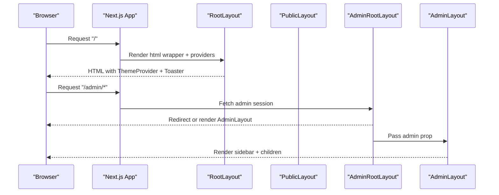
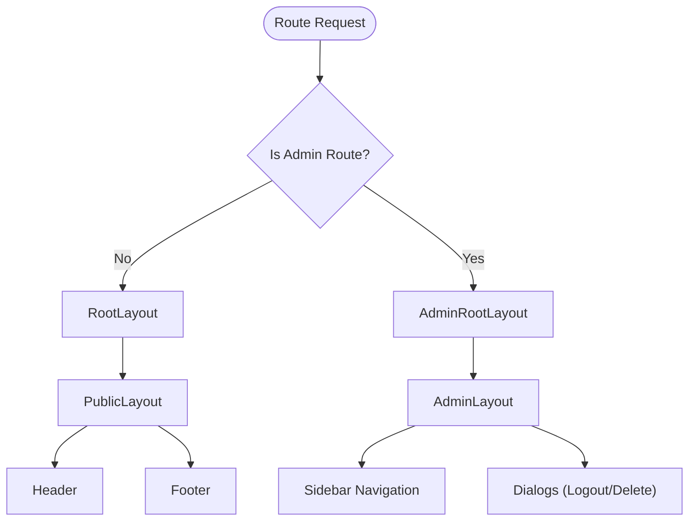
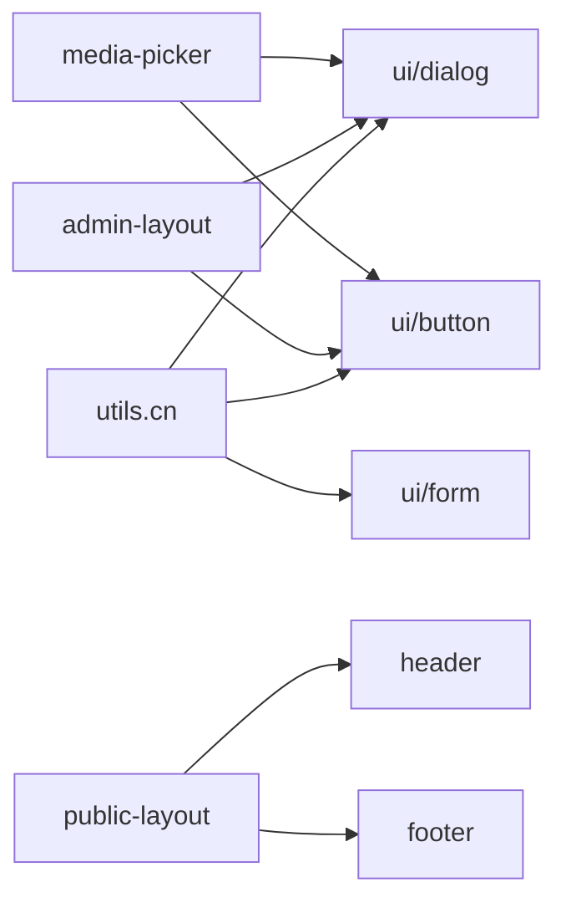

# Component System & UI Library

<cite>
**Referenced Files in This Document**
- [public-layout.tsx](file://src/components/public-layout.tsx)
- [admin-layout.tsx](file://src/components/admin-layout.tsx)
- [layout.tsx](file://src/app/layout.tsx)
- [admin-root-layout.tsx](file://src/app/admin/layout.tsx)
- [components.json](file://components.json)
- [button.tsx](file://src/components/ui/button.tsx)
- [dialog.tsx](file://src/components/ui/dialog.tsx)
- [form.tsx](file://src/components/ui/form.tsx)
- [header.tsx](file://src/components/header.tsx)
- [footer.tsx](file://src/components/footer.tsx)
- [media-picker.tsx](file://src/components/media-picker.tsx)
- [services-section.tsx](file://src/components/services-section.tsx)
- [news-section.tsx](file://src/components/news-section.tsx)
- [about-section.tsx](file://src/components/about-section.tsx)
- [utils.ts](file://src/lib/utils.ts)
</cite>

## Table of Contents
1. [Introduction](#introduction)
2. [Project Structure](#project-structure)
3. [Core Components](#core-components)
4. [Architecture Overview](#architecture-overview)
5. [Detailed Component Analysis](#detailed-component-analysis)
6. [Dependency Analysis](#dependency-analysis)
7. [Performance Considerations](#performance-considerations)
8. [Troubleshooting Guide](#troubleshooting-guide)
9. [Conclusion](#conclusion)
10. [Appendices](#appendices)

## Introduction
This document explains the component system architecture of the project, focusing on:
- Integration with the shadcn/ui component library
- Custom component development patterns and composition strategies
- Layout hierarchy for public and admin experiences
- Folder structure, naming conventions, and reusability patterns
- Examples of form components, data display components, and interactive elements
- Props validation, TypeScript integration, and accessibility features

## Project Structure
The component system is organized around:
- A dedicated ui folder for shadcn/ui primitives
- Feature-specific components under src/components
- Application-wide layouts under src/app and src/components
- Shared utilities for styling and composition

```mermaid
graph TB
subgraph "App Shell"
RootLayout["RootLayout<br/>(src/app/layout.tsx)"]
PublicLayout["PublicLayout<br/>(src/components/public-layout.tsx)"]
AdminRootLayout["AdminRootLayout<br/>(src/app/admin/layout.tsx)"]
AdminLayout["AdminLayout<br/>(src/components/admin-layout.tsx)"]
end
subgraph "UI Library"
Button["Button<br/>(src/components/ui/button.tsx)"]
Dialog["Dialog<br/>(src/components/ui/dialog.tsx)"]
Form["Form/FormProvider<br/>(src/components/ui/form.tsx)"]
end
subgraph "Custom Components"
Header["Header<br/>(src/components/header.tsx)"]
Footer["Footer<br/>(src/components/footer.tsx)]
MediaPicker["MediaPicker<br/>(src/components/media-picker.tsx)"]
ServicesSection["ServicesSection<br/>(src/components/services-section.tsx)"]
NewsSection["NewsSection<br/>(src/components/news-section.tsx)"]
AboutSection["AboutSection<br/>(src/components/about-section.tsx)"]
end
Utils["Utils<br/>(src/lib/utils.ts)"]
RootLayout --> PublicLayout
RootLayout --> AdminRootLayout
AdminRootLayout --> AdminLayout
PublicLayout --> Header
PublicLayout --> Footer
AdminLayout --> Dialog
AdminLayout --> Button
MediaPicker --> Dialog
MediaPicker --> Button
ServicesSection --> Button
NewsSection --> Button
AboutSection --> Utils
Header --> Button
Footer --> Utils
```

**Diagram sources**
- [layout.tsx:56-79](file://src/app/layout.tsx#L56-L79)
- [public-layout.tsx:10-54](file://src/components/public-layout.tsx#L10-L54)
- [admin-root-layout.tsx:5-17](file://src/app/admin/layout.tsx#L5-L17)
- [admin-layout.tsx:61-382](file://src/components/admin-layout.tsx#L61-L382)
- [button.tsx:38-57](file://src/components/ui/button.tsx#L38-L57)
- [dialog.tsx:9-81](file://src/components/ui/dialog.tsx#L9-L81)
- [form.tsx:19-66](file://src/components/ui/form.tsx#L19-L66)
- [header.tsx:21-187](file://src/components/header.tsx#L21-L187)
- [footer.tsx:42-221](file://src/components/footer.tsx#L42-L221)
- [media-picker.tsx:106-753](file://src/components/media-picker.tsx#L106-L753)
- [services-section.tsx:43-181](file://src/components/services-section.tsx#L43-L181)
- [news-section.tsx:23-137](file://src/components/news-section.tsx#L23-L137)
- [about-section.tsx:32-168](file://src/components/about-section.tsx#L32-L168)
- [utils.ts:4-6](file://src/lib/utils.ts#L4-L6)

**Section sources**
- [layout.tsx:1-80](file://src/app/layout.tsx#L1-L80)
- [public-layout.tsx:1-55](file://src/components/public-layout.tsx#L1-L55)
- [admin-root-layout.tsx:1-18](file://src/app/admin/layout.tsx#L1-L18)
- [admin-layout.tsx:1-384](file://src/components/admin-layout.tsx#L1-L384)
- [components.json:1-21](file://components.json#L1-L21)

## Core Components
- Shadcn/ui primitives: Button, Dialog, Form/FormProvider, and others are built with class variance authority and radix-ui foundations, enabling consistent styling and accessibility.
- Custom layout components: PublicLayout composes Header, Footer, and a floating WhatsApp bubble; AdminLayout provides a responsive sidebar, theme toggle, and account actions.
- Utility functions: cn merges Tailwind classes safely, ensuring predictable styles.

Key characteristics:
- Strong TypeScript integration with explicit props and generics
- Accessibility-first patterns (ARIA attributes, semantic HTML, keyboard navigation)
- Composition via slot-based components and context providers

**Section sources**
- [button.tsx:7-36](file://src/components/ui/button.tsx#L7-L36)
- [dialog.tsx:9-81](file://src/components/ui/dialog.tsx#L9-L81)
- [form.tsx:19-66](file://src/components/ui/form.tsx#L19-L66)
- [public-layout.tsx:6-54](file://src/components/public-layout.tsx#L6-L54)
- [admin-layout.tsx:43-382](file://src/components/admin-layout.tsx#L43-L382)
- [utils.ts:4-6](file://src/lib/utils.ts#L4-L6)

## Architecture Overview
The application bootstraps global providers and metadata, then delegates rendering to either public or admin layouts depending on the route. Public pages use PublicLayout to render shared header, main content, and footer. Admin pages wrap children with AdminLayout after verifying admin session.



**Diagram sources**
- [layout.tsx:56-79](file://src/app/layout.tsx#L56-L79)
- [admin-root-layout.tsx:5-17](file://src/app/admin/layout.tsx#L5-L17)
- [admin-layout.tsx:61-382](file://src/components/admin-layout.tsx#L61-L382)

## Detailed Component Analysis

### Shadcn/UI Integration and Patterns
- Variants and slots: Button uses class variance authority and Radix Slot to support both native buttons and custom wrappers.
- Dialog composition: Root, Portal, Overlay, Content, Title, Description, Footer, Trigger, Close encapsulate state and focus management.
- Form system: FormProvider, FormField, useFormField, and related helpers connect Radix labels and react-hook-form with accessible ARIA attributes.

```mermaid
classDiagram
class Button {
+variant
+size
+asChild
+className
}
class Dialog {
+Root
+Portal
+Overlay
+Content
+Title
+Description
+Footer
+Trigger
+Close
}
class Form {
+FormProvider
+FormField
+useFormField
+FormItem
+FormLabel
+FormControl
+FormDescription
+FormMessage
}
Button --> "uses" Utils["cn"]
Dialog --> "uses" Utils
Form --> "uses" Utils
```

**Diagram sources**
- [button.tsx:38-57](file://src/components/ui/button.tsx#L38-L57)
- [dialog.tsx:9-143](file://src/components/ui/dialog.tsx#L9-L143)
- [form.tsx:19-167](file://src/components/ui/form.tsx#L19-L167)
- [utils.ts:4-6](file://src/lib/utils.ts#L4-L6)

**Section sources**
- [button.tsx:1-60](file://src/components/ui/button.tsx#L1-L60)
- [dialog.tsx:1-144](file://src/components/ui/dialog.tsx#L1-L144)
- [form.tsx:1-168](file://src/components/ui/form.tsx#L1-L168)
- [utils.ts:1-7](file://src/lib/utils.ts#L1-L7)

### Layout Component Hierarchy
- RootLayout sets up theme provider, analytics loader, and global toasts.
- PublicLayout orchestrates platform configuration and services, passing them to Header and Footer, and renders a floating WhatsApp bubble.
- AdminRootLayout validates admin session and passes admin data to AdminLayout.
- AdminLayout manages responsive sidebar, theme toggle, navigation, and account actions with dialogs and state.



**Diagram sources**
- [layout.tsx:56-79](file://src/app/layout.tsx#L56-L79)
- [public-layout.tsx:10-54](file://src/components/public-layout.tsx#L10-L54)
- [admin-root-layout.tsx:5-17](file://src/app/admin/layout.tsx#L5-L17)
- [admin-layout.tsx:61-382](file://src/components/admin-layout.tsx#L61-L382)

**Section sources**
- [layout.tsx:1-80](file://src/app/layout.tsx#L1-L80)
- [public-layout.tsx:1-55](file://src/components/public-layout.tsx#L1-L55)
- [admin-root-layout.tsx:1-18](file://src/app/admin/layout.tsx#L1-L18)
- [admin-layout.tsx:1-384](file://src/components/admin-layout.tsx#L1-L384)

### Public Layout Props and Usage
- PublicLayoutProps: children (ReactNode)
- Fetches platform configuration and services concurrently, prepares footer config and mapped services, and renders Header, main content, Footer, and a WhatsApp bubble with dynamic props.

Usage pattern:
- Wrap page components with PublicLayout to inherit shared header/footer and configuration-driven UI.

**Section sources**
- [public-layout.tsx:6-54](file://src/components/public-layout.tsx#L6-L54)

### Admin Layout Props and Usage
- AdminLayoutProps: children (ReactNode), admin (with id, email, name)
- Manages:
  - Responsive sidebar (desktop and mobile overlays)
  - Theme toggle
  - Navigation items with active state
  - Logout and account deletion flow via dialogs
  - Dynamic logo and admin count

Usage pattern:
- Use AdminRootLayout to guard routes and pass admin data to AdminLayout.

**Section sources**
- [admin-layout.tsx:43-382](file://src/components/admin-layout.tsx#L43-L382)
- [admin-root-layout.tsx:5-17](file://src/app/admin/layout.tsx#L5-L17)

### Component Folder Structure, Naming, and Reusability
- src/components/ui: shadcn/ui primitives with consistent props and variants
- src/components: feature-specific components (Header, Footer, MediaPicker, Sections)
- Aliases configured in components.json map @/components, @/lib, @/hooks to actual paths
- Reusability patterns:
  - Props-driven customization (e.g., ServicesSection accepts a list of services)
  - Utility functions (cn) for safe class merging
  - Accessible patterns (ARIA attributes, labels, semantic roles)

**Section sources**
- [components.json:13-19](file://components.json#L13-L19)
- [utils.ts:4-6](file://src/lib/utils.ts#L4-L6)
- [services-section.tsx:18-20](file://src/components/services-section.tsx#L18-L20)

### Form Components
- Form/FormProvider: wraps react-hook-form contexts
- FormField/useFormField: injects ids and error state into labels and controls
- FormLabel/FormControl/FormDescription/FormMessage: connect to Radix and react-hook-form with accessible attributes

Validation and accessibility:
- ARIA invalid states and described-by ids propagate errors to assistive technologies
- Controlled components via Controller integrate with form state

**Section sources**
- [form.tsx:19-167](file://src/components/ui/form.tsx#L19-L167)

### Data Display Components
- ServicesSection: renders cards with optional images/icons, featured badges, and links to detail pages
- NewsSection: displays news cards with thumbnails, dates, and excerpts
- AboutSection: renders statistics and features with configurable colors and content

Composition:
- Use cloudinary helpers for responsive images
- Respect feature flags and fallbacks for empty states

**Section sources**
- [services-section.tsx:18-181](file://src/components/services-section.tsx#L18-L181)
- [news-section.tsx:19-137](file://src/components/news-section.tsx#L19-L137)
- [about-section.tsx:21-168](file://src/components/about-section.tsx#L21-L168)

### Interactive Elements
- Header: responsive navigation with mobile overlay, theme toggle, and scroll-aware styling
- Footer: social links, dynamic services, and contact information
- MediaPicker: unified picker with library browsing, upload with progress, duplicate detection, and preview modal

Accessibility:
- Proper labels and aria-expanded for mobile menu
- Semantic role and focus management in dialogs and forms
- Keyboard-friendly navigation in navigation menus

**Section sources**
- [header.tsx:21-187](file://src/components/header.tsx#L21-L187)
- [footer.tsx:42-221](file://src/components/footer.tsx#L42-L221)
- [media-picker.tsx:106-753](file://src/components/media-picker.tsx#L106-L753)

## Dependency Analysis
- UI primitives depend on cn for class merging and radix-ui for accessibility semantics
- Layouts depend on configuration and services fetched at runtime
- Custom components depend on UI primitives and shared utilities
- Admin layout depends on shadcn/ui dialogs and buttons for modals and actions



**Diagram sources**
- [utils.ts:4-6](file://src/lib/utils.ts#L4-L6)
- [button.tsx:38-57](file://src/components/ui/button.tsx#L38-L57)
- [dialog.tsx:9-81](file://src/components/ui/dialog.tsx#L9-L81)
- [form.tsx:19-66](file://src/components/ui/form.tsx#L19-L66)
- [public-layout.tsx:10-54](file://src/components/public-layout.tsx#L10-L54)
- [admin-layout.tsx:61-382](file://src/components/admin-layout.tsx#L61-L382)
- [media-picker.tsx:106-753](file://src/components/media-picker.tsx#L106-L753)

**Section sources**
- [utils.ts:1-7](file://src/lib/utils.ts#L1-L7)
- [button.tsx:1-60](file://src/components/ui/button.tsx#L1-L60)
- [dialog.tsx:1-144](file://src/components/ui/dialog.tsx#L1-L144)
- [form.tsx:1-168](file://src/components/ui/form.tsx#L1-L168)
- [public-layout.tsx:1-55](file://src/components/public-layout.tsx#L1-L55)
- [admin-layout.tsx:1-384](file://src/components/admin-layout.tsx#L1-L384)
- [media-picker.tsx:1-754](file://src/components/media-picker.tsx#L1-L754)

## Performance Considerations
- Prefer server-side fetching in layouts for configuration and lists to reduce client work
- Use responsive image helpers to optimize media rendering
- Keep dialogs and modals lazy-loaded where appropriate to minimize initial bundle size
- Use cn to avoid redundant class concatenation and improve render performance

## Troubleshooting Guide
Common issues and resolutions:
- Dialogs not closing or focus not trapped: ensure DialogPortal and Overlay are rendered and that triggers close properly
- Form validation not reflected visually: confirm useFormField is used inside FormField and that labels/controls receive aria-invalid and described-by ids
- Admin sidebar not responsive: verify mobile overlay click handlers and state transitions
- Media uploads failing: check maxSize constraints and duplicate detection warnings; ensure upload endpoint and Cloudinary integration are reachable

**Section sources**
- [dialog.tsx:58-80](file://src/components/ui/dialog.tsx#L58-L80)
- [form.tsx:107-123](file://src/components/ui/form.tsx#L107-L123)
- [admin-layout.tsx:252-335](file://src/components/admin-layout.tsx#L252-L335)
- [media-picker.tsx:201-316](file://src/components/media-picker.tsx#L201-L316)

## Conclusion
The component system blends shadcn/ui primitives with custom, reusable components to deliver a cohesive, accessible, and maintainable UI. Layouts orchestrate configuration-driven rendering, while form and data display components emphasize type safety, accessibility, and composability. The folder structure and aliases streamline imports and promote reuse across the application.

## Appendices
- Props validation: Use TypeScript interfaces for all components to enforce required props and prevent runtime errors
- Accessibility: Leverage ARIA attributes, semantic HTML, and radix-ui patterns to ensure inclusive experiences
- Naming conventions: Use kebab-case for component filenames and PascalCase for component exports; keep props concise and self-descriptive