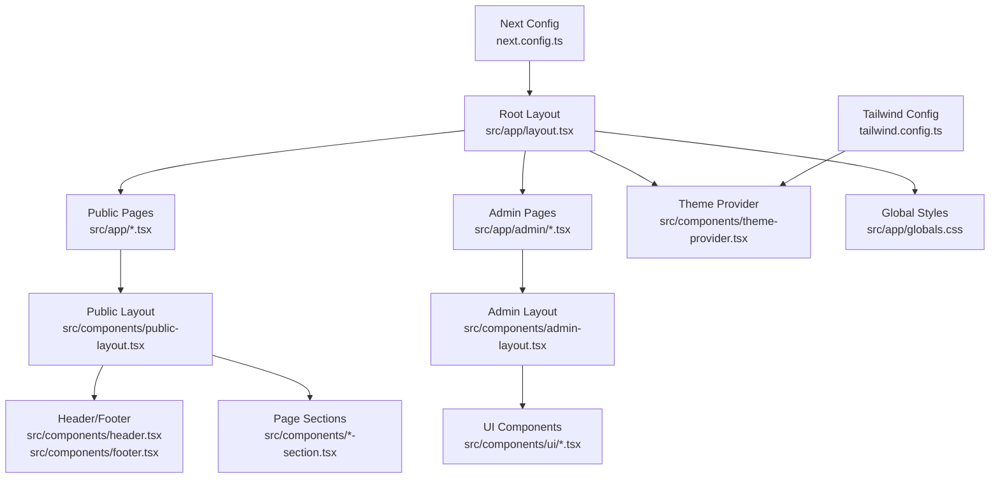
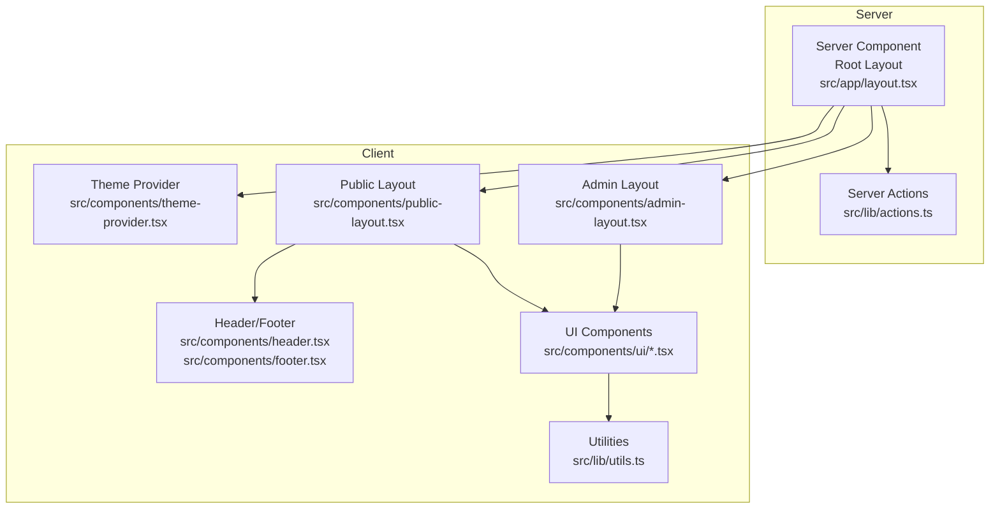
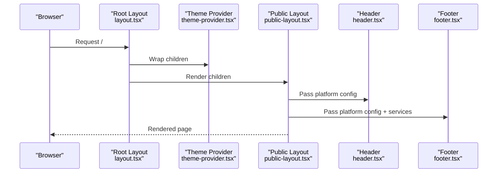
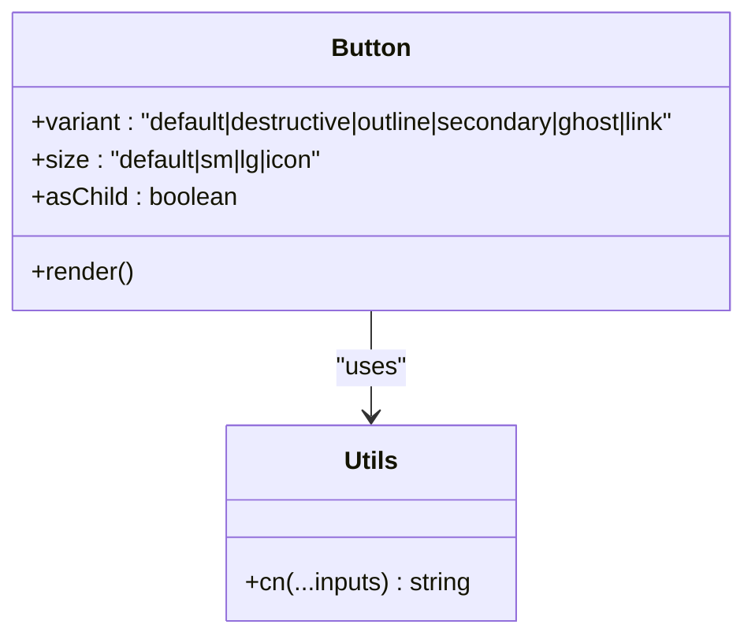
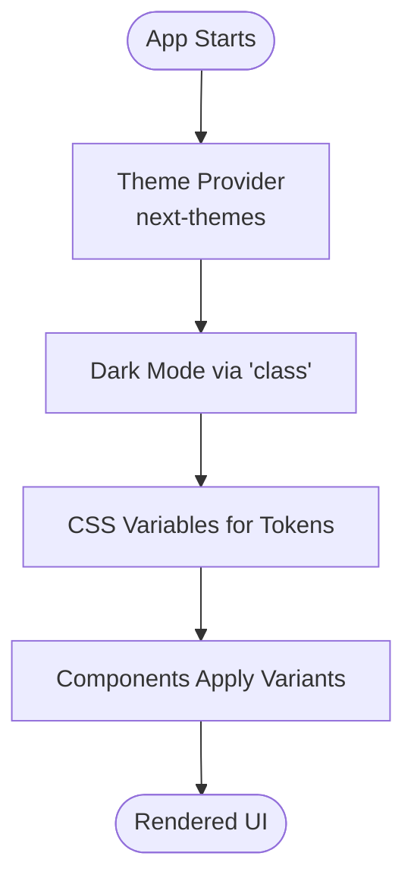
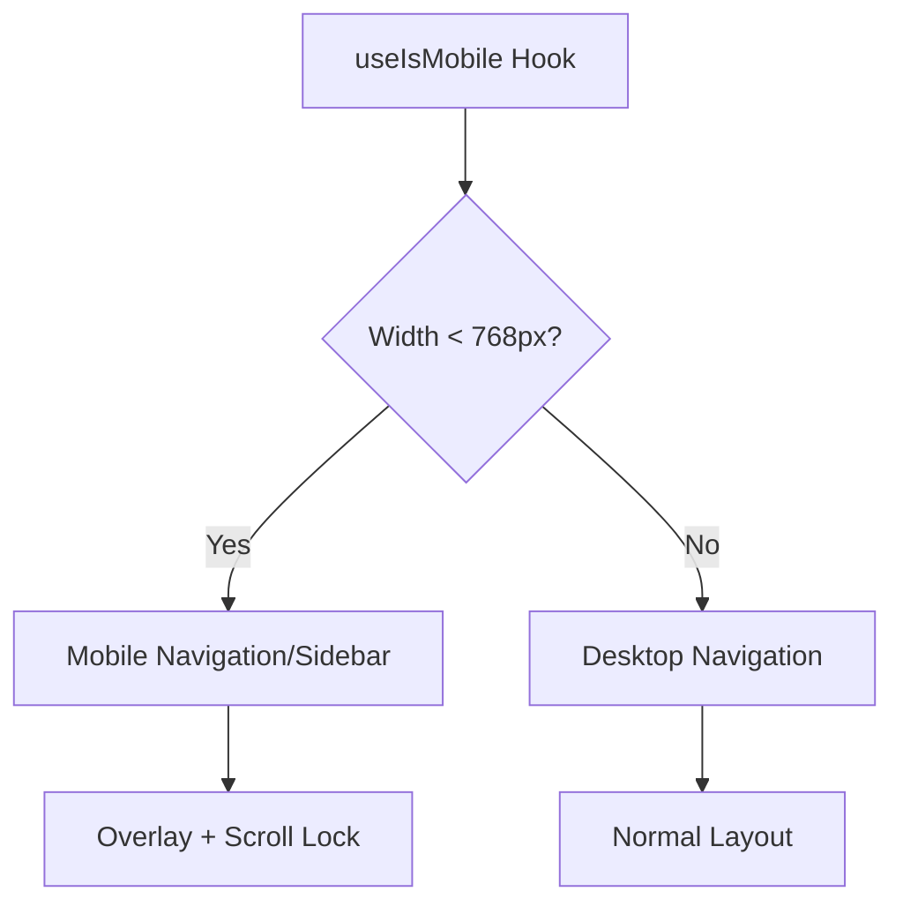
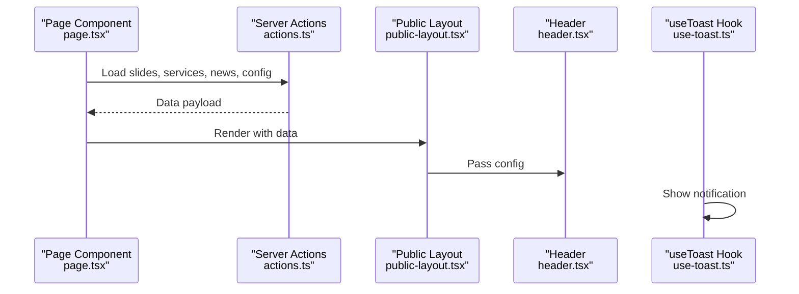
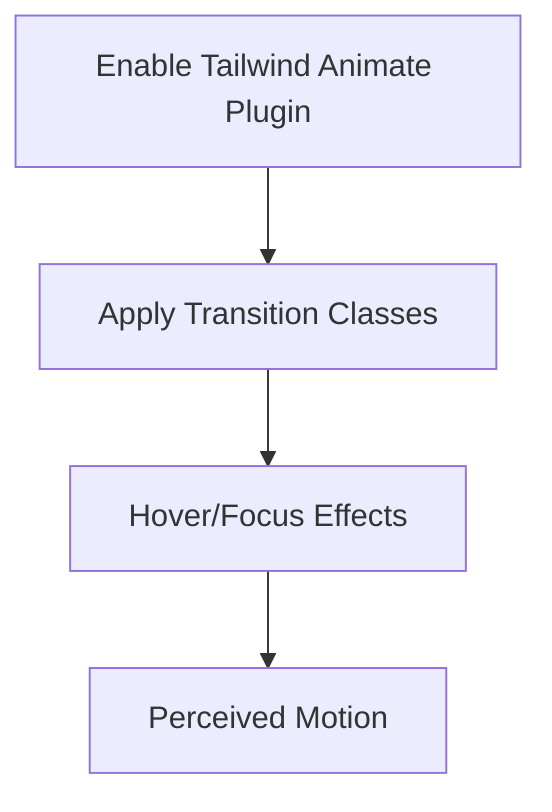
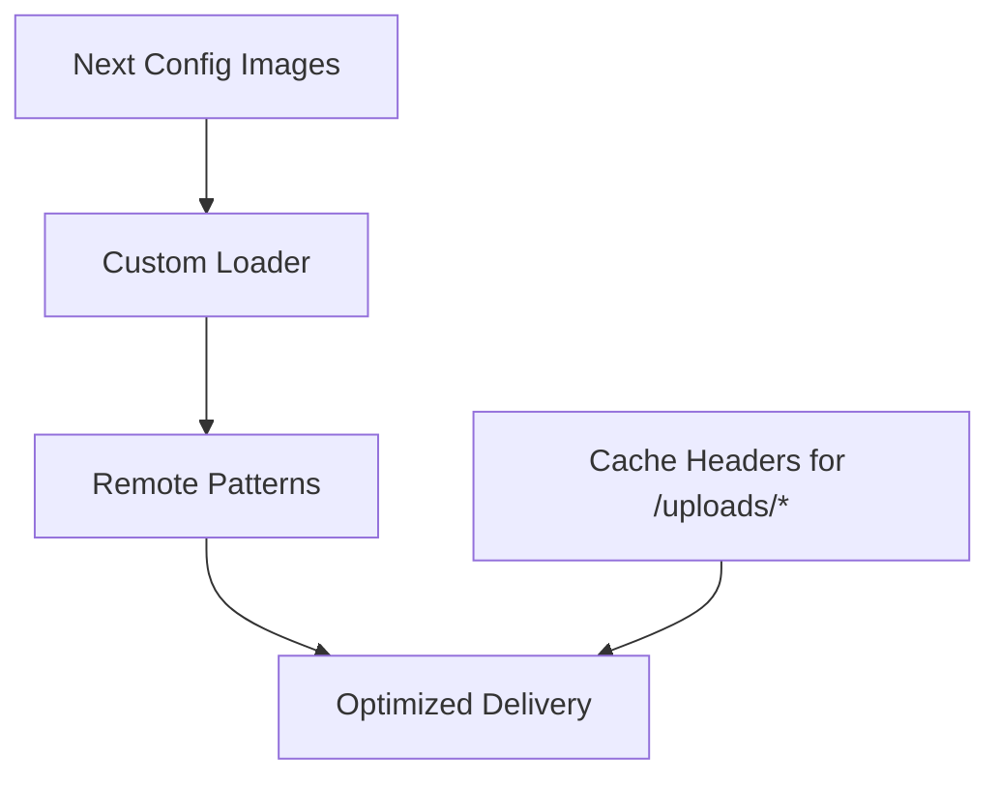
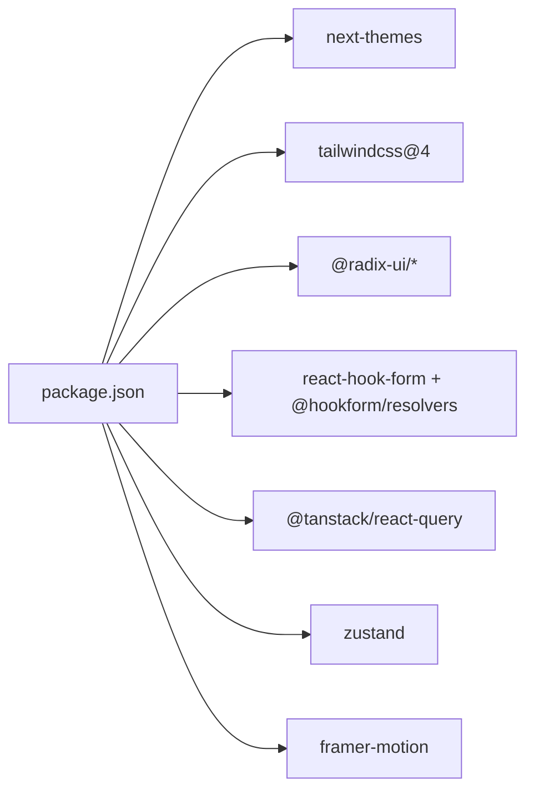

# Frontend Architecture

<cite>
**Referenced Files in This Document**
- [src/app/layout.tsx](file://src/app/layout.tsx)
- [src/components/theme-provider.tsx](file://src/components/theme-provider.tsx)
- [tailwind.config.ts](file://tailwind.config.ts)
- [package.json](file://package.json)
- [next.config.ts](file://next.config.ts)
- [src/components/ui/button.tsx](file://src/components/ui/button.tsx)
- [src/components/public-layout.tsx](file://src/components/public-layout.tsx)
- [src/components/admin-layout.tsx](file://src/components/admin-layout.tsx)
- [src/hooks/use-mobile.ts](file://src/hooks/use-mobile.ts)
- [src/hooks/use-toast.ts](file://src/hooks/use-toast.ts)
- [src/app/page.tsx](file://src/app/page.tsx)
- [src/components/header.tsx](file://src/components/header.tsx)
- [src/components/footer.tsx](file://src/components/footer.tsx)
- [src/lib/utils.ts](file://src/lib/utils.ts)
- [src/lib/actions.ts](file://src/lib/actions.ts)
</cite>

## Table of Contents
1. [Introduction](#introduction)
2. [Project Structure](#project-structure)
3. [Core Components](#core-components)
4. [Architecture Overview](#architecture-overview)
5. [Detailed Component Analysis](#detailed-component-analysis)
6. [Dependency Analysis](#dependency-analysis)
7. [Performance Considerations](#performance-considerations)
8. [Troubleshooting Guide](#troubleshooting-guide)
9. [Conclusion](#conclusion)

## Introduction
This document describes the frontend architecture of GreenAxis built with Next.js App Router. It covers page-based routing, server components, layout hierarchy, styling with Tailwind CSS 4 and shadcn/ui, state management patterns, responsive design, accessibility, theming, and animations. The goal is to help developers understand how the frontend is structured and how to extend or maintain it effectively.

## Project Structure
The frontend follows Next.js App Router conventions with:
- A root application layout that sets metadata, fonts, analytics, theme provider, and global styles.
- Page routes under src/app organized by feature (e.g., home, services, news, admin).
- Shared UI components under src/components, including a shadcn/ui-inspired component library and reusable layout components.
- Utilities and server actions under src/lib for data fetching and shared helpers.

**Diagram sources**
- [src/app/layout.tsx:1-80](file://src/app/layout.tsx#L1-L80)
- [src/components/public-layout.tsx:1-55](file://src/components/public-layout.tsx#L1-L55)
- [src/components/admin-layout.tsx:1-384](file://src/components/admin-layout.tsx#L1-L384)
- [src/components/header.tsx:1-189](file://src/components/header.tsx#L1-L189)
- [src/components/footer.tsx:1-224](file://src/components/footer.tsx#L1-L224)
- [src/components/theme-provider.tsx:1-9](file://src/components/theme-provider.tsx#L1-L9)
- [tailwind.config.ts:1-65](file://tailwind.config.ts#L1-L65)
- [next.config.ts:1-46](file://next.config.ts#L1-L46)

**Section sources**
- [src/app/layout.tsx:1-80](file://src/app/layout.tsx#L1-L80)
- [next.config.ts:1-46](file://next.config.ts#L1-L46)

## Core Components
- Root layout initializes metadata generation, theme provider, analytics, and global styles.
- Public layout composes header, main content, footer, and a WhatsApp bubble, preloading platform configuration and services.
- Admin layout provides a responsive sidebar navigation, theme toggle, logout, and account deletion flow.
- UI components are built with shadcn/ui patterns using class variance authority (CVA) and Tailwind utilities.
- Utilities include a cn helper for merging classes and a set of server actions for data fetching.

Key implementation references:
- Root layout and metadata: [src/app/layout.tsx:1-80](file://src/app/layout.tsx#L1-L80)
- Theme provider wrapper: [src/components/theme-provider.tsx:1-9](file://src/components/theme-provider.tsx#L1-L9)
- Public layout composition: [src/components/public-layout.tsx:1-55](file://src/components/public-layout.tsx#L1-L55)
- Admin layout navigation and dialogs: [src/components/admin-layout.tsx:1-384](file://src/components/admin-layout.tsx#L1-L384)
- UI button component: [src/components/ui/button.tsx:1-60](file://src/components/ui/button.tsx#L1-L60)
- Utility class merging: [src/lib/utils.ts:1-7](file://src/lib/utils.ts#L1-L7)
- Server actions for data: [src/lib/actions.ts:1-136](file://src/lib/actions.ts#L1-L136)

**Section sources**
- [src/app/layout.tsx:1-80](file://src/app/layout.tsx#L1-L80)
- [src/components/theme-provider.tsx:1-9](file://src/components/theme-provider.tsx#L1-L9)
- [src/components/public-layout.tsx:1-55](file://src/components/public-layout.tsx#L1-L55)
- [src/components/admin-layout.tsx:1-384](file://src/components/admin-layout.tsx#L1-L384)
- [src/components/ui/button.tsx:1-60](file://src/components/ui/button.tsx#L1-L60)
- [src/lib/utils.ts:1-7](file://src/lib/utils.ts#L1-L7)
- [src/lib/actions.ts:1-136](file://src/lib/actions.ts#L1-L136)

## Architecture Overview
The frontend uses Next.js App Router with:
- Server components for metadata generation and initial data loading.
- Client components for interactive UI (navigation, modals, theme switching).
- A layered layout system: root layout → public/admin layouts → page-specific components.
- Styling via Tailwind CSS 4 with a custom theme and shadcn/ui-inspired primitives.
- State management split across server actions, client-side hooks, and UI libraries.

**Diagram sources**
- [src/app/layout.tsx:1-80](file://src/app/layout.tsx#L1-L80)
- [src/lib/actions.ts:1-136](file://src/lib/actions.ts#L1-L136)
- [src/components/theme-provider.tsx:1-9](file://src/components/theme-provider.tsx#L1-L9)
- [src/components/public-layout.tsx:1-55](file://src/components/public-layout.tsx#L1-L55)
- [src/components/admin-layout.tsx:1-384](file://src/components/admin-layout.tsx#L1-L384)
- [src/components/header.tsx:1-189](file://src/components/header.tsx#L1-L189)
- [src/components/footer.tsx:1-224](file://src/components/footer.tsx#L1-L224)
- [src/components/ui/button.tsx:1-60](file://src/components/ui/button.tsx#L1-L60)
- [src/lib/utils.ts:1-7](file://src/lib/utils.ts#L1-L7)

## Detailed Component Analysis

### Layout Hierarchy
- Root layout sets HTML attributes, fonts, metadata, analytics, theme provider, and global styles.
- Public layout loads platform configuration and services, passes them to header/footer, and renders page content.
- Admin layout provides a responsive sidebar, theme toggle, and dialogs for logout and account deletion.

**Diagram sources**
- [src/app/layout.tsx:1-80](file://src/app/layout.tsx#L1-L80)
- [src/components/theme-provider.tsx:1-9](file://src/components/theme-provider.tsx#L1-L9)
- [src/components/public-layout.tsx:1-55](file://src/components/public-layout.tsx#L1-L55)
- [src/components/header.tsx:1-189](file://src/components/header.tsx#L1-L189)
- [src/components/footer.tsx:1-224](file://src/components/footer.tsx#L1-L224)

**Section sources**
- [src/app/layout.tsx:1-80](file://src/app/layout.tsx#L1-L80)
- [src/components/public-layout.tsx:1-55](file://src/components/public-layout.tsx#L1-L55)
- [src/components/header.tsx:1-189](file://src/components/header.tsx#L1-L189)
- [src/components/footer.tsx:1-224](file://src/components/footer.tsx#L1-L224)

### UI Component Library and Styling
- UI components follow shadcn/ui patterns with CVA for variants and sizes, and a cn helper for class merging.
- Tailwind CSS 4 is configured with a custom color system mapped to CSS variables and dark mode support via class strategy.
- The button component demonstrates variant and size customization, slot composition, and focus-visible ring behavior.

**Diagram sources**
- [src/components/ui/button.tsx:1-60](file://src/components/ui/button.tsx#L1-L60)
- [src/lib/utils.ts:1-7](file://src/lib/utils.ts#L1-L7)

**Section sources**
- [src/components/ui/button.tsx:1-60](file://src/components/ui/button.tsx#L1-L60)
- [src/lib/utils.ts:1-7](file://src/lib/utils.ts#L1-L7)
- [tailwind.config.ts:1-65](file://tailwind.config.ts#L1-L65)

### Theming and Dark Mode
- The theme provider wraps the application and supports system preference with smooth transitions disabled for predictable behavior.
- Tailwind is configured for dark mode using the class strategy, enabling automatic dark variants and CSS variable-based tokens.

**Diagram sources**
- [src/components/theme-provider.tsx:1-9](file://src/components/theme-provider.tsx#L1-L9)
- [tailwind.config.ts:1-65](file://tailwind.config.ts#L1-L65)

**Section sources**
- [src/components/theme-provider.tsx:1-9](file://src/components/theme-provider.tsx#L1-L9)
- [tailwind.config.ts:1-65](file://tailwind.config.ts#L1-L65)

### Responsive Design and Accessibility
- Mobile-first approach is evident in responsive breakpoints and mobile overlays for navigation and sidebar.
- A dedicated hook detects mobile widths to adapt UI behavior.
- Accessibility is considered through semantic markup, focus-visible rings, ARIA labels, and keyboard navigation support.

**Diagram sources**
- [src/hooks/use-mobile.ts:1-20](file://src/hooks/use-mobile.ts#L1-L20)
- [src/components/header.tsx:1-189](file://src/components/header.tsx#L1-L189)
- [src/components/admin-layout.tsx:1-384](file://src/components/admin-layout.tsx#L1-L384)

**Section sources**
- [src/hooks/use-mobile.ts:1-20](file://src/hooks/use-mobile.ts#L1-L20)
- [src/components/header.tsx:1-189](file://src/components/header.tsx#L1-L189)
- [src/components/admin-layout.tsx:1-384](file://src/components/admin-layout.tsx#L1-L384)

### State Management Patterns
- Server actions encapsulate data fetching and mutations, returning typed payloads for pages and layouts.
- Client-side state is handled via React hooks for UI interactions (e.g., mobile menu, sidebar visibility, dialogs).
- Toast notifications leverage a custom reducer-based hook for non-blocking feedback.

**Diagram sources**
- [src/app/page.tsx:1-52](file://src/app/page.tsx#L1-L52)
- [src/lib/actions.ts:1-136](file://src/lib/actions.ts#L1-L136)
- [src/components/public-layout.tsx:1-55](file://src/components/public-layout.tsx#L1-L55)
- [src/components/header.tsx:1-189](file://src/components/header.tsx#L1-L189)
- [src/hooks/use-toast.ts:1-194](file://src/hooks/use-toast.ts#L1-L194)

**Section sources**
- [src/app/page.tsx:1-52](file://src/app/page.tsx#L1-L52)
- [src/lib/actions.ts:1-136](file://src/lib/actions.ts#L1-L136)
- [src/components/public-layout.tsx:1-55](file://src/components/public-layout.tsx#L1-L55)
- [src/components/header.tsx:1-189](file://src/components/header.tsx#L1-L189)
- [src/hooks/use-toast.ts:1-194](file://src/hooks/use-toast.ts#L1-L194)

### Animations and Transitions
- Tailwind CSS animate plugin is enabled for basic transitions and motion utilities.
- Interactive elements use hover/focus transitions and subtle shadows to enhance perceived motion.
- Framer Motion is included in dependencies; while not currently used in the analyzed files, it can be integrated for advanced animations.

**Diagram sources**
- [tailwind.config.ts:1-65](file://tailwind.config.ts#L1-L65)
- [package.json:1-116](file://package.json#L1-L116)

**Section sources**
- [tailwind.config.ts:1-65](file://tailwind.config.ts#L1-L65)
- [package.json:1-116](file://package.json#L1-L116)

### Media and Performance
- Next.js image optimization is configured with a custom loader and remote patterns for Cloudinary and Unsplash.
- Cache headers are set for uploaded assets to improve caching behavior.
- Lazy loading and priority hints are applied to key images to improve Core Web Vitals.

**Diagram sources**
- [next.config.ts:1-46](file://next.config.ts#L1-L46)

**Section sources**
- [next.config.ts:1-46](file://next.config.ts#L1-L46)

## Dependency Analysis
External dependencies relevant to frontend architecture:
- next-themes for theme management.
- Tailwind CSS 4 with animate plugin.
- Radix UI primitives for accessible UI foundations.
- React Hook Form and @hookform/resolvers for form handling.
- React Query for data fetching and caching.
- Zustand for lightweight client-side state.
- Framer Motion for animations.

**Diagram sources**
- [package.json:1-116](file://package.json#L1-L116)

**Section sources**
- [package.json:1-116](file://package.json#L1-L116)

## Performance Considerations
- Use server actions for initial data loading to leverage server rendering and reduce client payload.
- Prefer static images with appropriate sizes and lazy loading; apply priority to above-the-fold images.
- Minimize client-side JavaScript; keep client components focused and small.
- Utilize Tailwind utilities for efficient styling without bloating the bundle.
- Consider pagination and selective data fetching to avoid large payloads.

## Troubleshooting Guide
- Theme not applying: Verify the theme provider is wrapping the application and dark mode is set to class strategy.
- Fonts not loading: Confirm Google Fonts are imported in the root layout and font variables are applied to the body.
- Mobile navigation issues: Ensure the mobile detection hook is used consistently and overlay scroll lock is functioning.
- Toast notifications not appearing: Check the use-toast hook initialization and that the Toaster component is rendered in the root layout.

**Section sources**
- [src/components/theme-provider.tsx:1-9](file://src/components/theme-provider.tsx#L1-L9)
- [src/app/layout.tsx:1-80](file://src/app/layout.tsx#L1-L80)
- [src/hooks/use-mobile.ts:1-20](file://src/hooks/use-mobile.ts#L1-L20)
- [src/hooks/use-toast.ts:1-194](file://src/hooks/use-toast.ts#L1-L194)

## Conclusion
GreenAxis frontend leverages Next.js App Router with server components for metadata and data loading, a robust layout hierarchy, and a shadcn/ui-inspired UI system styled with Tailwind CSS 4. Theming, responsiveness, and accessibility are foundational, while state management is split between server actions and client hooks. The architecture supports scalability and maintainability, with clear separation of concerns across pages, layouts, and shared components.