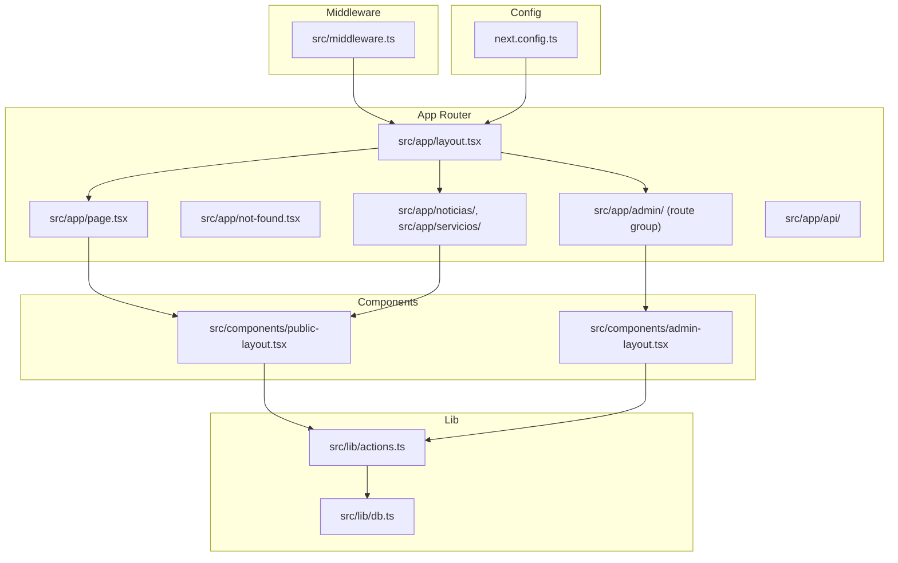
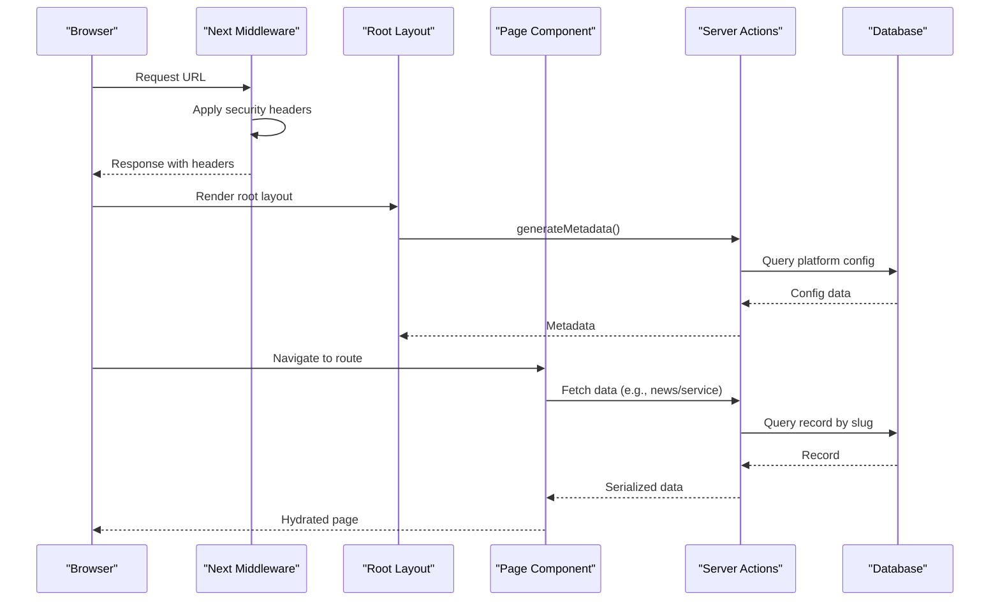
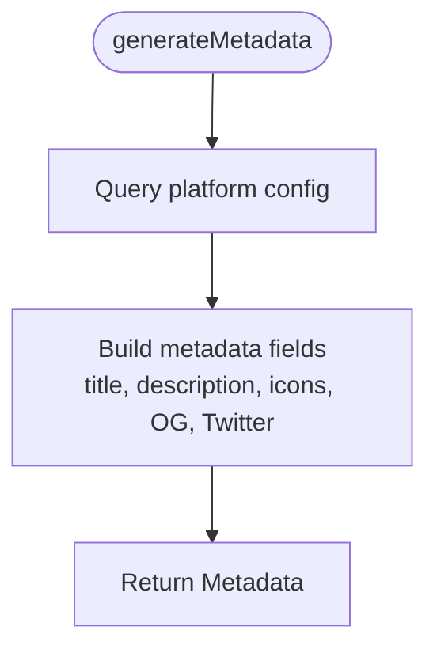
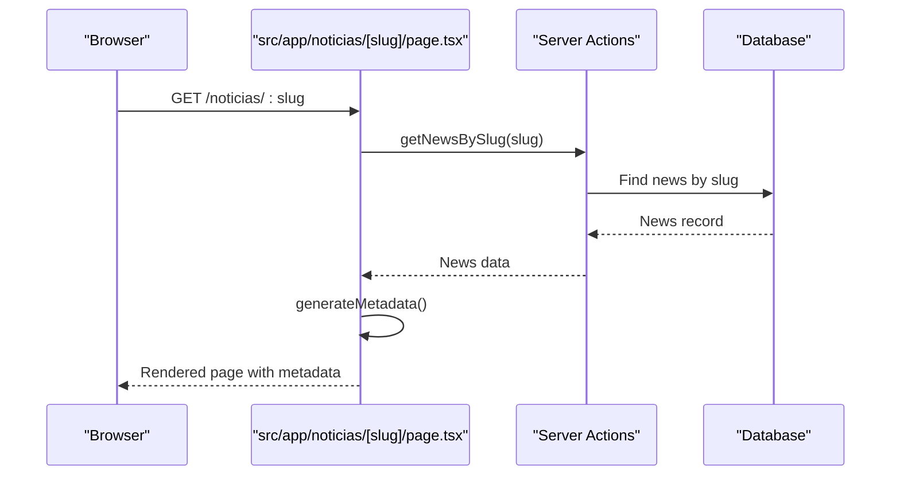
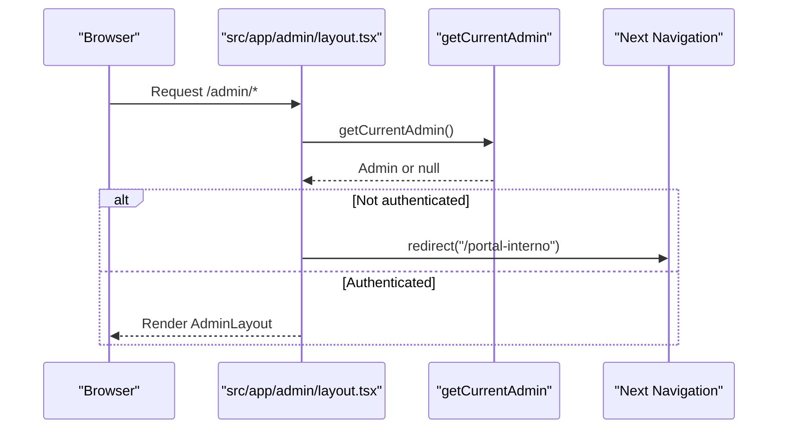
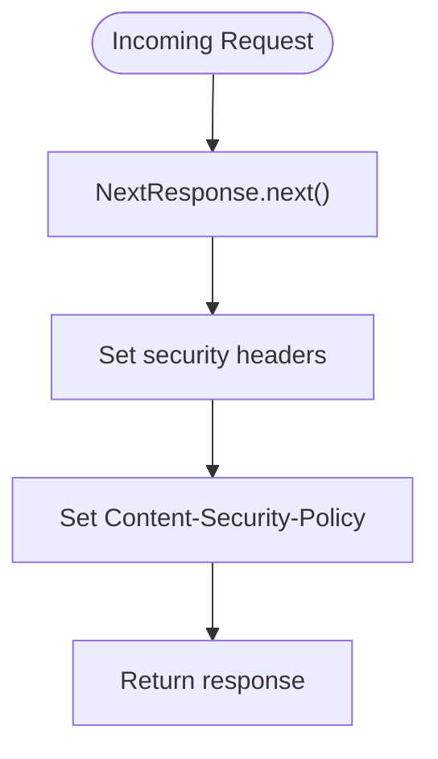
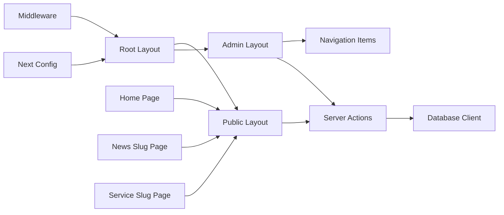

# Next.js App Router Architecture

<cite>
**Referenced Files in This Document**
- [layout.tsx](file://src/app/layout.tsx)
- [page.tsx](file://src/app/page.tsx)
- [not-found.tsx](file://src/app/not-found.tsx)
- [middleware.ts](file://src/middleware.ts)
- [next.config.ts](file://next.config.ts)
- [admin/layout.tsx](file://src/app/admin/layout.tsx)
- [public-layout.tsx](file://src/components/public-layout.tsx)
- [admin-layout.tsx](file://src/components/admin-layout.tsx)
- [actions.ts](file://src/lib/actions.ts)
- [noticias/[slug]/page.tsx](file://src/app/noticias/[slug]/page.tsx)
- [servicios/[slug]/page.tsx](file://src/app/servicios/[slug]/page.tsx)
- [api/route.ts](file://src/app/api/route.ts)
- [db.ts](file://src/lib/db.ts)
</cite>

## Table of Contents
1. [Introduction](#introduction)
2. [Project Structure](#project-structure)
3. [Core Components](#core-components)
4. [Architecture Overview](#architecture-overview)
5. [Detailed Component Analysis](#detailed-component-analysis)
6. [Dependency Analysis](#dependency-analysis)
7. [Performance Considerations](#performance-considerations)
8. [Troubleshooting Guide](#troubleshooting-guide)
9. [Conclusion](#conclusion)

## Introduction
This document explains the Next.js App Router architecture used in GreenAxis. It covers file-based routing conventions, dynamic routes with slug parameters, root layout and metadata generation from the database, middleware for security headers, server versus client components, route groups, error handling patterns, nested layouts, loading states, parallel routes, and performance optimizations such as automatic code splitting and ISR/SSG considerations.

## Project Structure
The application follows Next.js file-based routing conventions under the src/app directory. Key areas:
- Root application layout and metadata generation
- Public pages (home, static pages, dynamic slugs)
- Admin route group with protected layout
- Middleware for security headers
- Shared components for layouts and UI
- Data access via server actions and Prisma/Turso

**Diagram sources**
- [layout.tsx:1-80](file://src/app/layout.tsx#L1-L80)
- [page.tsx:1-52](file://src/app/page.tsx#L1-L52)
- [not-found.tsx:1-88](file://src/app/not-found.tsx#L1-L88)
- [admin/layout.tsx:1-18](file://src/app/admin/layout.tsx#L1-L18)
- [public-layout.tsx:1-55](file://src/components/public-layout.tsx#L1-L55)
- [admin-layout.tsx:1-384](file://src/components/admin-layout.tsx#L1-L384)
- [actions.ts:1-136](file://src/lib/actions.ts#L1-L136)
- [db.ts:1-21](file://src/lib/db.ts#L1-L21)
- [middleware.ts:1-58](file://src/middleware.ts#L1-L58)
- [next.config.ts:1-46](file://next.config.ts#L1-L46)

**Section sources**
- [layout.tsx:1-80](file://src/app/layout.tsx#L1-L80)
- [page.tsx:1-52](file://src/app/page.tsx#L1-L52)
- [not-found.tsx:1-88](file://src/app/not-found.tsx#L1-L88)
- [admin/layout.tsx:1-18](file://src/app/admin/layout.tsx#L1-L18)
- [public-layout.tsx:1-55](file://src/components/public-layout.tsx#L1-L55)
- [admin-layout.tsx:1-384](file://src/components/admin-layout.tsx#L1-L384)
- [actions.ts:1-136](file://src/lib/actions.ts#L1-L136)
- [db.ts:1-21](file://src/lib/db.ts#L1-L21)
- [middleware.ts:1-58](file://src/middleware.ts#L1-L58)
- [next.config.ts:1-46](file://next.config.ts#L1-L46)

## Core Components
- Root layout and metadata generation: Defines fonts, theme provider, analytics loader, and dynamic metadata from the database.
- Public layout: Provides shared header, footer, and WhatsApp bubble, fetching platform configuration and services.
- Admin layout: Client-side admin shell with navigation, responsive sidebar, and account actions.
- Server actions: Centralized database queries for configuration, services, news, carousel, legal pages, and contact messages.
- Middleware: Applies security headers and restricts matching to non-static assets.
- Next config: Image optimization with custom loader and cache headers for uploads.

**Section sources**
- [layout.tsx:1-80](file://src/app/layout.tsx#L1-L80)
- [public-layout.tsx:1-55](file://src/components/public-layout.tsx#L1-L55)
- [admin-layout.tsx:1-384](file://src/components/admin-layout.tsx#L1-L384)
- [actions.ts:1-136](file://src/lib/actions.ts#L1-L136)
- [middleware.ts:1-58](file://src/middleware.ts#L1-L58)
- [next.config.ts:1-46](file://next.config.ts#L1-L46)

## Architecture Overview
The architecture combines file-based routing with server components for data fetching and client components for interactivity. Dynamic routes resolve slugs to database records, while middleware ensures secure headers across requests. The admin route group enforces authentication via a server component wrapper.

**Diagram sources**
- [layout.tsx:19-54](file://src/app/layout.tsx#L19-L54)
- [noticias/[slug]/page.tsx](file://src/app/noticias/[slug]/page.tsx#L8-L54)
- [servicios/[slug]/page.tsx](file://src/app/servicios/[slug]/page.tsx#L7-L51)
- [actions.ts:6-22](file://src/lib/actions.ts#L6-L22)
- [db.ts:1-21](file://src/lib/db.ts#L1-L21)
- [middleware.ts:4-44](file://src/middleware.ts#L4-L44)

## Detailed Component Analysis

### Root Layout and Metadata Generation
- Root layout sets up fonts, theme provider, analytics loader, and wraps children.
- generateMetadata reads platform configuration from the database and constructs title, description, icons, Open Graph, and Twitter metadata.
- Uses database defaults if records are missing.

**Diagram sources**
- [layout.tsx:19-54](file://src/app/layout.tsx#L19-L54)

**Section sources**
- [layout.tsx:1-80](file://src/app/layout.tsx#L1-L80)

### Public Pages and Dynamic Routes
- Home page uses server components to fetch carousel slides, services, news, and platform config concurrently, rendering a composed public layout.
- Dynamic routes for news and services use slug parameters resolved from the database. generateMetadata builds SEO metadata per record.
- Both pages serialize data for client components and pass configuration for sharing URLs and canonical links.

**Diagram sources**
- [noticias/[slug]/page.tsx](file://src/app/noticias/[slug]/page.tsx#L56-L100)
- [actions.ts:74-79](file://src/lib/actions.ts#L74-L79)
- [db.ts:1-21](file://src/lib/db.ts#L1-L21)

**Section sources**
- [page.tsx:1-52](file://src/app/page.tsx#L1-L52)
- [noticias/[slug]/page.tsx](file://src/app/noticias/[slug]/page.tsx#L1-L101)
- [servicios/[slug]/page.tsx](file://src/app/servicios/[slug]/page.tsx#L1-L81)

### Admin Route Group and Protected Layout
- The admin route group is protected by a server component that checks current admin session and redirects unauthenticated users.
- The admin layout is a client component providing navigation, responsive sidebar, theme toggle, and account actions.

**Diagram sources**
- [admin/layout.tsx:5-17](file://src/app/admin/layout.tsx#L5-L17)
- [admin-layout.tsx:61-96](file://src/components/admin-layout.tsx#L61-L96)

**Section sources**
- [admin/layout.tsx:1-18](file://src/app/admin/layout.tsx#L1-L18)
- [admin-layout.tsx:1-384](file://src/components/admin-layout.tsx#L1-L384)

### Middleware Implementation for Security Headers
- Applies security headers including frame options, content type options, XSS protection, referrer policy, permissions policy, and strict transport security.
- Sets a permissive Content-Security-Policy suitable for corporate sites with analytics and Cloudinary.
- Excludes static assets and favicons from middleware processing.

**Diagram sources**
- [middleware.ts:4-44](file://src/middleware.ts#L4-L44)

**Section sources**
- [middleware.ts:1-58](file://src/middleware.ts#L1-L58)

### Server Components vs Client Components Distinction
- Server components: Root layout, page components, and server actions. They run on the server, can fetch data directly, and render HTML.
- Client components: Admin layout, UI components, and interactive widgets. They run on the client and are marked with "use client".

**Section sources**
- [layout.tsx:56-80](file://src/app/layout.tsx#L56-L80)
- [page.tsx:1-52](file://src/app/page.tsx#L1-L52)
- [admin-layout.tsx:1-384](file://src/components/admin-layout.tsx#L1-L384)
- [actions.ts:1-136](file://src/lib/actions.ts#L1-L136)

### Nested Layouts and Parallel Routes
- Nested layouts: Root layout wraps all pages; public pages wrap content with PublicLayout; admin route group wraps children with AdminLayout.
- Parallel routes: Not implemented in the current codebase. The architecture supports adding parallel routes by creating files with parentheses in the route segment name.

**Section sources**
- [layout.tsx:56-80](file://src/app/layout.tsx#L56-L80)
- [public-layout.tsx:1-55](file://src/components/public-layout.tsx#L1-L55)
- [admin/layout.tsx:1-18](file://src/app/admin/layout.tsx#L1-L18)

### Error Handling Patterns
- not-found page: Client component that fetches platform configuration and renders a friendly 404 UI with navigation options.
- Dynamic routes: Use notFound() to signal 404 when records are missing or inactive.

**Section sources**
- [not-found.tsx:1-88](file://src/app/not-found.tsx#L1-L88)
- [noticias/[slug]/page.tsx](file://src/app/noticias/[slug]/page.tsx#L64-L66)
- [servicios/[slug]/page.tsx](file://src/app/servicios/[slug]/page.tsx#L60-L62)

### Loading States
- No explicit loading components are present. Recommended approaches:
  - Use Suspense boundaries around heavy data fetching in server components.
  - Add skeletons in client components while data loads.
  - Implement incremental loading for lists and carousels.

[No sources needed since this section provides general guidance]

### Performance Optimizations
- Automatic code splitting: File-based routing naturally splits code by route segments.
- ISR/SSG considerations: Not configured in the current setup. For future enhancements:
  - Static generation for content with stable metadata.
  - Incremental static regeneration for frequently updated content.
- Image optimization: Custom loader with Cloudinary and remote patterns configured.
- Cache headers: Uploads receive long-lived cache headers.

**Section sources**
- [next.config.ts:11-42](file://next.config.ts#L11-L42)
- [layout.tsx:19-54](file://src/app/layout.tsx#L19-L54)

## Dependency Analysis
The system exhibits clear separation of concerns:
- Server components depend on server actions for data access.
- Server actions depend on the database client.
- Client components depend on UI primitives and server-provided props.
- Middleware applies globally to non-static routes.
- Next configuration centralizes image optimization and cache policies.

**Diagram sources**
- [layout.tsx:56-80](file://src/app/layout.tsx#L56-L80)
- [page.tsx:1-52](file://src/app/page.tsx#L1-L52)
- [noticias/[slug]/page.tsx](file://src/app/noticias/[slug]/page.tsx#L56-L100)
- [servicios/[slug]/page.tsx](file://src/app/servicios/[slug]/page.tsx#L53-L80)
- [public-layout.tsx:10-54](file://src/components/public-layout.tsx#L10-L54)
- [admin-layout.tsx:48-59](file://src/components/admin-layout.tsx#L48-L59)
- [actions.ts:1-136](file://src/lib/actions.ts#L1-L136)
- [db.ts:1-21](file://src/lib/db.ts#L1-L21)
- [middleware.ts:4-44](file://src/middleware.ts#L4-L44)
- [next.config.ts:1-46](file://next.config.ts#L1-L46)

**Section sources**
- [actions.ts:1-136](file://src/lib/actions.ts#L1-L136)
- [db.ts:1-21](file://src/lib/db.ts#L1-L21)
- [middleware.ts:1-58](file://src/middleware.ts#L1-L58)
- [next.config.ts:1-46](file://next.config.ts#L1-L46)

## Performance Considerations
- Automatic code splitting: Benefit from file-based routing; each route segment bundles independently.
- Data fetching: Use concurrent server actions to minimize load times.
- Images: Leverage custom loader and remote patterns for optimized delivery.
- Caching: Apply appropriate cache headers for static assets and uploads.
- Metadata generation: Keep database queries minimal and cached where feasible.

[No sources needed since this section provides general guidance]

## Troubleshooting Guide
- Missing or invalid slug: Dynamic pages call notFound() when records are missing or inactive.
- Authentication failures: Admin route group redirects unauthenticated users to the internal portal.
- Metadata inconsistencies: Root generateMetadata falls back to defaults if platform configuration is missing.
- Middleware exclusions: Static assets and favicons are excluded from middleware processing.

**Section sources**
- [noticias/[slug]/page.tsx](file://src/app/noticias/[slug]/page.tsx#L64-L66)
- [servicios/[slug]/page.tsx](file://src/app/servicios/[slug]/page.tsx#L60-L62)
- [admin/layout.tsx:10-14](file://src/app/admin/layout.tsx#L10-L14)
- [layout.tsx:20-25](file://src/app/layout.tsx#L20-L25)
- [middleware.ts:46-57](file://src/middleware.ts#L46-L57)

## Conclusion
GreenAxis leverages Next.js App Router’s file-based routing and server components to deliver a structured, secure, and scalable web application. Dynamic routes with slugs integrate seamlessly with database-driven metadata and content. The admin route group enforces authentication, while middleware and Next configuration enhance security and performance. Extending the architecture with parallel routes, loading states, and ISR/SSG would further improve user experience and performance.