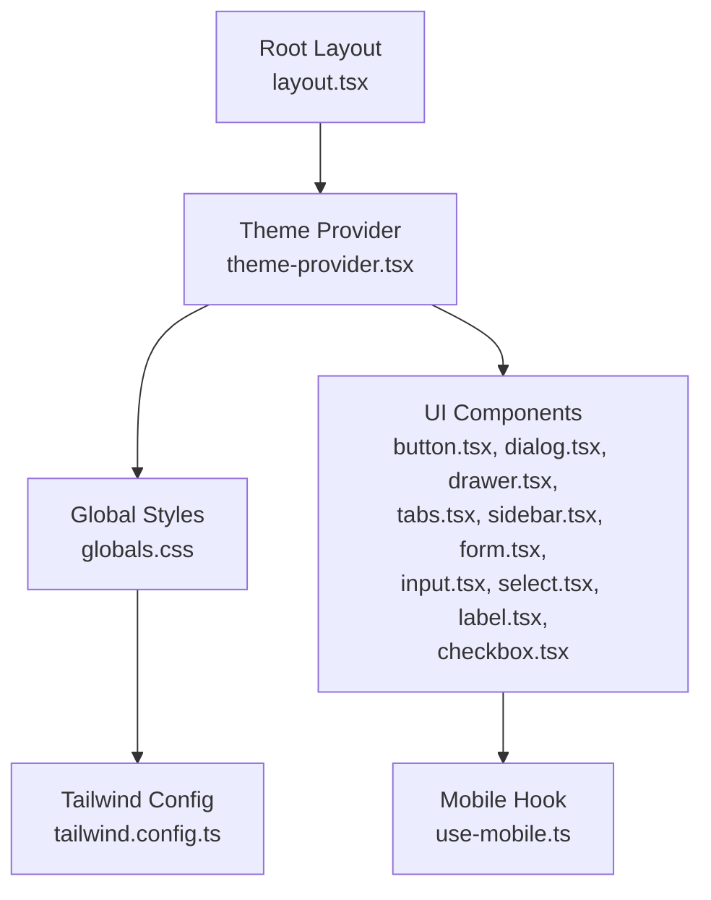
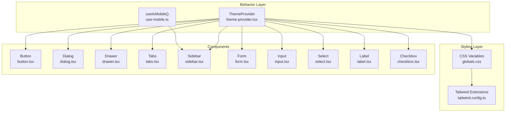
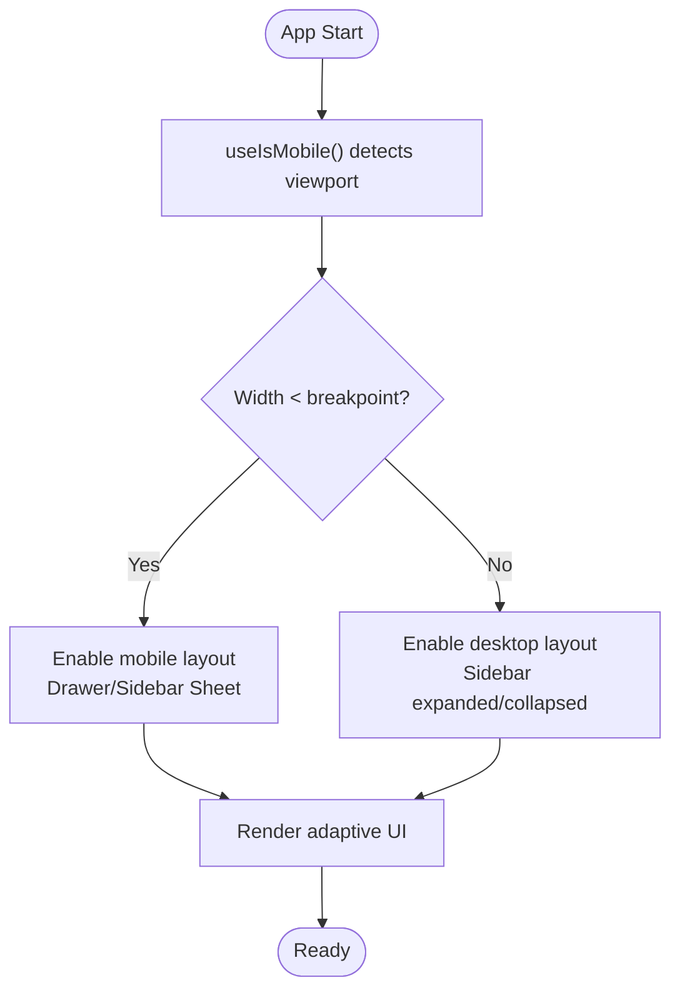
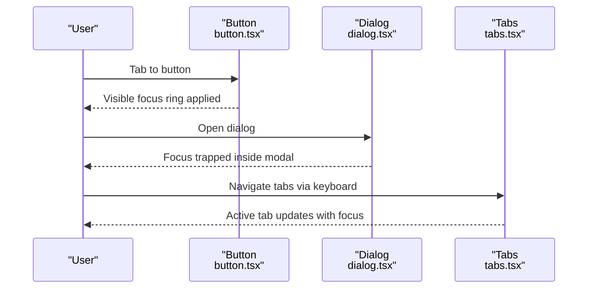
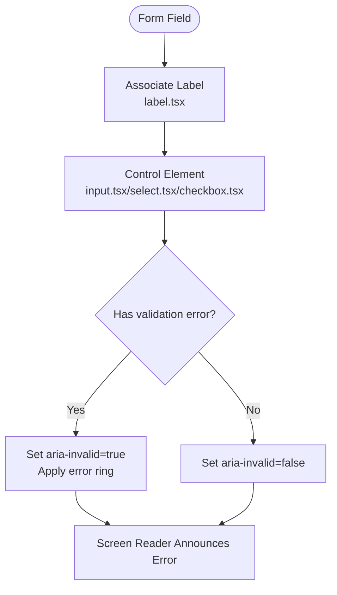
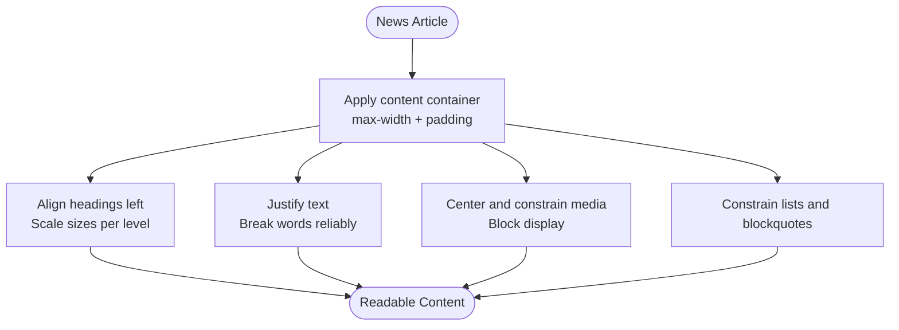
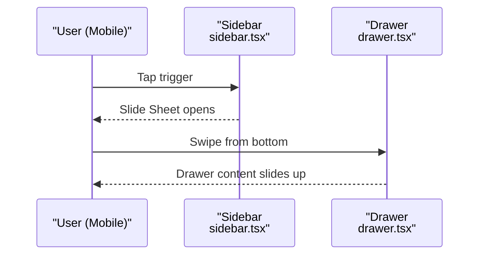
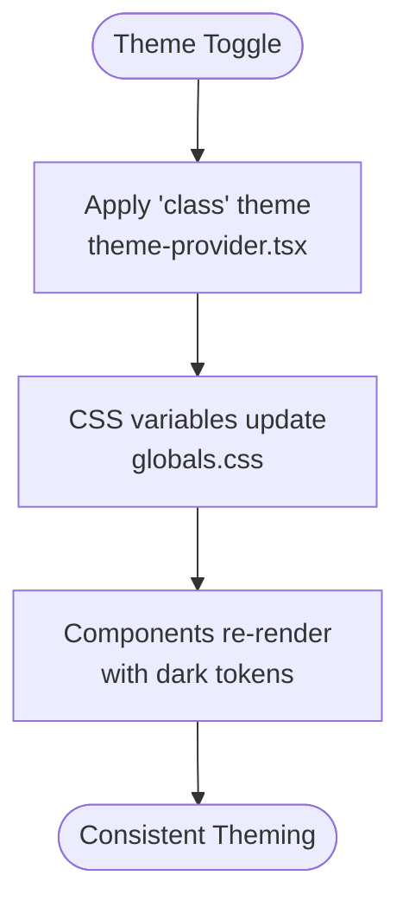
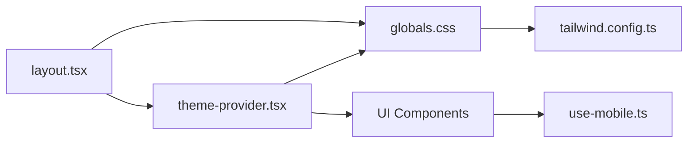

# Responsive Design & Accessibility

<cite>
**Referenced Files in This Document**
- [globals.css](file://src/app/globals.css)
- [tailwind.config.ts](file://tailwind.config.ts)
- [use-mobile.ts](file://src/hooks/use-mobile.ts)
- [theme-provider.tsx](file://src/components/theme-provider.tsx)
- [layout.tsx](file://src/app/layout.tsx)
- [button.tsx](file://src/components/ui/button.tsx)
- [dialog.tsx](file://src/components/ui/dialog.tsx)
- [drawer.tsx](file://src/components/ui/drawer.tsx)
- [tabs.tsx](file://src/components/ui/tabs.tsx)
- [sidebar.tsx](file://src/components/ui/sidebar.tsx)
- [form.tsx](file://src/components/ui/form.tsx)
- [input.tsx](file://src/components/ui/input.tsx)
- [select.tsx](file://src/components/ui/select.tsx)
- [label.tsx](file://src/components/ui/label.tsx)
- [checkbox.tsx](file://src/components/ui/checkbox.tsx)
</cite>

## Table of Contents
1. [Introduction](#introduction)
2. [Project Structure](#project-structure)
3. [Core Components](#core-components)
4. [Architecture Overview](#architecture-overview)
5. [Detailed Component Analysis](#detailed-component-analysis)
6. [Dependency Analysis](#dependency-analysis)
7. [Performance Considerations](#performance-considerations)
8. [Troubleshooting Guide](#troubleshooting-guide)
9. [Conclusion](#conclusion)

## Introduction
This document explains how the project implements responsive design and accessibility compliance. It covers the mobile-first approach, the breakpoint system, adaptive component behavior, and WCAG 2.1 alignment. It also documents focus management, color contrast, text scaling, touch-friendly interactions, and assistive technology compatibility. Finally, it outlines performance considerations and optimization strategies for responsive UI.

## Project Structure
The project uses a modern Next.js stack with Tailwind CSS for styling and Radix UI primitives for accessible component foundations. The global styles define brand tokens, dark mode, animations, and content containers. The layout initializes theming and analytics, while reusable UI components encapsulate responsive and accessible patterns.

**Diagram sources**
- [layout.tsx:56-79](file://src/app/layout.tsx#L56-L79)
- [theme-provider.tsx:6-8](file://src/components/theme-provider.tsx#L6-L8)
- [globals.css:116-123](file://src/app/globals.css#L116-L123)
- [tailwind.config.ts:4-65](file://tailwind.config.ts#L4-L65)
- [button.tsx:38-57](file://src/components/ui/button.tsx#L38-L57)
- [dialog.tsx:9-81](file://src/components/ui/dialog.tsx#L9-L81)
- [drawer.tsx:8-73](file://src/components/ui/drawer.tsx#L8-L73)
- [tabs.tsx:8-64](file://src/components/ui/tabs.tsx#L8-L64)
- [sidebar.tsx:154-254](file://src/components/ui/sidebar.tsx#L154-L254)
- [form.tsx:76-123](file://src/components/ui/form.tsx#L76-L123)
- [input.tsx:5-18](file://src/components/ui/input.tsx#L5-L18)
- [select.tsx:27-51](file://src/components/ui/select.tsx#L27-L51)
- [label.tsx:8-22](file://src/components/ui/label.tsx#L8-L22)
- [checkbox.tsx:9-29](file://src/components/ui/checkbox.tsx#L9-L29)
- [use-mobile.ts:5-18](file://src/hooks/use-mobile.ts#L5-L18)

**Section sources**
- [layout.tsx:56-79](file://src/app/layout.tsx#L56-L79)
- [globals.css:116-123](file://src/app/globals.css#L116-L123)
- [tailwind.config.ts:4-65](file://tailwind.config.ts#L4-L65)
- [use-mobile.ts:5-18](file://src/hooks/use-mobile.ts#L5-L18)

## Core Components
- Mobile detection hook: Provides a boolean signal for responsive rendering and behavior.
- Theme provider: Manages light/dark mode via class-based switching.
- Global CSS: Defines CSS variables, dark mode variants, animations, and content containers.
- Tailwind config: Extends design tokens and enables animations.
- UI primitives: Buttons, dialogs, drawers, tabs, forms, inputs, selects, labels, and checkboxes built with accessible defaults and responsive sizing.

**Section sources**
- [use-mobile.ts:5-18](file://src/hooks/use-mobile.ts#L5-L18)
- [theme-provider.tsx:6-8](file://src/components/theme-provider.tsx#L6-L8)
- [globals.css:6-44](file://src/app/globals.css#L6-L44)
- [tailwind.config.ts:11-62](file://tailwind.config.ts#L11-L62)
- [button.tsx:7-36](file://src/components/ui/button.tsx#L7-L36)
- [dialog.tsx:33-81](file://src/components/ui/dialog.tsx#L33-L81)
- [drawer.tsx:32-73](file://src/components/ui/drawer.tsx#L32-L73)
- [tabs.tsx:21-51](file://src/components/ui/tabs.tsx#L21-L51)
- [sidebar.tsx:47-151](file://src/components/ui/sidebar.tsx#L47-L151)
- [form.tsx:76-123](file://src/components/ui/form.tsx#L76-L123)
- [input.tsx:5-18](file://src/components/ui/input.tsx#L5-L18)
- [select.tsx:27-51](file://src/components/ui/select.tsx#L27-L51)
- [label.tsx:8-22](file://src/components/ui/label.tsx#L8-L22)
- [checkbox.tsx:9-29](file://src/components/ui/checkbox.tsx#L9-L29)

## Architecture Overview
The responsive and accessible architecture centers on:
- Mobile-first breakpoints and media queries for adaptive layouts.
- Semantic HTML and ARIA attributes for screen reader and keyboard compatibility.
- Focus-visible rings and outline resets for keyboard navigation.
- Content containers ensuring readable text and media scaling.
- Dark mode support across components and content areas.

**Diagram sources**
- [globals.css:6-44](file://src/app/globals.css#L6-L44)
- [tailwind.config.ts:11-62](file://tailwind.config.ts#L11-L62)
- [use-mobile.ts:5-18](file://src/hooks/use-mobile.ts#L5-L18)
- [theme-provider.tsx:6-8](file://src/components/theme-provider.tsx#L6-L8)
- [button.tsx:38-57](file://src/components/ui/button.tsx#L38-L57)
- [dialog.tsx:9-81](file://src/components/ui/dialog.tsx#L9-L81)
- [drawer.tsx:8-73](file://src/components/ui/drawer.tsx#L8-L73)
- [tabs.tsx:8-64](file://src/components/ui/tabs.tsx#L8-L64)
- [sidebar.tsx:154-254](file://src/components/ui/sidebar.tsx#L154-L254)
- [form.tsx:76-123](file://src/components/ui/form.tsx#L76-L123)
- [input.tsx:5-18](file://src/components/ui/input.tsx#L5-L18)
- [select.tsx:27-51](file://src/components/ui/select.tsx#L27-L51)
- [label.tsx:8-22](file://src/components/ui/label.tsx#L8-L22)
- [checkbox.tsx:9-29](file://src/components/ui/checkbox.tsx#L9-L29)

## Detailed Component Analysis

### Mobile-First Breakpoints and Adaptive Behavior
- Breakpoint definition: A single breakpoint constant defines the mobile threshold for responsive logic.
- Adaptive rendering: Components switch between desktop and mobile modes using the hook’s boolean state.
- Touch-friendly affordances: Interactive targets increase hit area on small screens; overlays and modals adapt to viewport constraints.

**Diagram sources**
- [use-mobile.ts:5-18](file://src/hooks/use-mobile.ts#L5-L18)
- [sidebar.tsx:183-206](file://src/components/ui/sidebar.tsx#L183-L206)
- [dialog.tsx:58-81](file://src/components/ui/dialog.tsx#L58-L81)
- [drawer.tsx:54-73](file://src/components/ui/drawer.tsx#L54-L73)

**Section sources**
- [use-mobile.ts:5-18](file://src/hooks/use-mobile.ts#L5-L18)
- [sidebar.tsx:183-206](file://src/components/ui/sidebar.tsx#L183-L206)
- [dialog.tsx:58-81](file://src/components/ui/dialog.tsx#L58-L81)
- [drawer.tsx:54-73](file://src/components/ui/drawer.tsx#L54-L73)

### Focus Management and Keyboard Navigation
- Focus-visible rings: Buttons, inputs, selects, and tabs apply visible focus rings to indicate keyboard focus.
- Outline resets: Consistent outline behavior across components ensures predictable focus states.
- Keyboard-only controls: Tabs and dialogs expose keyboard navigation and close mechanisms.

**Diagram sources**
- [button.tsx:7-36](file://src/components/ui/button.tsx#L7-L36)
- [input.tsx:5-18](file://src/components/ui/input.tsx#L5-L18)
- [select.tsx:27-51](file://src/components/ui/select.tsx#L27-L51)
- [tabs.tsx:21-51](file://src/components/ui/tabs.tsx#L21-L51)
- [dialog.tsx:58-81](file://src/components/ui/dialog.tsx#L58-L81)

**Section sources**
- [button.tsx:7-36](file://src/components/ui/button.tsx#L7-L36)
- [input.tsx:5-18](file://src/components/ui/input.tsx#L5-L18)
- [select.tsx:27-51](file://src/components/ui/select.tsx#L27-L51)
- [tabs.tsx:21-51](file://src/components/ui/tabs.tsx#L21-L51)
- [dialog.tsx:58-81](file://src/components/ui/dialog.tsx#L58-L81)

### WCAG 2.1 Compliance Patterns
- ARIA integration: Inputs and form controls set aria-invalid and aria-describedby dynamically based on validation state.
- Semantic labeling: Labels are associated with inputs via htmlFor and generated IDs.
- Screen reader support: Close buttons and sheet headers include screen-reader-only text; tooltips and triggers provide accessible titles.
- Keyboard compatibility: Tabs and dialogs support keyboard activation and focus trapping.

**Diagram sources**
- [label.tsx:8-22](file://src/components/ui/label.tsx#L8-L22)
- [input.tsx:5-18](file://src/components/ui/input.tsx#L5-L18)
- [select.tsx:27-51](file://src/components/ui/select.tsx#L27-L51)
- [checkbox.tsx:9-29](file://src/components/ui/checkbox.tsx#L9-L29)
- [form.tsx:90-123](file://src/components/ui/form.tsx#L90-L123)

**Section sources**
- [label.tsx:8-22](file://src/components/ui/label.tsx#L8-L22)
- [input.tsx:5-18](file://src/components/ui/input.tsx#L5-L18)
- [select.tsx:27-51](file://src/components/ui/select.tsx#L27-L51)
- [checkbox.tsx:9-29](file://src/components/ui/checkbox.tsx#L9-L29)
- [form.tsx:90-123](file://src/components/ui/form.tsx#L90-L123)

### Content Containers and Text Scaling
- News article container: Constrains content width, enforces text wrapping, and ensures media scaling.
- Typography hierarchy: Titles scale responsively with consistent line heights and margins.
- Readability: Paragraphs are justified with last-line alignment to the left; lists and blockquotes are constrained.

**Diagram sources**
- [globals.css:408-546](file://src/app/globals.css#L408-L546)

**Section sources**
- [globals.css:408-546](file://src/app/globals.css#L408-L546)

### Touch-Friendly Interactions
- Hit area enhancements: Buttons and interactive elements increase tap targets on mobile.
- Drawer gestures: Bottom/top/left/right drawers adapt to device orientation and viewport.
- Sidebar toggles: Rail and trigger provide accessible resizing and toggling affordances.

**Diagram sources**
- [sidebar.tsx:256-280](file://src/components/ui/sidebar.tsx#L256-L280)
- [sidebar.tsx:282-305](file://src/components/ui/sidebar.tsx#L282-L305)
- [drawer.tsx:54-73](file://src/components/ui/drawer.tsx#L54-L73)

**Section sources**
- [sidebar.tsx:256-280](file://src/components/ui/sidebar.tsx#L256-L280)
- [sidebar.tsx:282-305](file://src/components/ui/sidebar.tsx#L282-L305)
- [drawer.tsx:54-73](file://src/components/ui/drawer.tsx#L54-L73)

### Dark Mode and Color Contrast
- CSS variables: Tokens update across light/dark themes for backgrounds, foregrounds, borders, and accents.
- Dark variant selectors: Components adapt ring, border, and background colors in dark mode.
- Contrast-aware states: Focus rings and invalid states use theme-appropriate colors.

**Diagram sources**
- [theme-provider.tsx:6-8](file://src/components/theme-provider.tsx#L6-L8)
- [globals.css:46-114](file://src/app/globals.css#L46-L114)
- [tailwind.config.ts:11-62](file://tailwind.config.ts#L11-L62)

**Section sources**
- [theme-provider.tsx:6-8](file://src/components/theme-provider.tsx#L6-L8)
- [globals.css:46-114](file://src/app/globals.css#L46-L114)
- [tailwind.config.ts:11-62](file://tailwind.config.ts#L11-L62)

## Dependency Analysis
The responsive and accessible behavior emerges from coordinated dependencies:
- The layout initializes theming and fonts.
- The mobile hook informs component decisions.
- Tailwind config extends design tokens consumed by components.
- Global CSS provides baseline styles and content containers.

**Diagram sources**
- [layout.tsx:56-79](file://src/app/layout.tsx#L56-L79)
- [theme-provider.tsx:6-8](file://src/components/theme-provider.tsx#L6-L8)
- [globals.css:116-123](file://src/app/globals.css#L116-L123)
- [tailwind.config.ts:4-10](file://tailwind.config.ts#L4-L10)
- [use-mobile.ts:5-18](file://src/hooks/use-mobile.ts#L5-L18)

**Section sources**
- [layout.tsx:56-79](file://src/app/layout.tsx#L56-L79)
- [globals.css:116-123](file://src/app/globals.css#L116-L123)
- [tailwind.config.ts:4-10](file://tailwind.config.ts#L4-L10)
- [use-mobile.ts:5-18](file://src/hooks/use-mobile.ts#L5-L18)

## Performance Considerations
- Minimize layout thrashing: Prefer CSS transforms and opacity for animations; avoid forced synchronous layouts.
- Reduce repaints: Use hardware-accelerated properties (transform, opacity) for transitions.
- Optimize media: Ensure images and videos scale responsively to reduce decoding overhead.
- Bundle and tree-shake: Keep component libraries scoped; remove unused variants and animations.
- Font loading: Preload critical fonts and avoid layout shifts; the project already uses variable fonts.

[No sources needed since this section provides general guidance]

## Troubleshooting Guide
- Focus issues: Verify focus-visible rings are applied consistently across interactive elements.
- ARIA errors: Confirm aria-invalid and aria-describedby are set on controls and messages.
- Mobile layout glitches: Check the mobile hook and ensure media queries align with component breakpoints.
- Dark mode inconsistencies: Validate CSS variable updates and Tailwind token extensions.

**Section sources**
- [button.tsx:7-36](file://src/components/ui/button.tsx#L7-L36)
- [input.tsx:5-18](file://src/components/ui/input.tsx#L5-L18)
- [select.tsx:27-51](file://src/components/ui/select.tsx#L27-L51)
- [form.tsx:90-123](file://src/components/ui/form.tsx#L90-L123)
- [use-mobile.ts:5-18](file://src/hooks/use-mobile.ts#L5-L18)
- [globals.css:46-114](file://src/app/globals.css#L46-L114)
- [tailwind.config.ts:11-62](file://tailwind.config.ts#L11-L62)

## Conclusion
The project implements a cohesive mobile-first responsive system with robust accessibility foundations. The combination of a mobile detection hook, Tailwind-based design tokens, and Radix UI primitives ensures consistent behavior across devices and input methods. Focus management, ARIA attributes, and content containers align with WCAG 2.1 guidelines. By following the patterns documented here, teams can maintain performance and inclusivity as the interface evolves.