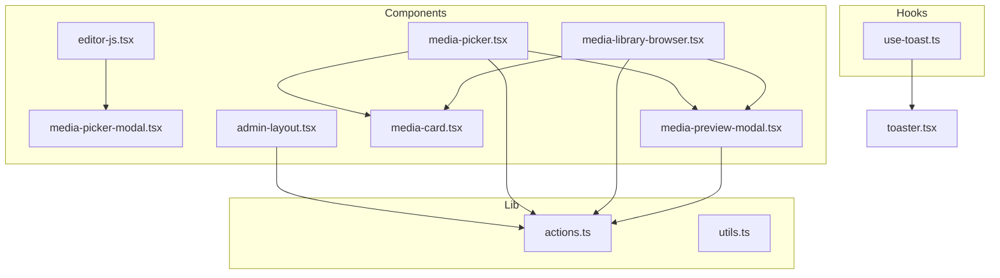
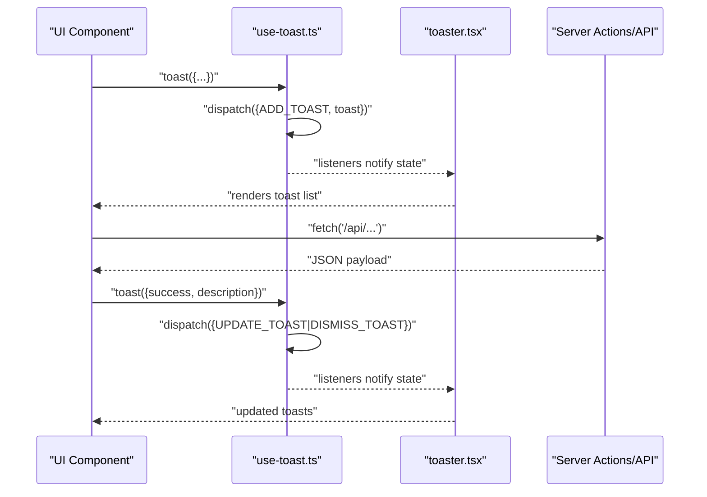
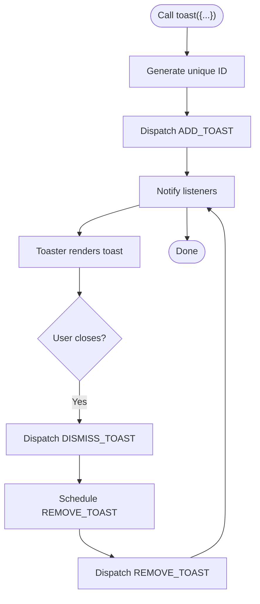
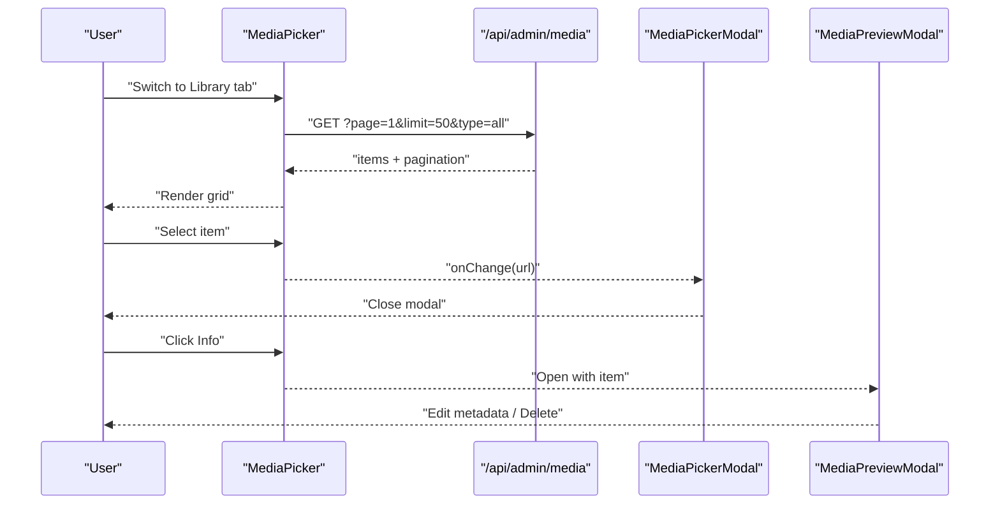
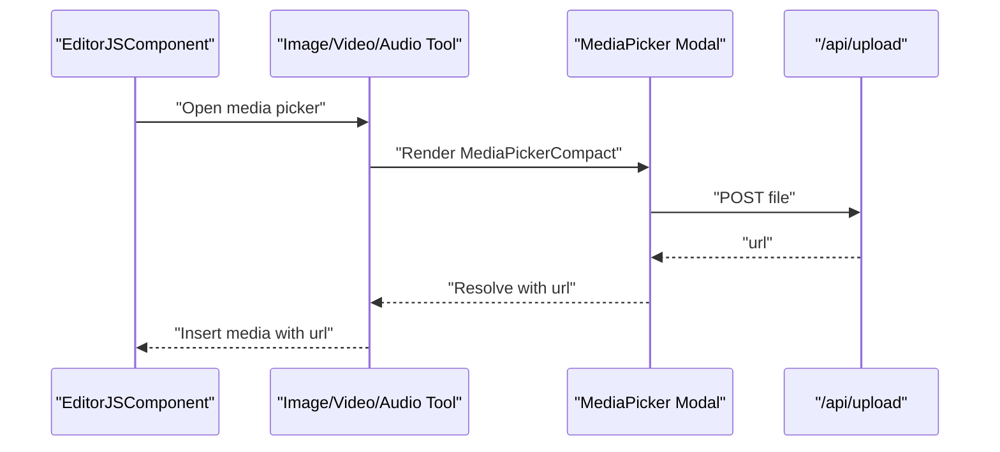
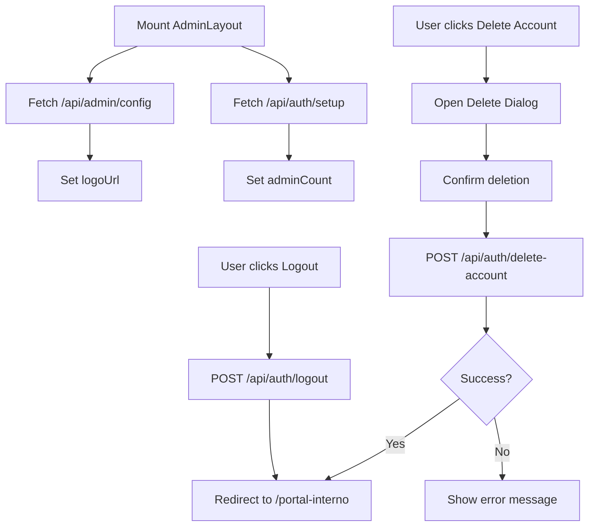
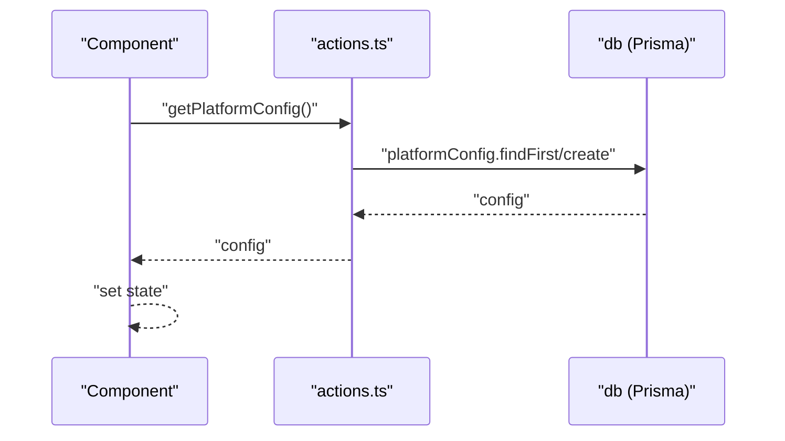
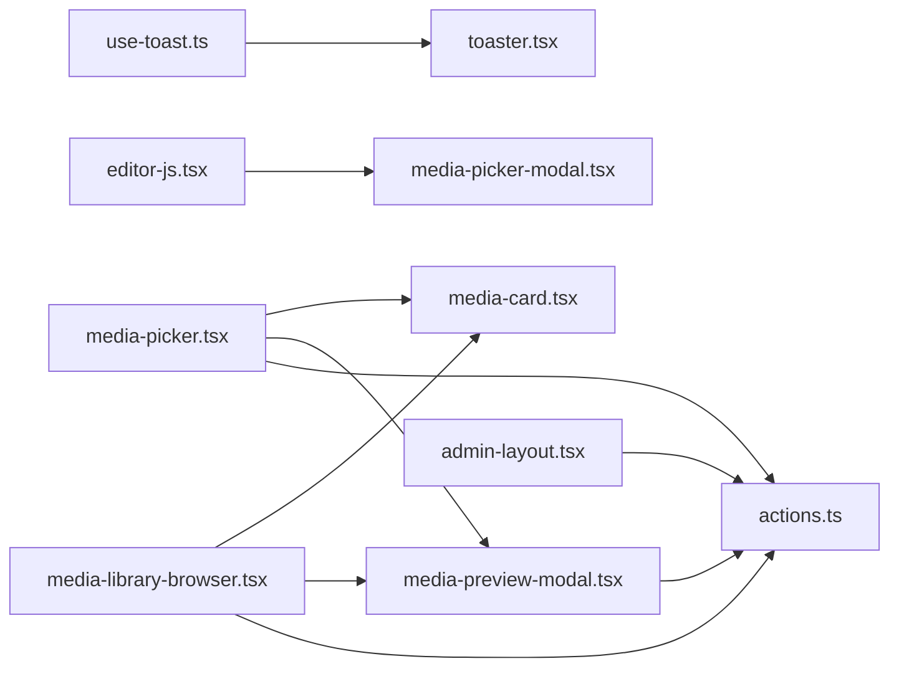

# State Management & Data Flow

<cite>
**Referenced Files in This Document**
- [use-toast.ts](file://src/hooks/use-toast.ts)
- [toaster.tsx](file://src/components/ui/toaster.tsx)
- [actions.ts](file://src/lib/actions.ts)
- [media-picker.tsx](file://src/components/media-picker.tsx)
- [media-picker-modal.tsx](file://src/components/media-picker-modal.tsx)
- [media-library-browser.tsx](file://src/components/media-library-browser.tsx)
- [media-preview-modal.tsx](file://src/components/media-preview-modal.tsx)
- [media-card.tsx](file://src/components/media-card.tsx)
- [editor-js.tsx](file://src/components/editor-js.tsx)
- [admin-layout.tsx](file://src/components/admin-layout.tsx)
- [layout.tsx](file://src/app/admin/layout.tsx)
- [utils.ts](file://src/lib/utils.ts)
</cite>

## Table of Contents
1. [Introduction](#introduction)
2. [Project Structure](#project-structure)
3. [Core Components](#core-components)
4. [Architecture Overview](#architecture-overview)
5. [Detailed Component Analysis](#detailed-component-analysis)
6. [Dependency Analysis](#dependency-analysis)
7. [Performance Considerations](#performance-considerations)
8. [Troubleshooting Guide](#troubleshooting-guide)
9. [Conclusion](#conclusion)

## Introduction
This document explains the state management architecture and data flow patterns across the frontend. It covers:
- React hooks for local component state
- A custom notification system via a hook and provider
- Client-server data synchronization using fetch and server actions
- Error handling and loading states
- Examples of form state and modal state handling
- Cross-component communication patterns
- Performance considerations such as memoization, debouncing, and efficient re-rendering

## Project Structure
The state-related logic spans three primary areas:
- Hooks: centralized state/notification logic
- Components: UI state, modals, and data synchronization
- Libraries: server actions and shared utilities

**Diagram sources**
- [use-toast.ts:1-194](file://src/hooks/use-toast.ts#L1-L194)
- [toaster.tsx:1-35](file://src/components/ui/toaster.tsx#L1-L35)
- [media-picker.tsx:1-754](file://src/components/media-picker.tsx#L1-L754)
- [media-picker-modal.tsx:1-70](file://src/components/media-picker-modal.tsx#L1-L70)
- [media-library-browser.tsx:1-362](file://src/components/media-library-browser.tsx#L1-L362)
- [media-preview-modal.tsx:1-516](file://src/components/media-preview-modal.tsx#L1-L516)
- [media-card.tsx:1-295](file://src/components/media-card.tsx#L1-L295)
- [editor-js.tsx:1-850](file://src/components/editor-js.tsx#L1-L850)
- [admin-layout.tsx:1-384](file://src/components/admin-layout.tsx#L1-L384)
- [actions.ts:1-136](file://src/lib/actions.ts#L1-L136)
- [utils.ts:1-7](file://src/lib/utils.ts#L1-L7)

**Section sources**
- [use-toast.ts:1-194](file://src/hooks/use-toast.ts#L1-L194)
- [toaster.tsx:1-35](file://src/components/ui/toaster.tsx#L1-L35)
- [media-picker.tsx:1-754](file://src/components/media-picker.tsx#L1-L754)
- [media-library-browser.tsx:1-362](file://src/components/media-library-browser.tsx#L1-L362)
- [media-preview-modal.tsx:1-516](file://src/components/media-preview-modal.tsx#L1-L516)
- [media-card.tsx:1-295](file://src/components/media-card.tsx#L1-L295)
- [editor-js.tsx:1-850](file://src/components/editor-js.tsx#L1-L850)
- [admin-layout.tsx:1-384](file://src/components/admin-layout.tsx#L1-L384)
- [actions.ts:1-136](file://src/lib/actions.ts#L1-L136)
- [utils.ts:1-7](file://src/lib/utils.ts#L1-L7)

## Core Components
- Custom toast/notification system:
  - Hook exposes a dispatcher and state subscription mechanism
  - Provider renders toasts and binds to global state
- Media picker and library:
  - Local state for tabs, items, pagination, upload progress, errors, and previews
  - Debounced search and infinite scroll
  - Modal orchestration for selection and preview
- Editor integration:
  - EditorJS initialization and save callbacks
  - Media selection via modal with library picker
- Admin layout:
  - Client-side state for sidebar, dialogs, and navigation
  - Server action-like fetch calls for configuration and auth

**Section sources**
- [use-toast.ts:174-192](file://src/hooks/use-toast.ts#L174-L192)
- [toaster.tsx:13-35](file://src/components/ui/toaster.tsx#L13-L35)
- [media-picker.tsx:106-134](file://src/components/media-picker.tsx#L106-L134)
- [media-library-browser.tsx:69-88](file://src/components/media-library-browser.tsx#L69-L88)
- [media-picker-modal.tsx:27-44](file://src/components/media-picker-modal.tsx#L27-L44)
- [media-preview-modal.tsx:97-133](file://src/components/media-preview-modal.tsx#L97-L133)
- [editor-js.tsx:344-575](file://src/components/editor-js.tsx#L344-L575)
- [admin-layout.tsx:61-96](file://src/components/admin-layout.tsx#L61-L96)

## Architecture Overview
The system combines local component state with centralized notifications and server-driven data. Components fetch and mutate data via fetch requests and server actions, while the toast system provides global feedback.

**Diagram sources**
- [use-toast.ts:136-192](file://src/hooks/use-toast.ts#L136-L192)
- [toaster.tsx:13-35](file://src/components/ui/toaster.tsx#L13-L35)
- [media-picker.tsx:149-196](file://src/components/media-picker.tsx#L149-L196)
- [media-library-browser.tsx:97-136](file://src/components/media-library-browser.tsx#L97-L136)
- [media-preview-modal.tsx:177-215](file://src/components/media-preview-modal.tsx#L177-L215)

## Detailed Component Analysis

### Notification System (use-toast + Toaster)
- Centralized state machine with actions for adding, updating, dismissing, and removing toasts
- Global listeners subscribe to state updates and trigger re-renders
- Unique IDs and timeouts manage lifecycle and cleanup
- Provider maps state to UI rendering

**Diagram sources**
- [use-toast.ts:145-172](file://src/hooks/use-toast.ts#L145-L172)
- [use-toast.ts:136-141](file://src/hooks/use-toast.ts#L136-L141)
- [use-toast.ts:174-192](file://src/hooks/use-toast.ts#L174-L192)
- [toaster.tsx:13-35](file://src/components/ui/toaster.tsx#L13-L35)

**Section sources**
- [use-toast.ts:1-194](file://src/hooks/use-toast.ts#L1-L194)
- [toaster.tsx:1-35](file://src/components/ui/toaster.tsx#L1-L35)

### Media Picker and Library Browser
- Local state encapsulates tabs, items, pagination, upload progress, errors, and preview
- Debounced search and infinite scroll reduce network load
- Modal composes MediaPicker with controlled props for selection and onChange propagation
- Preview modal supports editing metadata and deletion with confirmation

**Diagram sources**
- [media-picker.tsx:140-196](file://src/components/media-picker.tsx#L140-L196)
- [media-picker-modal.tsx:27-44](file://src/components/media-picker-modal.tsx#L27-L44)
- [media-preview-modal.tsx:97-133](file://src/components/media-preview-modal.tsx#L97-L133)

**Section sources**
- [media-picker.tsx:106-134](file://src/components/media-picker.tsx#L106-L134)
- [media-picker.tsx:149-196](file://src/components/media-picker.tsx#L149-L196)
- [media-library-browser.tsx:69-88](file://src/components/media-library-browser.tsx#L69-L88)
- [media-library-browser.tsx:97-136](file://src/components/media-library-browser.tsx#L97-L136)
- [media-picker-modal.tsx:1-70](file://src/components/media-picker-modal.tsx#L1-L70)
- [media-preview-modal.tsx:177-215](file://src/components/media-preview-modal.tsx#L177-L215)

### Editor Integration and Media Selection
- EditorJS initializes with tools and custom uploaders
- Media upload validates size and posts to upload endpoint
- Media selection opens a modal that renders MediaPickerCompact and returns URL to EditorJS

**Diagram sources**
- [editor-js.tsx:344-575](file://src/components/editor-js.tsx#L344-L575)
- [editor-js.tsx:185-227](file://src/components/editor-js.tsx#L185-L227)
- [media-picker-modal.tsx:27-44](file://src/components/media-picker-modal.tsx#L27-L44)

**Section sources**
- [editor-js.tsx:185-227](file://src/components/editor-js.tsx#L185-L227)
- [editor-js.tsx:344-575](file://src/components/editor-js.tsx#L344-L575)

### Admin Layout State and Navigation
- Client-side state manages sidebar visibility, logo, and admin account actions
- Fetch calls to configuration and auth endpoints
- Dialogs for logout and account deletion

**Diagram sources**
- [admin-layout.tsx:61-96](file://src/components/admin-layout.tsx#L61-L96)
- [admin-layout.tsx:98-128](file://src/components/admin-layout.tsx#L98-L128)
- [layout.tsx:5-17](file://src/app/admin/layout.tsx#L5-L17)

**Section sources**
- [admin-layout.tsx:1-384](file://src/components/admin-layout.tsx#L1-L384)
- [layout.tsx:1-18](file://src/app/admin/layout.tsx#L1-L18)

### Server Actions and Data Mutations
- Server actions encapsulate database queries and mutations
- Components call these actions via fetch to retrieve platform configuration, services, news, images, and other resources
- Error handling is performed on the client side after fetch responses

**Diagram sources**
- [actions.ts:6-22](file://src/lib/actions.ts#L6-L22)
- [media-library-browser.tsx:97-136](file://src/components/media-library-browser.tsx#L97-L136)
- [media-picker.tsx:149-196](file://src/components/media-picker.tsx#L149-L196)

**Section sources**
- [actions.ts:1-136](file://src/lib/actions.ts#L1-L136)
- [media-library-browser.tsx:97-136](file://src/components/media-library-browser.tsx#L97-L136)
- [media-picker.tsx:149-196](file://src/components/media-picker.tsx#L149-L196)

## Dependency Analysis
- use-toast.ts depends on React state and a reducer pattern to maintain a single source of truth for toasts
- toaster.tsx depends on use-toast to render notifications
- media-picker.tsx and media-library-browser.tsx depend on fetch APIs and share MediaCard for rendering
- media-preview-modal.tsx coordinates with server endpoints for metadata updates and deletions
- editor-js.tsx integrates MediaPicker via a modal and uses upload endpoints
- admin-layout.tsx performs client-side navigation and auth-related fetches

**Diagram sources**
- [use-toast.ts:1-194](file://src/hooks/use-toast.ts#L1-L194)
- [toaster.tsx:1-35](file://src/components/ui/toaster.tsx#L1-L35)
- [media-picker.tsx:1-754](file://src/components/media-picker.tsx#L1-L754)
- [media-library-browser.tsx:1-362](file://src/components/media-library-browser.tsx#L1-L362)
- [media-preview-modal.tsx:1-516](file://src/components/media-preview-modal.tsx#L1-L516)
- [media-card.tsx:1-295](file://src/components/media-card.tsx#L1-L295)
- [editor-js.tsx:1-850](file://src/components/editor-js.tsx#L1-L850)
- [admin-layout.tsx:1-384](file://src/components/admin-layout.tsx#L1-L384)
- [actions.ts:1-136](file://src/lib/actions.ts#L1-L136)

**Section sources**
- [use-toast.ts:1-194](file://src/hooks/use-toast.ts#L1-L194)
- [toaster.tsx:1-35](file://src/components/ui/toaster.tsx#L1-L35)
- [media-picker.tsx:1-754](file://src/components/media-picker.tsx#L1-L754)
- [media-library-browser.tsx:1-362](file://src/components/media-library-browser.tsx#L1-L362)
- [media-preview-modal.tsx:1-516](file://src/components/media-preview-modal.tsx#L1-L516)
- [media-card.tsx:1-295](file://src/components/media-card.tsx#L1-L295)
- [editor-js.tsx:1-850](file://src/components/editor-js.tsx#L1-L850)
- [admin-layout.tsx:1-384](file://src/components/admin-layout.tsx#L1-L384)
- [actions.ts:1-136](file://src/lib/actions.ts#L1-L136)

## Performance Considerations
- Debouncing:
  - MediaLibraryBrowser uses a debounce hook to avoid excessive API calls during search input
  - This reduces network overhead and improves responsiveness
- Infinite scroll:
  - IntersectionObserver triggers pagination, minimizing DOM churn and enabling smooth loading
- Memoization:
  - EditorJSComponent uses a callback wrapper around save to prevent unnecessary re-initializations
- Efficient re-rendering:
  - Local state is scoped to components to minimize upstream re-renders
  - Conditional rendering avoids unnecessary work when loading or empty states occur
- Utilities:
  - Shared utility functions consolidate class merging and other helpers

**Section sources**
- [media-library-browser.tsx:53-67](file://src/components/media-library-browser.tsx#L53-L67)
- [media-library-browser.tsx:151-173](file://src/components/media-library-browser.tsx#L151-L173)
- [editor-js.tsx:364-373](file://src/components/editor-js.tsx#L364-L373)
- [utils.ts:4-6](file://src/lib/utils.ts#L4-L6)

## Troubleshooting Guide
- Toast notifications not appearing:
  - Ensure Toaster is rendered in the application shell and use-toast is imported where needed
- Upload failures:
  - MediaPicker logs and displays errors returned from the upload endpoint; verify file size limits and type acceptance
- Media deletion conflicts:
  - MediaPreviewModal surfaces usage references; handle force deletion or cancel based on response
- Infinite scroll not triggering:
  - Verify IntersectionObserver target exists and hasMore flag is accurate
- Editor media insertion:
  - Confirm upload endpoint returns a URL and modal resolves with the selected URL

**Section sources**
- [toaster.tsx:13-35](file://src/components/ui/toaster.tsx#L13-L35)
- [media-picker.tsx:201-316](file://src/components/media-picker.tsx#L201-L316)
- [media-preview-modal.tsx:221-261](file://src/components/media-preview-modal.tsx#L221-L261)
- [media-library-browser.tsx:151-173](file://src/components/media-library-browser.tsx#L151-L173)
- [editor-js.tsx:185-227](file://src/components/editor-js.tsx#L185-L227)

## Conclusion
The application employs a hybrid state model:
- Local component state for UI and media workflows
- A centralized toast system for global notifications
- Server actions and fetch-based data access for CRUD operations
- Clear separation of concerns across components, with robust error handling and loading states

This design yields predictable data flows, efficient rendering, and maintainable cross-component communication patterns.