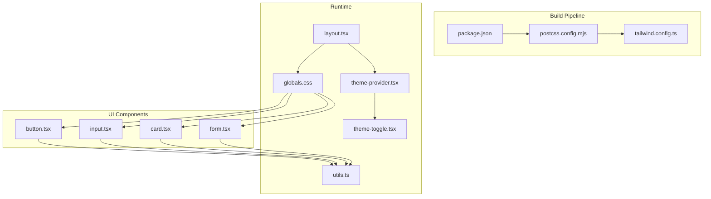
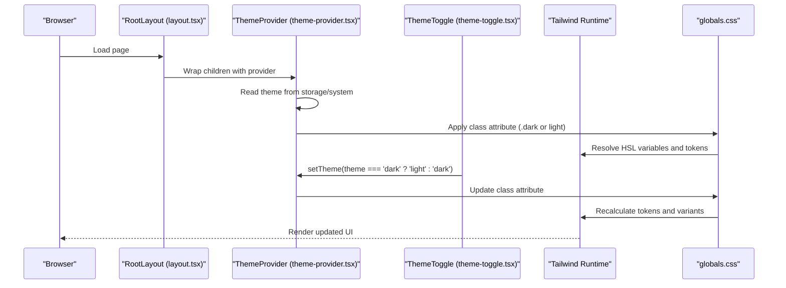
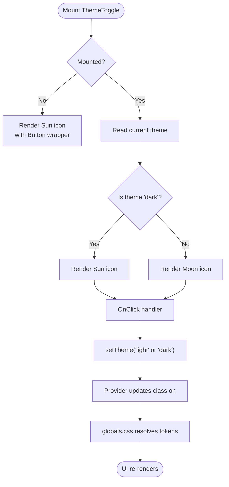
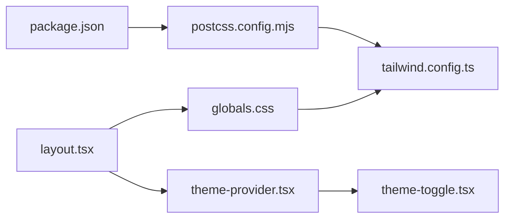

# Styling & Theming System

<cite>
**Referenced Files in This Document**
- [tailwind.config.ts](file://tailwind.config.ts)
- [globals.css](file://src/app/globals.css)
- [layout.tsx](file://src/app/layout.tsx)
- [theme-provider.tsx](file://src/components/theme-provider.tsx)
- [theme-toggle.tsx](file://src/components/theme-toggle.tsx)
- [button.tsx](file://src/components/ui/button.tsx)
- [input.tsx](file://src/components/ui/input.tsx)
- [card.tsx](file://src/components/ui/card.tsx)
- [form.tsx](file://src/components/ui/form.tsx)
- [utils.ts](file://src/lib/utils.ts)
- [components.json](file://components.json)
- [postcss.config.mjs](file://postcss.config.mjs)
- [package.json](file://package.json)
</cite>

## Table of Contents
1. [Introduction](#introduction)
2. [Project Structure](#project-structure)
3. [Core Components](#core-components)
4. [Architecture Overview](#architecture-overview)
5. [Detailed Component Analysis](#detailed-component-analysis)
6. [Dependency Analysis](#dependency-analysis)
7. [Performance Considerations](#performance-considerations)
8. [Accessibility Considerations](#accessibility-considerations)
9. [Troubleshooting Guide](#troubleshooting-guide)
10. [Conclusion](#conclusion)

## Introduction
This document explains the styling and theming system built with Tailwind CSS 4, design tokens, and a robust theme provider. It covers how design tokens are defined and consumed, how dark/light mode switching works with system preference detection and persistence, and how custom utility classes and component variants are structured. It also documents typography, spacing, and responsive patterns, along with examples of component styling approaches, CSS-in-JS alternatives, and performance optimizations. Accessibility guidance for color contrast and keyboard navigation is included.

## Project Structure
The styling system is organized around:
- Tailwind CSS 4 configuration and PostCSS pipeline
- Global CSS with design tokens and custom utilities
- Theme provider and toggle components
- Reusable UI components that consume design tokens and variants
- Utility functions for merging classes

**Diagram sources**
- [postcss.config.mjs:1-6](file://postcss.config.mjs#L1-L6)
- [tailwind.config.ts:1-65](file://tailwind.config.ts#L1-L65)
- [package.json:1-116](file://package.json#L1-L116)
- [layout.tsx:1-80](file://src/app/layout.tsx#L1-L80)
- [theme-provider.tsx:1-9](file://src/components/theme-provider.tsx#L1-L9)
- [theme-toggle.tsx:1-39](file://src/components/theme-toggle.tsx#L1-L39)
- [globals.css:1-546](file://src/app/globals.css#L1-L546)
- [utils.ts:1-7](file://src/lib/utils.ts#L1-L7)
- [button.tsx:1-60](file://src/components/ui/button.tsx#L1-L60)
- [input.tsx:1-22](file://src/components/ui/input.tsx#L1-L22)
- [card.tsx:1-93](file://src/components/ui/card.tsx#L1-L93)
- [form.tsx:1-168](file://src/components/ui/form.tsx#L1-L168)

**Section sources**
- [postcss.config.mjs:1-6](file://postcss.config.mjs#L1-L6)
- [tailwind.config.ts:1-65](file://tailwind.config.ts#L1-L65)
- [package.json:1-116](file://package.json#L1-L116)
- [layout.tsx:1-80](file://src/app/layout.tsx#L1-L80)
- [globals.css:1-546](file://src/app/globals.css#L1-L546)

## Core Components
- Tailwind configuration defines design tokens via CSS variables and extends color palettes and border radius scales.
- Global CSS declares design tokens and provides custom utilities, animations, and dark mode overrides.
- Theme provider enables system-aware theme switching with persistence and disables transition flicker.
- Toggle component switches themes and renders appropriate icons based on current theme.
- UI components use design tokens and variant systems to maintain consistent styles.

Key implementation references:
- Design tokens and dark mode variables: [globals.css:46-114](file://src/app/globals.css#L46-L114)
- Tailwind design token mapping: [tailwind.config.ts:11-61](file://tailwind.config.ts#L11-L61)
- Theme provider setup: [layout.tsx:67-75](file://src/app/layout.tsx#L67-L75)
- Theme toggle logic: [theme-toggle.tsx:8-39](file://src/components/theme-toggle.tsx#L8-L39)
- Component variant patterns: [button.tsx:7-36](file://src/components/ui/button.tsx#L7-L36), [input.tsx:5-18](file://src/components/ui/input.tsx#L5-L18)

**Section sources**
- [globals.css:46-114](file://src/app/globals.css#L46-L114)
- [tailwind.config.ts:11-61](file://tailwind.config.ts#L11-L61)
- [layout.tsx:67-75](file://src/app/layout.tsx#L67-L75)
- [theme-toggle.tsx:8-39](file://src/components/theme-toggle.tsx#L8-L39)
- [button.tsx:7-36](file://src/components/ui/button.tsx#L7-L36)
- [input.tsx:5-18](file://src/components/ui/input.tsx#L5-L18)

## Architecture Overview
The theming architecture integrates Tailwind CSS 4 with CSS variables and a theme provider to deliver a seamless dark/light experience with system preference detection and persistence.

**Diagram sources**
- [layout.tsx:67-75](file://src/app/layout.tsx#L67-L75)
- [theme-provider.tsx:6-8](file://src/components/theme-provider.tsx#L6-L8)
- [theme-toggle.tsx:24-38](file://src/components/theme-toggle.tsx#L24-L38)
- [globals.css:4-44](file://src/app/globals.css#L4-L44)
- [tailwind.config.ts:4-10](file://tailwind.config.ts#L4-L10)

## Detailed Component Analysis

### Design Tokens and CSS Variables
- CSS variables define brand colors, semantic roles, and radii at :root and .dark scopes.
- Tailwind resolves tokens via HSL values mapped to design tokens.
- Custom utilities augment Tailwind classes with brand gradients, glass effects, and Editor.js-specific overrides.

Implementation highlights:
- Token declarations and dark overrides: [globals.css:46-114](file://src/app/globals.css#L46-L114)
- Tailwind token mapping: [tailwind.config.ts:11-61](file://tailwind.config.ts#L11-L61)
- Custom utilities and animations: [globals.css:125-254](file://src/app/globals.css#L125-L254)

**Section sources**
- [globals.css:46-114](file://src/app/globals.css#L46-L114)
- [tailwind.config.ts:11-61](file://tailwind.config.ts#L11-L61)
- [globals.css:125-254](file://src/app/globals.css#L125-L254)

### Theme Provider and Toggle
- Provider wraps the app with theme awareness, enabling system detection and disabling transition flicker.
- Toggle reads the current theme and switches between light/dark, rendering accessible icons and screen-reader labels.

**Diagram sources**
- [theme-toggle.tsx:8-39](file://src/components/theme-toggle.tsx#L8-L39)
- [layout.tsx:67-75](file://src/app/layout.tsx#L67-L75)
- [globals.css:4-44](file://src/app/globals.css#L4-L44)

**Section sources**
- [theme-provider.tsx:6-8](file://src/components/theme-provider.tsx#L6-L8)
- [theme-toggle.tsx:8-39](file://src/components/theme-toggle.tsx#L8-L39)
- [layout.tsx:67-75](file://src/app/layout.tsx#L67-L75)

### Typography Scale and Fonts
- Google Fonts Geist Sans and Geist Mono are loaded and exposed as CSS variables for consistent typography.
- Base body and heading styles derive from background/foreground tokens.

References:
- Font loading and variables: [layout.tsx:9-17](file://src/app/layout.tsx#L9-L17)
- Base layer styles: [globals.css:116-123](file://src/app/globals.css#L116-L123)

**Section sources**
- [layout.tsx:9-17](file://src/app/layout.tsx#L9-L17)
- [globals.css:116-123](file://src/app/globals.css#L116-L123)

### Spacing Units and Border Radius
- Spacing is implicit through Tailwind utilities; custom radii are defined via CSS variables and extended in Tailwind.
- Components consistently use tokens for padding, margins, and borders.

References:
- Radius tokens and extensions: [globals.css:40-44](file://src/app/globals.css#L40-L44), [tailwind.config.ts:55-59](file://tailwind.config.ts#L55-L59)

**Section sources**
- [globals.css:40-44](file://src/app/globals.css#L40-L44)
- [tailwind.config.ts:55-59](file://tailwind.config.ts#L55-L59)

### Responsive Breakpoints
- Tailwind 4 defaults apply; breakpoint-related utilities are used across components and pages.
- No custom breakpoints are defined in the configuration.

Reference:
- Tailwind defaults: [tailwind.config.ts:4](file://tailwind.config.ts#L4)

**Section sources**
- [tailwind.config.ts:4](file://tailwind.config.ts#L4)

### Component Styling Patterns
- Variants with class variance authority (CVA): buttons define multiple variants and sizes that resolve to design tokens.
- Focus and invalid states leverage ring and destructive tokens for accessible feedback.
- Inputs and forms use tokens for borders, backgrounds, and selection colors.

Examples:
- Button variants and sizes: [button.tsx:7-36](file://src/components/ui/button.tsx#L7-L36)
- Input focus and invalid states: [input.tsx:5-18](file://src/components/ui/input.tsx#L5-L18)
- Form label and message styling: [form.tsx:90-156](file://src/components/ui/form.tsx#L90-L156)
- Card composition with tokens: [card.tsx:5-82](file://src/components/ui/card.tsx#L5-L82)

**Section sources**
- [button.tsx:7-36](file://src/components/ui/button.tsx#L7-L36)
- [input.tsx:5-18](file://src/components/ui/input.tsx#L5-L18)
- [form.tsx:90-156](file://src/components/ui/form.tsx#L90-L156)
- [card.tsx:5-82](file://src/components/ui/card.tsx#L5-L82)

### CSS-in-JS Alternatives
- The project uses CSS modules and Tailwind utilities rather than CSS-in-JS libraries.
- Design tokens are centralized in CSS variables and resolved by Tailwind, avoiding inline styles while maintaining flexibility.

Reference:
- Token usage in components: [button.tsx:12-22](file://src/components/ui/button.tsx#L12-L22), [input.tsx:10-15](file://src/components/ui/input.tsx#L10-L15)

**Section sources**
- [button.tsx:12-22](file://src/components/ui/button.tsx#L12-L22)
- [input.tsx:10-15](file://src/components/ui/input.tsx#L10-L15)

## Dependency Analysis
The styling stack relies on Tailwind CSS 4, PostCSS, and next-themes for theme management.

**Diagram sources**
- [package.json:103-116](file://package.json#L103-L116)
- [postcss.config.mjs:1-6](file://postcss.config.mjs#L1-L6)
- [tailwind.config.ts:1-65](file://tailwind.config.ts#L1-L65)
- [globals.css:1-546](file://src/app/globals.css#L1-L546)
- [layout.tsx:5-7](file://src/app/layout.tsx#L5-L7)
- [theme-provider.tsx:3-8](file://src/components/theme-provider.tsx#L3-L8)
- [theme-toggle.tsx:3-8](file://src/components/theme-toggle.tsx#L3-L8)

**Section sources**
- [package.json:103-116](file://package.json#L103-L116)
- [postcss.config.mjs:1-6](file://postcss.config.mjs#L1-L6)
- [tailwind.config.ts:1-65](file://tailwind.config.ts#L1-L65)
- [globals.css:1-546](file://src/app/globals.css#L1-L546)
- [layout.tsx:5-7](file://src/app/layout.tsx#L5-L7)
- [theme-provider.tsx:3-8](file://src/components/theme-provider.tsx#L3-L8)
- [theme-toggle.tsx:3-8](file://src/components/theme-toggle.tsx#L3-L8)

## Performance Considerations
- Minimize unnecessary re-renders by keeping theme logic in a single provider and toggling the class on the root element.
- Use CSS variables for theme-dependent values to avoid recalculating complex styles.
- Prefer Tailwind utilities over dynamic inline styles to reduce runtime overhead.
- Keep global CSS scoped and avoid excessive specificity; the current setup centralizes tokens and utilities effectively.

[No sources needed since this section provides general guidance]

## Accessibility Considerations
- Color contrast: Design tokens provide sufficient contrast pairs for light and dark modes; ensure interactive states (hover, focus, invalid) remain clearly distinguishable.
- Focus management: Components consistently apply focus-visible rings and outlines using ring tokens for keyboard navigation visibility.
- Screen reader support: Toggle includes an accessible label for theme changes.

References:
- Focus and invalid states: [button.tsx:8](file://src/components/ui/button.tsx#L8), [input.tsx:11](file://src/components/ui/input.tsx#L11)
- Accessible label in toggle: [theme-toggle.tsx:36-37](file://src/components/theme-toggle.tsx#L36-L37)

**Section sources**
- [button.tsx:8](file://src/components/ui/button.tsx#L8)
- [input.tsx:11](file://src/components/ui/input.tsx#L11)
- [theme-toggle.tsx:36-37](file://src/components/theme-toggle.tsx#L36-L37)

## Troubleshooting Guide
- Theme does not switch: Verify the provider is wrapping the app and the attribute is applied to the root element.
  - Reference: [layout.tsx:62-75](file://src/app/layout.tsx#L62-L75)
- Flicker on initial load: Disable transitions during hydration to prevent visual artifacts.
  - Reference: [layout.tsx:71](file://src/app/layout.tsx#L71)
- Tokens not resolving: Ensure CSS variables are declared for both light and dark modes and Tailwind maps them correctly.
  - References: [globals.css:46-114](file://src/app/globals.css#L46-L114), [tailwind.config.ts:11-61](file://tailwind.config.ts#L11-L61)
- Utilities not applying: Confirm PostCSS and Tailwind versions align with the project configuration.
  - References: [postcss.config.mjs:1-6](file://postcss.config.mjs#L1-L6), [package.json:103-116](file://package.json#L103-L116)

**Section sources**
- [layout.tsx:62-75](file://src/app/layout.tsx#L62-L75)
- [layout.tsx:71](file://src/app/layout.tsx#L71)
- [globals.css:46-114](file://src/app/globals.css#L46-L114)
- [tailwind.config.ts:11-61](file://tailwind.config.ts#L11-L61)
- [postcss.config.mjs:1-6](file://postcss.config.mjs#L1-L6)
- [package.json:103-116](file://package.json#L103-L116)

## Conclusion
The styling and theming system leverages Tailwind CSS 4 with a robust design token layer, enabling consistent, accessible, and performant UIs across light and dark modes. The theme provider integrates system preferences and persists user choices, while component variants and utilities ensure predictable styling patterns. Custom utilities and animations enhance brand identity without sacrificing maintainability.

[No sources needed since this section summarizes without analyzing specific files]