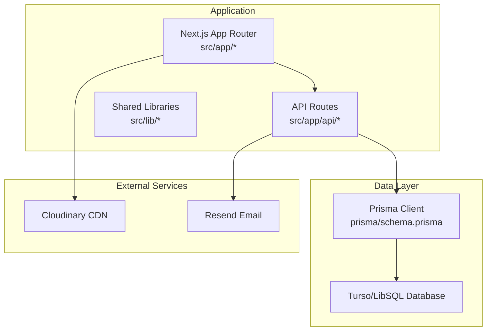
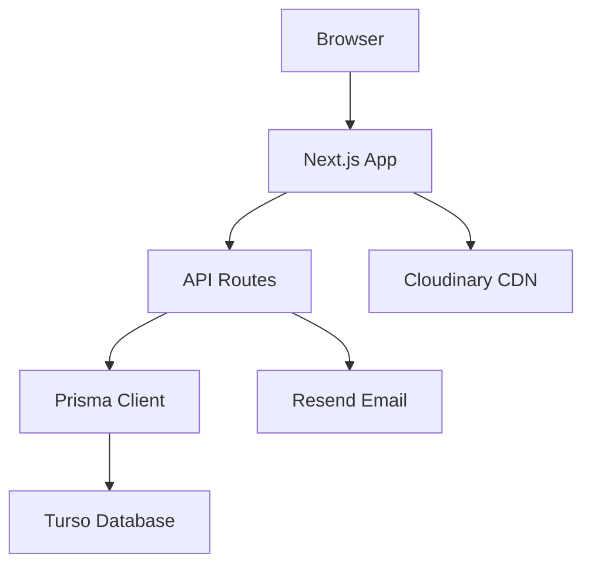
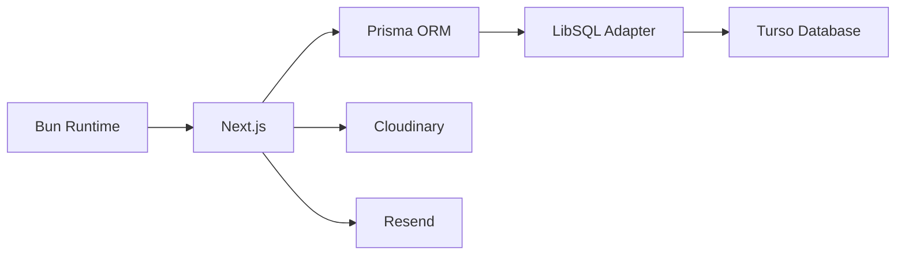

# Getting Started

<cite>
**Referenced Files in This Document**
- [package.json](file://package.json)
- [README.md](file://README.md)
- [prisma/schema.prisma](file://prisma/schema.prisma)
- [src/lib/db.ts](file://src/lib/db.ts)
- [src/lib/cloudinary.ts](file://src/lib/cloudinary.ts)
- [src/lib/cloudinary-loader.ts](file://src/lib/cloudinary-loader.ts)
- [next.config.ts](file://next.config.ts)
- [src/middleware.ts](file://src/middleware.ts)
- [src/app/api/route.ts](file://src/app/api/route.ts)
- [scripts/seed-services.ts](file://scripts/seed-services.ts)
- [db/custom.db.sql](file://db/custom.db.sql)
- [db/custom1.db.sql](file://db/custom1.db.sql)
</cite>

## Table of Contents
1. [Introduction](#introduction)
2. [Project Structure](#project-structure)
3. [Core Components](#core-components)
4. [Architecture Overview](#architecture-overview)
5. [Detailed Component Analysis](#detailed-component-analysis)
6. [Dependency Analysis](#dependency-analysis)
7. [Performance Considerations](#performance-considerations)
8. [Troubleshooting Guide](#troubleshooting-guide)
9. [Conclusion](#conclusion)
10. [Appendices](#appendices)

## Introduction
This guide helps you set up the GreenAxis project locally, configure environment variables, run database migrations, and start the development server. It covers prerequisites, step-by-step installation, environment configuration for Turso, Cloudinary, and Resend, and initial setup steps to get the admin panel and public site running.

## Project Structure
GreenAxis is a Next.js 16 application using the App Router, TypeScript, Tailwind CSS 4, and Prisma ORM with Turso/LibSQL. The stack integrates Cloudinary for image optimization and CDN, and Resend for transactional emails. Key directories and files include:
- Application routes under src/app
- API routes under src/app/api
- Shared libraries under src/lib
- Prisma schema and client generation under prisma
- Tailwind and Next.js configuration under root
- Utility scripts under scripts

**Diagram sources**
- [README.md:67-108](file://README.md#L67-L108)
- [prisma/schema.prisma:1-277](file://prisma/schema.prisma#L1-L277)
- [src/lib/db.ts:1-21](file://src/lib/db.ts#L1-L21)
- [src/lib/cloudinary.ts:1-119](file://src/lib/cloudinary.ts#L1-L119)
- [src/lib/cloudinary-loader.ts:1-59](file://src/lib/cloudinary-loader.ts#L1-L59)
- [next.config.ts:1-46](file://next.config.ts#L1-L46)

**Section sources**
- [README.md:152-186](file://README.md#L152-L186)

## Core Components
- Database client and adapter: Prisma configured with LibSQL adapter for Turso/LibSQL
- Cloudinary utilities and Next.js image loader
- Middleware for security headers and rate limiting
- Next.js configuration for custom image loader and static headers
- Example API route for health checks

Key implementation references:
- Turso adapter and Prisma client initialization
- Cloudinary URL transformation helpers and Next.js loader
- Security headers and CSP in middleware
- Next.js image loader configuration and remote patterns
- Sample API endpoint

**Section sources**
- [src/lib/db.ts:1-21](file://src/lib/db.ts#L1-L21)
- [src/lib/cloudinary.ts:1-119](file://src/lib/cloudinary.ts#L1-L119)
- [src/lib/cloudinary-loader.ts:1-59](file://src/lib/cloudinary-loader.ts#L1-L59)
- [src/middleware.ts:1-58](file://src/middleware.ts#L1-L58)
- [next.config.ts:1-46](file://next.config.ts#L1-L46)
- [src/app/api/route.ts:1-5](file://src/app/api/route.ts#L1-L5)

## Architecture Overview
The application uses a distributed database (Turso) via LibSQL, Prisma ORM for data access, Next.js API routes for backend logic, and external services for media and email.

**Diagram sources**
- [README.md:87-91](file://README.md#L87-L91)
- [src/lib/db.ts:1-21](file://src/lib/db.ts#L1-L21)
- [src/lib/cloudinary.ts:1-119](file://src/lib/cloudinary.ts#L1-L119)
- [src/middleware.ts:1-58](file://src/middleware.ts#L1-L58)

## Detailed Component Analysis

### Prerequisites
- Node.js: Required for running the project and installing dependencies
- Bun: Optional runtime compatible with the project’s scripts
- Database: Turso/LibSQL configured via Prisma adapter
- Cloudinary account: For image optimization and CDN
- Resend account: For sending transactional emails

Environment variables to configure:
- Turso: TURSO_DATABASE_URL, TURSO_AUTH_TOKEN
- Cloudinary: CLOUDINARY_URL (used by utilities)
- Resend: RESEND_API_KEY, RESEND_FROM_EMAIL

Notes:
- The project uses Prisma with driver adapters and LibSQL adapter
- Turso connection defaults to a local file database if environment variables are missing during development
- Cloudinary utilities require a Cloudinary-hosted URL to apply transformations

**Section sources**
- [README.md:87-108](file://README.md#L87-L108)
- [src/lib/db.ts:5-8](file://src/lib/db.ts#L5-L8)
- [src/lib/cloudinary.ts:11-13](file://src/lib/cloudinary.ts#L11-L13)
- [next.config.ts:11-28](file://next.config.ts#L11-L28)

### Step-by-Step Installation
1. Clone the repository to your machine
2. Install dependencies using your preferred package manager
3. Set environment variables for Turso, Cloudinary, and Resend
4. Run Prisma client generation
5. Run database migrations
6. Seed initial data (optional)
7. Start the development server

Reference commands and scripts:
- Development server: dev
- Build: build
- Production start: start
- Prisma client generation: db:generate
- Database migration: db:migrate
- Reset migration state: db:reset
- Export/import data: db:export, db:import

**Section sources**
- [package.json:5-16](file://package.json#L5-L16)

### Environment Variables Configuration
Set the following variables in your environment:
- TURSO_DATABASE_URL: Turso database URL
- TURSO_AUTH_TOKEN: Turso authentication token
- CLOUDINARY_URL: Cloudinary URL for transformations
- RESEND_API_KEY: Resend API key
- RESEND_FROM_EMAIL: Sender email address for Resend

These variables are consumed by:
- Turso adapter in the database client
- Cloudinary utilities for URL transformation
- Resend integration for email sending

**Section sources**
- [src/lib/db.ts:5-8](file://src/lib/db.ts#L5-L8)
- [src/lib/cloudinary.ts:11-13](file://src/lib/cloudinary.ts#L11-L13)
- [README.md:718-727](file://README.md#L718-L727)

### Initial Project Setup
- Confirm Prisma schema location and model definitions
- Verify Turso adapter configuration
- Ensure Next.js image loader is configured to use Cloudinary
- Add remote patterns for Cloudinary and Unsplash in Next.js config
- Apply security headers via middleware

**Section sources**
- [prisma/schema.prisma:1-277](file://prisma/schema.prisma#L1-L277)
- [src/lib/db.ts:1-21](file://src/lib/db.ts#L1-L21)
- [next.config.ts:11-28](file://next.config.ts#L11-L28)
- [src/middleware.ts:29-41](file://src/middleware.ts#L29-L41)

### Database Migration Execution
- Generate Prisma client: db:generate
- Create and apply migrations: db:migrate
- Optionally reset migrations: db:reset
- Export/import data: db:export, db:import

Migration behavior:
- The Prisma schema defines models and relations
- Turso adapter enables distributed SQLite-like behavior
- Seed script can populate initial services data

**Section sources**
- [package.json:10-15](file://package.json#L10-L15)
- [prisma/schema.prisma:15-277](file://prisma/schema.prisma#L15-L277)
- [scripts/seed-services.ts:115-138](file://scripts/seed-services.ts#L115-L138)

### Local Development Server Startup
- Start the development server: dev
- Access the sample API endpoint at /api for verification
- The production start command uses Bun to serve the standalone build

**Section sources**
- [package.json:6](file://package.json#L6)
- [src/app/api/route.ts:1-5](file://src/app/api/route.ts#L1-L5)
- [package.json:8](file://package.json#L8)

### Basic Project Structure Navigation
- Public pages: src/app/*
- Admin routes: src/app/admin/*
- API endpoints: src/app/api/*
- Shared utilities: src/lib/*
- Prisma schema: prisma/schema.prisma
- Tailwind config: tailwind.config.ts
- Next.js config: next.config.ts

**Section sources**
- [README.md:158-186](file://README.md#L158-L186)

## Dependency Analysis
The project relies on:
- Next.js 16 with App Router
- Prisma ORM with LibSQL adapter
- Turso for distributed database
- Cloudinary for image optimization and CDN
- Resend for email delivery
- Bun-compatible runtime for production start

**Diagram sources**
- [README.md:80-91](file://README.md#L80-L91)
- [src/lib/db.ts:1-21](file://src/lib/db.ts#L1-L21)
- [src/lib/cloudinary.ts:1-119](file://src/lib/cloudinary.ts#L1-L119)
- [package.json:79-92](file://package.json#L79-L92)

**Section sources**
- [README.md:67-108](file://README.md#L67-L108)
- [package.json:17-102](file://package.json#L17-L102)

## Performance Considerations
- Turso edge replicas reduce latency
- Cloudinary transformations optimize image delivery
- Next.js standalone output improves cold start and bundle size
- Prisma client generation and connection pooling improve query performance
- Use appropriate image widths and formats for responsive delivery

[No sources needed since this section provides general guidance]

## Troubleshooting Guide
Common setup issues and resolutions:
- Turso connection errors:
  - Ensure TURSO_DATABASE_URL and TURSO_AUTH_TOKEN are set
  - Confirm the database is reachable and credentials are valid
- Prisma client generation failures:
  - Run db:generate to regenerate the client
  - Verify Prisma schema correctness
- Migration errors:
  - Use db:migrate to apply pending migrations
  - Use db:reset to reset migration state if needed
- Cloudinary transformation issues:
  - Ensure images are served from Cloudinary domains
  - Verify CLOUDINARY_URL is configured
- Email sending failures:
  - Confirm RESEND_API_KEY and RESEND_FROM_EMAIL are set
  - Test endpoint availability and rate limits
- Development server startup:
  - Use dev script to start the development server
  - For production, use start script with Bun

**Section sources**
- [src/lib/db.ts:5-8](file://src/lib/db.ts#L5-L8)
- [package.json:10-15](file://package.json#L10-L15)
- [src/lib/cloudinary.ts:11-13](file://src/lib/cloudinary.ts#L11-L13)
- [README.md:718-727](file://README.md#L718-L727)
- [package.json:6](file://package.json#L6)
- [package.json:8](file://package.json#L8)

## Conclusion
You are now ready to run GreenAxis locally. Configure environment variables for Turso, Cloudinary, and Resend, generate the Prisma client, run migrations, optionally seed data, and start the development server. Explore the admin routes and public pages to verify the setup.

[No sources needed since this section summarizes without analyzing specific files]

## Appendices

### Appendix A: Environment Variables Reference
- TURSO_DATABASE_URL: Turso database URL
- TURSO_AUTH_TOKEN: Turso authentication token
- CLOUDINARY_URL: Cloudinary URL for transformations
- RESEND_API_KEY: Resend API key
- RESEND_FROM_EMAIL: Sender email address for Resend

**Section sources**
- [src/lib/db.ts:5-8](file://src/lib/db.ts#L5-L8)
- [src/lib/cloudinary.ts:11-13](file://src/lib/cloudinary.ts#L11-L13)
- [README.md:718-727](file://README.md#L718-L727)

### Appendix B: Database Models Overview
Key models defined in the Prisma schema:
- PlatformConfig: Global site configuration
- Service: Company services with ordering and visibility
- News: Blog/news posts with optional Editor.js blocks
- SiteImage: Media library with hashing and categorization
- CarouselSlide: Hero carousel entries
- LegalPage: Terms and privacy pages
- ContactMessage: Contact form submissions
- Admin: Administrator accounts
- PasswordResetToken: Password reset tokens
- SocialFeedConfig: Social media embed configurations
- AboutPage: Full “About Us” page content

**Section sources**
- [prisma/schema.prisma:15-277](file://prisma/schema.prisma#L15-L277)

### Appendix C: Seed Data
Seed script creates default services with titles, descriptions, icons, and ordering. It updates existing records or inserts new ones.

**Section sources**
- [scripts/seed-services.ts:5-113](file://scripts/seed-services.ts#L5-L113)

### Appendix D: Legacy Database SQL
Legacy SQL files define the initial schema and default configuration for PlatformConfig. These can be used for reference or migration scenarios.

**Section sources**
- [db/custom.db.sql:1-212](file://db/custom.db.sql#L1-L212)
- [db/custom1.db.sql:1-211](file://db/custom1.db.sql#L1-L211)