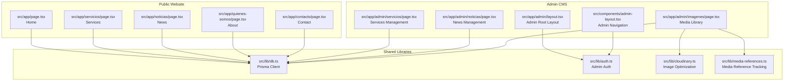
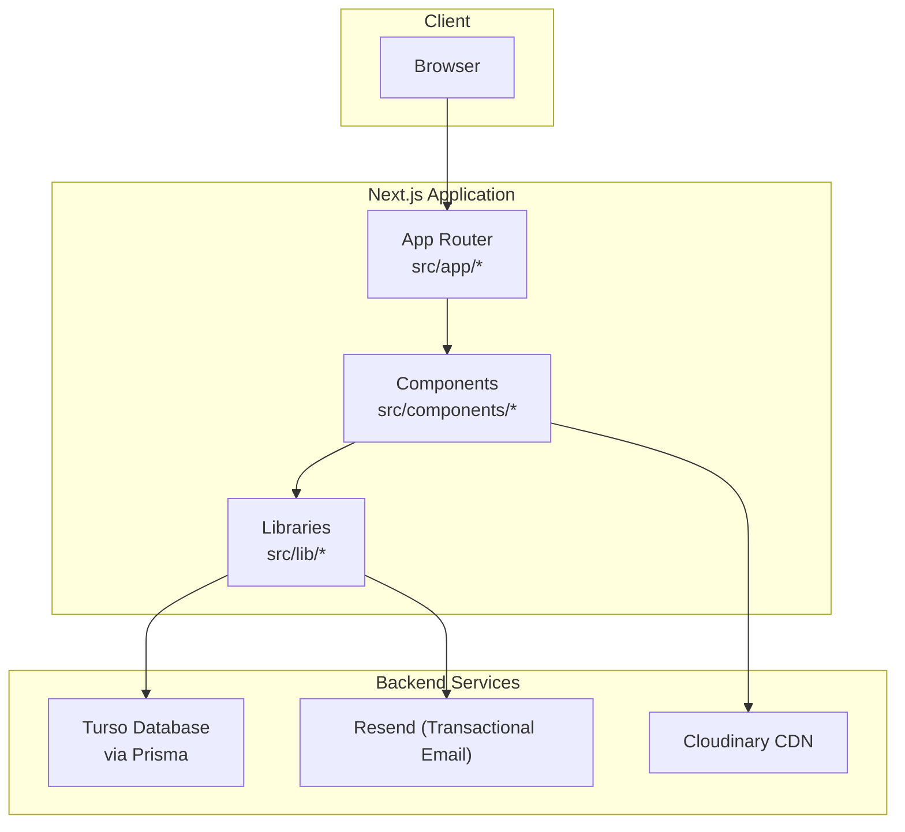
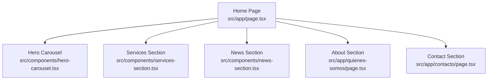
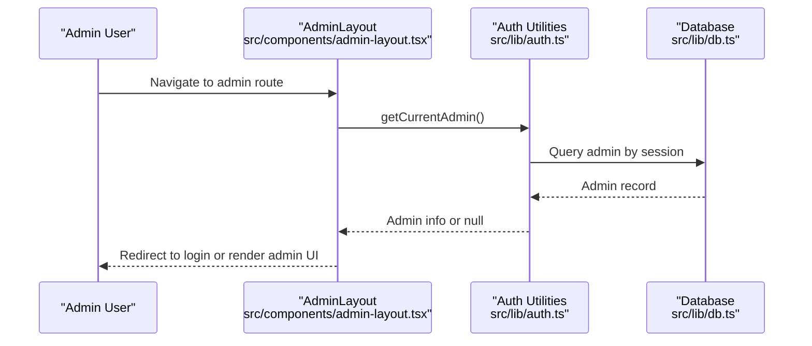
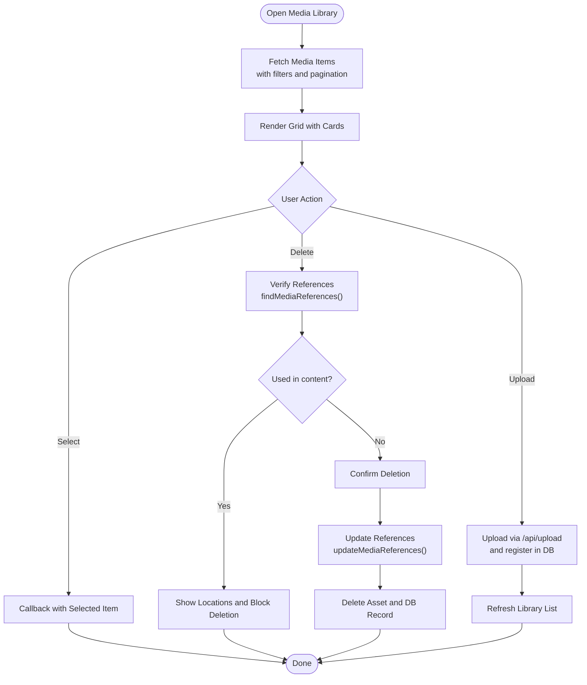
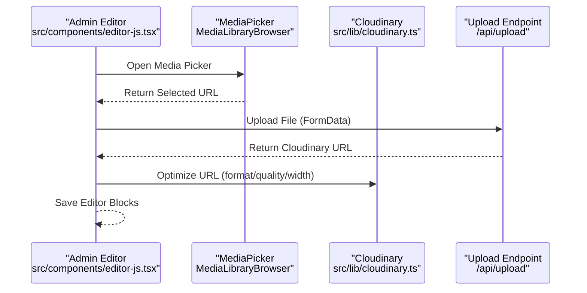
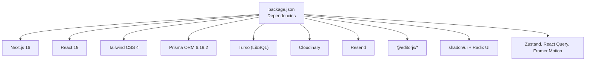

# Project Overview

<cite>
**Referenced Files in This Document**
- [README.md](file://README.md)
- [package.json](file://package.json)
- [src/app/layout.tsx](file://src/app/layout.tsx)
- [src/middleware.ts](file://src/middleware.ts)
- [src/lib/db.ts](file://src/lib/db.ts)
- [src/lib/auth.ts](file://src/lib/auth.ts)
- [src/components/theme-provider.tsx](file://src/components/theme-provider.tsx)
- [src/components/media-library-browser.tsx](file://src/components/media-library-browser.tsx)
- [src/components/editor-js.tsx](file://src/components/editor-js.tsx)
- [src/lib/cloudinary.ts](file://src/lib/cloudinary.ts)
- [src/lib/media-references.ts](file://src/lib/media-references.ts)
- [src/app/admin/layout.tsx](file://src/app/admin/layout.tsx)
- [src/components/admin-layout.tsx](file://src/components/admin-layout.tsx)
- [src/app/page.tsx](file://src/app/page.tsx)
- [src/components/hero-carousel.tsx](file://src/components/hero-carousel.tsx)
- [src/components/services-section.tsx](file://src/components/services-section.tsx)
- [src/components/news-section.tsx](file://src/components/news-section.tsx)
</cite>

## Table of Contents
1. [Introduction](#introduction)
2. [Project Structure](#project-structure)
3. [Core Components](#core-components)
4. [Architecture Overview](#architecture-overview)
5. [Detailed Component Analysis](#detailed-component-analysis)
6. [Dependency Analysis](#dependency-analysis)
7. [Performance Considerations](#performance-considerations)
8. [Troubleshooting Guide](#troubleshooting-guide)
9. [Conclusion](#conclusion)

## Introduction
Green Axis S.A.S. is an integrated web solution designed for environmental service companies. It combines a high-performance public website with a powerful administrative CMS, enabling organizations to manage their digital presence independently and securely. The platform emphasizes:
- Mobile-first responsive design for optimal viewing across devices
- Rich content creation powered by a block-based editor
- A professional media library with advanced storage, duplicate detection, and reference tracking
- Enterprise-grade security and performance optimizations

This overview introduces the platform’s purpose, capabilities, and target use cases, while later sections provide both beginner-friendly explanations and technical insights for developers.

## Project Structure
The project follows a modern Next.js 16 App Router architecture with a clear separation between the public-facing website and the admin CMS. Key directories and responsibilities:
- src/app: Public pages, API routes, and shared layouts
- src/components: Reusable UI components and page-specific sections
- src/lib: Backend utilities, database client, authentication, and media helpers
- prisma: Database schema and migrations
- public: Static assets and uploads folder
- scripts: Utility scripts for data import/export and seeding

**Diagram sources**
- [src/app/page.tsx:1-52](file://src/app/page.tsx#L1-L52)
- [src/app/admin/layout.tsx:1-18](file://src/app/admin/layout.tsx#L1-L18)
- [src/components/admin-layout.tsx:1-384](file://src/components/admin-layout.tsx#L1-L384)
- [src/lib/db.ts:1-21](file://src/lib/db.ts#L1-L21)
- [src/lib/auth.ts:1-170](file://src/lib/auth.ts#L1-L170)
- [src/lib/cloudinary.ts:1-119](file://src/lib/cloudinary.ts#L1-L119)
- [src/lib/media-references.ts:1-334](file://src/lib/media-references.ts#L1-L334)

**Section sources**
- [README.md:152-186](file://README.md#L152-L186)
- [package.json:1-116](file://package.json#L1-L116)

## Core Components
This section highlights the platform’s key capabilities and how they serve environmental service businesses.

- Mobile-first responsive design
  - Built with Tailwind CSS breakpoints and a mobile-first approach ensuring optimal usability on phones, tablets, and desktops.
  - Components like the hero carousel, services grid, and news cards adapt seamlessly across screen sizes.

- Rich content management with a block-based editor
  - The Editor.js-based editor enables creating structured, media-rich content for news and legal pages.
  - Supports images, videos, audios, lists, quotes, and more, with a Spanish localization layer.

- Professional media library system
  - Media library browser with search, filtering, infinite scrolling, and preview modals.
  - Duplicate detection via SHA-256 hashing and reference tracking to prevent broken links when deleting files.
  - Cloudinary integration for global CDN delivery, automatic format/quality optimization, and responsive image URLs.

- Security and access control
  - Admin authentication with bcrypt hashing, secure session cookies, and rate limiting.
  - Middleware applies comprehensive security headers and protects admin routes.

- Performance and SEO
  - Next.js 16 features: server components, streaming SSR, automatic image optimization, and prefetching.
  - Dynamic metadata generation and canonical URLs for SEO.
  - Analytics integration for Google Analytics.

- Practical use cases
  - Environmental consulting firms can publish service catalogs, news, and “About” content with rich media.
  - Operations teams can manage carousels, media assets, and contact messages without developer intervention.
  - Organizations can maintain consistent branding and global performance using Cloudinary and Turso.

**Section sources**
- [README.md:67-108](file://README.md#L67-L108)
- [src/components/theme-provider.tsx:1-9](file://src/components/theme-provider.tsx#L1-L9)
- [src/components/editor-js.tsx:1-800](file://src/components/editor-js.tsx#L1-L800)
- [src/components/media-library-browser.tsx:1-362](file://src/components/media-library-browser.tsx#L1-L362)
- [src/lib/media-references.ts:1-334](file://src/lib/media-references.ts#L1-L334)
- [src/lib/cloudinary.ts:1-119](file://src/lib/cloudinary.ts#L1-L119)
- [src/lib/auth.ts:1-170](file://src/lib/auth.ts#L1-L170)
- [src/middleware.ts:1-58](file://src/middleware.ts#L1-L58)
- [src/app/layout.tsx:1-80](file://src/app/layout.tsx#L1-L80)

## Architecture Overview
The system integrates a public-facing website and an admin CMS, connected to a distributed database and external services.

**Diagram sources**
- [src/lib/db.ts:1-21](file://src/lib/db.ts#L1-L21)
- [src/lib/cloudinary.ts:1-119](file://src/lib/cloudinary.ts#L1-L119)
- [src/lib/auth.ts:1-170](file://src/lib/auth.ts#L1-L170)
- [package.json:17-101](file://package.json#L17-L101)

## Detailed Component Analysis

### Public Website Sections
The public website is composed of modular sections that showcase services, news, and company information.

**Diagram sources**
- [src/app/page.tsx:1-52](file://src/app/page.tsx#L1-L52)
- [src/components/hero-carousel.tsx:1-305](file://src/components/hero-carousel.tsx#L1-L305)
- [src/components/services-section.tsx:1-182](file://src/components/services-section.tsx#L1-L182)
- [src/components/news-section.tsx:1-138](file://src/components/news-section.tsx#L1-L138)

**Section sources**
- [src/app/page.tsx:1-52](file://src/app/page.tsx#L1-L52)
- [src/components/hero-carousel.tsx:1-305](file://src/components/hero-carousel.tsx#L1-L305)
- [src/components/services-section.tsx:1-182](file://src/components/services-section.tsx#L1-L182)
- [src/components/news-section.tsx:1-138](file://src/components/news-section.tsx#L1-L138)

### Admin CMS and Authentication
The admin CMS provides a protected environment for managing content, media, and configuration.

**Diagram sources**
- [src/app/admin/layout.tsx:1-18](file://src/app/admin/layout.tsx#L1-L18)
- [src/components/admin-layout.tsx:1-384](file://src/components/admin-layout.tsx#L1-L384)
- [src/lib/auth.ts:1-170](file://src/lib/auth.ts#L1-L170)
- [src/lib/db.ts:1-21](file://src/lib/db.ts#L1-L21)

**Section sources**
- [src/app/admin/layout.tsx:1-18](file://src/app/admin/layout.tsx#L1-L18)
- [src/components/admin-layout.tsx:1-384](file://src/components/admin-layout.tsx#L1-L384)
- [src/lib/auth.ts:1-170](file://src/lib/auth.ts#L1-L170)

### Media Library Browser and Reference Tracking
The media library offers a comprehensive interface for browsing, selecting, uploading, and deleting media assets with safety checks.

**Diagram sources**
- [src/components/media-library-browser.tsx:1-362](file://src/components/media-library-browser.tsx#L1-L362)
- [src/lib/media-references.ts:1-334](file://src/lib/media-references.ts#L1-L334)

**Section sources**
- [src/components/media-library-browser.tsx:1-362](file://src/components/media-library-browser.tsx#L1-L362)
- [src/lib/media-references.ts:1-334](file://src/lib/media-references.ts#L1-L334)

### Editor.js Integration and Media Picker
The editor enables rich content creation with integrated media selection and upload flows.

**Diagram sources**
- [src/components/editor-js.tsx:1-800](file://src/components/editor-js.tsx#L1-L800)
- [src/components/media-library-browser.tsx:1-362](file://src/components/media-library-browser.tsx#L1-L362)
- [src/lib/cloudinary.ts:1-119](file://src/lib/cloudinary.ts#L1-L119)

**Section sources**
- [src/components/editor-js.tsx:1-800](file://src/components/editor-js.tsx#L1-L800)
- [src/lib/cloudinary.ts:1-119](file://src/lib/cloudinary.ts#L1-L119)

## Dependency Analysis
The project relies on a cohesive stack to deliver performance, security, and scalability.

**Diagram sources**
- [package.json:17-101](file://package.json#L17-L101)

**Section sources**
- [package.json:1-116](file://package.json#L1-L116)

## Performance Considerations
- Database: Turso edge replicas reduce latency; Prisma connection pooling and compiled queries improve throughput.
- Images: Cloudinary delivers optimized formats (WebP/AVIF), responsive srcset, and lazy loading; helper utilities inject transformations.
- Frontend: Next.js 16 server components minimize client-side JavaScript; React Query caches and deduplicates requests; tree-shaking and compression reduce bundle size.
- Recommendations: Keep hero images under 500KB, limit active carousel slides to 3–5, and use appropriate image dimensions to avoid unnecessary bandwidth.

**Section sources**
- [README.md:733-800](file://README.md#L733-L800)
- [src/lib/cloudinary.ts:1-119](file://src/lib/cloudinary.ts#L1-L119)
- [src/lib/db.ts:1-21](file://src/lib/db.ts#L1-L21)

## Troubleshooting Guide
Common issues and resolutions:
- Authentication failures
  - Ensure sessions are created with secure cookies and not expired; verify bcrypt verification and rate limits.
  - Check admin credentials and session persistence.
- Media deletion errors
  - Use reference verification to confirm where an asset is used; update references before deletion to prevent broken links.
- Upload size limits
  - Large files are rejected by the upload endpoint; use Cloudinary Console for large assets and paste URLs into the editor or media picker.
- CSP and security headers
  - Review middleware-provided headers if external resources fail to load; adjust CSP policies as needed for embedded content.

**Section sources**
- [src/lib/auth.ts:1-170](file://src/lib/auth.ts#L1-L170)
- [src/lib/media-references.ts:1-334](file://src/lib/media-references.ts#L1-L334)
- [src/middleware.ts:1-58](file://src/middleware.ts#L1-L58)
- [src/components/editor-js.tsx:180-227](file://src/components/editor-js.tsx#L180-L227)

## Conclusion
Green Axis S.A.S. provides an end-to-end solution for environmental service companies to publish engaging content, manage media efficiently, and operate securely. Its mobile-first design, powerful editor, robust media library, and enterprise-grade security make it suitable for organizations seeking a scalable, production-ready digital presence. Whether you are a small consulting firm or a larger operations team, the platform’s CMS and public website streamline content management and enhance customer engagement.