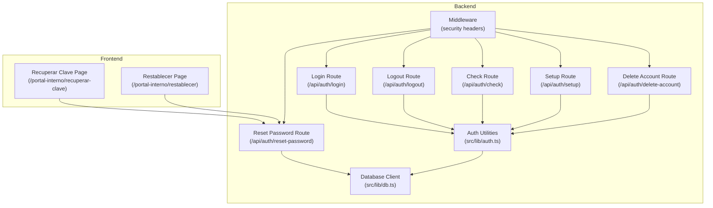
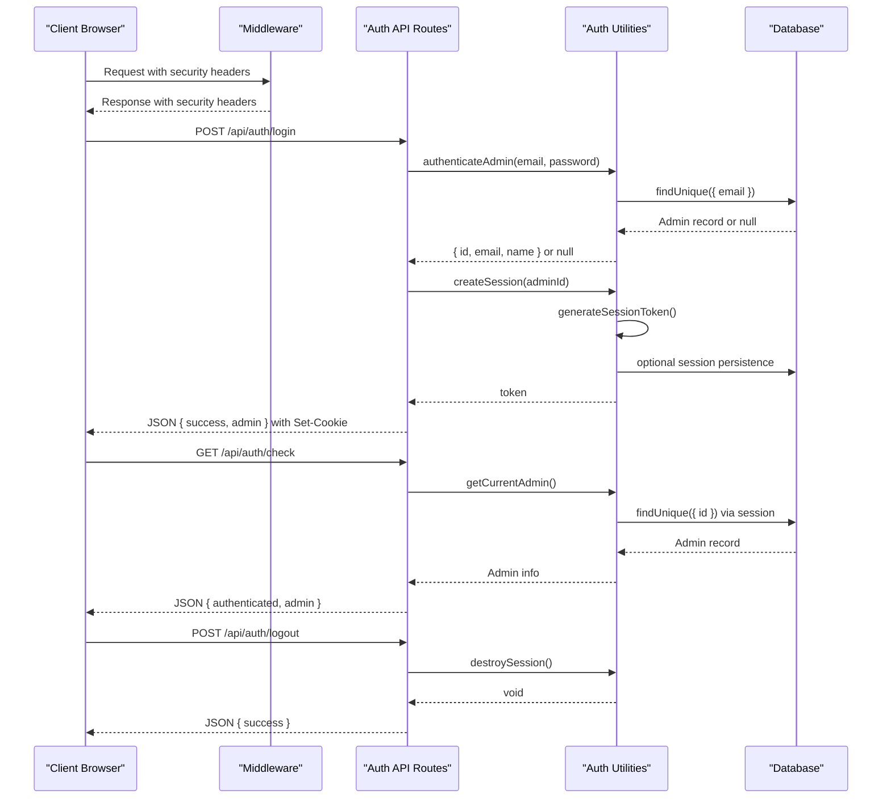
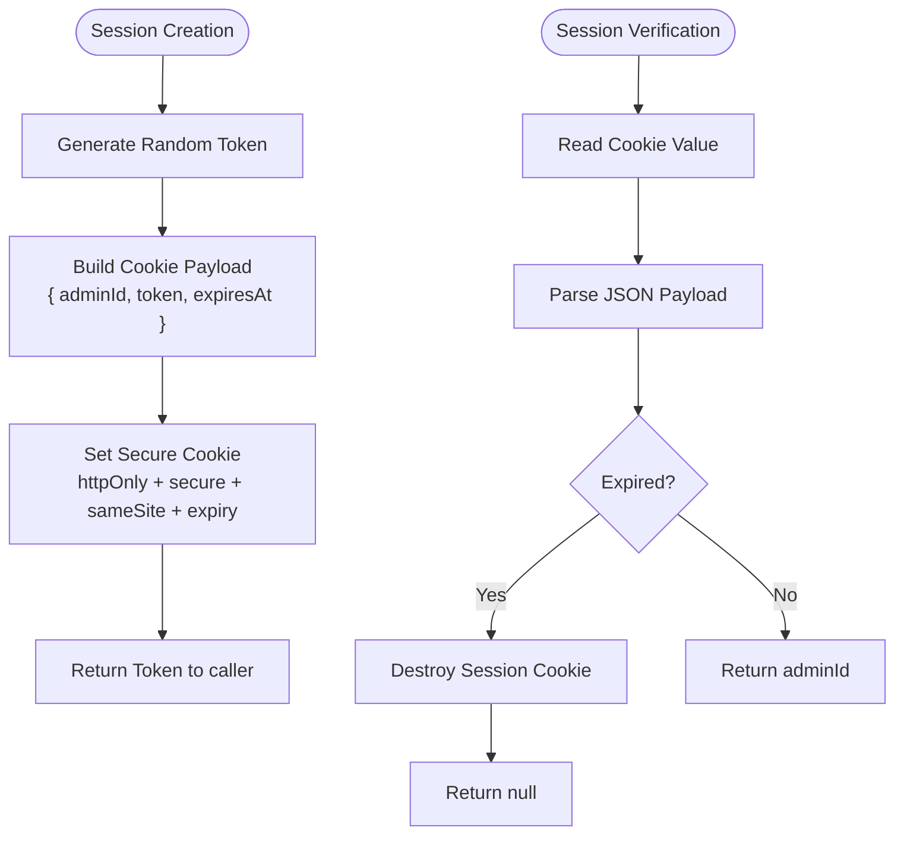
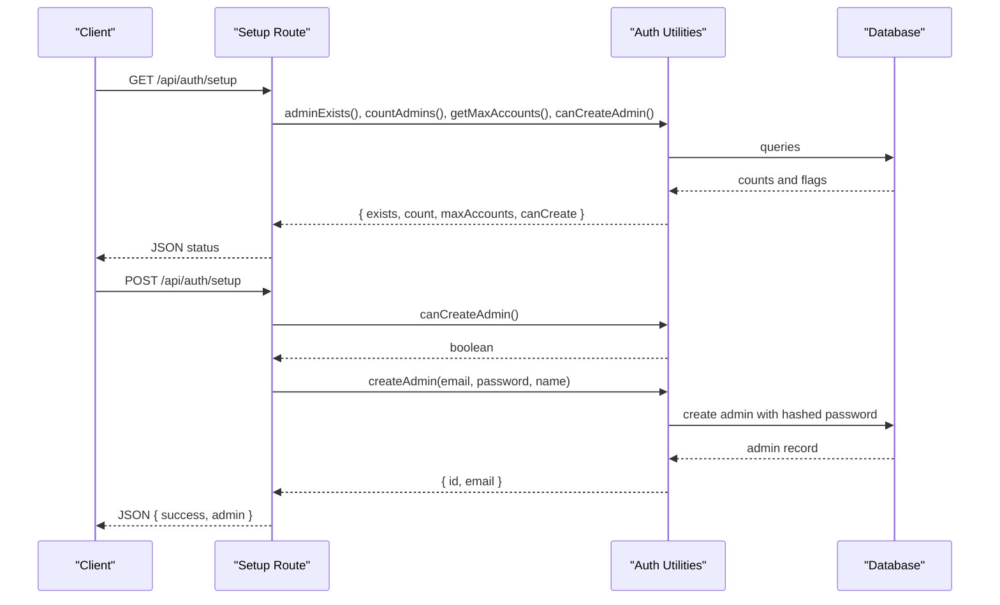
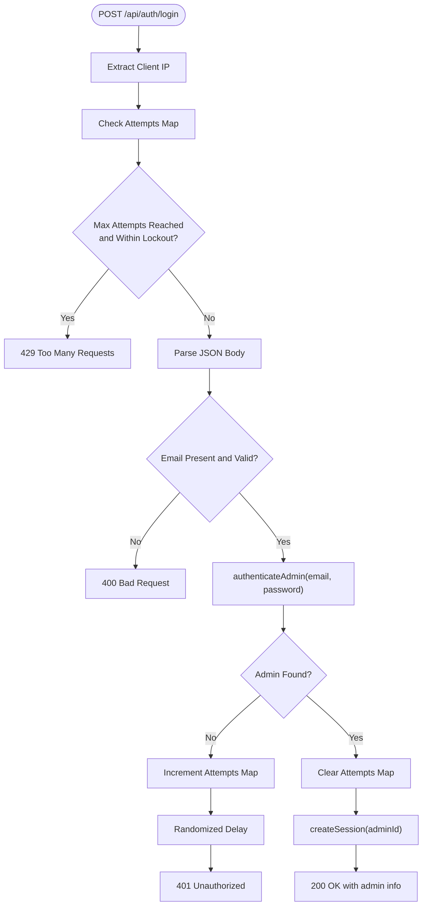
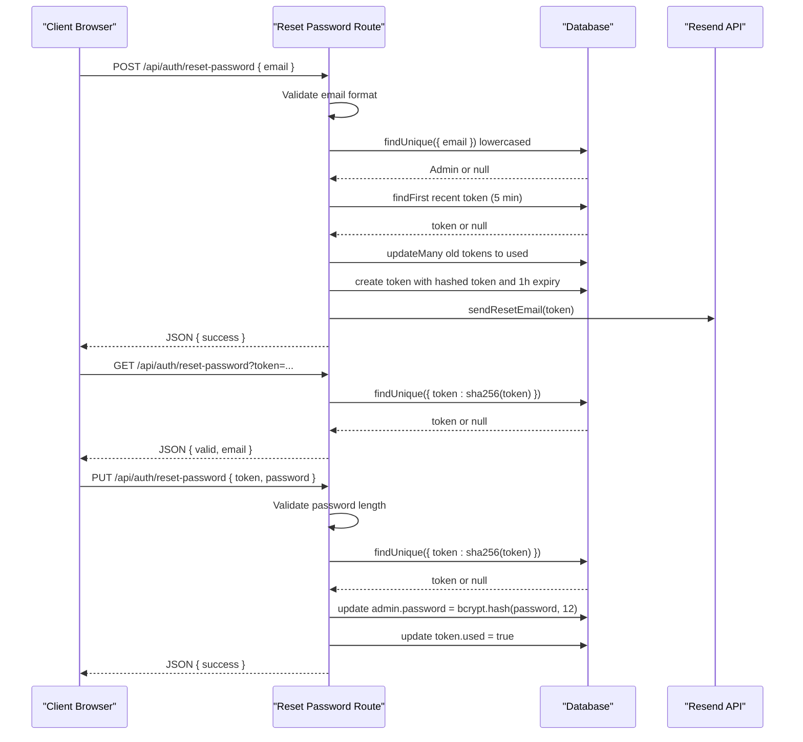
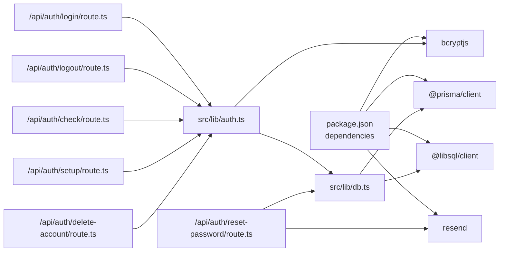

# Authentication System

<cite>
**Referenced Files in This Document**
- [auth.ts](file://src/lib/auth.ts)
- [middleware.ts](file://src/middleware.ts)
- [login/route.ts](file://src/app/api/auth/login/route.ts)
- [logout/route.ts](file://src/app/api/auth/logout/route.ts)
- [check/route.ts](file://src/app/api/auth/check/route.ts)
- [reset-password/route.ts](file://src/app/api/auth/reset-password/route.ts)
- [setup/route.ts](file://src/app/api/auth/setup/route.ts)
- [delete-account/route.ts](file://src/app/api/auth/delete-account/route.ts)
- [schema.prisma](file://prisma/schema.prisma)
- [db.ts](file://src/lib/db.ts)
- [recuperar-clave/page.tsx](file://src/app/portal-interno/recuperar-clave/page.tsx)
- [restablecer/page.tsx](file://src/app/portal-interno/restablecer/page.tsx)
- [package.json](file://package.json)
</cite>

## Table of Contents
1. [Introduction](#introduction)
2. [Project Structure](#project-structure)
3. [Core Components](#core-components)
4. [Architecture Overview](#architecture-overview)
5. [Detailed Component Analysis](#detailed-component-analysis)
6. [Dependency Analysis](#dependency-analysis)
7. [Performance Considerations](#performance-considerations)
8. [Security Measures](#security-measures)
9. [Troubleshooting Guide](#troubleshooting-guide)
10. [Conclusion](#conclusion)

## Introduction
This document describes the authentication system for GreenAxis, focusing on bcrypt password hashing with 12 rounds, session-based authentication with secure cookie management, user registration flow, and password reset functionality. It explains the authentication middleware, login/logout endpoints, session token generation and expiration handling, secure cookie attributes, user validation, credential verification, and authentication state management. It also covers security measures against brute force attacks, session hijacking prevention, and secure password handling practices.

## Project Structure
The authentication system spans backend API routes, shared authentication utilities, database models, and frontend pages for password reset. Key areas:
- Backend utilities: password hashing, session creation/verification, admin operations
- API endpoints: login, logout, check, reset-password, setup, delete-account
- Database models: Admin and PasswordResetToken
- Frontend pages: password reset initiation and completion flows

**Diagram sources**
- [middleware.ts:1-58](file://src/middleware.ts#L1-L58)
- [login/route.ts:1-91](file://src/app/api/auth/login/route.ts#L1-L91)
- [logout/route.ts:1-13](file://src/app/api/auth/logout/route.ts#L1-L13)
- [check/route.ts:1-21](file://src/app/api/auth/check/route.ts#L1-L21)
- [reset-password/route.ts:1-262](file://src/app/api/auth/reset-password/route.ts#L1-L262)
- [setup/route.ts:1-63](file://src/app/api/auth/setup/route.ts#L1-L63)
- [delete-account/route.ts:1-43](file://src/app/api/auth/delete-account/route.ts#L1-L43)
- [auth.ts:1-170](file://src/lib/auth.ts#L1-L170)
- [db.ts:1-21](file://src/lib/db.ts#L1-L21)

**Section sources**
- [auth.ts:1-170](file://src/lib/auth.ts#L1-L170)
- [login/route.ts:1-91](file://src/app/api/auth/login/route.ts#L1-L91)
- [logout/route.ts:1-13](file://src/app/api/auth/logout/route.ts#L1-L13)
- [check/route.ts:1-21](file://src/app/api/auth/check/route.ts#L1-L21)
- [reset-password/route.ts:1-262](file://src/app/api/auth/reset-password/route.ts#L1-L262)
- [setup/route.ts:1-63](file://src/app/api/auth/setup/route.ts#L1-L63)
- [delete-account/route.ts:1-43](file://src/app/api/auth/delete-account/route.ts#L1-L43)
- [middleware.ts:1-58](file://src/middleware.ts#L1-L58)
- [schema.prisma:200-222](file://prisma/schema.prisma#L200-L222)
- [db.ts:1-21](file://src/lib/db.ts#L1-L21)

## Core Components
- Password hashing and verification: bcrypt with 12 rounds
- Session management: secure cookie with httpOnly, secure, sameSite strict, 7-day expiry
- Admin operations: existence checks, counting, creation, deletion with limits
- Authentication utilities: token generation, session lifecycle, current admin retrieval
- Database models: Admin and PasswordResetToken with appropriate constraints

Key implementation references:
- bcrypt configuration and helpers: [auth.ts:6-18](file://src/lib/auth.ts#L6-L18)
- session cookie attributes and lifecycle: [auth.ts:26-77](file://src/lib/auth.ts#L26-L77)
- admin creation and validation: [auth.ts:122-153](file://src/lib/auth.ts#L122-L153)
- reset token generation and storage: [reset-password/route.ts:10-167](file://src/app/api/auth/reset-password/route.ts#L10-L167)
- rate limiting and brute force protection: [login/route.ts:4-7](file://src/app/api/auth/login/route.ts#L4-L7)

**Section sources**
- [auth.ts:6-18](file://src/lib/auth.ts#L6-L18)
- [auth.ts:26-77](file://src/lib/auth.ts#L26-L77)
- [auth.ts:122-153](file://src/lib/auth.ts#L122-L153)
- [reset-password/route.ts:10-167](file://src/app/api/auth/reset-password/route.ts#L10-L167)
- [login/route.ts:4-7](file://src/app/api/auth/login/route.ts#L4-L7)

## Architecture Overview
The authentication system follows a layered architecture:
- Middleware applies security headers to all requests
- API routes handle authentication operations
- Shared auth utilities encapsulate cryptographic and session logic
- Database models define Admin and PasswordResetToken entities
- Frontend pages trigger password reset workflows via API calls

**Diagram sources**
- [middleware.ts:1-58](file://src/middleware.ts#L1-L58)
- [login/route.ts:1-91](file://src/app/api/auth/login/route.ts#L1-L91)
- [check/route.ts:1-21](file://src/app/api/auth/check/route.ts#L1-L21)
- [logout/route.ts:1-13](file://src/app/api/auth/logout/route.ts#L1-L13)
- [auth.ts:26-77](file://src/lib/auth.ts#L26-L77)
- [db.ts:1-21](file://src/lib/db.ts#L1-L21)

## Detailed Component Analysis

### Password Hashing and Verification
- bcrypt is configured with 12 rounds for password hashing and comparison
- Hashing occurs during admin creation and password reset
- Verification is used during login to authenticate credentials

Implementation highlights:
- Hashing function: [auth.ts:11-13](file://src/lib/auth.ts#L11-L13)
- Verification function: [auth.ts:16-18](file://src/lib/auth.ts#L16-L18)
- Reset password hashing: [reset-password/route.ts:242](file://src/app/api/auth/reset-password/route.ts#L242)

**Section sources**
- [auth.ts:11-18](file://src/lib/auth.ts#L11-L18)
- [reset-password/route.ts:242](file://src/app/api/auth/reset-password/route.ts#L242)

### Session-Based Authentication and Secure Cookies
- Session token generation uses cryptographically secure random bytes
- Sessions stored in a signed cookie with:
  - httpOnly: prevents XSS reading
  - secure: transmitted over HTTPS in production
  - sameSite strict: mitigates CSRF
  - 7-day expiry
  - path /
- Session verification parses cookie, validates expiry, and clears expired sessions
- Logout destroys the session cookie

Implementation highlights:
- Token generation: [auth.ts:21-23](file://src/lib/auth.ts#L21-L23)
- Cookie creation: [auth.ts:34-44](file://src/lib/auth.ts#L34-L44)
- Session verification: [auth.ts:50-71](file://src/lib/auth.ts#L50-L71)
- Session destruction: [auth.ts:74-77](file://src/lib/auth.ts#L74-L77)
- Logout endpoint: [logout/route.ts:1-13](file://src/app/api/auth/logout/route.ts#L1-L13)

**Diagram sources**
- [auth.ts:21-23](file://src/lib/auth.ts#L21-L23)
- [auth.ts:34-44](file://src/lib/auth.ts#L34-L44)
- [auth.ts:50-71](file://src/lib/auth.ts#L50-L71)
- [auth.ts:74-77](file://src/lib/auth.ts#L74-L77)

**Section sources**
- [auth.ts:21-23](file://src/lib/auth.ts#L21-L23)
- [auth.ts:34-44](file://src/lib/auth.ts#L34-L44)
- [auth.ts:50-71](file://src/lib/auth.ts#L50-L71)
- [auth.ts:74-77](file://src/lib/auth.ts#L74-L77)
- [logout/route.ts:1-13](file://src/app/api/auth/logout/route.ts#L1-L13)

### User Registration Flow
- Setup endpoint checks admin existence and capacity before creation
- Password strength validated (minimum 8 characters)
- New admin created with bcrypt-hashed password
- Returns success with admin identifier

Implementation highlights:
- Setup check: [setup/route.ts:4-21](file://src/app/api/auth/setup/route.ts#L4-L21)
- Setup creation: [setup/route.ts:23-62](file://src/app/api/auth/setup/route.ts#L23-L62)
- Admin creation utility: [auth.ts:122-134](file://src/lib/auth.ts#L122-L134)

**Diagram sources**
- [setup/route.ts:4-21](file://src/app/api/auth/setup/route.ts#L4-L21)
- [setup/route.ts:23-62](file://src/app/api/auth/setup/route.ts#L23-L62)
- [auth.ts:122-134](file://src/lib/auth.ts#L122-L134)

**Section sources**
- [setup/route.ts:4-21](file://src/app/api/auth/setup/route.ts#L4-L21)
- [setup/route.ts:23-62](file://src/app/api/auth/setup/route.ts#L23-L62)
- [auth.ts:122-134](file://src/lib/auth.ts#L122-L134)

### Login Endpoint
- Validates presence and format of email
- Implements memory-based rate limiting (max 5 attempts per IP, 15-minute lockout)
- On successful authentication, creates a session and returns admin info
- On failure, increments attempts and adds a small randomized delay to mitigate timing attacks

Implementation highlights:
- Rate limiting structure: [login/route.ts:4-7](file://src/app/api/auth/login/route.ts#L4-L7)
- Attempt tracking and lockout: [login/route.ts:16-33](file://src/app/api/auth/login/route.ts#L16-L33)
- Credential validation and delay: [login/route.ts:52-74](file://src/app/api/auth/login/route.ts#L52-L74)
- Session creation: [login/route.ts:80](file://src/app/api/auth/login/route.ts#L80)

**Diagram sources**
- [login/route.ts:4-7](file://src/app/api/auth/login/route.ts#L4-L7)
- [login/route.ts:16-33](file://src/app/api/auth/login/route.ts#L16-L33)
- [login/route.ts:52-74](file://src/app/api/auth/login/route.ts#L52-L74)
- [login/route.ts:80](file://src/app/api/auth/login/route.ts#L80)

**Section sources**
- [login/route.ts:4-7](file://src/app/api/auth/login/route.ts#L4-L7)
- [login/route.ts:16-33](file://src/app/api/auth/login/route.ts#L16-L33)
- [login/route.ts:52-74](file://src/app/api/auth/login/route.ts#L52-L74)
- [login/route.ts:80](file://src/app/api/auth/login/route.ts#L80)

### Logout Endpoint
- Destroys the session cookie immediately
- Returns success regardless of prior session state

Implementation highlights:
- Logout handler: [logout/route.ts:1-13](file://src/app/api/auth/logout/route.ts#L1-L13)
- Session destruction: [auth.ts:74-77](file://src/lib/auth.ts#L74-L77)

**Section sources**
- [logout/route.ts:1-13](file://src/app/api/auth/logout/route.ts#L1-L13)
- [auth.ts:74-77](file://src/lib/auth.ts#L74-L77)

### Authentication State Check
- Retrieves current admin by parsing session cookie and querying the database
- Returns authenticated status and admin info if session valid

Implementation highlights:
- Check handler: [check/route.ts:1-21](file://src/app/api/auth/check/route.ts#L1-L21)
- Current admin retrieval: [auth.ts:156-169](file://src/lib/auth.ts#L156-L169)

**Section sources**
- [check/route.ts:1-21](file://src/app/api/auth/check/route.ts#L1-L21)
- [auth.ts:156-169](file://src/lib/auth.ts#L156-L169)

### Password Reset Functionality
- Initiation:
  - Validates email format
  - Checks for recent tokens to prevent spam
  - Invalidates unused previous tokens
  - Generates a plain token for email and stores a hashed token
  - Sends email via Resend with a 1-hour expiry link
- Validation:
  - Verifies token hash against database
  - Ensures token is not used and not expired
- Reset:
  - Validates password strength
  - Hashes new password with 12 rounds
  - Updates admin password and marks token as used

Implementation highlights:
- Token generation and storage: [reset-password/route.ts:10-167](file://src/app/api/auth/reset-password/route.ts#L10-L167)
- Token validation: [reset-password/route.ts:188-213](file://src/app/api/auth/reset-password/route.ts#L188-L213)
- Password reset: [reset-password/route.ts:216-261](file://src/app/api/auth/reset-password/route.ts#L216-L261)
- Frontend initiation: [recuperar-clave/page.tsx:25-43](file://src/app/portal-interno/recuperar-clave/page.tsx#L25-L43)
- Frontend validation and reset: [restablecer/page.tsx:36-90](file://src/app/portal-interno/restablecer/page.tsx#L36-L90)

**Diagram sources**
- [reset-password/route.ts:10-167](file://src/app/api/auth/reset-password/route.ts#L10-L167)
- [reset-password/route.ts:188-213](file://src/app/api/auth/reset-password/route.ts#L188-L213)
- [reset-password/route.ts:216-261](file://src/app/api/auth/reset-password/route.ts#L216-L261)
- [recuperar-clave/page.tsx:25-43](file://src/app/portal-interno/recuperar-clave/page.tsx#L25-L43)
- [restablecer/page.tsx:36-90](file://src/app/portal-interno/restablecer/page.tsx#L36-L90)

**Section sources**
- [reset-password/route.ts:10-167](file://src/app/api/auth/reset-password/route.ts#L10-L167)
- [reset-password/route.ts:188-213](file://src/app/api/auth/reset-password/route.ts#L188-L213)
- [reset-password/route.ts:216-261](file://src/app/api/auth/reset-password/route.ts#L216-L261)
- [recuperar-clave/page.tsx:25-43](file://src/app/portal-interno/recuperar-clave/page.tsx#L25-L43)
- [restablecer/page.tsx:36-90](file://src/app/portal-interno/restablecer/page.tsx#L36-L90)

### Account Deletion
- Requires authenticated admin context
- Prevents deletion of the last admin
- Deletes admin record and destroys session

Implementation highlights:
- Deletion handler: [delete-account/route.ts:1-43](file://src/app/api/auth/delete-account/route.ts#L1-L43)
- Admin count and deletion: [auth.ts:86-119](file://src/lib/auth.ts#L86-L119)

**Section sources**
- [delete-account/route.ts:1-43](file://src/app/api/auth/delete-account/route.ts#L1-L43)
- [auth.ts:86-119](file://src/lib/auth.ts#L86-L119)

### Database Models and Schema
- Admin model: unique email, password hash, role, status, timestamps
- PasswordResetToken model: unique token hash, email, expiry (1 hour), used flag, timestamps

Implementation highlights:
- Admin model: [schema.prisma:201-211](file://prisma/schema.prisma#L201-L211)
- PasswordResetToken model: [schema.prisma:214-222](file://prisma/schema.prisma#L214-L222)

**Section sources**
- [schema.prisma:201-211](file://prisma/schema.prisma#L201-L211)
- [schema.prisma:214-222](file://prisma/schema.prisma#L214-L222)

## Dependency Analysis
The authentication system relies on bcrypt for password hashing, secure cookie management via Next.js headers, and Prisma for database operations. The frontend pages integrate with API endpoints to complete authentication workflows.

**Diagram sources**
- [package.json:68-92](file://package.json#L68-L92)
- [auth.ts:1-4](file://src/lib/auth.ts#L1-L4)
- [db.ts:1-8](file://src/lib/db.ts#L1-L8)
- [login/route.ts:1-2](file://src/app/api/auth/login/route.ts#L1-L2)
- [reset-password/route.ts:1-4](file://src/app/api/auth/reset-password/route.ts#L1-L4)

**Section sources**
- [package.json:68-92](file://package.json#L68-L92)
- [auth.ts:1-4](file://src/lib/auth.ts#L1-L4)
- [db.ts:1-8](file://src/lib/db.ts#L1-L8)
- [login/route.ts:1-2](file://src/app/api/auth/login/route.ts#L1-L2)
- [reset-password/route.ts:1-4](file://src/app/api/auth/reset-password/route.ts#L1-L4)

## Performance Considerations
- bcrypt cost factor 12 balances security and performance; adjust based on hardware capabilities
- Rate limiting uses an in-memory Map; consider Redis for distributed environments
- Session cookie size is minimal; avoid storing large payloads
- Database queries are lightweight; ensure proper indexing on unique fields (email, token)

## Security Measures
- Brute force protection:
  - Max 5 attempts per IP with 15-minute lockout
  - Randomized delay on invalid credentials
- Session security:
  - httpOnly, secure, sameSite strict, 7-day expiry
  - Automatic expiry validation and cleanup
- Password handling:
  - bcrypt with 12 rounds
  - Tokens stored as hashes; plain tokens only used in emails
- Transport security:
  - HSTS header enforced
  - Secure cookies in production
- Input validation:
  - Email format validation
  - Password length validation

Evidence in code:
- Rate limiting and delays: [login/route.ts:4-7](file://src/app/api/auth/login/route.ts#L4-L7), [login/route.ts:67-68](file://src/app/api/auth/login/route.ts#L67-L68)
- Cookie attributes: [auth.ts:39-44](file://src/lib/auth.ts#L39-L44)
- Expiry handling: [auth.ts:28](file://src/lib/auth.ts#L28), [auth.ts:62-65](file://src/lib/auth.ts#L62-L65)
- bcrypt rounds: [auth.ts:12](file://src/lib/auth.ts#L12), [reset-password/route.ts:242](file://src/app/api/auth/reset-password/route.ts#L242)
- Token hashing: [reset-password/route.ts:157](file://src/app/api/auth/reset-password/route.ts#L157)
- Security headers: [middleware.ts:8-41](file://src/middleware.ts#L8-L41)

**Section sources**
- [login/route.ts:4-7](file://src/app/api/auth/login/route.ts#L4-L7)
- [login/route.ts:67-68](file://src/app/api/auth/login/route.ts#L67-L68)
- [auth.ts:39-44](file://src/lib/auth.ts#L39-L44)
- [auth.ts:28](file://src/lib/auth.ts#L28)
- [auth.ts:62-65](file://src/lib/auth.ts#L62-L65)
- [auth.ts:12](file://src/lib/auth.ts#L12)
- [reset-password/route.ts:242](file://src/app/api/auth/reset-password/route.ts#L242)
- [reset-password/route.ts:157](file://src/app/api/auth/reset-password/route.ts#L157)
- [middleware.ts:8-41](file://src/middleware.ts#L8-L41)

## Troubleshooting Guide
- Login failures:
  - Verify email format and presence
  - Check rate limit lockout messages
  - Confirm bcrypt rounds and password correctness
- Session issues:
  - Ensure secure cookie attributes match environment (secure flag in production)
  - Validate cookie expiry and automatic cleanup
- Password reset problems:
  - Confirm Resend API key and sender configuration
  - Check token validity and expiry
  - Verify database connectivity and Prisma client initialization
- Admin limits:
  - Confirm MAX_ADMIN_ACCOUNTS environment variable
  - Ensure admin count reflects actual records

Common references:
- Login error handling: [login/route.ts:38-50](file://src/app/api/auth/login/route.ts#L38-L50), [login/route.ts:67-74](file://src/app/api/auth/login/route.ts#L67-L74)
- Session verification errors: [auth.ts:54-71](file://src/lib/auth.ts#L54-L71)
- Reset endpoint errors: [reset-password/route.ts:110-118](file://src/app/api/auth/reset-password/route.ts#L110-L118), [reset-password/route.ts:193-206](file://src/app/api/auth/reset-password/route.ts#L193-L206)
- Setup limits: [setup/route.ts:29-33](file://src/app/api/auth/setup/route.ts#L29-L33)
- Database client: [db.ts:14-21](file://src/lib/db.ts#L14-L21)

**Section sources**
- [login/route.ts:38-50](file://src/app/api/auth/login/route.ts#L38-L50)
- [login/route.ts:67-74](file://src/app/api/auth/login/route.ts#L67-L74)
- [auth.ts:54-71](file://src/lib/auth.ts#L54-L71)
- [reset-password/route.ts:110-118](file://src/app/api/auth/reset-password/route.ts#L110-L118)
- [reset-password/route.ts:193-206](file://src/app/api/auth/reset-password/route.ts#L193-L206)
- [setup/route.ts:29-33](file://src/app/api/auth/setup/route.ts#L29-L33)
- [db.ts:14-21](file://src/lib/db.ts#L14-L21)

## Conclusion
GreenAxis implements a robust authentication system featuring bcrypt password hashing with 12 rounds, secure session management with hardened cookie attributes, comprehensive rate limiting, and a complete password reset workflow with token hashing and expiry. The modular design separates concerns across utilities, API routes, and database models, while middleware ensures transport and content security. The frontend pages integrate seamlessly with the backend to deliver a secure and user-friendly authentication experience.