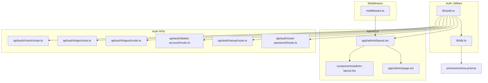
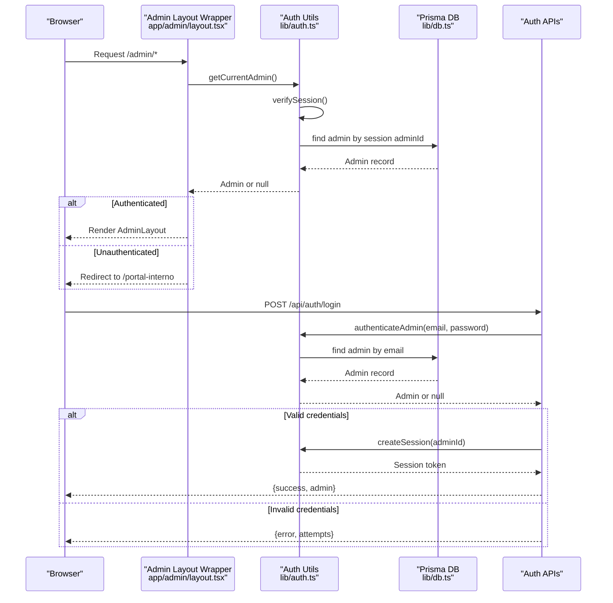
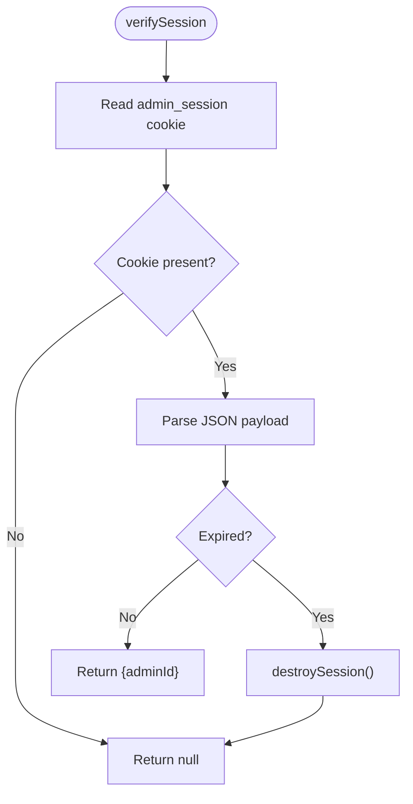
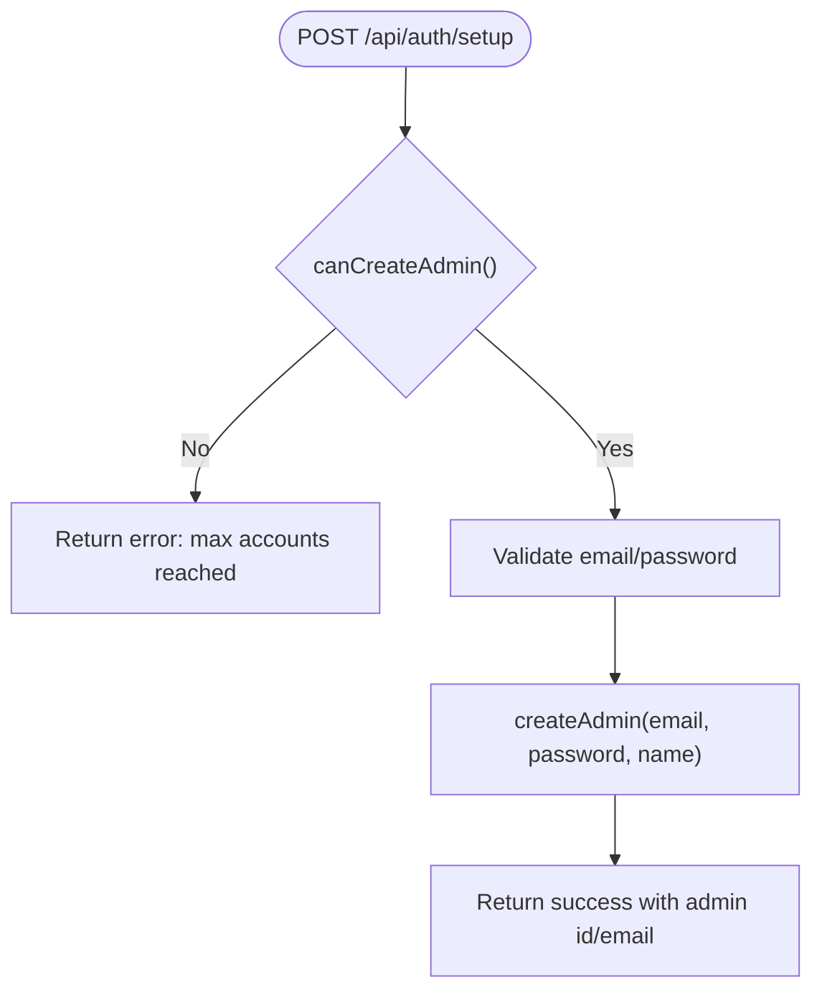
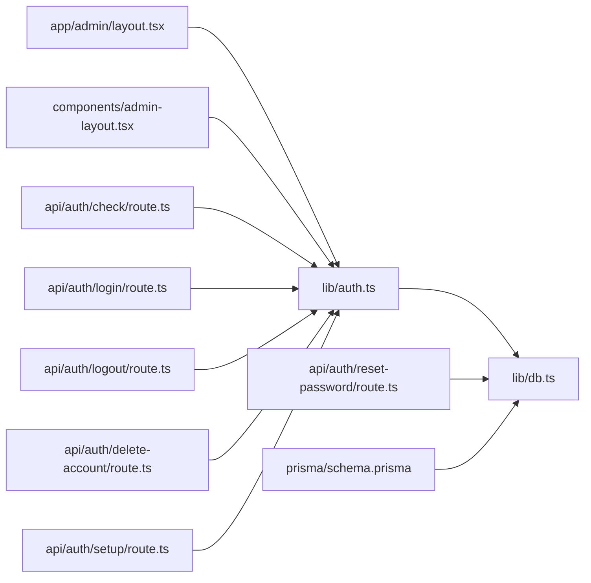

# Authorization & Permissions

<cite>
**Referenced Files in This Document**
- [middleware.ts](file://src/middleware.ts)
- [auth.ts](file://src/lib/auth.ts)
- [admin-layout.tsx](file://src/components/admin-layout.tsx)
- [admin layout wrapper](file://src/app/admin/layout.tsx)
- [admin home](file://src/app/admin/page.tsx)
- [auth check](file://src/app/api/auth/check/route.ts)
- [auth login](file://src/app/api/auth/login/route.ts)
- [auth logout](file://src/app/api/auth/logout/route.ts)
- [auth delete-account](file://src/app/api/auth/delete-account/route.ts)
- [auth setup](file://src/app/api/auth/setup/route.ts)
- [auth reset-password](file://src/app/api/auth/reset-password/route.ts)
- [db client](file://src/lib/db.ts)
- [prisma schema](file://prisma/schema.prisma)
</cite>

## Table of Contents
1. [Introduction](#introduction)
2. [Project Structure](#project-structure)
3. [Core Components](#core-components)
4. [Architecture Overview](#architecture-overview)
5. [Detailed Component Analysis](#detailed-component-analysis)
6. [Dependency Analysis](#dependency-analysis)
7. [Performance Considerations](#performance-considerations)
8. [Troubleshooting Guide](#troubleshooting-guide)
9. [Conclusion](#conclusion)

## Introduction
This document explains the authorization and permissions model for GreenAxis. It covers role-based access control (RBAC), middleware-based route protection, session-based authentication, and admin panel access controls. It also documents protected route enforcement, user role management, and permission validation flows. The system currently defines administrative roles and enforces session-based access to the admin area, with explicit checks at both the server-side layout wrapper and API endpoints.

## Project Structure
Authorization and permissions are implemented across:
- Middleware for security headers and optional route protection
- Authentication utilities for session creation, verification, and destruction
- Admin layout wrapper enforcing session-based access to admin pages
- API routes for login, logout, account deletion, setup, and password reset
- Prisma schema defining the Admin entity and related models

**Diagram sources**
- [middleware.ts:1-58](file://src/middleware.ts#L1-L58)
- [auth.ts:1-170](file://src/lib/auth.ts#L1-L170)
- [admin layout wrapper:1-18](file://src/app/admin/layout.tsx#L1-L18)
- [admin-layout.tsx:1-384](file://src/components/admin-layout.tsx#L1-L384)
- [admin home:1-120](file://src/app/admin/page.tsx#L1-L120)
- [auth check:1-21](file://src/app/api/auth/check/route.ts#L1-L21)
- [auth login:1-91](file://src/app/api/auth/login/route.ts#L1-L91)
- [auth logout:1-13](file://src/app/api/auth/logout/route.ts#L1-L13)
- [auth delete-account:1-43](file://src/app/api/auth/delete-account/route.ts#L1-L43)
- [auth setup:1-63](file://src/app/api/auth/setup/route.ts#L1-L63)
- [auth reset-password:1-262](file://src/app/api/auth/reset-password/route.ts#L1-L262)
- [db client:1-21](file://src/lib/db.ts#L1-L21)
- [prisma schema:200-211](file://prisma/schema.prisma#L200-L211)

**Section sources**
- [middleware.ts:1-58](file://src/middleware.ts#L1-L58)
- [auth.ts:1-170](file://src/lib/auth.ts#L1-L170)
- [admin layout wrapper:1-18](file://src/app/admin/layout.tsx#L1-L18)
- [admin-layout.tsx:1-384](file://src/components/admin-layout.tsx#L1-L384)
- [admin home:1-120](file://src/app/admin/page.tsx#L1-L120)
- [auth check:1-21](file://src/app/api/auth/check/route.ts#L1-L21)
- [auth login:1-91](file://src/app/api/auth/login/route.ts#L1-L91)
- [auth logout:1-13](file://src/app/api/auth/logout/route.ts#L1-L13)
- [auth delete-account:1-43](file://src/app/api/auth/delete-account/route.ts#L1-L43)
- [auth setup:1-63](file://src/app/api/auth/setup/route.ts#L1-L63)
- [auth reset-password:1-262](file://src/app/api/auth/reset-password/route.ts#L1-L262)
- [db client:1-21](file://src/lib/db.ts#L1-L21)
- [prisma schema:200-211](file://prisma/schema.prisma#L200-L211)

## Core Components
- Session-based admin authentication and session cookie management
- Admin-only layout wrapper that redirects unauthenticated users
- API endpoints for login, logout, account deletion, setup, and password reset
- Middleware that applies security headers to non-static routes
- Prisma Admin model with role and status fields

Key implementation references:
- Session creation, verification, and destruction: [auth.ts:25-77](file://src/lib/auth.ts#L25-L77)
- Admin layout wrapper enforcing access: [admin layout wrapper:5-17](file://src/app/admin/layout.tsx#L5-L17)
- Admin layout UI and logout flow: [admin-layout.tsx:98-105](file://src/components/admin-layout.tsx#L98-L105)
- Login endpoint with rate limiting and validation: [auth login:9-91](file://src/app/api/auth/login/route.ts#L9-L91)
- Logout endpoint: [auth logout:4-12](file://src/app/api/auth/logout/route.ts#L4-L12)
- Account deletion with safety checks: [auth delete-account:6-32](file://src/app/api/auth/delete-account/route.ts#L6-L32)
- Setup endpoint for admin creation and limits: [auth setup:23-62](file://src/app/api/auth/setup/route.ts#L23-L62)
- Password reset flow: [auth reset-password:105-261](file://src/app/api/auth/reset-password/route.ts#L105-L261)
- Security headers middleware: [middleware.ts:8-44](file://src/middleware.ts#L8-L44)
- Admin model definition: [prisma schema:200-211](file://prisma/schema.prisma#L200-L211)

**Section sources**
- [auth.ts:25-77](file://src/lib/auth.ts#L25-L77)
- [admin layout wrapper:5-17](file://src/app/admin/layout.tsx#L5-L17)
- [admin-layout.tsx:98-105](file://src/components/admin-layout.tsx#L98-L105)
- [auth login:9-91](file://src/app/api/auth/login/route.ts#L9-L91)
- [auth logout:4-12](file://src/app/api/auth/logout/route.ts#L4-L12)
- [auth delete-account:6-32](file://src/app/api/auth/delete-account/route.ts#L6-L32)
- [auth setup:23-62](file://src/app/api/auth/setup/route.ts#L23-L62)
- [auth reset-password:105-261](file://src/app/api/auth/reset-password/route.ts#L105-L261)
- [middleware.ts:8-44](file://src/middleware.ts#L8-L44)
- [prisma schema:200-211](file://prisma/schema.prisma#L200-L211)

## Architecture Overview
The authorization model centers on a signed session cookie stored in the browser. Access to the admin area is enforced by a server-side layout wrapper that verifies the session and redirects unauthorized users. API endpoints enforce session-based access where applicable and implement additional safeguards such as rate limiting and validation.

**Diagram sources**
- [admin layout wrapper:5-17](file://src/app/admin/layout.tsx#L5-L17)
- [auth.ts:50-71](file://src/lib/auth.ts#L50-L71)
- [auth.ts:137-153](file://src/lib/auth.ts#L137-L153)
- [auth.ts:26-47](file://src/lib/auth.ts#L26-L47)
- [db client:1-21](file://src/lib/db.ts#L1-L21)
- [auth login:52-85](file://src/app/api/auth/login/route.ts#L52-L85)

## Detailed Component Analysis

### Role-Based Access Control (RBAC)
- The Admin model includes a role field with a default value suitable for basic admin access.
- Current implementation does not define separate roles (e.g., developer, superadmin, admin) nor enforce role-based permissions at runtime.
- Permission checks are performed implicitly via session verification and admin existence.

Recommendations for future RBAC:
- Define explicit roles and permissions matrices
- Add centralized permission checks in middleware or shared utilities
- Enforce route-level permissions using role gates

**Section sources**
- [prisma schema:206-206](file://prisma/schema.prisma#L206-L206)
- [auth.ts:137-153](file://src/lib/auth.ts#L137-L153)

### Middleware-Based Route Protection
- The middleware applies strict security headers to all non-static routes.
- It does not enforce route-level authorization; protection is handled by the admin layout wrapper and API endpoints.

Security headers applied:
- X-Frame-Options, X-Content-Type-Options, X-XSS-Protection
- Referrer-Policy, Permissions-Policy, Strict-Transport-Security
- Content-Security-Policy with corporate-friendly defaults

**Section sources**
- [middleware.ts:8-44](file://src/middleware.ts#L8-L44)
- [middleware.ts:47-57](file://src/middleware.ts#L47-L57)

### Session-Based Authentication and Validation
- Session cookie name, duration, and attributes are configured centrally.
- Session verification parses the cookie, validates expiration, and returns the associated admin ID.
- Logout destroys the session cookie.

**Diagram sources**
- [auth.ts:49-71](file://src/lib/auth.ts#L49-L71)
- [auth.ts:74-77](file://src/lib/auth.ts#L74-L77)

**Section sources**
- [auth.ts:26-47](file://src/lib/auth.ts#L26-L47)
- [auth.ts:49-71](file://src/lib/auth.ts#L49-L71)
- [auth.ts:74-77](file://src/lib/auth.ts#L74-L77)

### Admin Panel Access Controls
- The admin layout wrapper fetches the current admin and redirects to the internal portal if not authenticated.
- The admin layout UI exposes logout and account deletion flows.

Protected areas:
- Admin dashboard routes under /admin/*
- Admin-only API endpoints (login, logout, delete-account, setup, reset-password)

**Section sources**
- [admin layout wrapper:5-17](file://src/app/admin/layout.tsx#L5-L17)
- [admin-layout.tsx:98-105](file://src/components/admin-layout.tsx#L98-L105)

### Protected Route Enforcement
- Server-side enforcement via the admin layout wrapper ensures only authenticated admins can access admin pages.
- API endpoints enforce session-based access where applicable:
  - Check authentication status
  - Validate credentials and apply rate limiting
  - Manage session lifecycle (create/destroy)
  - Enforce safety constraints for destructive actions

Examples of protected endpoints:
- GET /api/auth/check: Returns authenticated status and admin info
- POST /api/auth/login: Validates credentials, rate-limits attempts, creates session
- POST /api/auth/logout: Destroys session
- POST /api/auth/delete-account: Requires authenticated admin, prevents deleting the last admin
- GET/POST /api/auth/setup: Checks admin existence and capacity, creates initial admin
- GET/PUT /api/auth/reset-password: Token-based password reset flow

**Section sources**
- [auth check:4-20](file://src/app/api/auth/check/route.ts#L4-L20)
- [auth login:9-91](file://src/app/api/auth/login/route.ts#L9-L91)
- [auth logout:4-12](file://src/app/api/auth/logout/route.ts#L4-L12)
- [auth delete-account:6-32](file://src/app/api/auth/delete-account/route.ts#L6-L32)
- [auth setup:4-21](file://src/app/api/auth/setup/route.ts#L4-L21)
- [auth setup:23-62](file://src/app/api/auth/setup/route.ts#L23-L62)
- [auth reset-password:105-261](file://src/app/api/auth/reset-password/route.ts#L105-L261)

### User Role Management
- Admin creation supports setting email, password, and optional name.
- Admin deletion enforces a minimum count to prevent orphaning the administration.
- Setup endpoint enforces a configurable maximum number of admin accounts.

**Diagram sources**
- [auth setup:23-62](file://src/app/api/auth/setup/route.ts#L23-L62)
- [auth.ts:122-134](file://src/lib/auth.ts#L122-L134)
- [auth.ts:96-100](file://src/lib/auth.ts#L96-L100)

**Section sources**
- [auth setup:23-62](file://src/app/api/auth/setup/route.ts#L23-L62)
- [auth.ts:96-100](file://src/lib/auth.ts#L96-L100)
- [auth.ts:122-134](file://src/lib/auth.ts#L122-L134)
- [auth.ts:103-119](file://src/lib/auth.ts#L103-L119)

### Authorization Middleware Configuration
- The middleware applies security headers to all non-static routes using a matcher pattern.
- No route-level authorization logic is implemented in middleware; authorization is delegated to the admin layout wrapper and API endpoints.

**Section sources**
- [middleware.ts:47-57](file://src/middleware.ts#L47-L57)

### Route-Level Security Restrictions
- Admin routes are protected by the server-side admin layout wrapper.
- API endpoints enforce session-based access and additional validations:
  - Login: rate limiting, credential validation, timing delay
  - Logout: session destruction
  - Delete-account: requires authenticated admin and enforces minimum admin count
  - Setup: enforces max admin accounts and validates inputs
  - Reset-password: token-based flow with expiration and hashing

**Section sources**
- [admin layout wrapper:5-17](file://src/app/admin/layout.tsx#L5-L17)
- [auth login:9-91](file://src/app/api/auth/login/route.ts#L9-L91)
- [auth logout:4-12](file://src/app/api/auth/logout/route.ts#L4-L12)
- [auth delete-account:6-32](file://src/app/api/auth/delete-account/route.ts#L6-L32)
- [auth setup:23-62](file://src/app/api/auth/setup/route.ts#L23-L62)
- [auth reset-password:105-261](file://src/app/api/auth/reset-password/route.ts#L105-L261)

### Session-Based Permission Validation
- The admin layout wrapper calls a server action to retrieve the current admin, which internally verifies the session and queries the database.
- The admin layout UI performs client-side actions for logout and account deletion, but these are gated by server-side session checks.

**Section sources**
- [admin layout wrapper:10-10](file://src/app/admin/layout.tsx#L10-L10)
- [admin-layout.tsx:98-105](file://src/components/admin-layout.tsx#L98-L105)
- [auth.ts:156-169](file://src/lib/auth.ts#L156-L169)

### Examples of Protected Endpoints and Admin-Only Features
- Protected endpoints:
  - GET /api/auth/check: authenticated status and admin info
  - POST /api/auth/login: credential validation and session creation
  - POST /api/auth/logout: session destruction
  - POST /api/auth/delete-account: authenticated admin account deletion
  - GET/POST /api/auth/setup: admin creation and capacity checks
  - GET/PUT /api/auth/reset-password: token-based password reset
- Admin-only features:
  - Admin dashboard (/admin/*)
  - Admin layout navigation and actions
  - Account deletion button appears only when multiple admins exist

**Section sources**
- [auth check:4-20](file://src/app/api/auth/check/route.ts#L4-L20)
- [auth login:52-85](file://src/app/api/auth/login/route.ts#L52-L85)
- [auth logout:4-12](file://src/app/api/auth/logout/route.ts#L4-L12)
- [auth delete-account:6-32](file://src/app/api/auth/delete-account/route.ts#L6-L32)
- [auth setup:4-21](file://src/app/api/auth/setup/route.ts#L4-L21)
- [auth setup:23-62](file://src/app/api/auth/setup/route.ts#L23-L62)
- [auth reset-password:188-213](file://src/app/api/auth/reset-password/route.ts#L188-L213)
- [auth reset-password:216-261](file://src/app/api/auth/reset-password/route.ts#L216-L261)
- [admin layout wrapper:5-17](file://src/app/admin/layout.tsx#L5-L17)
- [admin-layout.tsx:204-214](file://src/components/admin-layout.tsx#L204-L214)

### Permission Inheritance and Role Hierarchy
- The current implementation does not define role hierarchy or permission inheritance.
- Future enhancements should introduce:
  - Explicit roles with permission sets
  - Hierarchical role relationships
  - Centralized permission checks
  - Route-level guards based on roles

[No sources needed since this section provides conceptual guidance]

### Security Boundary Enforcement
- Security boundaries are enforced at:
  - Admin layout wrapper (server-side)
  - API endpoints (session validation and safety checks)
  - Middleware (security headers)
- Additional improvements:
  - Add CSRF protection for state-changing endpoints
  - Implement granular permission checks for admin features
  - Add audit logs for sensitive actions

**Section sources**
- [admin layout wrapper:5-17](file://src/app/admin/layout.tsx#L5-L17)
- [auth login:9-91](file://src/app/api/auth/login/route.ts#L9-L91)
- [auth delete-account:6-32](file://src/app/api/auth/delete-account/route.ts#L6-L32)
- [middleware.ts:8-44](file://src/middleware.ts#L8-L44)

## Dependency Analysis

**Diagram sources**
- [auth.ts:1-170](file://src/lib/auth.ts#L1-L170)
- [db client:1-21](file://src/lib/db.ts#L1-L21)
- [admin layout wrapper:1-1](file://src/app/admin/layout.tsx#L1-L1)
- [admin-layout.tsx:1-1](file://src/components/admin-layout.tsx#L1-L1)
- [auth check:1-1](file://src/app/api/auth/check/route.ts#L1-L1)
- [auth login:1-2](file://src/app/api/auth/login/route.ts#L1-L2)
- [auth logout:1-1](file://src/app/api/auth/logout/route.ts#L1-L1)
- [auth delete-account:1-2](file://src/app/api/auth/delete-account/route.ts#L1-L2)
- [auth setup:1-2](file://src/app/api/auth/setup/route.ts#L1-L2)
- [auth reset-password:1-4](file://src/app/api/auth/reset-password/route.ts#L1-L4)
- [prisma schema:200-211](file://prisma/schema.prisma#L200-L211)

**Section sources**
- [auth.ts:1-170](file://src/lib/auth.ts#L1-L170)
- [db client:1-21](file://src/lib/db.ts#L1-L21)
- [prisma schema:200-211](file://prisma/schema.prisma#L200-L211)

## Performance Considerations
- Session verification reads and parses a single cookie; overhead is minimal.
- Rate limiting for login uses an in-memory Map; consider persistence for multi-instance deployments.
- API endpoints perform database queries for admin lookup and token management; ensure proper indexing on email and token fields.
- Middleware applies headers to all non-static routes; keep matcher narrow to avoid unnecessary processing.

[No sources needed since this section provides general guidance]

## Troubleshooting Guide
Common issues and resolutions:
- Unauthorized access to admin routes:
  - Verify the admin layout wrapper is rendering and that sessions are being created on login.
  - Confirm the session cookie is present and not expired.
- Login failures:
  - Check rate limiting thresholds and IP-based locking.
  - Ensure email format validation passes and credentials match stored hashes.
- Logout not working:
  - Confirm the logout endpoint is called and the session cookie is deleted.
- Account deletion blocked:
  - Ensure more than one admin exists; the system prevents deleting the last admin.
- Setup endpoint errors:
  - Verify the maximum admin account limit and input validation.

**Section sources**
- [admin layout wrapper:5-17](file://src/app/admin/layout.tsx#L5-L17)
- [auth login:16-33](file://src/app/api/auth/login/route.ts#L16-L33)
- [auth logout:4-12](file://src/app/api/auth/logout/route.ts#L4-L12)
- [auth delete-account:14-20](file://src/app/api/auth/delete-account/route.ts#L14-L20)
- [auth setup:25-33](file://src/app/api/auth/setup/route.ts#L25-L33)

## Conclusion
GreenAxis implements a straightforward, session-based admin authorization model with strong server-side enforcement at the admin layout wrapper and robust API endpoints for authentication and account management. While the current RBAC is implicit through admin session checks, the foundation is in place to evolve into a formal role-based system with centralized permission checks and route-level guards. The middleware provides essential security headers, and the database schema supports future enhancements for role and permission modeling.