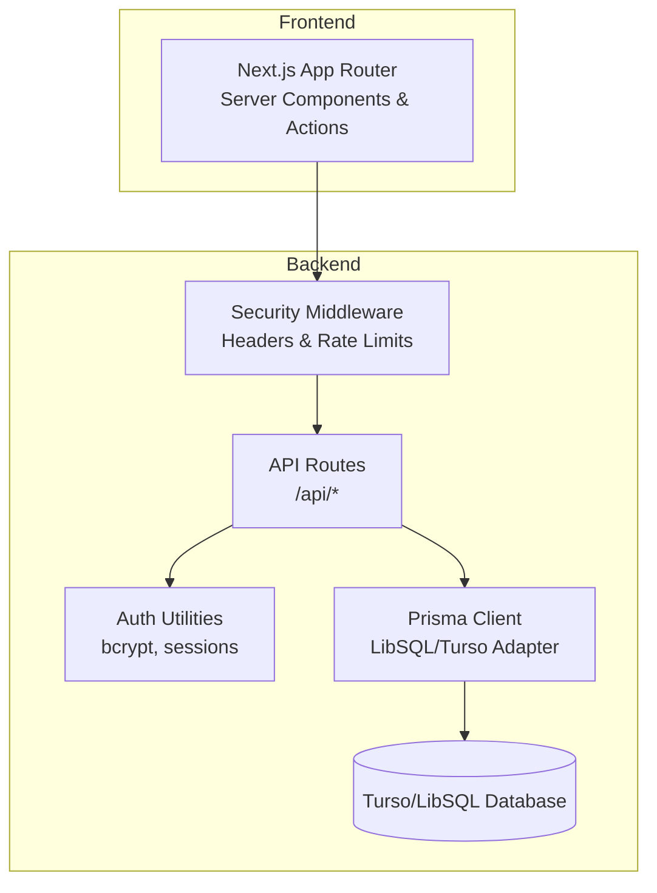
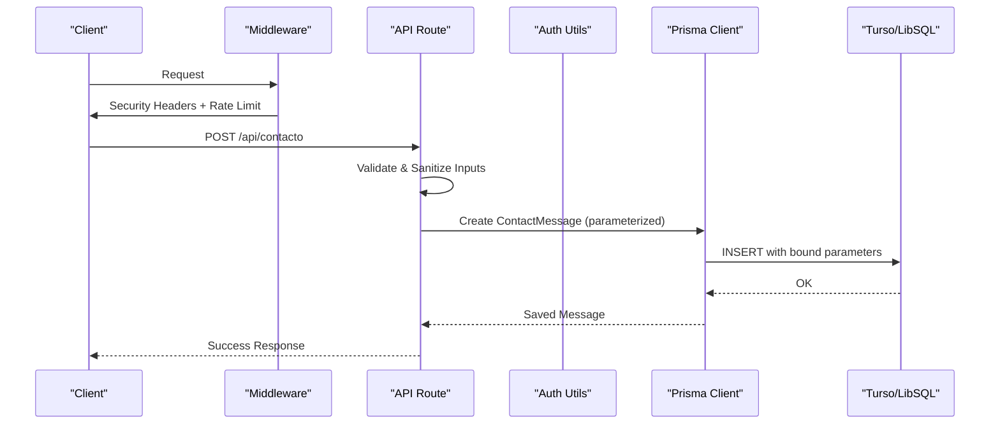
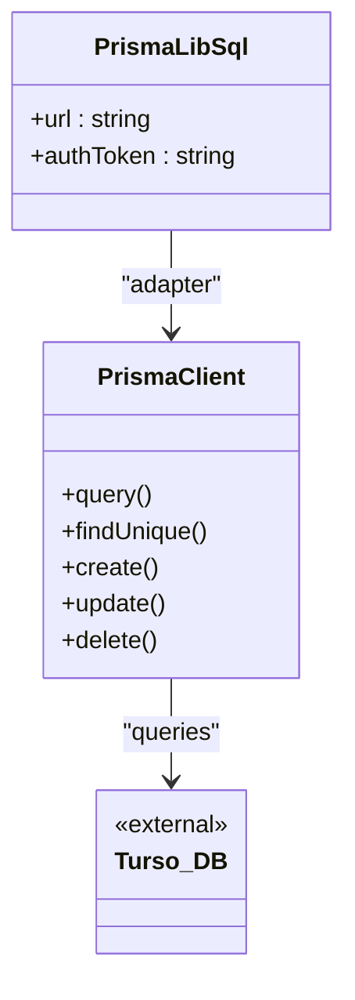
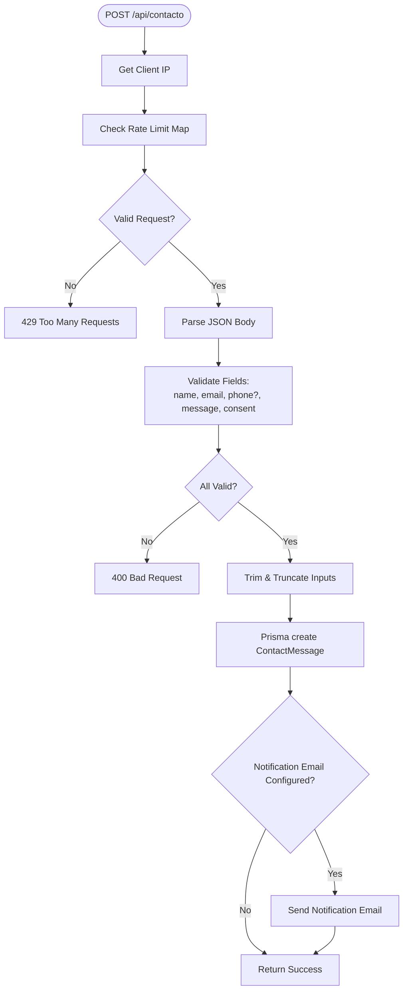
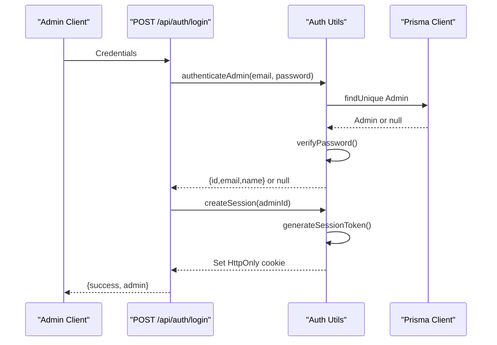
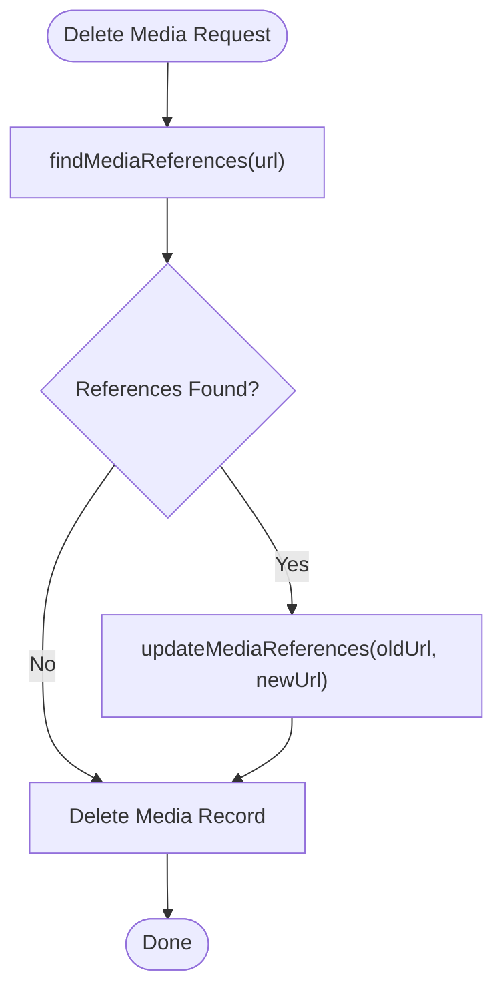
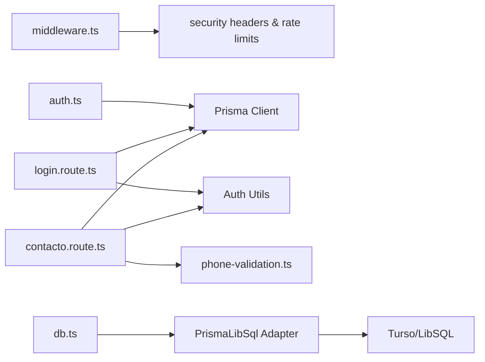

# Data Protection & Validation

<cite>
**Referenced Files in This Document**
- [schema.prisma](file://prisma/schema.prisma)
- [db.ts](file://src/lib/db.ts)
- [auth.ts](file://src/lib/auth.ts)
- [middleware.ts](file://src/middleware.ts)
- [actions.ts](file://src/lib/actions.ts)
- [login.route.ts](file://src/app/api/auth/login/route.ts)
- [delete-account.route.ts](file://src/app/api/auth/delete-account/route.ts)
- [contacto.route.ts](file://src/app/api/contacto/route.ts)
- [phone-validation.ts](file://src/lib/phone-validation.ts)
- [media-references.ts](file://src/lib/media-references.ts)
- [README.md](file://README.md)
- [VERIFICATION-CHECKLIST.md](file://VERIFICATION-CHECKLIST.md)
</cite>

## Table of Contents
1. [Introduction](#introduction)
2. [Project Structure](#project-structure)
3. [Core Components](#core-components)
4. [Architecture Overview](#architecture-overview)
5. [Detailed Component Analysis](#detailed-component-analysis)
6. [Dependency Analysis](#dependency-analysis)
7. [Performance Considerations](#performance-considerations)
8. [Troubleshooting Guide](#troubleshooting-guide)
9. [Conclusion](#conclusion)
10. [Appendices](#appendices)

## Introduction
This document provides comprehensive data protection and validation guidance for GreenAxis. It covers database security with Prisma ORM, input validation and sanitization practices, encryption at rest, Turso database configuration, query parameter binding, SQL injection prevention, validation rules, sanitization techniques, secure data transmission, validated forms, sanitized inputs, secure database operations, data retention and deletion, GDPR considerations, and secure error handling/logging.

## Project Structure
GreenAxis uses Next.js App Router with server-side API routes and Server Actions. Data access is performed via Prisma ORM with a LibSQL/Turso adapter. Authentication is handled with bcrypt and secure cookies. Middleware applies security headers and rate limiting. Input validation and sanitization occur in API routes and shared utilities.

**Diagram sources**
- [middleware.ts:1-58](file://src/middleware.ts#L1-L58)
- [db.ts:1-21](file://src/lib/db.ts#L1-L21)
- [auth.ts:1-170](file://src/lib/auth.ts#L1-L170)
- [login.route.ts:1-91](file://src/app/api/auth/login/route.ts#L1-L91)
- [contacto.route.ts:1-302](file://src/app/api/contacto/route.ts#L1-L302)

**Section sources**
- [README.md:1-928](file://README.md#L1-L928)
- [middleware.ts:1-58](file://src/middleware.ts#L1-L58)
- [db.ts:1-21](file://src/lib/db.ts#L1-L21)

## Core Components
- Prisma ORM with LibSQL/Turso adapter for secure, connection-pooled database access.
- Authentication utilities using bcrypt for password hashing and secure session cookies.
- Middleware applying CSP, HSTS, X-Frame-Options, and rate limiting.
- API routes validating and sanitizing inputs, enforcing rate limits, and performing secure database operations.
- Shared utilities for phone validation and media reference tracking.

**Section sources**
- [schema.prisma:1-277](file://prisma/schema.prisma#L1-L277)
- [db.ts:1-21](file://src/lib/db.ts#L1-L21)
- [auth.ts:1-170](file://src/lib/auth.ts#L1-L170)
- [middleware.ts:1-58](file://src/middleware.ts#L1-L58)
- [contacto.route.ts:1-302](file://src/app/api/contacto/route.ts#L1-L302)
- [phone-validation.ts:1-113](file://src/lib/phone-validation.ts#L1-L113)
- [media-references.ts:1-334](file://src/lib/media-references.ts#L1-L334)

## Architecture Overview
The system enforces layered protections:
- Transport and headers: HTTPS enforcement, CSP, HSTS, and browser hardening headers.
- Authentication: bcrypt-hashed passwords, secure session cookies, and admin session checks.
- Input validation: strict server-side validation and sanitization in API routes.
- Data access: Prisma queries with parameterized bindings and safe model usage.
- Data integrity: media reference tracking prevents dangling references.

**Diagram sources**
- [middleware.ts:1-58](file://src/middleware.ts#L1-L58)
- [contacto.route.ts:137-229](file://src/app/api/contacto/route.ts#L137-L229)
- [db.ts:1-21](file://src/lib/db.ts#L1-L21)
- [schema.prisma:173-185](file://prisma/schema.prisma#L173-L185)

## Detailed Component Analysis

### Database Security with Prisma ORM and Turso
- Turso/LibSQL configuration via Prisma adapter with environment-driven URL and optional auth token.
- Connection pooling and query logging enabled for diagnostics.
- All database writes use Prisma client methods that automatically parameterize queries, preventing SQL injection.
- Strong typing in schema ensures valid data shapes and constraints.

**Diagram sources**
- [db.ts:5-19](file://src/lib/db.ts#L5-L19)
- [schema.prisma:1-13](file://prisma/schema.prisma#L1-L13)

**Section sources**
- [db.ts:1-21](file://src/lib/db.ts#L1-L21)
- [schema.prisma:1-13](file://prisma/schema.prisma#L1-L13)

### Input Validation and Sanitization
- Contact form validation includes:
  - Required fields with length checks.
  - Email format validation.
  - Optional phone validation with country-specific digit counts.
  - Consent requirement enforced.
  - Basic sanitization trimming and length limits.
- Login route validates presence of credentials, email format, enforces rate limiting, and delays responses to mitigate timing attacks.
- Phone validation utility supports multiple regions with strict digit range checks.

**Diagram sources**
- [contacto.route.ts:137-229](file://src/app/api/contacto/route.ts#L137-L229)
- [phone-validation.ts:48-112](file://src/lib/phone-validation.ts#L48-L112)

**Section sources**
- [contacto.route.ts:1-302](file://src/app/api/contacto/route.ts#L1-L302)
- [phone-validation.ts:1-113](file://src/lib/phone-validation.ts#L1-L113)
- [login.route.ts:1-91](file://src/app/api/auth/login/route.ts#L1-L91)

### Authentication and Session Security
- Passwords are hashed with bcrypt at 12 rounds.
- Sessions are stored in secure, HttpOnly cookies with SameSite strict and optional Secure flag in production.
- Session tokens are cryptographically random 32-byte hex strings.
- Admin session verification parses cookie payload and checks expiration.
- Account deletion prevents removal of the last admin and destroys session upon deletion.

**Diagram sources**
- [login.route.ts:9-85](file://src/app/api/auth/login/route.ts#L9-L85)
- [auth.ts:137-170](file://src/lib/auth.ts#L137-L170)
- [db.ts:1-21](file://src/lib/db.ts#L1-L21)

**Section sources**
- [auth.ts:1-170](file://src/lib/auth.ts#L1-L170)
- [login.route.ts:1-91](file://src/app/api/auth/login/route.ts#L1-L91)
- [delete-account.route.ts:1-43](file://src/app/api/auth/delete-account/route.ts#L1-L43)

### Data Encryption at Rest
- Turso databases are encrypted at rest by default.
- Application-level encryption for sensitive data is not implemented; secrets are managed via environment variables and cookies.

**Section sources**
- [README.md:56-66](file://README.md#L56-L66)
- [db.ts:5-8](file://src/lib/db.ts#L5-L8)

### SQL Injection Prevention and Query Binding
- Prisma ORM generates parameterized queries automatically for all write/read operations.
- No raw SQL strings are used in the analyzed code paths.
- Parameterized bindings are enforced by Prisma’s client generation and adapter.

**Section sources**
- [actions.ts:1-136](file://src/lib/actions.ts#L1-L136)
- [contacto.route.ts:200-206](file://src/app/api/contacto/route.ts#L200-L206)
- [login.route.ts:52-54](file://src/app/api/auth/login/route.ts#L52-L54)

### Secure Data Transmission
- Strict-Transport-Security header enforces HTTPS.
- Content-Security-Policy restricts resource loading.
- Cookies configured with HttpOnly, Secure (production), and SameSite strict.

**Section sources**
- [middleware.ts:24-43](file://src/middleware.ts#L24-L43)
- [auth.ts:34-46](file://src/lib/auth.ts#L34-L46)

### Data Validation Rules and Sanitization Techniques
- Contact form:
  - Name: required, minimum length, trimmed, max length.
  - Email: required and format-checked.
  - Phone: optional; validated with country-specific digit ranges.
  - Subject: optional, trimmed, max length.
  - Company: optional, trimmed, max length.
  - Message: required, minimum length, trimmed, max length.
  - Consent: required boolean.
- Sanitization: trim and substring to enforce maximum lengths.
- Phone validation: supports international prefixes and digit count validation.

**Section sources**
- [contacto.route.ts:166-198](file://src/app/api/contacto/route.ts#L166-L198)
- [phone-validation.ts:48-112](file://src/lib/phone-validation.ts#L48-L112)

### Secure Database Operations
- Safe creation of records using Prisma create with validated and sanitized data.
- Parameterized reads/writes prevent injection.
- Batch operations are used where appropriate (e.g., pagination with skip/take).

**Section sources**
- [contacto.route.ts:200-206](file://src/app/api/contacto/route.ts#L200-L206)
- [actions.ts:47-64](file://src/lib/actions.ts#L47-L64)

### Data Retention Policies and GDPR Compliance Considerations
- Data retention policy is not explicitly defined in the codebase. Administrators can manage content via the CMS, but no automated retention/deletion schedules are present.
- GDPR considerations observed:
  - Consent checkbox required for contact submissions.
  - Secure storage of credentials using bcrypt.
  - Secure cookies for session management.
  - No plaintext storage of sensitive data in the reviewed code paths.
- Recommendations:
  - Define explicit retention periods for logs and user data.
  - Implement data minimization and purpose limitation.
  - Add right to erasure support for user data.
  - Add data portability mechanisms.
  - Establish lawful basis and privacy notices.

**Section sources**
- [contacto.route.ts:186-188](file://src/app/api/contacto/route.ts#L186-L188)
- [auth.ts:11-18](file://src/lib/auth.ts#L11-L18)
- [README.md:526-528](file://README.md#L526-L528)

### Secure Data Deletion Procedures
- Media reference tracking utility scans multiple tables for references to a given URL and updates them when files are deleted or replaced.
- This prevents dangling references and supports safe deletion workflows.

**Diagram sources**
- [media-references.ts:65-181](file://src/lib/media-references.ts#L65-L181)
- [media-references.ts:190-333](file://src/lib/media-references.ts#L190-L333)

**Section sources**
- [media-references.ts:1-334](file://src/lib/media-references.ts#L1-L334)

### Error Handling Without Information Leakage
- API routes return generic error messages and appropriate HTTP status codes.
- Internal errors are logged to console; clients receive non-leaking messages.
- Middleware applies security headers and rate limiting to reduce exposure.

**Section sources**
- [login.route.ts:86-89](file://src/app/api/auth/login/route.ts#L86-L89)
- [contacto.route.ts:225-228](file://src/app/api/contacto/route.ts#L225-L228)
- [middleware.ts:1-58](file://src/middleware.ts#L1-L58)

### Secure Logging Practices
- Console logging is used for internal error tracking.
- Recommendation: Use structured logging with redaction of sensitive fields and centralized log aggregation with access controls.

**Section sources**
- [login.route.ts:87-88](file://src/app/api/auth/login/route.ts#L87-L88)
- [contacto.route.ts:226-227](file://src/app/api/contacto/route.ts#L226-L227)

## Dependency Analysis

**Diagram sources**
- [middleware.ts:1-58](file://src/middleware.ts#L1-L58)
- [contacto.route.ts:1-302](file://src/app/api/contacto/route.ts#L1-L302)
- [login.route.ts:1-91](file://src/app/api/auth/login/route.ts#L1-L91)
- [auth.ts:1-170](file://src/lib/auth.ts#L1-L170)
- [db.ts:1-21](file://src/lib/db.ts#L1-L21)

**Section sources**
- [middleware.ts:1-58](file://src/middleware.ts#L1-L58)
- [contacto.route.ts:1-302](file://src/app/api/contacto/route.ts#L1-L302)
- [login.route.ts:1-91](file://src/app/api/auth/login/route.ts#L1-L91)
- [auth.ts:1-170](file://src/lib/auth.ts#L1-L170)
- [db.ts:1-21](file://src/lib/db.ts#L1-L21)

## Performance Considerations
- Prisma connection pooling and Turso edge replicas improve latency.
- Rate limiting reduces load and protects endpoints.
- Avoid excessive logging in hot paths; consider sampling or structured logging.

[No sources needed since this section provides general guidance]

## Troubleshooting Guide
- Authentication failures:
  - Verify bcrypt rounds and cookie flags.
  - Confirm session expiration and SameSite configuration.
- Rate limiting:
  - Memory-based maps reset on server restart; consider persistent storage for production.
- Contact form errors:
  - Validate input lengths and consent flag.
  - Check email format and phone validation rules.
- Database connectivity:
  - Ensure Turso URL and auth token are set.
  - Confirm Prisma client initialization and adapter configuration.

**Section sources**
- [auth.ts:26-77](file://src/lib/auth.ts#L26-L77)
- [login.route.ts:4-7](file://src/app/api/auth/login/route.ts#L4-L7)
- [contacto.route.ts:132-136](file://src/app/api/contacto/route.ts#L132-L136)
- [db.ts:5-8](file://src/lib/db.ts#L5-L8)

## Conclusion
GreenAxis implements strong transport and application-layer protections, secure authentication with bcrypt and secure cookies, robust input validation and sanitization, and safe database operations through Prisma. Turso provides encrypted-at-rest storage. Additional improvements include formal data retention policies, GDPR-compliant deletion mechanisms, and structured logging.

[No sources needed since this section summarizes without analyzing specific files]

## Appendices

### Appendix A: Validation Rules Summary
- Contact form:
  - Name: required, min length, max length.
  - Email: required, valid format.
  - Phone: optional, validated by country rules.
  - Subject: optional, max length.
  - Company: optional, max length.
  - Message: required, min length, max length.
  - Consent: required.

**Section sources**
- [contacto.route.ts:166-198](file://src/app/api/contacto/route.ts#L166-L198)
- [phone-validation.ts:48-112](file://src/lib/phone-validation.ts#L48-L112)

### Appendix B: Secure Operation Examples (paths)
- Create contact message: [contacto.route.ts:200-206](file://src/app/api/contacto/route.ts#L200-L206)
- Authenticate admin: [login.route.ts:52-74](file://src/app/api/auth/login/route.ts#L52-L74)
- Delete admin account: [delete-account.route.ts:22-32](file://src/app/api/auth/delete-account/route.ts#L22-L32)
- Media reference updates: [media-references.ts:190-333](file://src/lib/media-references.ts#L190-L333)

**Section sources**
- [contacto.route.ts:200-206](file://src/app/api/contacto/route.ts#L200-L206)
- [login.route.ts:52-74](file://src/app/api/auth/login/route.ts#L52-L74)
- [delete-account.route.ts:22-32](file://src/app/api/auth/delete-account/route.ts#L22-L32)
- [media-references.ts:190-333](file://src/lib/media-references.ts#L190-L333)