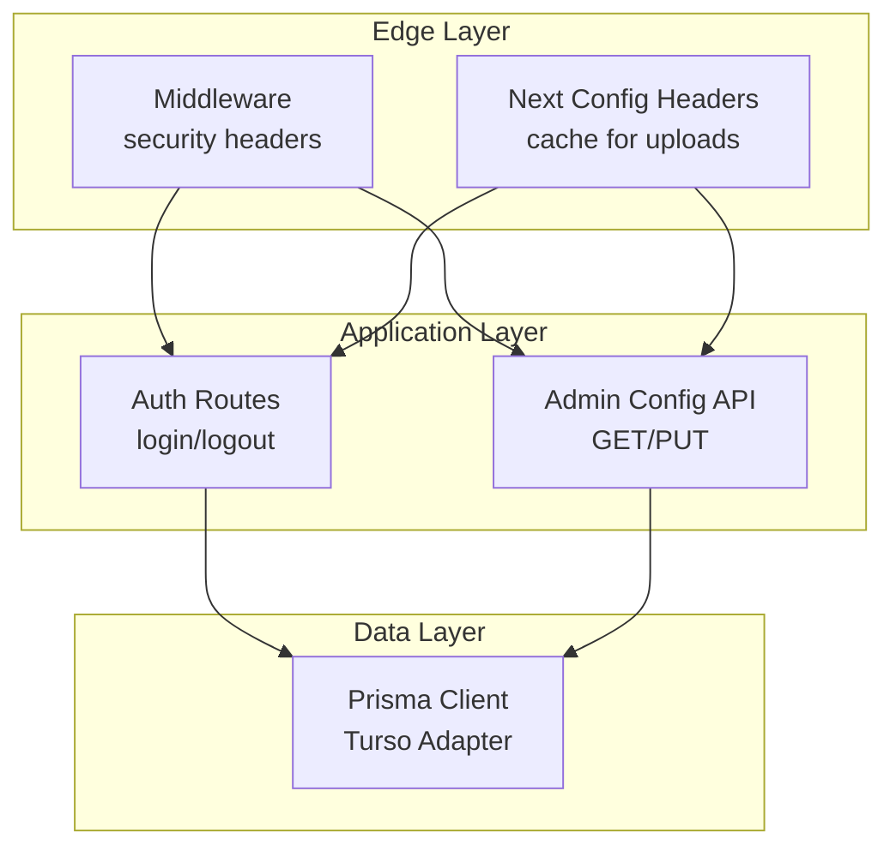
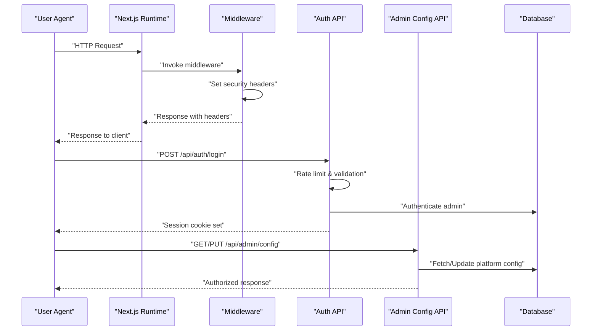
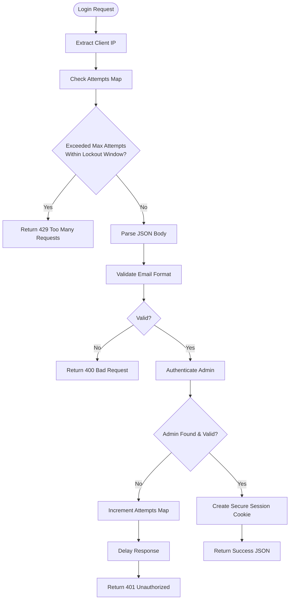
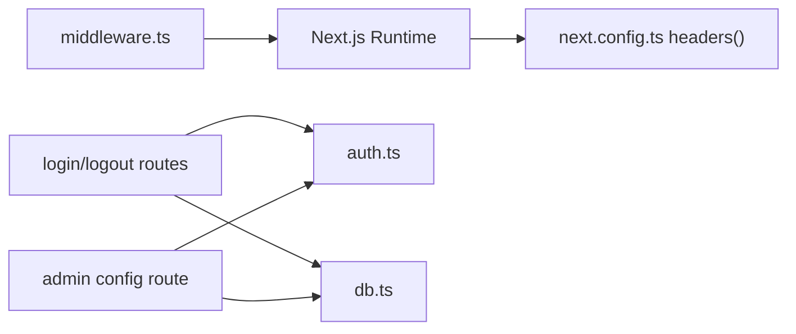

# Security Middleware

<cite>
**Referenced Files in This Document**
- [middleware.ts](file://src/middleware.ts)
- [next.config.ts](file://next.config.ts)
- [auth.ts](file://src/lib/auth.ts)
- [login.route.ts](file://src/app/api/auth/login/route.ts)
- [logout.route.ts](file://src/app/api/auth/logout/route.ts)
- [config.route.ts](file://src/app/api/admin/config/route.ts)
- [db.ts](file://src/lib/db.ts)
- [package.json](file://package.json)
</cite>

## Table of Contents
1. [Introduction](#introduction)
2. [Project Structure](#project-structure)
3. [Core Components](#core-components)
4. [Architecture Overview](#architecture-overview)
5. [Detailed Component Analysis](#detailed-component-analysis)
6. [Dependency Analysis](#dependency-analysis)
7. [Performance Considerations](#performance-considerations)
8. [Troubleshooting Guide](#troubleshooting-guide)
9. [Conclusion](#conclusion)
10. [Appendices](#appendices)

## Introduction
This document provides comprehensive security middleware documentation for GreenAxis. It details the implementation of security headers, Content-Security-Policy (CSP) configuration, middleware matching behavior, and alignment with OWASP Top 10 2021 standards. It also includes practical guidance on browser compatibility, header precedence, validation techniques, and CSP optimization strategies to achieve a production-ready security posture.

## Project Structure
GreenAxis applies security headers centrally via Next.js middleware and augments them with authentication controls and database-backed platform configuration. The middleware sets robust HTTP security headers and restricts them to dynamic routes, excluding static assets. Authentication endpoints implement rate limiting and secure session handling. Platform configuration endpoints enforce authorization checks.

**Diagram sources**
- [middleware.ts:1-58](file://src/middleware.ts#L1-L58)
- [next.config.ts:29-42](file://next.config.ts#L29-L42)
- [login.route.ts:1-91](file://src/app/api/auth/login/route.ts#L1-L91)
- [logout.route.ts:1-13](file://src/app/api/auth/logout/route.ts#L1-L13)
- [config.route.ts:1-120](file://src/app/api/admin/config/route.ts#L1-L120)
- [db.ts:1-21](file://src/lib/db.ts#L1-L21)

**Section sources**
- [middleware.ts:1-58](file://src/middleware.ts#L1-L58)
- [next.config.ts:1-46](file://next.config.ts#L1-L46)

## Core Components
- Security Headers Middleware: Applies X-Frame-Options, X-Content-Type-Options, X-XSS-Protection, Referrer-Policy, Permissions-Policy, Strict-Transport-Security, and Content-Security-Policy to all non-static routes.
- Middleware Matcher: Excludes static assets (_next/static, _next/image, favicon.ico) to minimize header overhead.
- Authentication Controls: Rate limiting on login, secure session cookies, and authorization enforcement on protected endpoints.
- Platform Configuration: Admin-only endpoints with session-based authorization and cache revalidation after updates.

**Section sources**
- [middleware.ts:4-58](file://src/middleware.ts#L4-L58)
- [login.route.ts:4-91](file://src/app/api/auth/login/route.ts#L4-L91)
- [auth.ts:25-77](file://src/lib/auth.ts#L25-L77)
- [config.route.ts:12-119](file://src/app/api/admin/config/route.ts#L12-L119)

## Architecture Overview
The security architecture centers on middleware-driven header injection and endpoint-level controls. Static asset delivery bypasses middleware for performance, while dynamic routes receive comprehensive protection. Authentication endpoints apply rate limiting and secure session management. Platform configuration endpoints enforce authorization and maintain cache coherency.

**Diagram sources**
- [middleware.ts:4-44](file://src/middleware.ts#L4-L44)
- [login.route.ts:9-91](file://src/app/api/auth/login/route.ts#L9-L91)
- [config.route.ts:12-119](file://src/app/api/admin/config/route.ts#L12-L119)
- [db.ts:14-21](file://src/lib/db.ts#L14-L21)

## Detailed Component Analysis

### Security Headers Implementation
The middleware sets the following headers:
- X-Frame-Options: DENY prevents clickjacking by disallowing framing.
- X-Content-Type-Options: nosniff disables MIME type sniffing.
- X-XSS-Protection: 1; mode=block activates legacy XSS filters.
- Referrer-Policy: strict-origin-when-cross-origin minimizes leakage.
- Permissions-Policy: camera=(), microphone=(), geolocation=() disables sensors by default.
- Strict-Transport-Security: max-age=31536000; includeSubDomains; preload enforces HTTPS.
- Content-Security-Policy: Restricts resources and ancestors; includes frame-ancestors 'none'.

These headers are applied to all non-static routes via the matcher configuration.

**Section sources**
- [middleware.ts:8-41](file://src/middleware.ts#L8-L41)
- [middleware.ts:46-58](file://src/middleware.ts#L46-L58)

### Content-Security-Policy Configuration
The CSP policy is constructed as a semicolon-separated directive string. Key directives include:
- default-src 'self': Default to same-origin resources.
- script-src 'self' 'unsafe-inline' 'unsafe-eval' https://www.googletagmanager.com https://www.google-analytics.com: Allow inline and eval plus trusted analytics domains.
- style-src 'self' 'unsafe-inline': Permit inline styles for current origin.
- img-src 'self' data: https: blob:: Allow images from self, data URLs, HTTPS origins, and blobs.
- font-src 'self' data:: Fonts from self and data URLs.
- connect-src 'self' https://www.google-analytics.com blob:: Restrict connections to self and analytics; allow blob.
- frame-src 'self' https://www.google.com https://maps.google.com: Allow embedding trusted Google domains.
- media-src 'self' https://res.cloudinary.com blob: data: https:: Media from self and Cloudinary; allow blobs, data, and HTTPS.
- frame-ancestors 'none': Prevent embedding in frames.

This configuration balances functionality for corporate sites with strong security defaults.

**Section sources**
- [middleware.ts:27-41](file://src/middleware.ts#L27-L41)

### Middleware Matcher and Static Asset Exclusion
The matcher excludes:
- _next/static
- _next/image
- favicon.ico

This ensures security headers are not sent for static assets, reducing bandwidth and avoiding unnecessary header propagation.

**Section sources**
- [middleware.ts:46-58](file://src/middleware.ts#L46-L58)

### Authentication Controls and Secure Sessions
- Rate limiting: Tracks failed attempts per IP with a memory Map and lockout window.
- Timing attack mitigation: Adds jittered delay on invalid credentials.
- Secure session cookies: httpOnly, secure (production), sameSite strict, fixed path, and expiration.
- Authorization enforcement: Protected endpoints verify current admin session before processing.

**Diagram sources**
- [login.route.ts:4-91](file://src/app/api/auth/login/route.ts#L4-L91)
- [auth.ts:25-47](file://src/lib/auth.ts#L25-L47)

**Section sources**
- [login.route.ts:4-91](file://src/app/api/auth/login/route.ts#L4-L91)
- [auth.ts:25-77](file://src/lib/auth.ts#L25-L77)

### Platform Configuration Endpoint Security
- GET: Returns platform configuration with automatic creation if missing.
- PUT: Updates configuration with sanitization of empty strings to null, revalidates cache, and enforces authorization via current admin session.

**Section sources**
- [config.route.ts:12-119](file://src/app/api/admin/config/route.ts#L12-L119)
- [auth.ts:155-169](file://src/lib/auth.ts#L155-L169)

### Database Connectivity and Environment Variables
- Uses Prisma with LibSQL adapter pointing to Turso database via environment variables.
- Ensures production-grade persistence for administrative operations.

**Section sources**
- [db.ts:1-21](file://src/lib/db.ts#L1-L21)
- [package.json:17-101](file://package.json#L17-L101)

## Dependency Analysis
Security middleware depends on Next.js runtime and NextConfig headers for static asset caching. Authentication and configuration endpoints depend on the database layer for persistence and on the auth library for session management.

**Diagram sources**
- [middleware.ts:1-58](file://src/middleware.ts#L1-L58)
- [next.config.ts:29-42](file://next.config.ts#L29-L42)
- [login.route.ts:1-91](file://src/app/api/auth/login/route.ts#L1-L91)
- [logout.route.ts:1-13](file://src/app/api/auth/logout/route.ts#L1-L13)
- [auth.ts:1-170](file://src/lib/auth.ts#L1-L170)
- [config.route.ts:1-120](file://src/app/api/admin/config/route.ts#L1-L120)
- [db.ts:1-21](file://src/lib/db.ts#L1-L21)

**Section sources**
- [middleware.ts:1-58](file://src/middleware.ts#L1-L58)
- [next.config.ts:29-42](file://next.config.ts#L29-L42)
- [auth.ts:1-170](file://src/lib/auth.ts#L1-L170)
- [db.ts:1-21](file://src/lib/db.ts#L1-L21)

## Performance Considerations
- Static asset exclusion: The matcher avoids applying headers to static assets, reducing overhead.
- Cache headers for uploads: next.config.ts sets long-lived cache-control for uploaded media to improve performance.
- Session cookie attributes: httpOnly and secure reduce XSS and man-in-the-middle risks without impacting performance.

**Section sources**
- [middleware.ts:46-58](file://src/middleware.ts#L46-L58)
- [next.config.ts:29-42](file://next.config.ts#L29-L42)
- [auth.ts:34-47](file://src/lib/auth.ts#L34-L47)

## Troubleshooting Guide
- Header validation: Use browser developer tools Network panel to inspect response headers and confirm presence of security headers.
- CSP violations: Monitor browser console for CSP violation reports; adjust directives incrementally and use report-uri/report-to for reporting.
- Authentication failures: Verify rate limiting thresholds and ensure client IP headers are correctly forwarded by proxies.
- Session issues: Confirm secure flag and SameSite settings match deployment environment; ensure cookies are not blocked by privacy settings.

## Conclusion
GreenAxis implements a robust security middleware stack with comprehensive headers, strict CSP, and middleware-based exclusion of static assets. Authentication endpoints incorporate rate limiting and secure sessions, while platform configuration endpoints enforce authorization. Together, these measures align with OWASP Top 10 2021 recommendations and support a production-ready security posture.

## Appendices

### Security Header Reference
- X-Frame-Options: DENY
- X-Content-Type-Options: nosniff
- X-XSS-Protection: 1; mode=block
- Referrer-Policy: strict-origin-when-cross-origin
- Permissions-Policy: camera=(), microphone=(), geolocation=()
- Strict-Transport-Security: max-age=31536000; includeSubDomains; preload
- Content-Security-Policy: default-src 'self'; script-src 'self' 'unsafe-inline' 'unsafe-eval' https://www.googletagmanager.com https://www.google-analytics.com; style-src 'self' 'unsafe-inline'; img-src 'self' data: https: blob:; font-src 'self' data:; connect-src 'self' https://www.google-analytics.com blob:; frame-src 'self' https://www.google.com https://maps.google.com; media-src 'self' https://res.cloudinary.com blob: data: https:; frame-ancestors 'none'

**Section sources**
- [middleware.ts:8-41](file://src/middleware.ts#L8-L41)

### Browser Compatibility Notes
- X-Frame-Options and X-Content-Type-Options are broadly supported across modern browsers.
- X-XSS-Protection is legacy and not recommended for new deployments; rely on CSP and other protections.
- Strict-Transport-Security requires HTTPS; ensure TLS termination is configured upstream.
- Permissions-Policy and Referrer-Policy are widely supported in modern browsers.

### Security Header Precedence
- Server-side headers take precedence over HTML meta tags.
- For pages served via middleware, ensure headers are applied consistently across all routes.

### CSP Policy Optimization Tips
- Start restrictive: Use default-src 'self' and expand only what is necessary.
- Minimize unsafe: Prefer removing 'unsafe-inline' and 'unsafe-eval' where possible.
- Whitelist domains: Keep external domains explicit and minimal.
- Monitor violations: Use CSP report-only mode during transitions to identify issues.