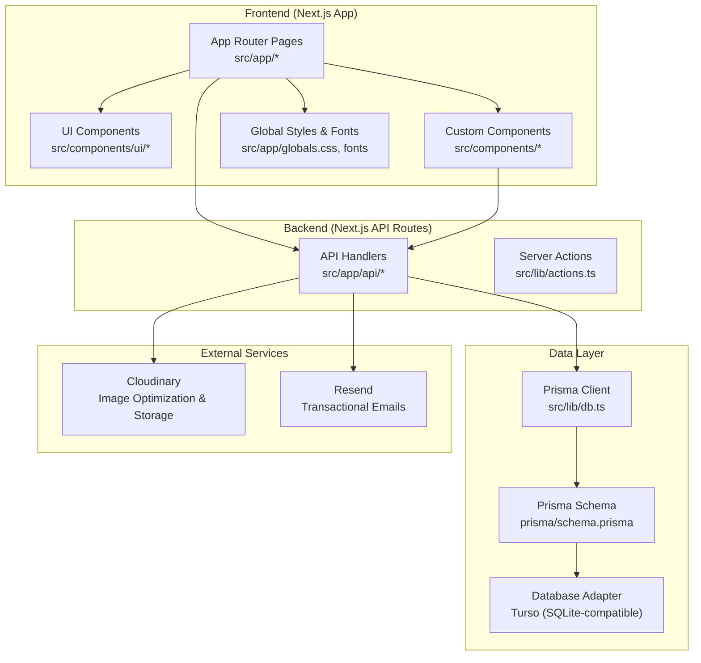
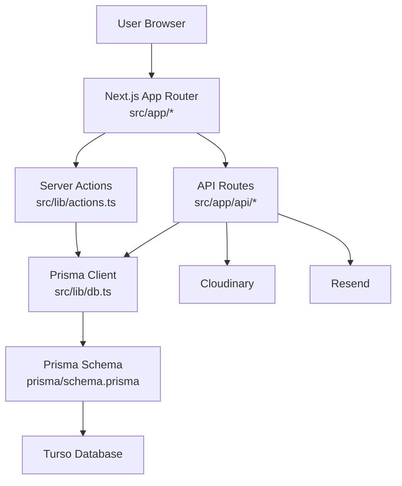
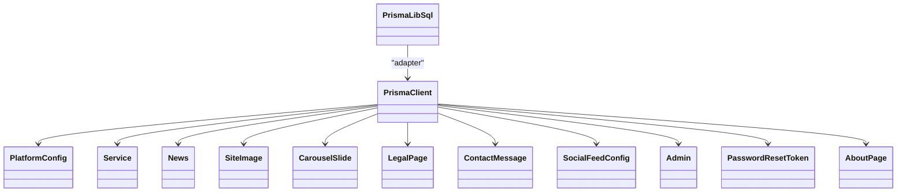
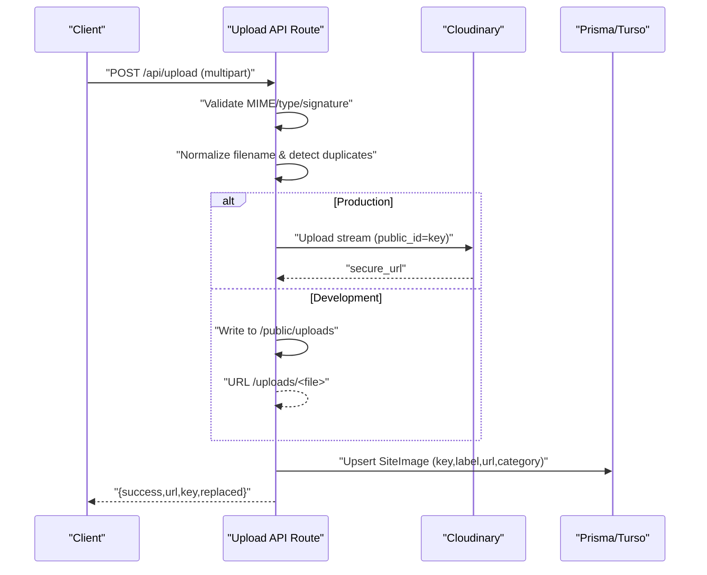
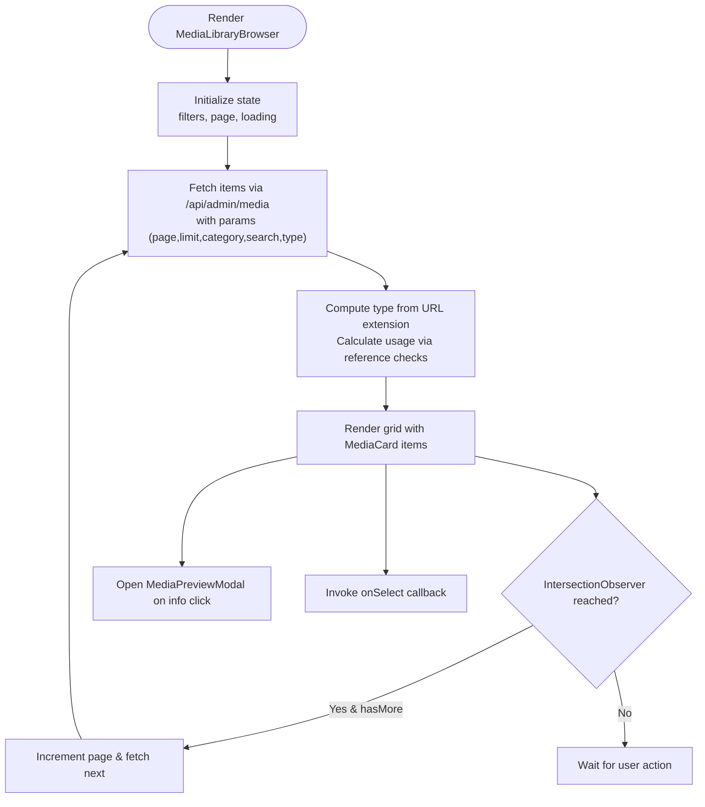
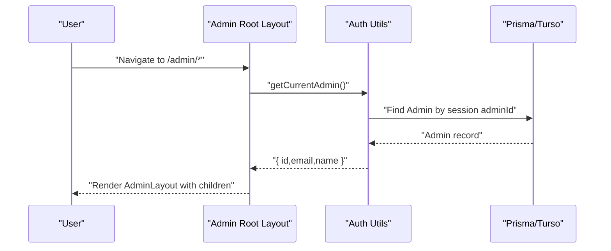
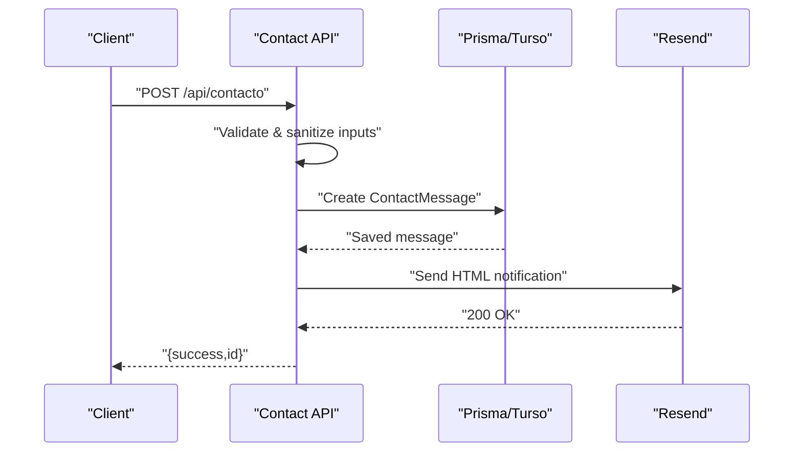
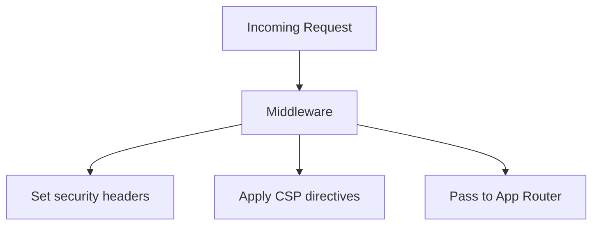
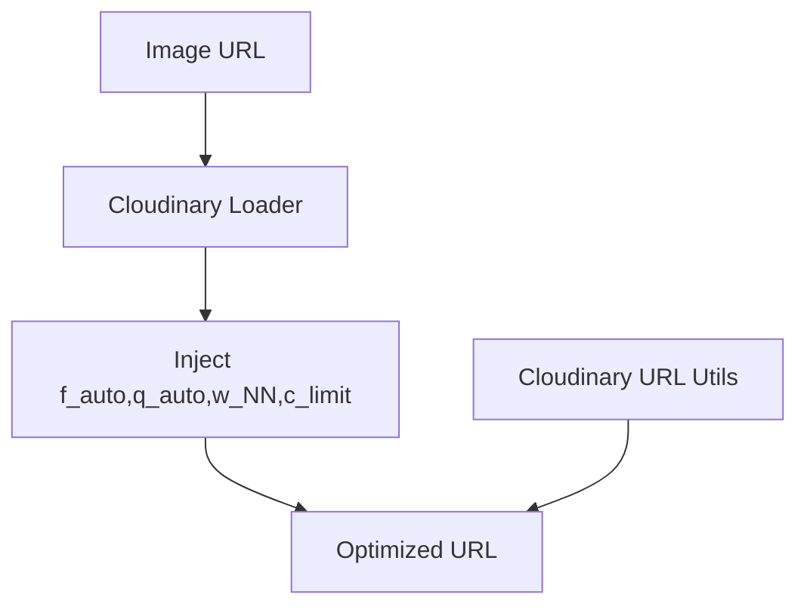
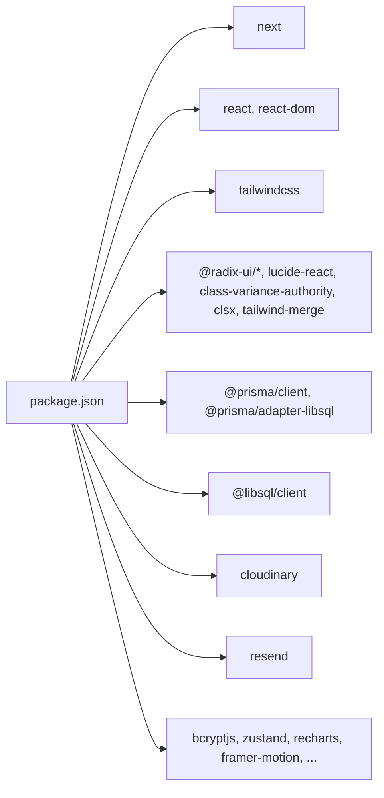

# Technology Stack & Architecture

<cite>
**Referenced Files in This Document**
- [package.json](file://package.json)
- [next.config.ts](file://next.config.ts)
- [tailwind.config.ts](file://tailwind.config.ts)
- [src/middleware.ts](file://src/middleware.ts)
- [src/lib/db.ts](file://src/lib/db.ts)
- [prisma/schema.prisma](file://prisma/schema.prisma)
- [src/lib/cloudinary.ts](file://src/lib/cloudinary.ts)
- [src/lib/cloudinary-loader.ts](file://src/lib/cloudinary-loader.ts)
- [src/lib/actions.ts](file://src/lib/actions.ts)
- [src/app/layout.tsx](file://src/app/layout.tsx)
- [src/components/theme-provider.tsx](file://src/components/theme-provider.tsx)
- [src/components/media-library-browser.tsx](file://src/components/media-library-browser.tsx)
- [src/app/api/route.ts](file://src/app/api/route.ts)
- [src/app/api/admin/media/route.ts](file://src/app/api/admin/media/route.ts)
- [src/app/api/upload/route.ts](file://src/app/api/upload/route.ts)
- [src/app/api/contacto/route.ts](file://src/app/api/contacto/route.ts)
- [src/lib/auth.ts](file://src/lib/auth.ts)
- [src/app/admin/layout.tsx](file://src/app/admin/layout.tsx)
</cite>

## Table of Contents
1. [Introduction](#introduction)
2. [Project Structure](#project-structure)
3. [Core Components](#core-components)
4. [Architecture Overview](#architecture-overview)
5. [Detailed Component Analysis](#detailed-component-analysis)
6. [Dependency Analysis](#dependency-analysis)
7. [Performance Considerations](#performance-considerations)
8. [Security Implementation](#security-implementation)
9. [Infrastructure & Deployment](#infrastructure--deployment)
10. [Monitoring & Observability](#monitoring--observability)
11. [Troubleshooting Guide](#troubleshooting-guide)
12. [Conclusion](#conclusion)

## Introduction
This document describes the GreenAxis technology stack and system architecture. The application is built with Next.js 16 using App Router, React 19, and TypeScript 5. The frontend leverages shadcn/ui components and Tailwind CSS for styling. The backend consists of Next.js API routes backed by Prisma ORM connected to a distributed SQLite-compatible database via Turso. Media assets are optimized and served through Cloudinary, while email notifications are handled by Resend. Cross-cutting concerns include robust security middleware, performance optimizations, and scalable deployment topology suitable for Vercel.

## Project Structure
The repository follows a feature-based structure under src/, with:
- App Router pages and layouts under src/app
- Shared UI components under src/components/ui and custom components under src/components
- Libraries for database, auth, media, and utilities under src/lib
- Middleware and global styles under src/middleware.ts and src/app/globals.css
- Prisma schema and client generation under prisma/

**Diagram sources**
- [src/app/layout.tsx:1-80](file://src/app/layout.tsx#L1-L80)
- [src/lib/db.ts:1-21](file://src/lib/db.ts#L1-L21)
- [prisma/schema.prisma:1-277](file://prisma/schema.prisma#L1-L277)
- [src/lib/cloudinary.ts:1-119](file://src/lib/cloudinary.ts#L1-L119)
- [src/app/api/upload/route.ts:1-452](file://src/app/api/upload/route.ts#L1-L452)
- [src/app/api/contacto/route.ts:1-302](file://src/app/api/contacto/route.ts#L1-L302)

**Section sources**
- [package.json:1-116](file://package.json#L1-L116)
- [next.config.ts:1-46](file://next.config.ts#L1-L46)
- [tailwind.config.ts:1-65](file://tailwind.config.ts#L1-L65)

## Core Components
- Frontend framework and styling: Next.js 16, React 19, TypeScript 5, Tailwind CSS, shadcn/ui primitives
- Backend runtime: Next.js API routes with server actions
- Data persistence: Prisma ORM with LibSQL adapter for Turso
- Media pipeline: Cloudinary for storage and transformation
- Communication: Resend for transactional emails
- Security: Next.js middleware enforcing CSP, HSTS, and other security headers
- Theming and UX: next-themes for light/dark mode

**Section sources**
- [package.json:17-101](file://package.json#L17-L101)
- [src/middleware.ts:1-58](file://src/middleware.ts#L1-L58)
- [src/lib/db.ts:1-21](file://src/lib/db.ts#L1-L21)
- [prisma/schema.prisma:1-277](file://prisma/schema.prisma#L1-L277)
- [src/lib/cloudinary.ts:1-119](file://src/lib/cloudinary.ts#L1-L119)
- [src/app/api/contacto/route.ts:1-302](file://src/app/api/contacto/route.ts#L1-L302)

## Architecture Overview
The system is a modern Jamstack application with a strong backend API surface:
- App Router handles static and dynamic routes, SSR, and metadata generation
- API routes encapsulate CRUD operations, media uploads, and administrative tasks
- Prisma abstracts database operations with a clean schema model
- Turso provides a distributed SQLite-compatible database
- Cloudinary optimizes and serves media assets
- Resend delivers transactional emails
- Middleware enforces security policies globally

**Diagram sources**
- [src/app/layout.tsx:1-80](file://src/app/layout.tsx#L1-L80)
- [src/app/api/upload/route.ts:1-452](file://src/app/api/upload/route.ts#L1-L452)
- [src/app/api/contacto/route.ts:1-302](file://src/app/api/contacto/route.ts#L1-L302)
- [src/lib/db.ts:1-21](file://src/lib/db.ts#L1-L21)
- [prisma/schema.prisma:1-277](file://prisma/schema.prisma#L1-L277)

## Detailed Component Analysis

### Database and ORM (Prisma + Turso)
- The Prisma client is initialized with a LibSQL adapter pointing to Turso via environment variables for URL and auth token.
- The schema defines core domain models: PlatformConfig, Service, News, SiteImage, CarouselSlide, LegalPage, ContactMessage, SocialFeedConfig, Admin, PasswordResetToken, and AboutPage.
- The database is SQLite-compatible and distributed via Turso, enabling low-latency reads and writes across regions.

**Diagram sources**
- [src/lib/db.ts:1-21](file://src/lib/db.ts#L1-L21)
- [prisma/schema.prisma:1-277](file://prisma/schema.prisma#L1-L277)

**Section sources**
- [src/lib/db.ts:1-21](file://src/lib/db.ts#L1-L21)
- [prisma/schema.prisma:1-277](file://prisma/schema.prisma#L1-L277)

### Media Management Pipeline (Upload, Transform, Reference Tracking)
- Upload endpoint accepts multipart/form-data, validates MIME types and signatures, and stores files either to Cloudinary (production) or local filesystem (development).
- Duplicate detection normalizes filenames and compares against existing records.
- After successful upload, the SiteImage record is updated or created with the new URL.
- The media library browser queries the database with pagination and filters, computes usage counts via reference checks, and renders a responsive grid with preview modals.

**Diagram sources**
- [src/app/api/upload/route.ts:150-392](file://src/app/api/upload/route.ts#L150-L392)
- [src/lib/db.ts:1-21](file://src/lib/db.ts#L1-L21)

**Section sources**
- [src/app/api/upload/route.ts:1-452](file://src/app/api/upload/route.ts#L1-L452)
- [src/components/media-library-browser.tsx:1-362](file://src/components/media-library-browser.tsx#L1-L362)

### Media Library Browser (Client Component)
- Implements search with debouncing, category filtering, infinite scroll pagination, and preview modals.
- Integrates with the media API to fetch paginated items and displays usage counts derived from reference checks.

**Diagram sources**
- [src/components/media-library-browser.tsx:69-362](file://src/components/media-library-browser.tsx#L69-L362)
- [src/app/api/admin/media/route.ts:37-150](file://src/app/api/admin/media/route.ts#L37-L150)

**Section sources**
- [src/components/media-library-browser.tsx:1-362](file://src/components/media-library-browser.tsx#L1-L362)
- [src/app/api/admin/media/route.ts:1-150](file://src/app/api/admin/media/route.ts#L1-L150)

### Authentication and Admin Access Control
- Authentication utilities provide password hashing, session creation with signed cookies, verification, and destruction.
- Admin-only routes enforce session validation; unauthorized requests are redirected to the internal portal.
- The admin root layout verifies the current admin session and guards protected pages.

**Diagram sources**
- [src/app/admin/layout.tsx:1-18](file://src/app/admin/layout.tsx#L1-L18)
- [src/lib/auth.ts:156-169](file://src/lib/auth.ts#L156-L169)
- [src/lib/db.ts:1-21](file://src/lib/db.ts#L1-L21)

**Section sources**
- [src/lib/auth.ts:1-170](file://src/lib/auth.ts#L1-L170)
- [src/app/admin/layout.tsx:1-18](file://src/app/admin/layout.tsx#L1-L18)

### Contact Form and Notifications (Resend)
- Validates input, sanitizes data, persists messages to the database, and conditionally sends HTML emails via Resend using the configured API key and sender address.
- Implements a simple in-memory rate limiter keyed by client IP.

**Diagram sources**
- [src/app/api/contacto/route.ts:137-229](file://src/app/api/contacto/route.ts#L137-L229)
- [src/lib/db.ts:1-21](file://src/lib/db.ts#L1-L21)

**Section sources**
- [src/app/api/contacto/route.ts:1-302](file://src/app/api/contacto/route.ts#L1-L302)

### Global Security Middleware
- Applies strict security headers: X-Frame-Options, X-Content-Type-Options, X-XSS-Protection, Referrer-Policy, Permissions-Policy, and Strict-Transport-Security.
- Enforces a permissive but safe Content-Security-Policy allowing trusted domains for analytics and media.
- Excludes static assets and image optimization endpoints from middleware processing.

**Diagram sources**
- [src/middleware.ts:4-44](file://src/middleware.ts#L4-L44)

**Section sources**
- [src/middleware.ts:1-58](file://src/middleware.ts#L1-L58)

### Image Optimization and CDN Integration
- Next.js image loader is customized to integrate with Cloudinary, injecting automatic format, quality, and width transformations.
- Utility functions generate optimized URLs for various contexts (hero, thumbnails, service images).
- Remote patterns allow trusted domains for Next.js Image optimization.

**Diagram sources**
- [src/lib/cloudinary-loader.ts:10-58](file://src/lib/cloudinary-loader.ts#L10-L58)
- [src/lib/cloudinary.ts:32-83](file://src/lib/cloudinary.ts#L32-L83)
- [next.config.ts:11-28](file://next.config.ts#L11-L28)

**Section sources**
- [src/lib/cloudinary-loader.ts:1-59](file://src/lib/cloudinary-loader.ts#L1-L59)
- [src/lib/cloudinary.ts:1-119](file://src/lib/cloudinary.ts#L1-L119)
- [next.config.ts:1-46](file://next.config.ts#L1-L46)

## Dependency Analysis
- Runtime dependencies include Next.js, React 19, Tailwind CSS, shadcn/ui primitives, Prisma client, LibSQL adapter, Cloudinary SDK, Resend SDK, and various UI libraries.
- Dev dependencies include TypeScript, ESLint, and Tailwind PostCSS plugins.
- The application uses a standalone output build for production deployments.

**Diagram sources**
- [package.json:17-101](file://package.json#L17-L101)

**Section sources**
- [package.json:1-116](file://package.json#L1-L116)

## Performance Considerations
- Image optimization: Custom loader and utility functions ensure automatic format and quality adjustments; Next.js remote patterns enable efficient image serving.
- Pagination and lazy loading: Media library uses infinite scroll and debounced search to reduce payload sizes.
- Database queries: Server actions and API routes implement selective field retrieval and pagination to minimize load.
- Build output: Standalone output reduces container startup time and improves cold start characteristics.

[No sources needed since this section provides general guidance]

## Security Implementation
- Security headers enforced by middleware: XFO, XCTO, XXS, Referrer-Policy, Permissions-Policy, HSTS.
- CSP allows trusted analytics and media domains; frame ancestors restricted.
- Admin access control: Session-based authentication with secure, HttpOnly cookies and strict SameSite policy.
- Input validation and sanitization in API routes; rate limiting for contact form submissions.
- Environment-driven configuration for external services (Cloudinary, Resend) to prevent credential leakage.

**Section sources**
- [src/middleware.ts:8-43](file://src/middleware.ts#L8-L43)
- [src/lib/auth.ts:25-77](file://src/lib/auth.ts#L25-L77)
- [src/app/api/contacto/route.ts:137-229](file://src/app/api/contacto/route.ts#L137-L229)

## Infrastructure & Deployment
- Database: Turso provides a distributed SQLite-compatible database with low-latency reads/writes.
- Media: Cloudinary handles storage and transformation; production uses Cloudinary uploader, development uses local filesystem.
- Emails: Resend API for transactional notifications.
- Build and runtime: Next.js standalone output; Bun used for production start with logging.
- Deployment topology: Recommended to deploy on Vercel with Turso managed databases and Cloudinary/Resend configured via environment variables.

**Section sources**
- [src/app/api/upload/route.ts:30-31](file://src/app/api/upload/route.ts#L30-L31)
- [package.json:5-16](file://package.json#L5-L16)
- [next.config.ts:4-6](file://next.config.ts#L4-L6)

## Monitoring & Observability
- Logging: Production start script pipes logs to a server.log file for observability.
- Database: Prisma client logs queries; monitor slow queries and connection pooling.
- Media: Track Cloudinary upload metrics and transformation performance.
- API: Add structured logging around critical endpoints (uploads, contact form) and implement basic health checks.

**Section sources**
- [package.json:8-8](file://package.json#L8-L8)
- [src/lib/db.ts:18-18](file://src/lib/db.ts#L18-L18)

## Troubleshooting Guide
- Authentication failures: Verify session cookie presence, expiration, and secure flags; confirm admin session retrieval logic.
- Upload errors: Check MIME type validation, file size limits, and environment configuration for Cloudinary; review error responses for duplicate detection and replacement scenarios.
- Media library issues: Confirm pagination parameters, category filters, and reference counting logic; verify Cloudinary URL transformations.
- Contact form errors: Validate input constraints, rate limiting thresholds, and Resend API key configuration.

**Section sources**
- [src/lib/auth.ts:49-77](file://src/lib/auth.ts#L49-L77)
- [src/app/api/upload/route.ts:150-392](file://src/app/api/upload/route.ts#L150-L392)
- [src/app/api/admin/media/route.ts:37-150](file://src/app/api/admin/media/route.ts#L37-L150)
- [src/app/api/contacto/route.ts:137-229](file://src/app/api/contacto/route.ts#L137-L229)

## Conclusion
GreenAxis adopts a modern, scalable architecture centered on Next.js App Router, Prisma with Turso, and externalized services for media and email. The system emphasizes security through middleware, robust admin controls, and performance via image optimization and pagination. The deployment topology aligns with Vercel’s platform, leveraging managed integrations for Cloudinary and Resend to achieve a reliable, maintainable solution.