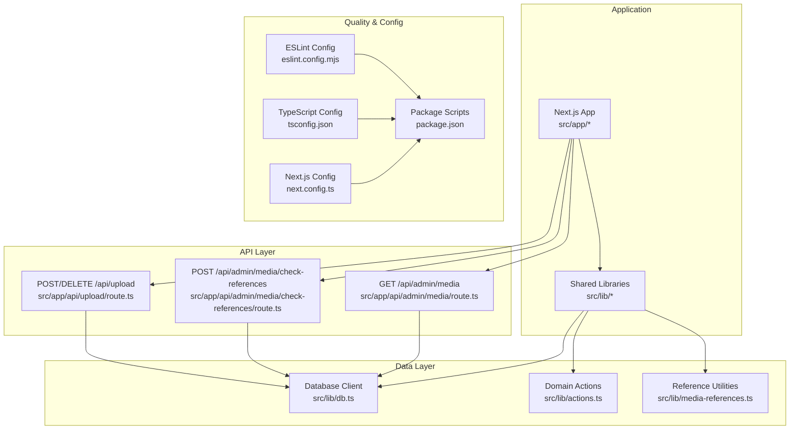
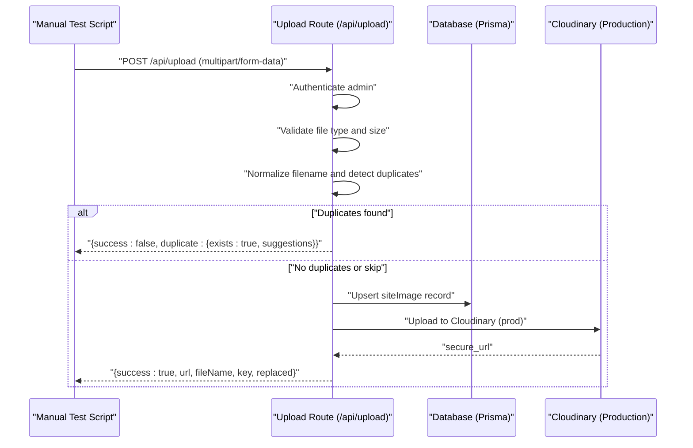
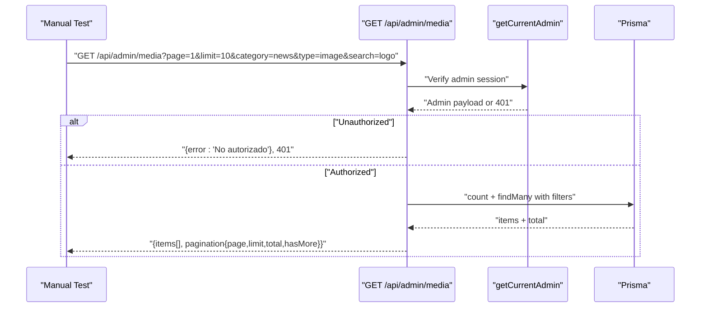
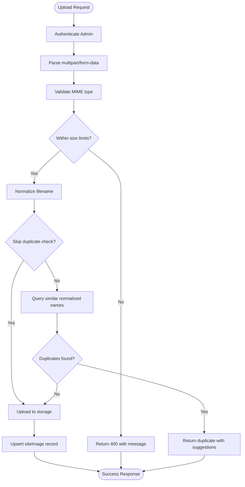
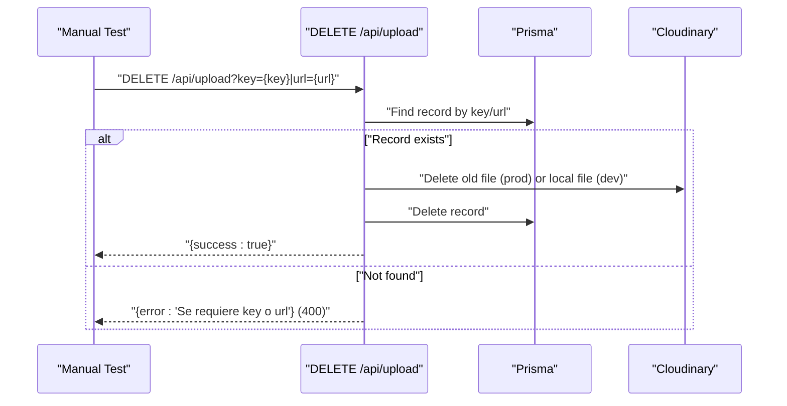
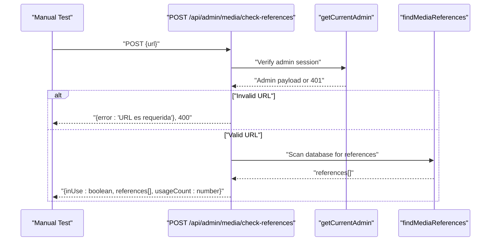
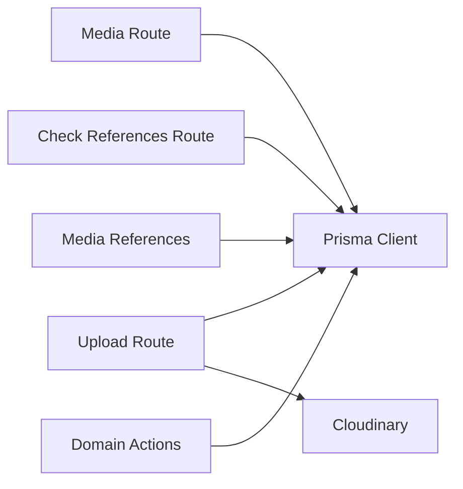

# Testing Strategy

<cite>
**Referenced Files in This Document**
- [package.json](file://package.json)
- [eslint.config.mjs](file://eslint.config.mjs)
- [tsconfig.json](file://tsconfig.json)
- [next.config.ts](file://next.config.ts)
- [src/lib/db.ts](file://src/lib/db.ts)
- [src/lib/actions.ts](file://src/lib/actions.ts)
- [src/lib/media-references.ts](file://src/lib/media-references.ts)
- [src/app/api/admin/media/route.ts](file://src/app/api/admin/media/route.ts)
- [src/app/api/admin/media/check-references/route.ts](file://src/app/api/admin/media/check-references/route.ts)
- [src/app/api/upload/route.ts](file://src/app/api/upload/route.ts)
- [test-media-endpoint.js](file://test-media-endpoint.js)
- [test-delete-endpoint.js](file://test-delete-endpoint.js)
- [test-check-references.js](file://test-check-references.js)
- [test-duplicate-detection.js](file://test-duplicate-detection.js)
- [test-upload-duplicate-detection.js](file://test-upload-duplicate-detection.js)
</cite>

## Table of Contents
1. [Introduction](#introduction)
2. [Project Structure](#project-structure)
3. [Core Components](#core-components)
4. [Architecture Overview](#architecture-overview)
5. [Detailed Component Analysis](#detailed-component-analysis)
6. [Dependency Analysis](#dependency-analysis)
7. [Performance Considerations](#performance-considerations)
8. [Troubleshooting Guide](#troubleshooting-guide)
9. [Conclusion](#conclusion)
10. [Appendices](#appendices)

## Introduction
This document defines a comprehensive testing strategy for GreenAxis, focusing on unit, integration, and end-to-end testing. It explains the existing manual test scripts for media endpoints, upload duplicate detection, and deletion verification, and outlines how to evolve them into automated, reliable, and maintainable test suites. It also documents quality assurance processes (ESLint, TypeScript compilation checks), best practices for Next.js applications, database testing strategies, API contract testing, continuous integration testing, performance testing, security testing, automation, debugging techniques, and quality metrics collection.

## Project Structure
The repository follows a Next.js application structure with a dedicated src directory for application code, API routes under src/app/api, shared libraries under src/lib, and manual test scripts at the project root. Quality tools are configured via ESLint, TypeScript, and Next.js configuration.

**Diagram sources**
- [src/app/api/admin/media/route.ts:1-150](file://src/app/api/admin/media/route.ts#L1-L150)
- [src/app/api/admin/media/check-references/route.ts:1-86](file://src/app/api/admin/media/check-references/route.ts#L1-L86)
- [src/app/api/upload/route.ts:1-452](file://src/app/api/upload/route.ts#L1-L452)
- [src/lib/db.ts:1-21](file://src/lib/db.ts#L1-L21)
- [src/lib/actions.ts:1-136](file://src/lib/actions.ts#L1-L136)
- [src/lib/media-references.ts:1-334](file://src/lib/media-references.ts#L1-L334)
- [eslint.config.mjs:1-51](file://eslint.config.mjs#L1-L51)
- [tsconfig.json:1-43](file://tsconfig.json#L1-L43)
- [next.config.ts:1-46](file://next.config.ts#L1-L46)
- [package.json:1-116](file://package.json#L1-L116)

**Section sources**
- [package.json:1-116](file://package.json#L1-L116)
- [eslint.config.mjs:1-51](file://eslint.config.mjs#L1-L51)
- [tsconfig.json:1-43](file://tsconfig.json#L1-L43)
- [next.config.ts:1-46](file://next.config.ts#L1-L46)

## Core Components
- Database client and connection management for Prisma with LibSQL adapter.
- Domain action functions for retrieving platform data, services, news, images, and other domain entities.
- Media reference utilities for extracting and scanning EditorJS content, finding references across tables, and updating references after file operations.
- API routes for listing media, checking references, and uploading/deleting media with duplicate detection and replacement logic.

**Section sources**
- [src/lib/db.ts:1-21](file://src/lib/db.ts#L1-L21)
- [src/lib/actions.ts:1-136](file://src/lib/actions.ts#L1-L136)
- [src/lib/media-references.ts:1-334](file://src/lib/media-references.ts#L1-L334)
- [src/app/api/admin/media/route.ts:1-150](file://src/app/api/admin/media/route.ts#L1-L150)
- [src/app/api/admin/media/check-references/route.ts:1-86](file://src/app/api/admin/media/check-references/route.ts#L1-L86)
- [src/app/api/upload/route.ts:1-452](file://src/app/api/upload/route.ts#L1-L452)

## Architecture Overview
The testing strategy aligns with the layered architecture:
- Unit tests target pure functions and utilities (e.g., filename normalization, reference extraction).
- Integration tests validate API endpoints and database interactions using realistic payloads and environments.
- End-to-end tests simulate complete user workflows (upload, replace, delete, reference checks) against a running server.

**Diagram sources**
- [src/app/api/upload/route.ts:150-392](file://src/app/api/upload/route.ts#L150-L392)
- [src/lib/db.ts:1-21](file://src/lib/db.ts#L1-L21)

## Detailed Component Analysis

### Media Endpoint Testing (Manual)
Existing manual test validates GET /api/admin/media with filters and pagination, ensuring proper authentication, response shape, and error handling for invalid parameters.

**Diagram sources**
- [src/app/api/admin/media/route.ts:37-149](file://src/app/api/admin/media/route.ts#L37-L149)
- [src/lib/db.ts:1-21](file://src/lib/db.ts#L1-L21)

**Section sources**
- [test-media-endpoint.js:1-121](file://test-media-endpoint.js#L1-L121)
- [src/app/api/admin/media/route.ts:26-149](file://src/app/api/admin/media/route.ts#L26-L149)

### Upload Duplicate Detection Validation (Manual)
Two manual tests validate filename normalization and duplicate detection logic, and an integration test simulates upload flows with duplicate detection and bypass.

**Diagram sources**
- [src/app/api/upload/route.ts:150-392](file://src/app/api/upload/route.ts#L150-L392)
- [src/lib/db.ts:1-21](file://src/lib/db.ts#L1-L21)

**Section sources**
- [test-duplicate-detection.js:1-79](file://test-duplicate-detection.js#L1-L79)
- [test-upload-duplicate-detection.js:1-147](file://test-upload-duplicate-detection.js#L1-L147)
- [src/app/api/upload/route.ts:127-243](file://src/app/api/upload/route.ts#L127-L243)

### Deletion Endpoint Verification (Manual)
The manual test verifies deletion behavior for non-existent resources, resources with references, and safe deletion paths, including production cleanup via Cloudinary.

**Diagram sources**
- [src/app/api/upload/route.ts:394-451](file://src/app/api/upload/route.ts#L394-L451)
- [src/lib/db.ts:1-21](file://src/lib/db.ts#L1-L21)

**Section sources**
- [test-delete-endpoint.js:1-112](file://test-delete-endpoint.js#L1-L112)
- [src/app/api/upload/route.ts:394-451](file://src/app/api/upload/route.ts#L394-L451)

### Reference Checking Endpoint (Manual)
The manual test validates POST /api/admin/media/check-references, ensuring proper authentication, request validation, and response structure with usage metrics and reference details.

**Diagram sources**
- [src/app/api/admin/media/check-references/route.ts:37-85](file://src/app/api/admin/media/check-references/route.ts#L37-L85)
- [src/lib/media-references.ts:65-181](file://src/lib/media-references.ts#L65-L181)

**Section sources**
- [test-check-references.js:1-162](file://test-check-references.js#L1-L162)
- [src/app/api/admin/media/check-references/route.ts:25-85](file://src/app/api/admin/media/check-references/route.ts#L25-L85)
- [src/lib/media-references.ts:65-181](file://src/lib/media-references.ts#L65-L181)

### Unit Testing Approaches
- Pure function tests: Validate filename normalization and EditorJS URL extraction with representative inputs and edge cases.
- Utility function tests: Verify reference scanning and URL generation helpers used by the API routes.
- Action function tests: Validate domain queries for platform configuration, services, news, and images.

Recommended approach:
- Use a lightweight test runner (e.g., Vitest) with JSDOM for DOM-related utilities.
- Mock Prisma client for unit tests to isolate logic and avoid database dependencies.
- Parameterized tests for normalization and duplicate detection to cover common patterns.

**Section sources**
- [src/app/api/upload/route.ts:127-148](file://src/app/api/upload/route.ts#L127-L148)
- [src/lib/media-references.ts:21-56](file://src/lib/media-references.ts#L21-L56)
- [src/lib/actions.ts:1-136](file://src/lib/actions.ts#L1-L136)

### Integration Testing Methods
- API endpoint tests: Use fetch-based tests or a lightweight HTTP server to validate request/response contracts, status codes, and pagination/filtering.
- Database operation tests: Use an in-memory database or a test-specific schema to validate upserts, deletions, and reference updates without affecting production data.
- Environment-specific tests: Separate development and production flows for Cloudinary uploads and local filesystem cleanup.

Recommended approach:
- Introduce a test harness that boots a minimal Next.js server and seeds test data.
- Use transaction rollbacks or schema snapshots to keep tests isolated and repeatable.
- Validate error propagation and logging for failure scenarios.

**Section sources**
- [src/app/api/admin/media/route.ts:37-149](file://src/app/api/admin/media/route.ts#L37-L149)
- [src/app/api/admin/media/check-references/route.ts:37-85](file://src/app/api/admin/media/check-references/route.ts#L37-L85)
- [src/app/api/upload/route.ts:150-392](file://src/app/api/upload/route.ts#L150-L392)
- [src/lib/db.ts:1-21](file://src/lib/db.ts#L1-L21)

### End-to-End Testing Implementation
- Workflow tests: Simulate complete user journeys such as uploading a file, detecting duplicates, replacing a file, and verifying reference updates.
- Cross-environment tests: Validate behavior differences between development (local filesystem) and production (Cloudinary).
- Regression tests: Ensure that duplicate detection and replacement logic remains consistent across versions.

Recommended approach:
- Use Playwright or Cypress to automate browser interactions and API calls.
- Capture and assert on response payloads, database state, and storage artifacts.
- Integrate with CI to run E2E tests against ephemeral test databases.

[No sources needed since this section provides general guidance]

## Dependency Analysis
The testing strategy depends on:
- API routes for media listing, reference checking, and upload/delete operations.
- Database client and Prisma models for persistence.
- Media reference utilities for cross-table scanning and updates.
- Quality tools (ESLint, TypeScript) for static checks and compile-time safety.

**Diagram sources**
- [src/app/api/admin/media/route.ts:1-150](file://src/app/api/admin/media/route.ts#L1-L150)
- [src/app/api/admin/media/check-references/route.ts:1-86](file://src/app/api/admin/media/check-references/route.ts#L1-L86)
- [src/app/api/upload/route.ts:1-452](file://src/app/api/upload/route.ts#L1-L452)
- [src/lib/db.ts:1-21](file://src/lib/db.ts#L1-L21)
- [src/lib/media-references.ts:1-334](file://src/lib/media-references.ts#L1-L334)

**Section sources**
- [src/app/api/admin/media/route.ts:1-150](file://src/app/api/admin/media/route.ts#L1-L150)
- [src/app/api/admin/media/check-references/route.ts:1-86](file://src/app/api/admin/media/check-references/route.ts#L1-L86)
- [src/app/api/upload/route.ts:1-452](file://src/app/api/upload/route.ts#L1-L452)
- [src/lib/db.ts:1-21](file://src/lib/db.ts#L1-L21)
- [src/lib/media-references.ts:1-334](file://src/lib/media-references.ts#L1-L334)

## Performance Considerations
- API pagination and filtering: Validate that large datasets are handled efficiently and that type filtering does not incur heavy client-side computation.
- Duplicate detection: Optimize normalization and database queries; consider indexing normalized names if scaling.
- Storage operations: Measure upload and delete times for Cloudinary vs. local filesystem and set SLIs for latency and throughput.
- Memory usage: Monitor memory consumption during batch operations (bulk uploads, reference scans).

[No sources needed since this section provides general guidance]

## Troubleshooting Guide
Common issues and resolutions:
- Authentication failures: Ensure admin session cookies are present and valid for protected endpoints.
- Invalid parameters: Validate pagination and filter parameters; expect 400 responses for invalid inputs.
- Duplicate detection false positives/negatives: Review normalization rules and database query logic.
- Production vs. development behavior: Confirm environment variables for Cloudinary and local storage paths.
- Reference scan inconsistencies: Verify EditorJS block parsing and that all relevant tables are scanned.

**Section sources**
- [src/app/api/admin/media/route.ts:54-60](file://src/app/api/admin/media/route.ts#L54-L60)
- [src/app/api/upload/route.ts:213-243](file://src/app/api/upload/route.ts#L213-L243)
- [src/app/api/admin/media/check-references/route.ts:49-55](file://src/app/api/admin/media/check-references/route.ts#L49-L55)

## Conclusion
GreenAxis currently relies on manual test scripts to validate media endpoints, duplicate detection, and deletion flows. The recommended path forward is to formalize unit, integration, and end-to-end tests with a test runner, environment isolation, and CI integration. Align quality gates with ESLint and TypeScript configurations, and establish performance and security baselines to ensure robust, scalable testing.

[No sources needed since this section summarizes without analyzing specific files]

## Appendices

### Quality Assurance Processes
- ESLint configuration: Extends Next.js core-web-vitals and TypeScript rules; disables several rules to reduce friction. Use lint-staged and pre-commit hooks to enforce style consistency.
- TypeScript compilation checks: Strict mode enabled with incremental builds; ignoreBuildErrors is set for Next.js to prevent blocking builds in development.
- Next.js configuration: Standalone output, custom loader, and cache headers for uploads.

**Section sources**
- [eslint.config.mjs:1-51](file://eslint.config.mjs#L1-L51)
- [tsconfig.json:1-43](file://tsconfig.json#L1-L43)
- [next.config.ts:1-46](file://next.config.ts#L1-L46)
- [package.json:1-116](file://package.json#L1-L116)

### Testing Best Practices for Next.js Applications
- Use app router testing patterns with minimal server bootstrapping.
- Mock external services (e.g., Cloudinary) in tests to avoid flakiness.
- Prefer deterministic fixtures and deterministic filenames for reproducibility.
- Separate concerns: unit tests for logic, integration tests for endpoints, E2E tests for workflows.

[No sources needed since this section provides general guidance]

### Database Testing Strategies
- Use a separate test database or schema; snapshot and rollback for isolation.
- Validate referential integrity and cascading effects after delete/rename operations.
- Test concurrent operations (race conditions) for upload/replacement logic.

**Section sources**
- [src/lib/db.ts:1-21](file://src/lib/db.ts#L1-L21)
- [src/lib/media-references.ts:65-181](file://src/lib/media-references.ts#L65-L181)

### API Contract Testing
- Define OpenAPI-like schemas for request/response bodies and status codes.
- Validate content types, pagination metadata, and reference structures.
- Use property-based tests to vary query parameters and payloads systematically.

**Section sources**
- [src/app/api/admin/media/route.ts:26-149](file://src/app/api/admin/media/route.ts#L26-L149)
- [src/app/api/admin/media/check-references/route.ts:25-85](file://src/app/api/admin/media/check-references/route.ts#L25-L85)
- [src/app/api/upload/route.ts:150-392](file://src/app/api/upload/route.ts#L150-L392)

### Continuous Integration Testing
- Run unit tests on every commit; integrate with GitHub Actions or equivalent.
- Execute integration tests against ephemeral databases and storage backends.
- Gate merges on passing tests and linting; enforce minimum coverage thresholds.

[No sources needed since this section provides general guidance]

### Performance Testing Approaches
- Load test upload endpoints with varying file sizes and concurrency.
- Benchmark reference scanning across large datasets.
- Track p95/p99 latencies and error rates; alert on regressions.

[No sources needed since this section provides general guidance]

### Security Testing Procedures
- Validate authentication and authorization for admin-only endpoints.
- Sanitize inputs and enforce strict MIME/type validation.
- Audit Cloudinary configuration and permissions; monitor for unexpected deletions.

**Section sources**
- [src/app/api/admin/media/route.ts:37-42](file://src/app/api/admin/media/route.ts#L37-L42)
- [src/app/api/admin/media/check-references/route.ts:37-42](file://src/app/api/admin/media/check-references/route.ts#L37-L42)
- [src/app/api/upload/route.ts:150-211](file://src/app/api/upload/route.ts#L150-L211)

### Test Automation and Debugging Techniques
- Automate manual scripts with a test runner and fixtures.
- Use structured logs and assertions to capture state before and after operations.
- Employ deterministic test IDs and seeded data for repeatability.

**Section sources**
- [test-media-endpoint.js:1-121](file://test-media-endpoint.js#L1-L121)
- [test-delete-endpoint.js:1-112](file://test-delete-endpoint.js#L1-L112)
- [test-check-references.js:1-162](file://test-check-references.js#L1-L162)
- [test-duplicate-detection.js:1-79](file://test-duplicate-detection.js#L1-L79)
- [test-upload-duplicate-detection.js:1-147](file://test-upload-duplicate-detection.js#L1-L147)

### Quality Metrics Collection
- Track pass/fail rates, flakiness, and duration per test suite.
- Monitor API error rates and response times for media endpoints.
- Collect coverage metrics for unit and integration tests.

[No sources needed since this section provides general guidance]