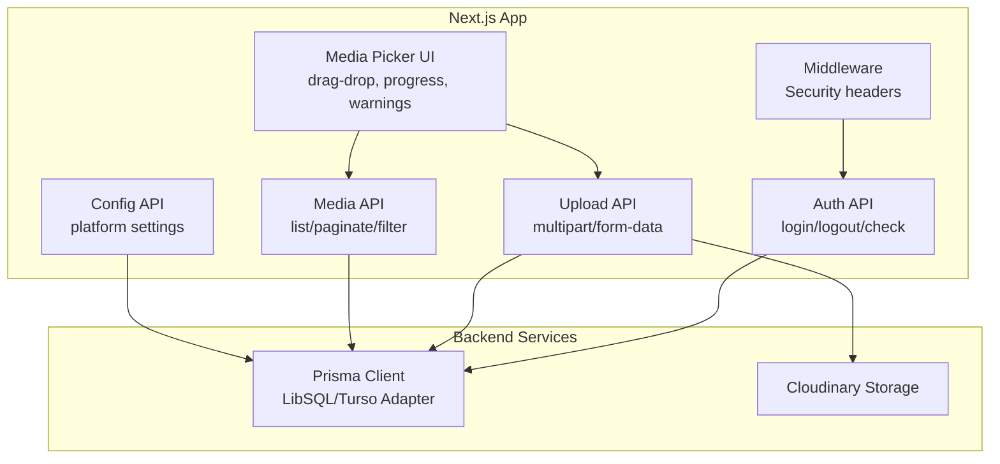
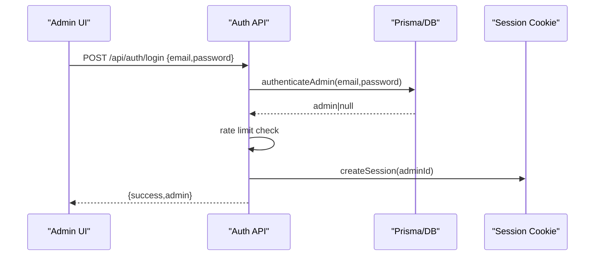
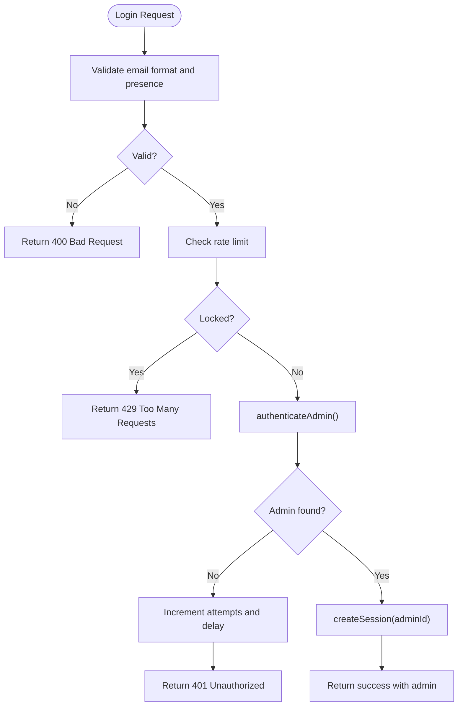
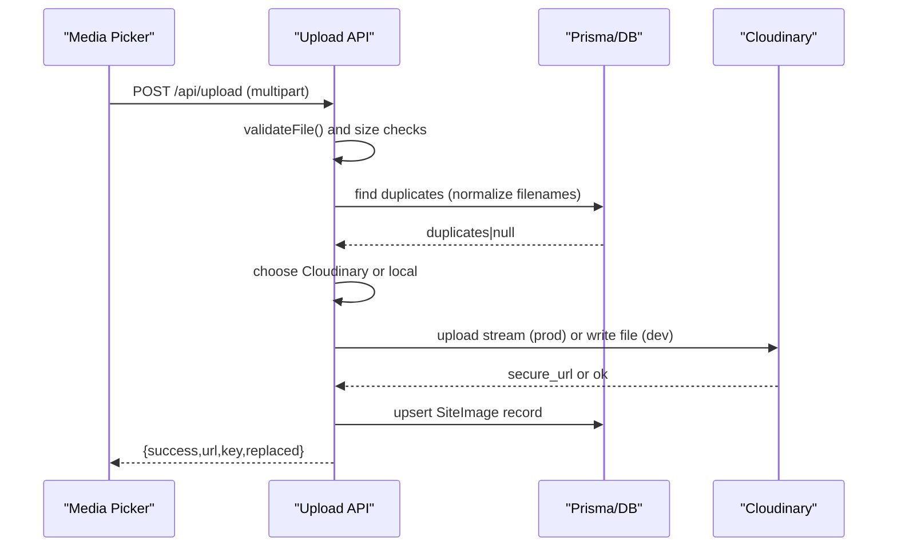
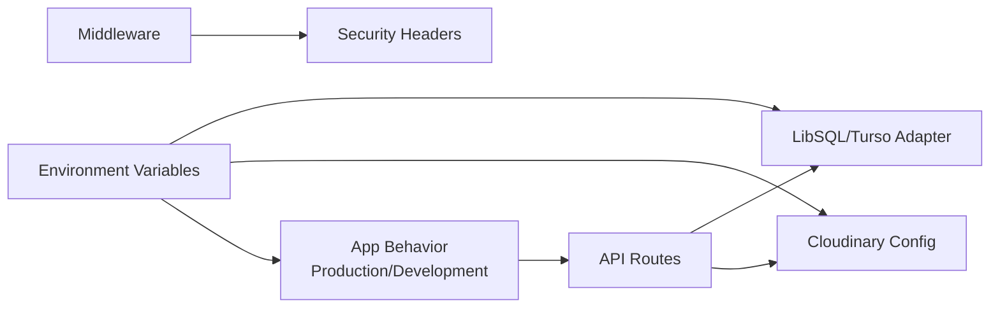

# Troubleshooting & FAQ

<cite>
**Referenced Files in This Document**
- [auth.ts](file://src/lib/auth.ts)
- [db.ts](file://src/lib/db.ts)
- [cloudinary.ts](file://src/lib/cloudinary.ts)
- [middleware.ts](file://src/middleware.ts)
- [package.json](file://package.json)
- [login/route.ts](file://src/app/api/auth/login/route.ts)
- [logout/route.ts](file://src/app/api/auth/logout/route.ts)
- [check/route.ts](file://src/app/api/auth/check/route.ts)
- [upload/route.ts](file://src/app/api/upload/route.ts)
- [media/route.ts](file://src/app/api/admin/media/route.ts)
- [config/route.ts](file://src/app/api/admin/config/route.ts)
- [media-picker.tsx](file://src/components/media-picker.tsx)
- [schema.prisma](file://prisma/schema.prisma)
</cite>

## Table of Contents
1. [Introduction](#introduction)
2. [Project Structure](#project-structure)
3. [Core Components](#core-components)
4. [Architecture Overview](#architecture-overview)
5. [Detailed Component Analysis](#detailed-component-analysis)
6. [Dependency Analysis](#dependency-analysis)
7. [Performance Considerations](#performance-considerations)
8. [Troubleshooting Guide](#troubleshooting-guide)
9. [Conclusion](#conclusion)
10. [Appendices](#appendices)

## Introduction
This document provides comprehensive troubleshooting and Frequently Asked Questions for GreenAxis. It focuses on diagnosing and resolving common issues related to authentication, database connectivity, media uploads, and performance. It also explains debugging techniques for Next.js applications, database query optimization, API endpoint troubleshooting, error handling strategies, logging approaches, and monitoring setup for production environments. Step-by-step resolution guides and preventive best practices are included to support both development and operational tasks.

## Project Structure
GreenAxis is a Next.js application using Prisma with a LibSQL/Turso adapter for database connectivity, and Cloudinary for media storage. Authentication is handled via signed session cookies and admin records in the database. Media management includes upload, duplicate detection, and library browsing.

**Diagram sources**
- [middleware.ts:1-58](file://src/middleware.ts#L1-L58)
- [login/route.ts:1-91](file://src/app/api/auth/login/route.ts#L1-L91)
- [logout/route.ts:1-13](file://src/app/api/auth/logout/route.ts#L1-L13)
- [check/route.ts:1-21](file://src/app/api/auth/check/route.ts#L1-L21)
- [upload/route.ts:1-452](file://src/app/api/upload/route.ts#L1-L452)
- [media/route.ts:1-150](file://src/app/api/admin/media/route.ts#L1-L150)
- [config/route.ts:1-120](file://src/app/api/admin/config/route.ts#L1-L120)
- [media-picker.tsx:1-754](file://src/components/media-picker.tsx#L1-L754)
- [db.ts:1-21](file://src/lib/db.ts#L1-L21)
- [cloudinary.ts:1-119](file://src/lib/cloudinary.ts#L1-L119)

**Section sources**
- [middleware.ts:1-58](file://src/middleware.ts#L1-L58)
- [db.ts:1-21](file://src/lib/db.ts#L1-L21)
- [cloudinary.ts:1-119](file://src/lib/cloudinary.ts#L1-L119)
- [schema.prisma:1-277](file://prisma/schema.prisma#L1-L277)

## Core Components
- Authentication and sessions: Cookie-based session management, admin verification, and rate-limited login flow.
- Database connectivity: Prisma with LibSQL/Turso adapter, configured via environment variables.
- Media pipeline: Local filesystem in development, Cloudinary in production; includes duplicate detection and replacement logic.
- API endpoints: Auth, upload, media listing, and configuration management.
- Frontend media picker: Drag-and-drop upload, progress tracking, duplicate suggestion warnings, and library browsing.

**Section sources**
- [auth.ts:1-170](file://src/lib/auth.ts#L1-L170)
- [db.ts:1-21](file://src/lib/db.ts#L1-L21)
- [upload/route.ts:1-452](file://src/app/api/upload/route.ts#L1-L452)
- [media/route.ts:1-150](file://src/app/api/admin/media/route.ts#L1-L150)
- [media-picker.tsx:1-754](file://src/components/media-picker.tsx#L1-L754)

## Architecture Overview
The system integrates Next.js API routes with Prisma for data persistence and Cloudinary for media assets. Middleware applies security headers globally. Authentication endpoints enforce rate limits and session creation. The upload endpoint validates files, detects duplicates, and stores assets either locally or in Cloudinary depending on environment.

**Diagram sources**
- [login/route.ts:1-91](file://src/app/api/auth/login/route.ts#L1-L91)
- [auth.ts:137-153](file://src/lib/auth.ts#L137-L153)
- [db.ts:1-21](file://src/lib/db.ts#L1-L21)

## Detailed Component Analysis

### Authentication Flow and Troubleshooting
Common issues:
- Invalid credentials or blocked account after repeated failed attempts.
- Session expiration or missing cookie.
- Missing or invalid email format.

Resolution steps:
- Verify email format and presence before attempting authentication.
- Check rate-limiting messages and wait for lockout window to expire.
- Confirm session cookie is set with secure attributes and not expired.
- Ensure environment variables for session duration and cookie security match expectations.

**Diagram sources**
- [login/route.ts:1-91](file://src/app/api/auth/login/route.ts#L1-L91)
- [auth.ts:137-153](file://src/lib/auth.ts#L137-L153)
- [auth.ts:26-47](file://src/lib/auth.ts#L26-L47)

**Section sources**
- [login/route.ts:1-91](file://src/app/api/auth/login/route.ts#L1-L91)
- [logout/route.ts:1-13](file://src/app/api/auth/logout/route.ts#L1-L13)
- [check/route.ts:1-21](file://src/app/api/auth/check/route.ts#L1-L21)
- [auth.ts:1-170](file://src/lib/auth.ts#L1-L170)

### Media Upload Pipeline and Troubleshooting
Common issues:
- File type not allowed.
- File too large for environment limits.
- Duplicate file detection suggests existing asset.
- Cloudinary upload failures or missing credentials.
- Local filesystem permission errors in development.

Resolution steps:
- Confirm MIME type is in allowed lists and matches file signature where applicable.
- Reduce file size or use Cloudinary Console for oversized assets.
- Review duplicate suggestions and reuse existing asset if appropriate.
- Verify Cloudinary configuration variables and network connectivity.
- Ensure upload directory exists and is writable in development.

**Diagram sources**
- [upload/route.ts:1-452](file://src/app/api/upload/route.ts#L1-L452)
- [media-picker.tsx:200-316](file://src/components/media-picker.tsx#L200-L316)
- [db.ts:1-21](file://src/lib/db.ts#L1-L21)

**Section sources**
- [upload/route.ts:1-452](file://src/app/api/upload/route.ts#L1-L452)
- [media-picker.tsx:1-754](file://src/components/media-picker.tsx#L1-L754)
- [cloudinary.ts:1-119](file://src/lib/cloudinary.ts#L1-L119)

### Media Library and Reference Checking
Common issues:
- Pagination parameter errors.
- Type filtering yields approximate totals.
- Reference counting errors do not block listing.

Resolution steps:
- Ensure page and limit are positive integers and limit does not exceed backend cap.
- Understand that type filtering is URL-based and may yield approximate counts.
- Investigate reference calculation errors independently; listing continues with zero usage count fallback.

**Section sources**
- [media/route.ts:1-150](file://src/app/api/admin/media/route.ts#L1-L150)

### Configuration Management
Common issues:
- Missing initial configuration record.
- Empty string normalization to null for optional fields.
- Cache invalidation after updates.

Resolution steps:
- On first GET, a default configuration record is created if none exists.
- PUT handles partial updates; empty strings are converted to null for optional fields.
- After updates, cache is revalidated to reflect changes immediately.

**Section sources**
- [config/route.ts:1-120](file://src/app/api/admin/config/route.ts#L1-L120)

## Dependency Analysis
- Environment-driven behavior:
  - Database URL and token for LibSQL/Turso.
  - Cloudinary configuration via URL or individual variables.
  - Production flag affects upload behavior and limits.
- Middleware security headers apply globally to non-static routes.
- Logging uses console.error for server-side errors; consider structured logging for production.

**Diagram sources**
- [db.ts:1-21](file://src/lib/db.ts#L1-L21)
- [upload/route.ts:1-452](file://src/app/api/upload/route.ts#L1-L452)
- [middleware.ts:1-58](file://src/middleware.ts#L1-L58)
- [package.json:1-116](file://package.json#L1-L116)

**Section sources**
- [db.ts:1-21](file://src/lib/db.ts#L1-L21)
- [upload/route.ts:1-452](file://src/app/api/upload/route.ts#L1-L452)
- [middleware.ts:1-58](file://src/middleware.ts#L1-L58)
- [package.json:1-116](file://package.json#L1-L116)

## Performance Considerations
- Database query optimization:
  - Use pagination and limit parameters to avoid large result sets.
  - Apply filters early (category, label) to reduce scan volume.
  - Prefer indexed fields (e.g., unique keys) for lookups.
- Media delivery:
  - Use Cloudinary URL transformation helpers to optimize format, quality, and width.
  - Serve responsive images with Next.js Image to leverage automatic optimization.
- Network and storage:
  - In production, offload uploads to Cloudinary to reduce server load.
  - Monitor upload sizes and consider CDN caching for static assets.

[No sources needed since this section provides general guidance]

## Troubleshooting Guide

### Authentication Problems
Symptoms:
- Login returns rate-limit message.
- “No autorizado” on protected endpoints.
- Session cookie not recognized.

Resolutions:
- Wait for lockout window if repeatedly failing login attempts.
- Ensure client sends session cookie with requests.
- Confirm environment variables for cookie security and session duration.

**Section sources**
- [login/route.ts:1-91](file://src/app/api/auth/login/route.ts#L1-L91)
- [check/route.ts:1-21](file://src/app/api/auth/check/route.ts#L1-L21)
- [auth.ts:50-77](file://src/lib/auth.ts#L50-L77)

### Database Connectivity Issues
Symptoms:
- Prisma client errors during upload or media listing.
- Connection refused or invalid database URL.

Resolutions:
- Verify DATABASE_URL and TURSO_* environment variables.
- Ensure LibSQL/Turso adapter is configured correctly.
- Check Prisma client initialization logs and NODE_ENV settings.

**Section sources**
- [db.ts:1-21](file://src/lib/db.ts#L1-L21)
- [schema.prisma:1-277](file://prisma/schema.prisma#L1-L277)

### Media Upload Failures
Symptoms:
- “File type not allowed” or “Invalid file.”
- “Too large” error with suggested workaround.
- Duplicate detected with suggestions.
- Cloudinary upload failure or missing credentials.
- Local filesystem errors in development.

Resolutions:
- Confirm MIME type is permitted and file signature matches.
- Reduce file size or upload directly to Cloudinary Console for large assets.
- Choose existing asset from duplicate suggestions or proceed with override.
- Set CLOUDINARY_URL or individual variables and ensure secure connection.
- Ensure upload directory exists and is writable in development.

**Section sources**
- [upload/route.ts:1-452](file://src/app/api/upload/route.ts#L1-L452)
- [media-picker.tsx:200-316](file://src/components/media-picker.tsx#L200-L316)
- [cloudinary.ts:1-119](file://src/lib/cloudinary.ts#L1-L119)

### API Endpoint Troubleshooting
Symptoms:
- 400 on media listing due to invalid pagination parameters.
- Type-filtered results have approximate counts.
- Reference counting errors do not block listing.

Resolutions:
- Use page ≥ 1 and 1 ≤ limit ≤ 100.
- Understand type filtering is URL-based and may yield approximate totals.
- Investigate reference calculation errors separately; listing proceeds with usageCount = 0.

**Section sources**
- [media/route.ts:1-150](file://src/app/api/admin/media/route.ts#L1-L150)

### Performance Optimization Tips
- Use Cloudinary URL transformation helpers for automatic format and quality optimization.
- Leverage Next.js Image with responsive variants for optimal delivery.
- Apply pagination and filters to media queries.
- Monitor upload sizes and consider CDN caching.

**Section sources**
- [cloudinary.ts:1-119](file://src/lib/cloudinary.ts#L1-L119)
- [media/route.ts:1-150](file://src/app/api/admin/media/route.ts#L1-L150)

### Debugging Techniques for Next.js Applications
- Enable Prisma query logging in development to inspect generated SQL.
- Use console.error for server-side errors and correlate with request IDs.
- Inspect environment variables at runtime to confirm configuration.
- Validate middleware headers are applied to non-static routes.

**Section sources**
- [db.ts:1-21](file://src/lib/db.ts#L1-L21)
- [middleware.ts:1-58](file://src/middleware.ts#L1-L58)
- [package.json:1-116](file://package.json#L1-L116)

### Error Handling Strategies and Logging
- Centralized try/catch blocks in API routes return structured error responses.
- Distinguish between database, Cloudinary, and validation errors for targeted messaging.
- Log detailed errors in development; suppress internal details in production.

**Section sources**
- [upload/route.ts:357-391](file://src/app/api/upload/route.ts#L357-L391)
- [login/route.ts:86-89](file://src/app/api/auth/login/route.ts#L86-L89)

### Monitoring Setup for Production
- Capture server logs and correlate with API responses.
- Monitor Cloudinary upload metrics and error rates.
- Track database query performance and slow queries.
- Observe client-side upload progress and error dialogs.

[No sources needed since this section provides general guidance]

## Conclusion
This guide consolidates practical troubleshooting steps and FAQs for GreenAxis across authentication, database connectivity, media uploads, and performance. By validating environment configuration, applying rate limits, leveraging Cloudinary, and optimizing database queries, most issues can be resolved quickly. Adopt structured logging and monitoring to maintain reliability in production.

[No sources needed since this section summarizes without analyzing specific files]

## Appendices

### Frequently Asked Questions

Q: Why does login fail after several attempts?
A: The system enforces a rate limit. After exceeding the threshold, requests are temporarily blocked until the lockout period expires.

Q: How do I fix “No autorizado” on media or config endpoints?
A: Ensure you are authenticated and your session cookie is present and valid.

Q: My upload says “File type not allowed.” What should I do?
A: Confirm the file’s MIME type is among the supported types and the file signature is valid.

Q: How can I upload large files?
A: Reduce the file size or upload directly to Cloudinary Console and paste the URL.

Q: Why does the media list show approximate counts when filtering by type?
A: Type filtering is URL-based and may yield approximate totals.

Q: How do I configure Cloudinary?
A: Set CLOUDINARY_URL or the individual variables (cloud name, API key, secret). Ensure secure connections.

Q: How do I configure the database?
A: Set TURSO_DATABASE_URL and TURSO_AUTH_TOKEN. Ensure the LibSQL/Turso adapter is initialized.

Q: How do I enable security headers?
A: Middleware applies security headers to non-static routes. Ensure it is enabled and configured.

Q: How do I monitor performance?
A: Use Prisma query logs in development, Cloudinary metrics, and Next.js Image optimization. Consider production logging and tracing.

**Section sources**
- [login/route.ts:1-91](file://src/app/api/auth/login/route.ts#L1-L91)
- [check/route.ts:1-21](file://src/app/api/auth/check/route.ts#L1-L21)
- [upload/route.ts:1-452](file://src/app/api/upload/route.ts#L1-L452)
- [media/route.ts:1-150](file://src/app/api/admin/media/route.ts#L1-L150)
- [cloudinary.ts:1-119](file://src/lib/cloudinary.ts#L1-L119)
- [db.ts:1-21](file://src/lib/db.ts#L1-L21)
- [middleware.ts:1-58](file://src/middleware.ts#L1-L58)
- [package.json:1-116](file://package.json#L1-L116)